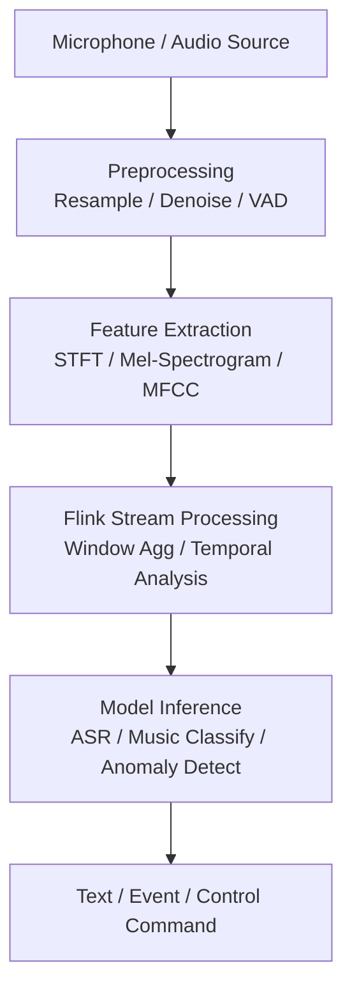

# Real-Time Audio Stream Processing

> **Language**: English | **Source**: [Knowledge/06-frontier/audio-stream-processing.md](../Knowledge/06-frontier/audio-stream-processing.md) | **Last Updated**: 2026-04-21

---

## 1. Definitions

**Def-K-Audio-EN-01: Real-Time Audio Stream Processing**

Stream computing applications that perform real-time acquisition, feature extraction, event detection, classification, and response triggering on continuous audio signals (speech, music, ambient sound). Typical scenarios include real-time speech transcription, music recommendation, abnormal sound detection, and voice assistant interaction.

**Def-K-Audio-EN-02: Short-Time Fourier Transform (STFT)**

Splits time-domain audio signals into short frames and applies Fourier transform to each frame, producing a time-frequency representation. STFT is one of the most fundamental feature extraction steps in audio stream processing.

**Def-K-Audio-EN-03: Mel-Spectrogram**

A spectral representation based on human auditory perception, mapping linear frequency to Mel scale to better capture perceptually relevant information in speech and music.

## 2. Properties

**Lemma-K-Audio-EN-01: Audio Latency Perception Bound**

Human sensitivity to speech interaction latency is ~200-300ms (conversation naturalness); music playback sync sensitivity is ~20-40ms. Therefore, real-time speech systems should target < 200ms E2E latency, while multi-channel music mixing should achieve < 20ms sync precision.

**Lemma-K-Audio-EN-02: Feature-Extraction / Inference Decoupling**

Mel-spectrogram extraction is lightweight and low-latency, suitable for high-frequency execution (e.g., every 10ms). Deep learning inference (e.g., ASR models) is compute-intensive, better suited for lower-frequency batch processing (e.g., every 500ms). Decoupling optimizes resource utilization.

**Prop-K-Audio-EN-01: Sliding Windows Are Key for Audio Event Detection**

Since audio events (keywords, abnormal sounds) can occur at any time with varying duration, overlapping sliding windows significantly improve event detection recall by preventing events straddling window boundaries from being missed.

## 3. Architecture

## 4. Cross-Modal Comparison

| Characteristic | Audio Stream | Video Stream | Text Stream |
|---------------|-------------|-------------|-------------|
| Data rate | Medium (16-128 kbps) | Very high (Mbps-Gbps) | Low (bps-kbps) |
| Latency requirement | < 200ms | < 1-3s | < 100ms |
| Core features | Spectral / temporal | Spatial / temporal | Semantic / syntactic |
| Inference frequency | Medium (100-500ms) | Low (1-5s) | High (10-50ms) |
| Primary hardware | CPU/GPU | GPU | CPU |

## References
