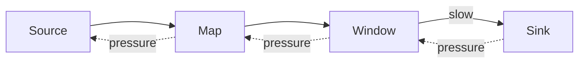

# Backpressure Handling Patterns

> **Stage**: Knowledge | **Prerequisites**: [Stream Join Patterns](../stream-join-patterns.md) | **Formal Level**: L3-L5
>
> Backpressure detection, mitigation, and recovery strategies for streaming system stability.

---

## 1. Definitions

**Def-K-02-41: Backpressure**

When downstream operator processing rate $\mu$ is lower than upstream production rate $\lambda$:

$$
\text{Backpressure} \iff \lambda > \mu \land \frac{dB}{dt} > 0
$$

where $B$ = buffer occupancy. Backpressure is a self-protection mechanism.

**Def-K-02-42: Backpressure Propagation**

For operator chain $O_1 \to O_2 \to ... \to O_n$, if $O_k$ is bottleneck, pressure propagates upstream.

**Def-K-02-43: Mitigation Strategy**

Actions to reduce backpressure: scale out, shed load, increase parallelism, or optimize slow operators.

---

## 2. Properties

**Prop-K-02-21: Backpressure Propagation Characteristics**

Backpressure propagates upstream at network speed, faster than data flow.

**Prop-K-02-22: Mitigation Effectiveness**

Scaling out is effective for compute-bound bottlenecks; less effective for external I/O bottlenecks.

---

## 3. Relations

- **with Checkpoint**: Backpressure can cause checkpoint timeout if barriers cannot propagate.
- **with Watermark**: Backpressure delays watermark progression, delaying window triggers.

---

## 4. Argumentation

**Root Cause Analysis**:

| Symptom | Likely Cause | Solution |
|---------|-------------|----------|
| Single task backpressure | Hot key | Rebalance or salting |
| All tasks backpressure | Insufficient parallelism | Scale out |
| Sporadic backpressure | GC pauses | Tune JVM, use off-heap |
| Persistent backpressure | Slow external sink | Async I/O or batching |

**Flow Control Degradation Strategy**:

1. **Level 1**: Buffer expansion
2. **Level 2**: Load shedding (drop non-critical)
3. **Level 3**: Circuit breaker (pause ingestion)
4. **Level 4**: Emergency scale-out

---

## 5. Engineering Argument

**Optimal Flow Control**: The optimal backpressure response minimizes $L = \alpha \cdot \text{dropped} + \beta \cdot \text{latency} + \gamma \cdot \text{cost}$. For most systems, scaling out is preferred over dropping.

---

## 6. Examples

```java
// Backpressure monitoring via Flink REST API
// GET /jobs/{jobId}/vertices/{vertexId}/backpressure
// Response: OK / LOW / HIGH
```

---

## 7. Visualizations

**Backpressure Architecture**:



---

## 8. References
