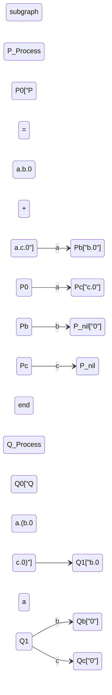
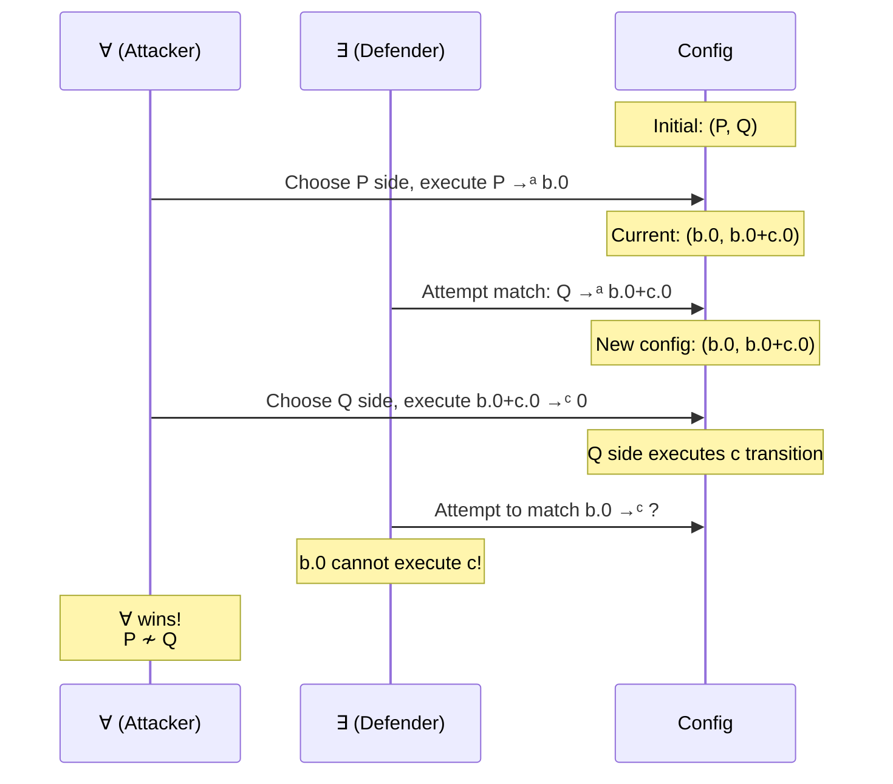
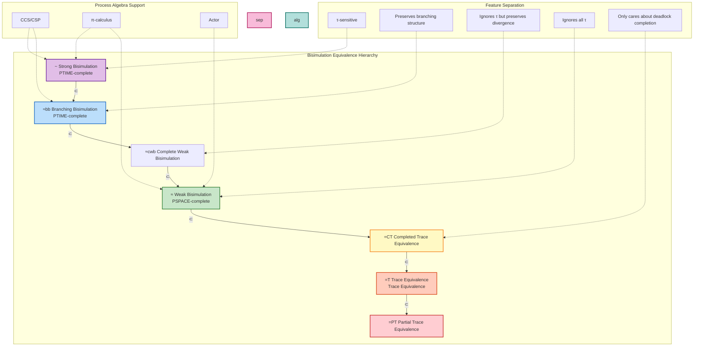
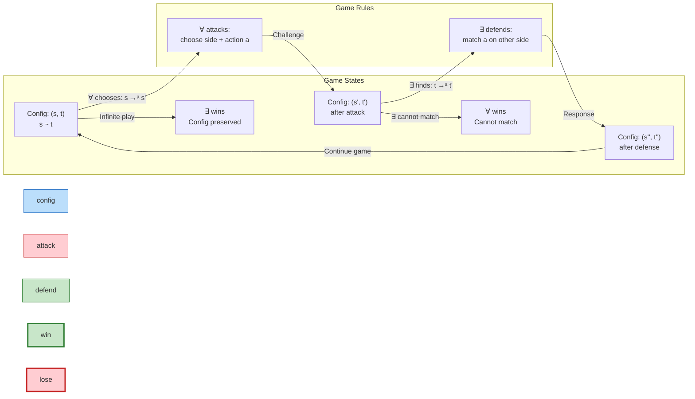

# Bisimulation Equivalences

> **Stage**: Struct | **Prerequisites**: [../01-foundation/01.02-process-calculus-primer.md](../01-foundation/01.02-process-calculus-primer.md) | **Formalization Level**: L3-L4
> **Version**: 2026.04

---

## Table of Contents

- [Bisimulation Equivalences](#bisimulation-equivalences)
  - [Table of Contents](#table-of-contents)
  - [1. Definitions](#1-definitions)
    - [Def-S-15-01. Strong Bisimulation](#def-s-15-01-strong-bisimulation)
    - [Def-S-15-02. Weak & Branching Bisimulation](#def-s-15-02-weak--branching-bisimulation)
    - [Def-S-15-03. Bisimulation Game](#def-s-15-03-bisimulation-game)
    - [Def-S-15-04. Congruence](#def-s-15-04-congruence)
  - [2. Properties](#2-properties)
    - [Lemma-S-15-01. Strong Bisimulation is an Equivalence Relation](#lemma-s-15-01-strong-bisimulation-is-an-equivalence-relation)
    - [Lemma-S-15-02. Bisimulation Implies Trace Equivalence, but Not Vice Versa](#lemma-s-15-02-bisimulation-implies-trace-equivalence-but-not-vice-versa)
    - [Prop-S-15-01. Congruence Defect of Weak Bisimulation](#prop-s-15-01-congruence-defect-of-weak-bisimulation)
    - [Prop-S-15-02. Branching Bisimulation Preserves Divergence](#prop-s-15-02-branching-bisimulation-preserves-divergence)
  - [3. Relations](#3-relations)
    - [Relation 1: Strict Inclusion Chain of the Bisimulation Spectrum](#relation-1-strict-inclusion-chain-of-the-bisimulation-spectrum)
    - [Relation 2: Correspondence Between Strong Bisimulation and Hennessy-Milner Logic](#relation-2-correspondence-between-strong-bisimulation-and-hennessy-milner-logic)
    - [Relation 3: Correspondence Between Branching Bisimulation and BHML](#relation-3-correspondence-between-branching-bisimulation-and-bhml)
  - [4. Argumentation](#4-argumentation)
    - [Argument 1: Theoretical Foundation for Bisimulation Over Trace Equivalence](#argument-1-theoretical-foundation-for-bisimulation-over-trace-equivalence)
    - [Argument 2: Necessity of Congruence and Corrections for Weak Bisimulation](#argument-2-necessity-of-congruence-and-corrections-for-weak-bisimulation)
    - [Argument 3: Complexity and Verification Feasibility](#argument-3-complexity-and-verification-feasibility)
  - [5. Proofs](#5-proofs)
    - [Thm-S-15-01. Bisimulation Congruence Theorem](#thm-s-15-01-bisimulation-congruence-theorem)
    - [Cor-S-15-01. Bisimulation Equivalence Classes Form a Quotient LTS](#cor-s-15-01-bisimulation-equivalence-classes-form-a-quotient-lts)
  - [6. Examples](#6-examples)
    - [Example 1: Classic Counterexample of Trace Equivalence but Not Bisimulation](#example-1-classic-counterexample-of-trace-equivalence-but-not-bisimulation)
    - [Example 2: Weakly Bisimilar but Not Branching Bisimilar](#example-2-weakly-bisimilar-but-not-branching-bisimilar)
    - [Example 3: Bisimulation Game Demonstration](#example-3-bisimulation-game-demonstration)
    - [Counterexample: Failure of Weak Bisimulation on Congruence](#counterexample-failure-of-weak-bisimulation-on-congruence)
  - [7. Visualizations](#7-visualizations)
    - [Figure 7.1: Bisimulation Hierarchy Spectrum](#figure-71-bisimulation-hierarchy-spectrum)
    - [Figure 7.2: Bisimulation Game Schematic](#figure-72-bisimulation-game-schematic)
    - [Figure 7.3: Congruence and Operator Relationship Diagram](#figure-73-congruence-and-operator-relationship-diagram)
  - [8. References](#8-references)
  - [Related Documents](#related-documents)

## 1. Definitions

### Def-S-15-01. Strong Bisimulation

Let $\mathcal{T} = (S, A, \{\xrightarrow{a}\}_{a \in A})$ be a labeled transition system (LTS), where $S$ is the set of states and $A$ is the set of actions (including the internal action $\tau$). A binary relation $\mathcal{R} \subseteq S \times S$ is called a **Strong Bisimulation** if and only if it satisfies the following **zig-zag condition**[^1][^2]:

$$
\forall (s, t) \in \mathcal{R}. \forall a \in A:
\begin{cases}
s \xrightarrow{a} s' \Rightarrow \exists t'.\ t \xrightarrow{a} t' \land (s', t') \in \mathcal{R} \\
t \xrightarrow{a} t' \Rightarrow \exists s'.\ s \xrightarrow{a} s' \land (s', t') \in \mathcal{R}
\end{cases}
$$

**Strong bisimulation equivalence** (denoted $s \sim t$) is defined as the union of all strong bisimulations:

$$
s \sim t \iff \exists \mathcal{R} \text{ is a strong bisimulation}.\ (s, t) \in \mathcal{R}
$$

The **maximum strong bisimulation** $\sim$ is the union of all strong bisimulation relations, and is itself a strong bisimulation.

**Intuitive explanation**: Strong bisimulation requires two processes to mirror each other exactly at every action step, including internal $\tau$ actions. It is the finest behavioral equivalence in process algebra, capturing the intuition of "step-by-step simulation"—two processes not only produce the same visible action sequences, but also offer the same set of choices at every branching point.

**Motivation for the definition**: If internal actions $\tau$ were not included in the equivalence judgment, it would be impossible to distinguish between a process that "executes $a$ immediately" and one that "performs internal computation before executing $a$", thereby losing important behavioral discriminative power. Strong bisimulation provides the theoretical foundation for coarser equivalences such as weak bisimulation and trace equivalence.

---

### Def-S-15-02. Weak & Branching Bisimulation

A **Weak Transition** $\xRightarrow{a}$ is defined as the closure of transitions ignoring $\tau$ actions:

$$
\xRightarrow{a} =
\begin{cases}
\xrightarrow{\tau}^* & \text{if } a = \tau \\
\xrightarrow{\tau}^* \circ \xrightarrow{a} \circ \xrightarrow{\tau}^* & \text{if } a \neq \tau
\end{cases}
$$

A binary relation $\mathcal{R} \subseteq S \times S$ is called a **Weak Bisimulation** if and only if[^1]:

$$
\forall (s, t) \in \mathcal{R}. \forall a \in A:
\begin{cases}
s \xrightarrow{a} s' \Rightarrow \exists t'.\ t \xRightarrow{a} t' \land (s', t') \in \mathcal{R} \\
t \xrightarrow{a} t' \Rightarrow \exists s'.\ s \xRightarrow{a} s' \land (s', t') \in \mathcal{R}
\end{cases}
$$

**Weak bisimulation equivalence** is denoted $s \approx t$.

**Branching Bisimulation** $\approx_{bb}$ is a refinement of weak bisimulation, augmented with the **stuttering condition**[^7]: if $s \xrightarrow{\tau} s'$, then either $(s', t) \in \mathcal{R}$ (a silent step), or there exists $t \xrightarrow{\tau}^* t_1 \xrightarrow{a} t'$ such that $(s, t_1) \in \mathcal{R}$ and $(s', t') \in \mathcal{R}$. This requires that when matching the $\tau$ sequence preceding a visible action, the intermediate states must remain related to the original state.

**Intuitive explanation**: Weak bisimulation ignores invisible internal computation and only requires that visible actions can be matched. It is suitable for verifying equivalence between implementation and specification—an implementation may contain additional internal steps (such as scheduling, garbage collection), but an external observer should be unable to distinguish them. Branching bisimulation further preserves the branching information of "when choices are made", making it stricter than weak bisimulation.

**Motivation for the definition**: In engineering implementations, internal actions (such as protocol buffering, thread scheduling) are typically unobservable. Strong bisimulation is too strict, judging implementations that are essentially behaviorally equivalent as inequivalent. Weak bisimulation establishes a more suitable equivalence standard for implementation verification by abstracting away $\tau$ actions.

---

### Def-S-15-03. Bisimulation Game

Given two states $s, t \in S$ in an LTS, the **Bisimulation Game** is a two-player game between $\forall$ (Attacker) and $\exists$ (Defender)[^2][^4]:

**Game Configuration**: The current configuration is a pair of states $(s_i, t_i)$, with the initial configuration being $(s, t)$.

**Game Rules**:

1. **Attack Move**: $\forall$ chooses one side (e.g., $s_i$) and an action $a \in A$, performing $s_i \xrightarrow{a} s_{i+1}$;
2. **Defense Move**: $\exists$ must find a matching transition on the other side, $t_i \xrightarrow{a} t_{i+1}$ (for strong bisimulation) or $t_i \xRightarrow{a} t_{i+1}$ (for weak bisimulation), such that the new configuration is $(s_{i+1}, t_{i+1})$;
3. If $\exists$ cannot match, $\forall$ wins; if the game continues infinitely, $\exists$ wins.

**Strategies and Winning**:

- **Winning strategy for $\exists$**: From configuration $(s, t)$, no matter how $\forall$ chooses, $\exists$ can always find a matching transition in the complete strategy tree;
- **Positional strategy for $\exists$**: The strategy depends only on the current configuration, not on the history.

**Game semantics**: $s \sim t$ if and only if $\exists$ has a winning strategy in the bisimulation game; $s \approx t$ if and only if $\exists$ has a winning strategy in the weak bisimulation game.

**Intuitive explanation**: The bisimulation game transforms the abstract equivalence relation into a concrete game process. The attacker tries to find behavioral differences between two processes, while the defender tries to prove them behaviorally equivalent. This "challenge-response" paradigm provides an operational foundation for verification algorithms (such as model checking).

**Motivation for the definition**: The original definition of bisimulation uses an existential quantifier ("there exists a relation $\mathcal{R}$..."), making it difficult to use directly for algorithmic decision. Game semantics transforms it into a reachability problem—whether $\exists$ has a winning strategy—which provides theoretical support for partition refinement algorithms (such as Paige-Tarjan).

---

### Def-S-15-04. Congruence

Let $\mathcal{C}$ be a **context** in a process calculus—an process expression containing one or more "holes" $[\cdot]$. The application of a context $C[\cdot]$ to a process $P$ is denoted $C[P]$, meaning the hole is replaced by $P$.

An equivalence relation $\sim$ is a **congruence** with respect to a family of process calculus operators $\mathcal{O}$ if and only if[^1][^6]:

$$
\forall P, Q.\ P \sim Q \Rightarrow \forall C[\cdot] \in \mathcal{C}.\ C[P] \sim C[Q]
$$

That is, equivalent processes remain equivalent when substituted into any context.

**Standard operators of CCS/CSP/π-calculus**:

| Operator | Syntax | Arity |
|----------|--------|-------|
| Prefix | $a.P$ | Unary |
| Choice | $P + Q$ (CCS/π) or $P \square Q$ (CSP) | Binary |
| Parallel | $P \mid Q$ or $P \parallel Q$ | Binary |
| Restriction/Hiding | $(\nu a)P$ or $P \setminus L$ | Binding |
| Renaming | $P[f]$ | Unary |
| Replication | $!P$ | Unary |

**Intuitive explanation**: Congruence guarantees the composability of an equivalence relation under modular construction. If $P$ and $Q$ are behaviorally equivalent, this equivalence should be preserved when they are embedded into any larger system. Without congruence, equivalence checking would lose its engineering value—component-level verification results could not be composed into system-level guarantees.

**Motivation for the definition**: Weak bisimulation $\approx$ is **not** a congruence for the CCS choice operator $+$ (classic counterexample: $\tau.a \approx a$, but $\tau.a + b \not\approx a + b$). This has motivated research into branching bisimulation $\approx_{bb}$ and observational congruence $\approx^c$, which ignore internal actions while preserving congruence.

---

## 2. Properties

### Lemma-S-15-01. Strong Bisimulation is an Equivalence Relation

**Statement**: Strong bisimulation equivalence $\sim$ is an equivalence relation on the state set $S$, i.e., it satisfies reflexivity, symmetry, and transitivity.

**Proof**:

1. **Reflexivity**: The identity relation $\mathcal{I} = \{(s, s) \mid s \in S\}$ is clearly a strong bisimulation. For any $s \xrightarrow{a} s'$, there exists $s \xrightarrow{a} s'$ and $(s', s') \in \mathcal{I}$. Therefore $s \sim s$.

2. **Symmetry**: Directly follows from the symmetry of the zig-zag condition in Def-S-15-01. If $\mathcal{R}$ is a strong bisimulation, then $\mathcal{R}^{-1} = \{(t, s) \mid (s, t) \in \mathcal{R}\}$ is also a strong bisimulation. Therefore $s \sim t \Rightarrow t \sim s$.

3. **Transitivity**: Let $s \sim t$ via $\mathcal{R}_1$, and $t \sim u$ via $\mathcal{R}_2$. Consider the composite relation:
   $$
   \mathcal{R}_1 \circ \mathcal{R}_2 = \{(s, u) \mid \exists t.\ (s, t) \in \mathcal{R}_1 \land (t, u) \in \mathcal{R}_2\}
   $$

   For any $(s, u) \in \mathcal{R}_1 \circ \mathcal{R}_2$, if $s \xrightarrow{a} s'$:
   - From $s \sim t$, there exists $t \xrightarrow{a} t'$ and $(s', t') \in \mathcal{R}_1$;
   - From $t \sim u$, there exists $u \xrightarrow{a} u'$ and $(t', u') \in \mathcal{R}_2$;
   - Therefore $(s', u') \in \mathcal{R}_1 \circ \mathcal{R}_2$.

   The symmetric condition follows similarly. Hence $\mathcal{R}_1 \circ \mathcal{R}_2$ is a strong bisimulation, and $s \sim u$. ∎

---

### Lemma-S-15-02. Bisimulation Implies Trace Equivalence, but Not Vice Versa

**Statement**: For any states $s, t \in S$, $s \sim t$ implies that $s$ and $t$ have the same set of finite traces ($\text{Traces}(s) = \text{Traces}(t)$), but trace equivalence does not imply bisimulation equivalence.

**Proof**:

**Part 1: $\sim \Rightarrow =_T$ (Bisimulation implies trace equivalence)**

Let $s \sim t$, with $\mathcal{R}$ witnessing the bisimulation. For any trace $\sigma = a_1 a_2 \dots a_n \in \text{Traces}(s)$:

1. By the definition of trace, there exists a state sequence $s = s_0 \xrightarrow{a_1} s_1 \xrightarrow{a_2} \dots \xrightarrow{a_n} s_n$;
2. By the definition of bisimulation, $s_0 \sim t_0$ implies there exists $t_0 \xrightarrow{a_1} t_1$ and $s_1 \sim t_1$;
3. Inductively, for each $i$, there exists $t_i \xrightarrow{a_{i+1}} t_{i+1}$ and $s_{i+1} \sim t_{i+1}$;
4. Therefore there exists $t = t_0 \xrightarrow{a_1} t_1 \xrightarrow{a_2} \dots \xrightarrow{a_n} t_n$, i.e., $\sigma \in \text{Traces}(t)$.

The symmetric direction follows similarly. Hence $\text{Traces}(s) = \text{Traces}(t)$.

**Part 2: $=_T \not\Rightarrow \sim$ (Trace equivalence does not imply bisimulation)**

Construct a counterexample: Consider the CCS processes:
$$
P = a.b.0 + a.c.0, \quad Q = a.(b.0 + c.0)
$$

**Trace equivalence verification**:

- $\text{Traces}(P) = \{\varepsilon, a, ab, ac\}$
- $\text{Traces}(Q) = \{\varepsilon, a, ab, ac\}$

The trace sets of both are identical, so $P =_T Q$.

**Non-bisimulation verification**:

Assume $P \sim Q$. Consider the first step transitions of $P$:

- $P \xrightarrow{a} b.0$ (from the first summand)
- $P \xrightarrow{a} c.0$ (from the second summand)

$Q$ has only one $a$-transition: $Q \xrightarrow{a} b.0 + c.0$.

By the definition of bisimulation, the $a$-transition of $Q$ must simultaneously match both $a$-transitions of $P$. That is, we need:

- $b.0 \sim b.0 + c.0$ (match the first)
- $c.0 \sim b.0 + c.0$ (match the second)

But $b.0 + c.0$ can execute $b$ or $c$, while $b.0$ can only execute $b$, and $c.0$ can only execute $c$. Therefore $b.0 \not\sim b.0 + c.0$, a contradiction.

**Conclusion**: $P =_T Q$ but $P \not\sim Q$. ∎

---

### Prop-S-15-01. Congruence Defect of Weak Bisimulation

**Statement**: Weak bisimulation equivalence $\approx$ is **not** a congruence relation for the CCS choice operator $+$.

**Derivation**:

1. Take $P = \tau.a.0$, $Q = a.0$. Clearly $P \approx Q$:
   - $P \xrightarrow{\tau} a.0$, and $Q$ can reach itself via zero $\tau$ steps, then execute $a$;
   - $P \xrightarrow{a} 0$ (after $\tau$), and $Q \xrightarrow{a} 0$ matches directly.

2. Consider the context $C[\cdot] = [\cdot] + b.0$:
   - $C[P] = \tau.a.0 + b.0$
   - $C[Q] = a.0 + b.0$

3. **Key difference**: In $C[P]$, the environment may first choose $\tau$ to enter the $a.0$ state; if the environment then forbids $a$ but allows $b$, the process deadlocks (unable to revert and choose $b$); in $C[Q]$, the environment can always directly choose $b$.

4. Therefore $C[P] \not\approx C[Q]$, despite $P \approx Q$.

**Conclusion**: Weak bisimulation is not a congruence for $+$, which is caused by the "commitment" effect of the choice operator—once $\tau$ is executed, a branch is entered irreversibly. ∎

---

### Prop-S-15-02. Branching Bisimulation Preserves Divergence

**Statement**: If $s \approx_{bb} t$ (branching bisimulation equivalence), then $s$ can execute an infinite $\tau$ sequence (diverge) if and only if $t$ can execute an infinite $\tau$ sequence.

**Derivation**:

1. Let $s$ diverge, i.e., there exists an infinite sequence $s = s_0 \xrightarrow{\tau} s_1 \xrightarrow{\tau} s_2 \xrightarrow{\tau} \dots$.

2. By the stuttering condition of branching bisimulation, for $s_0 \xrightarrow{\tau} s_1$:
   - either $s_1 \approx_{bb} t$;
   - or there exists $t \xrightarrow{\tau} t_1$ such that $s \approx_{bb} t_1$ and $s_1 \approx_{bb} t_1$.

3. If the first case occurs infinitely, then $t$ itself is branching bisimilar to all $s_i$, but $t$ may be stable (unable to execute $\tau$). However, branching bisimulation requires: if $s$ executes infinite $\tau$ while remaining related to $t$, then $t$ must also be able to execute $\tau$ to reach a state related to a subsequent state of $s$.

4. More strictly, if $s$ diverges while $t$ is stable (unable to execute $\tau$), then for $s \xrightarrow{\tau} s_1$, we must have $s_1 \approx_{bb} t$. Recursively, all $s_i \approx_{bb} t$. But $t$ being stable means it cannot match any subsequent transition of $s$ via $\tau$, a contradiction.

5. Therefore $s$ diverges if and only if $t$ diverges. ∎

---

## 3. Relations

### Relation 1: Strict Inclusion Chain of the Bisimulation Spectrum

**van Glabbeek's Linear Time–Branching Time Spectrum**[^7]:

$$
\sim \; \subset \; \approx_{2n} \; \subset \; \approx_{bb} \; \subset \; \approx_{cwb} \; \subset \; \approx_{wb} \; \subset \; =_{CT} \; \subset \; =_T \; \subset \; =_{PT}
$$

Where:

- $\sim$: Strong Bisimulation
- $\approx_{2n}$: 2-Nested Simulation
- $\approx_{bb}$: Branching Bisimulation
- $\approx_{cwb}$: Complete Weak Bisimulation (divergence-sensitive)
- $\approx_{wb}$: Weak Bisimulation (i.e., $\approx$)
- $=_{CT}$: Completed Trace Equivalence
- $=_T$: Trace Equivalence
- $=_{PT}$: Partial Trace Equivalence

**Argumentation**:

| Inclusion Pair | Forward Derivation | Separating Counterexample |
|----------------|--------------------|---------------------------|
| $\sim \subset \approx_{bb}$ | Strong bisimulation requires exact matching of $\tau$; branching bisimulation allows stuttering | $\tau.a.0 \approx_{bb} a.0$ but $\tau.a.0 \not\sim a.0$ |
| $\approx_{bb} \subset \approx_{wb}$ | Branching bisimulation requires maintaining the relation before matching visible actions; weak bisimulation has no such requirement | $a.0 + \tau.b.0 \approx_{wb} a.0 + \tau.b.0 + b.0$ but not branching bisimilar |
| $\approx_{wb} \subset =_{CT}$ | Weak bisimulation cares not only about traces but also about branching structure | Classic counterexample $a.b + a.c$ vs. $a.(b+c)$ |

---

### Relation 2: Correspondence Between Strong Bisimulation and Hennessy-Milner Logic

**Statement**: On image-finite LTSs, $s \sim t$ if and only if $s$ and $t$ satisfy exactly the same HML formulas[^1][^2].

**Argumentation**:

**Hennessy-Milner Logic (HML)** syntax:
$$
\phi ::= \top \mid \neg\phi \mid \phi_1 \land \phi_2 \mid \langle a \rangle\phi
$$

- $s \models \langle a \rangle\phi$: there exists $s \xrightarrow{a} s'$ and $s' \models \phi$.

**Hennessy-Milner Theorem**:
$$
s \sim t \iff \forall \phi \in \text{HML}.\ s \models \phi \iff t \models \phi
$$

**Existence of encoding**: The modal operator $\langle a \rangle$ of HML precisely captures the "there exists an $a$-transition" condition of bisimulation. Bisimulation preserves HML satisfiability, and HML equivalence implies bisimulation.

**Separation result**: If the LTS is not image-finite (a state has infinitely many $a$-successors), then there exist counterexamples that are logically equivalent but not bisimilar.

---

### Relation 3: Correspondence Between Branching Bisimulation and BHML

**Statement**: Branching bisimulation equivalence $\approx_{bb}$ corresponds to Branching HML (BHML) logical equivalence[^7].

**Argumentation**:

**Branching HML** syntax:
$$
\phi ::= \top \mid \neg\phi \mid \phi_1 \land \phi_2 \mid \langle \varepsilon \rangle\langle a \rangle\phi
$$

Where $\langle \varepsilon \rangle$ means "reachable via zero or more $\tau$ steps".

The semantics of BHML precisely characterizes the stuttering condition of branching bisimulation:

- It allows a finite number of internal transitions before observing a visible action;
- But requires that the same precondition be satisfied throughout the transition process;
- This distinguishes it from weak HML, which completely ignores $\tau$ intermediate states.

---

## 4. Argumentation

### Argument 1: Theoretical Foundation for Bisimulation Over Trace Equivalence

**Core thesis**: Bisimulation is a "branching-time" semantics, while trace equivalence is a "linear-time" semantics. Bisimulation cares not only about "what can be done", but also about "when choices are made".

**Concrete scenario**: Consider the processes $P = a.b.0 + a.c.0$ and $Q = a.(b.0 + c.0)$.

- **Trace perspective**: Both can execute traces $\varepsilon$, $a$, $ab$, $ac$, and are completely equivalent.
- **Branching perspective**: $P$ has already determined whether to take $b$ or $c$ **before** executing $a$; $Q$ makes this choice **after** executing $a$.

**Environment interaction difference**:

- Suppose the environment forbids $b$ but allows $a$ and $c$ in the initial state;
- If $P$ chooses the $a.b.0$ branch, it deadlocks after executing $a$;
- $Q$ can still choose $c$ after executing $a$, and continue execution.

**Engineering significance**: In protocol verification, such branching differences can lead to deadlock. Bisimulation can detect such problems; trace equivalence cannot.

---

### Argument 2: Necessity of Congruence and Corrections for Weak Bisimulation

**Problem statement**: Prop-S-15-01 proves that weak bisimulation is not a congruence for the choice operator. This undermines the foundation of modular verification—if $P \approx Q$, we cannot replace $P$ with $Q$ without examining the context.

**Solution 1: Observational Congruence** $\approx^c$:
$$
P \approx^c Q \iff \forall a.\ a.P \approx a.Q
$$

That is, weak bisimulation is required after any prefix context. $\approx^c$ is a congruence relation, but stricter than $\approx$.

**Solution 2: Branching Bisimulation** $\approx_{bb}$:

Branching bisimulation avoids the "commitment" problem of weak bisimulation by maintaining the relation with the original state when matching $\tau$ sequences. It is a congruence for all operators of CCS (including $+$).

**Engineering trade-offs**:

| Equivalence Relation | Congruence | Granularity | Applicable Scenario |
|----------------------|------------|-------------|---------------------|
| $\sim$ | ✅ Yes | Finest | Theoretical analysis, fine-grained verification |
| $\approx_{bb}$ | ✅ Yes | Medium | Implementation verification, preserving branching structure |
| $\approx^c$ | ✅ Yes | Coarser | Protocol compatibility |
| $\approx$ | ❌ No (for $+$) | Coarser | Pure observational behavior (requires additional constraints) |

---

### Argument 3: Complexity and Verification Feasibility

**Bisimulation decision complexity**[^2][^8]:

| Equivalence Relation | Complexity | Decision Algorithm |
|----------------------|------------|--------------------|
| Strong Bisimulation $\sim$ | PTIME-complete | Paige-Tarjan partition refinement $O(m \log n)$ |
| Branching Bisimulation $\approx_{bb}$ | PTIME-complete | Reduction to strong bisimulation or direct variant |
| Weak Bisimulation $\approx$ | PSPACE-complete | Saturation algorithm / BDD symbolic methods |

**Decidability boundaries**:

- **Finite-state systems**: Strong bisimulation and branching bisimulation can be decided in polynomial time, supporting automated verification tools (such as FDR, CADP);
- **Infinite-state systems** (with dynamic topology): Bisimulation decision is generally undecidable, requiring abstract interpretation or approximation techniques.

**Inference [Theory→Implementation]**: The PSPACE-complete complexity of weak bisimulation means that in engineering practice (such as verifying distributed protocols, Actor systems), directly deciding weak bisimulation may encounter state-space explosion. Therefore, real systems (such as Erlang/OTP supervisor tree verification) typically use branching bisimulation or abstract interpretation as compensation.

---

## 5. Proofs

### Thm-S-15-01. Bisimulation Congruence Theorem

**Statement**: Strong bisimulation $\sim$ is a congruence relation for all standard process constructors of CCS, CSP, and π-calculus. That is, if $P \sim Q$, then:

1. $a.P \sim a.Q$ (prefix)
2. $P + R \sim Q + R$ (choice)
3. $P \mid R \sim Q \mid R$ (parallel)
4. $(\nu a)P \sim (\nu a)Q$ (restriction/hiding)
5. $P[f] \sim Q[f]$ (renaming)

**Proof**:

We prove by structural induction on CCS operators. The proofs for CSP and π-calculus are similar.

**Case 1 — Prefix**: Let $P \sim Q$ via bisimulation $\mathcal{R}$.

Construct $\mathcal{R}' = \{(a.P, a.Q)\} \cup \mathcal{R}$.

Verify that $\mathcal{R}'$ is a strong bisimulation:

- The only transition of $a.P$ is $a.P \xrightarrow{a} P$;
- The only transition of $a.Q$ is $a.Q \xrightarrow{a} Q$;
- And $(P, Q) \in \mathcal{R} \subseteq \mathcal{R}'$.

The symmetric condition follows similarly. Hence $\mathcal{R}'$ is a strong bisimulation, and $a.P \sim a.Q$.

**Case 2 — Choice**: Let $P \sim Q$ via $\mathcal{R}$.

Construct $\mathcal{R}' = \{(P + R, Q + R) \mid (P, Q) \in \mathcal{R}\} \cup \mathcal{R}$.

Consider transitions of $P + R$:

- If from $P \xrightarrow{a} P'$: by $P \sim Q$, there exists $Q \xrightarrow{a} Q'$ and $(P', Q') \in \mathcal{R}$; therefore $Q + R \xrightarrow{a} Q'$ and $(P', Q') \in \mathcal{R}'$.
- If from $R \xrightarrow{a} R'$: then $Q + R \xrightarrow{a} R'$, and $(R', R') \in \mathcal{R}'$ (reflexivity).

The symmetric condition follows similarly. Hence $\mathcal{R}'$ is a strong bisimulation, and $P + R \sim Q + R$.

**Case 3 — Parallel Composition**: Let $P \sim Q$ via $\mathcal{R}_1$.

Construct $\mathcal{R}' = \{(P \mid R, Q \mid R) \mid (P, Q) \in \mathcal{R}_1\} \cup \mathcal{R}_1$.

Consider transitions of $P \mid R$:

- **Left independent**: $P \mid R \xrightarrow{a} P' \mid R$ from $P \xrightarrow{a} P'$. By $\mathcal{R}_1$, there exists $Q \xrightarrow{a} Q'$ and $(P', Q') \in \mathcal{R}_1$; therefore $Q \mid R \xrightarrow{a} Q' \mid R$ and $(P' \mid R, Q' \mid R) \in \mathcal{R}'$.
- **Right independent**: $P \mid R \xrightarrow{a} P \mid R'$ from $R \xrightarrow{a} R'$. Then $Q \mid R \xrightarrow{a} Q \mid R'$, and by $(P, Q) \in \mathcal{R}_1$ we have $(P \mid R', Q \mid R') \in \mathcal{R}'$.
- **Synchronization**: $P \mid R \xrightarrow{\tau} P' \mid R'$ from $P \xrightarrow{b} P'$ and $R \xrightarrow{\bar{b}} R'$. By $\mathcal{R}_1$, there exists $Q \xrightarrow{b} Q'$ and $(P', Q') \in \mathcal{R}_1$; therefore $Q \mid R \xrightarrow{\tau} Q' \mid R'$ and $(P' \mid R', Q' \mid R') \in \mathcal{R}'$.

The symmetric condition follows similarly. Hence $\mathcal{R}'$ is a strong bisimulation, and $P \mid R \sim Q \mid R$.

**Case 4 — Restriction**: Let $P \sim Q$ via $\mathcal{R}$.

Construct $\mathcal{R}' = \{((\nu a)P, (\nu a)Q) \mid (P, Q) \in \mathcal{R}\}$.

If $(\nu a)P \xrightarrow{\alpha} (\nu a)P'$, then $\alpha \neq a, \bar{a}$ and $P \xrightarrow{\alpha} P'$.
By $P \sim Q$, there exists $Q \xrightarrow{\alpha} Q'$ and $(P', Q') \in \mathcal{R}$;
therefore $(\nu a)Q \xrightarrow{\alpha} (\nu a)Q'$ and $((\nu a)P', (\nu a)Q') \in \mathcal{R}'$.

Hence restriction preserves strong bisimulation.

**Case 5 — Renaming**: Similarly provable, as renaming is a consistent action mapping.

**Conclusion**: By structural induction, strong bisimulation is a congruence for all standard operators of CCS. The proofs for CSP and π-calculus follow the same pattern, only adapting to their respective SOS rules. ∎

---

### Cor-S-15-01. Bisimulation Equivalence Classes Form a Quotient LTS

**Statement**: Let $\mathcal{T} = (S, A, \{\xrightarrow{a}\})$ be an LTS, and $\sim$ be strong bisimulation equivalence. Then the quotient structure $\mathcal{T}/\sim = (S/\sim, A, \{\xrightarrow{a}\})$ is a well-defined LTS, where $[s] \xrightarrow{a} [t]$ if and only if $\exists s' \in [s], t' \in [t].\ s' \xrightarrow{a} t'$.

**Proof**: By the congruence property of Thm-S-15-01, the transition relation is well-defined on equivalence classes—the targets of transitions from equivalent states remain in the same equivalence class. ∎

---

## 6. Examples

### Example 1: Classic Counterexample of Trace Equivalence but Not Bisimulation

**Process definitions**:
$$
P = a.b.0 + a.c.0, \quad Q = a.(b.0 + c.0)
$$

**LTS state diagram**:

**Verification**:

1. **Trace equivalence**: $\text{Traces}(P) = \text{Traces}(Q) = \{\varepsilon, a, ab, ac\}$
2. **Non-bisimulation**: $P$'s two $a$-transitions point to different states; $Q$ has only one $a$-transition.

**Environment test**: If the environment forbids $b$ after $a$:

- If $P$ chooses the $a.b.0$ branch, it deadlocks after executing $a$;
- $Q$ can still choose $c$ after executing $a$.

---

### Example 2: Weakly Bisimilar but Not Branching Bisimilar

**Process definitions**:
$$
P = a.0 + \tau.b.0, \quad Q = a.0 + \tau.b.0 + b.0
$$

**Analysis**:

1. **Weak bisimulation**: $Q$ has one more direct $b$-transition from the initial state to $b.0$ than $P$. In weak bisimulation, this extra $b$-transition can be matched by $P$'s $\tau \xrightarrow{} b$ sequence, so $P \approx Q$.

2. **Non-branching-bisimulation**: Consider $Q \xrightarrow{b} 0$ (direct transition). According to the definition of branching bisimulation, $P$ must either directly match $b$ (cannot), or execute a sequence of $\tau$ to reach a state related to $Q$ and then execute $b$. $P$ can only execute $\tau$ to reach $b.0$, at which point $P \approx_{bb} b.0$ is required. But $P$ can execute $a$, while $b.0$ cannot, so $P \not\approx_{bb} b.0$, and thus $P \not\approx_{bb} Q$.

---

### Example 3: Bisimulation Game Demonstration

**Game configuration**: Verify whether $P = a.b.0 + a.c.0$ and $Q = a.(b.0 + c.0)$ are strongly bisimilar.

**Game process**:

**Conclusion**: The attacker exposes the behavioral difference between $P$ and $Q$ by choosing $Q$'s $c$-transition, proving that the two are not strongly bisimilar.

---

### Counterexample: Failure of Weak Bisimulation on Congruence

**Scenario**: Verify that weak bisimulation is not a congruence for the choice operator.

**Processes**:

- $P = \tau.a.0$
- $Q = a.0$
- Context $C[\cdot] = [\cdot] + b.0$

**Analysis**:

1. $P \approx Q$ ($\tau$ can be ignored);
2. $C[P] = \tau.a.0 + b.0$, $C[Q] = a.0 + b.0$;
3. $C[P]$ can execute $\tau$ to enter $a.0$; if the environment then forbids $a$ but allows $b$, it deadlocks;
4. $C[Q]$ can always directly choose $b$.

Therefore $C[P] \not\approx C[Q]$, proving that weak bisimulation is not a congruence.

---

## 7. Visualizations

### Figure 7.1: Bisimulation Hierarchy Spectrum

**Figure description**:

- From strong bisimulation to trace equivalence, the equivalence relation becomes progressively coarser (discriminative power decreases)
- Complexity rises from PTIME-complete to PSPACE-complete
- Colors gradient from purple (fine-grained) to red (coarse)

---

### Figure 7.2: Bisimulation Game Schematic

**Figure description**:

- The attacker (∀) tries to find behavioral differences between two processes
- The defender (∃) tries to prove them behaviorally equivalent
- If the defender has a winning strategy, the two states are bisimilar

---

### Figure 7.3: Congruence and Operator Relationship Diagram

```mermaid
graph TB
    subgraph "Equivalence Relations"
        SIM["~ Strong Bisimulation"]:::sim
        BB["≈bb Branching Bisimulation"]:::bb
        CONG["≈ᶜ Observational Congruence"]:::cong
        WB["≈ Weak Bisimulation"]:::wb
    end

    subgraph "Operator Congruence"
        PREFIX["Prefix a.P<br/>✓ ~ ✓ ≈bb ✓ ≈ᶜ ✓ ≈"]:::op
        SUM["Choice P+Q<br/>✓ ~ ✓ ≈bb ✓ ≈ᶜ ✗ ≈"]:::op
        PAR["Parallel P|Q<br/>✓ ~ ✓ ≈bb ✓ ≈ᶜ ✓ ≈"]:::op
        RES["Restriction (νa)P<br/>✓ ~ ✓ ≈bb ✓ ≈ᶜ ✓ ≈"]:::op
    end

    subgraph "Conclusion"
        CONG_YES["Congruent: ~, ≈bb, ≈ᶜ"]:::ok
        CONG_NO["Non-congruent: ≈ (for choice)"]:::no
    end

    SIM --> PREFIX
    SIM --> SUM
    SIM --> PAR
    SIM --> RES

    BB --> PREFIX
    BB --> SUM
    BB --> PAR
    BB --> RES

    WB --> PREFIX
    WB -.->|"✗ Failure"| SUM
    WB --> PAR
    WB --> RES

    SIM --> CONG_YES
    BB --> CONG_YES
    CONG --> CONG_YES
    WB --> CONG_NO

    style sim fill:#e1bee7,stroke:#6a1b9a,stroke-width:2px
    style bb fill:#bbdefb,stroke:#1565c0,stroke-width:2px
    style cong fill:#c8e6c9,stroke:#2e7d32,stroke-width:2px
    style wb fill:#ffcdd2,stroke:#c62828,stroke-width:2px
    style op fill:#fff9c4,stroke:#f57f17
    style ok fill:#c8e6c9,stroke:#2e7d32,stroke-width:3px
    style no fill:#ffcdd2,stroke:#c62828,stroke-width:3px
```

**Figure description**:

- Strong bisimulation and branching bisimulation are congruent for all operators
- Weak bisimulation fails for the choice operator (red dashed line)
- Observational congruence restores congruence through additional constraints

---

## 8. References

[^1]: R. Milner, *A Calculus of Communicating Systems*, Springer, 1980. — The foundational work of CCS, defining strong bisimulation and weak bisimulation

[^2]: D. Sangiorgi, *An Introduction to Bisimulation and Coinduction*, Cambridge University Press, 2012. — A systematic textbook on bisimulation theory, covering coinductive proof methods

[^4]: R. Milner, "The Polyadic π-Calculus: A Tutorial," *Logic and Algebra of Specification*, Springer, 1993. — Development of bisimulation theory in π-calculus

[^6]: D. Sangiorgi and D. Walker, *The π-calculus: A Theory of Mobile Processes*, Cambridge University Press, 2001. — Authoritative reference on π-calculus bisimulation theory

[^7]: R. J. van Glabbeek, "The Linear Time-Branching Time Spectrum," *CONCUR 1990*, LNCS 458, Springer, 1990; extended version *The Linear Time-Branching Time Spectrum II*, 1993, 2024. — Systematic classification of the bisimulation spectrum

[^8]: R. Paige and R. E. Tarjan, "Three Partition Refinement Algorithms," *SIAM Journal on Computing*, 16(6), 973-989, 1987. — The $O(m \log n)$ algorithm for strong bisimulation decision

---

## Related Documents

- [../01-foundation/01.02-process-calculus-primer.md](../01-foundation/01.02-process-calculus-primer.md) — Process calculus foundations (CCS, CSP, π, Session Types)
- [03.03-expressiveness-hierarchy.md](./03.03-expressiveness-hierarchy.md) — Expressiveness hierarchy and the position of bisimulation
- [../01-foundation/01.02-process-calculus-primer.md](../01-foundation/01.02-process-calculus-primer.md) — Process calculus foundations (CCS, CSP, π, Session Types)

---

*Document version: 2026.04 | Formalization level: L3-L4 | Status: Complete*

---

*Document version: v1.0 | Translation date: 2026-04-24*
