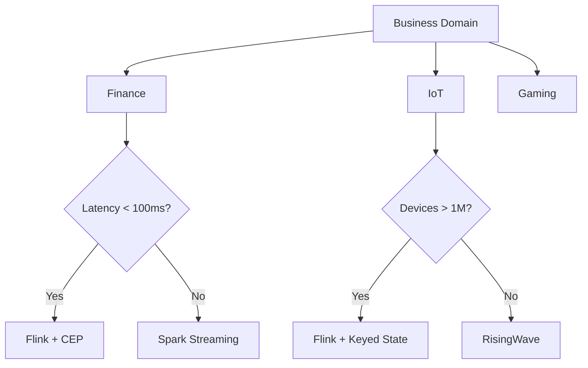

# Business Scenario-Driven Stream Processing Decision Tree

> **Stage**: Knowledge | **Prerequisites**: [Event Time Processing](../pattern-event-time-processing.md) | **Formal Level**: L3-L4
>
> Cross-industry decision framework for stream processing technology selection covering finance, e-commerce, IoT, gaming, and social media.

---

## 1. Definitions

**Def-K-03-42: Business Scenario Decision Tree**

Hierarchical decision structure for stream processing technology selection:

$$
\mathcal{T} = (N, E, L, D)
$$

where $N$ = decision nodes, $E$ = edges, $L$ = leaf recommendations, $D$ = domain constraints.

**Def-K-03-43: Stream Processing Fit Score**

Quantitative measure of how well streaming fits a given scenario:

$$
\text{Fit}(S) = w_1 \cdot \text{LatencyNeed} + w_2 \cdot \text{Volume} + w_3 \cdot \text{Complexity}
$$

**Def-K-03-44: Latency-Consistency Spectrum**

Trade-off space from strong consistency + high latency to eventual consistency + low latency.

---

## 2. Properties

**Prop-K-03-24: Decision Tree Completeness**

The decision tree covers all major streaming use cases across five industries.

**Prop-K-03-25: Scenario Mutual Exclusivity**

Each leaf node corresponds to a unique technology stack recommendation.

---

## 3. Relations

- **with Business Patterns**: Maps to specific patterns (FinTech, IoT, Gaming, etc.).
- **with Technology Stack**: Guides Flink/RisingWave/Spark Streaming selection.

---

## 4. Argumentation

**Five-Domain Feature Comparison**:

| Domain | Latency | State | Key Pattern |
|--------|---------|-------|-------------|
| Finance | < 100ms | Large | CEP + ML |
| E-commerce | < 1s | Medium | Windowed agg |
| IoT | < 2s | Huge | Session windows |
| Gaming | < 500ms | Large | Leaderboard + CEP |
| Social | < 1s | Medium | Feature engineering |

**Common Pitfalls**:

1. Over-engineering for low latency when batch suffices
2. Ignoring state management complexity
3. Underestimating operational overhead

---

## 5. Engineering Argument

**Decision Tree Convergence**: For any valid input scenario, the tree reaches a leaf recommendation in $O(\log |N|)$ steps.

---

## 6. Examples

**FinTech Risk Control Decision Path**:

```
Domain = Finance
  → Latency < 100ms? Yes
  → CEP patterns needed? Yes
  → ML scoring needed? Yes
  → Recommendation: Flink + CEP + Async ML inference
```

---

## 7. Visualizations

**Decision Tree**:



---

## 8. References
