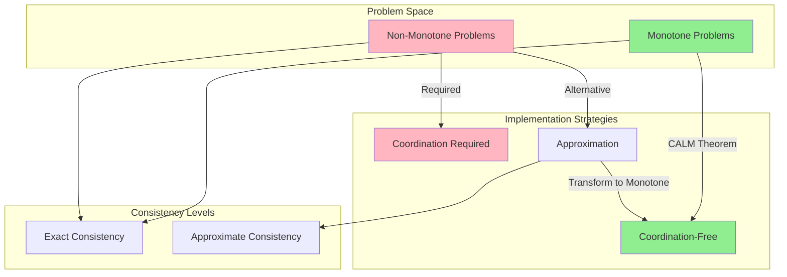
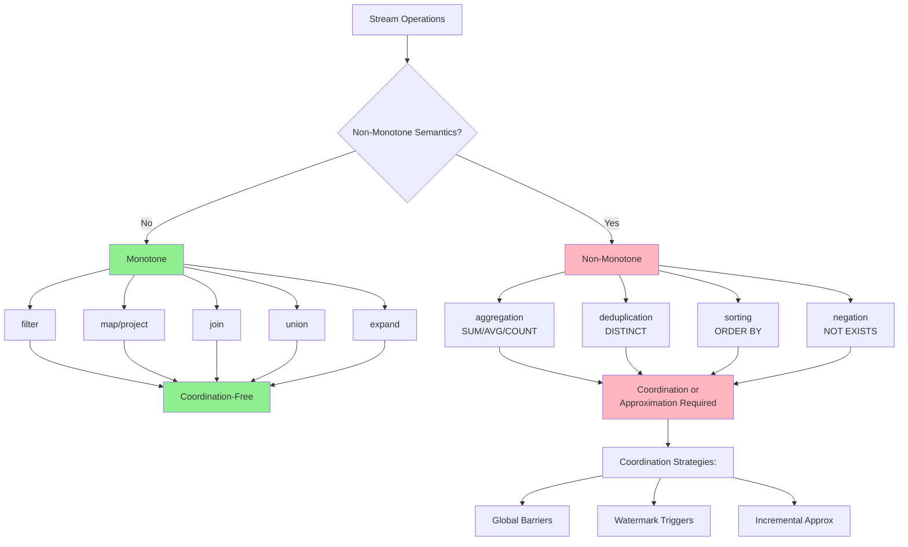
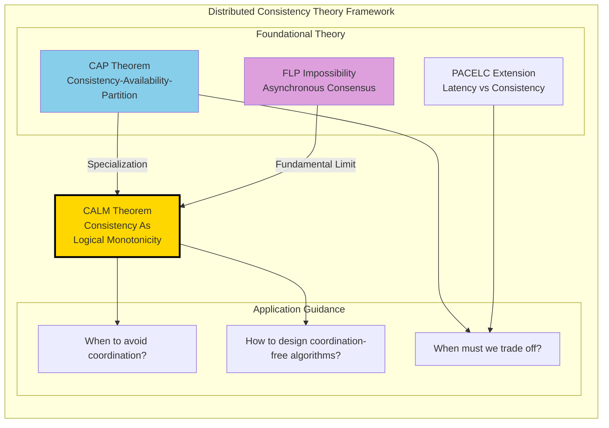

# CALM Theorem: Consistency As Logical Monotonicity

> **Stage**: Struct/ | **Prerequisites**: [02.04-liveness-and-safety.md](./02.04-liveness-and-safety.md), [02.05-type-safety-derivation.md](./02.05-type-safety-derivation.md) | **Formalization Level**: L5

---

## 1. Definitions

### 1.1 Problem and Computational Model

In distributed systems, we consider the following formal model:

**Def-S-02-13** (Distributed Problem): A distributed problem $\mathcal{P}$ is a mapping $P: \mathcal{I} \to \mathcal{O}$, where:

- $\mathcal{I}$ is the input set (possibly distributed across multiple nodes)
- $\mathcal{O}$ is the output set
- Each input $I \in \mathcal{I}$ is a set of key-value pairs $I = \{(k_1, v_1), (k_2, v_2), \ldots\}$
- Each output $O \in \mathcal{O}$ is likewise defined as a set of key-value pairs

**Def-S-02-14** (Logical Monotonicity): A problem $P$ is **logically monotone** if and only if:

$$\forall I_1, I_2 \in \mathcal{I}: I_1 \subseteq I_2 \Rightarrow P(I_1) \subseteq P(I_2)$$

That is, monotonic growth of the input set induces monotonic growth of the output set.

**Intuitive Explanation**: Monotone problems exhibit a "can only grow, never shrink" property. Once a particular output tuple is produced, it will never be retracted upon receipt of additional input. This notion aligns with monotone operations in SQL (e.g., selection, projection, natural join).

**Def-S-02-15** (Coordination): Coordination refers to **inter-process synchronization mechanisms** introduced in distributed computation to ensure correctness, including:

- Global barriers
- Distributed locks
- Consensus protocols
- Two-phase commit (2PC/3PC)

Formally, coordination cost is defined as:

$$\text{CoordCost}(\mathcal{A}) = \{(m, t) : m \text{ is a synchronization message}, t \text{ is waiting time}\}$$

**Def-S-02-16** (Consistency as Determinism of Program Results): A distributed implementation $\mathcal{A}$ satisfies **consistency** if and only if for all possible execution traces $\sigma \in \text{Exec}(\mathcal{A})$:

$$\text{result}(\sigma) = P(I)$$

where $I$ is the total input and $P$ is the specification of the target problem. In other words: **regardless of message delays, failures, or concurrency, the final program result always equals the function value defined by the specification**.

This differs from traditional CAP consistency—CAP concerns the consistency of replica states, whereas CALM concerns the **determinism of computational results with respect to the specification**.

---

## 2. Properties

### 2.1 Fundamental Properties of Monotone Problems

**Lemma-S-02-12** (Closure of Monotonicity under Set Operations): Logical monotonicity is closed under the following operations:

1. **Union**: If $P_1, P_2$ are monotone, then $P_1 \cup P_2$ is monotone.
2. **Join**: If $P_1, P_2$ are monotone, then $P_1 \bowtie P_2$ is monotone (natural join).
3. **Selection**: If $P$ is monotone, then $\sigma_\theta(P)$ is monotone (predicate selection).
4. **Projection**: If $P$ is monotone, then $\pi_A(P)$ is monotone.

*Proof Sketch*: Directly follows from the transitivity of set inclusion. ∎

**Lemma-S-02-13** (Non-Closure of Non-Monotonic Operations): The following operations **do not preserve** logical monotonicity:

1. **Aggregation**: $\gamma_{A, \text{SUM}(B)}(R)$ — new inputs may change the aggregated value.
2. **Negation** (Set Difference): $R - S$ — new inputs to $S$ may shrink the result.
3. **Universal Quantification**: $\forall x. \phi(x)$ — a new counterexample may flip the truth value from true to false.

*Counterexample*: Consider the counting aggregation $count(R)$. Initially, with $R = \{a, b\}$, we obtain $count = 2$; after adding $c$, we obtain $count = 3$. This violates the definition of monotonicity (the output set changes from $\{2\}$ to $\{3\}$, which does not form a subset relation). ∎

**Lemma-S-02-14** (Network Tolerance of Monotonicity): If a problem $P$ is logically monotone, then for any message-delay function $\delta: \mathbb{M} \to \mathbb{R}^+$, there exists an asynchronous implementation $\mathcal{A}_\delta$ such that:

$$\forall \sigma \in \text{Exec}(\mathcal{A}_\delta, \delta): \text{result}(\sigma) = P(I)$$

That is: monotone problems possess inherent fault tolerance against message delays.

---

## 3. Relations

### 3.1 Relation between CALM and CAP

**CAP Theorem** (Brewer, 2000): In the presence of a network partition, a system cannot simultaneously guarantee:

- Consistency
- Availability
- Partition Tolerance

**CALM vs. CAP**:

| Dimension | CAP Theorem | CALM Theorem |
|-----------|-------------|--------------|
| **Problem Type** | General distributed systems | Specific problem classes |
| **Core Conclusion** | Must trade off among the three | Monotone problems require no coordination |
| **Constructiveness** | Negative (impossibility) | Positive (feasibility) |
| **Application Value** | Architecture selection guidance | Algorithm design guidance |
| **Consistency Definition** | Linearizability, etc. | Determinism of results w.r.t. specification |

**Key Insight**: CAP tells us that "during a network partition, one must choose between consistency and availability"; CALM tells us that "for monotone problems, we can have both simultaneously."

### 3.2 Relation between CALM and Stream Processing

Operations in stream-processing systems can be classified within the CALM framework:

**Monotone Operations (Coordination-Free)**:

| Operation | Description | Example |
|-----------|-------------|---------|
| `filter` | Predicate filtering | `WHERE temperature > 100` |
| `map` | Element-wise transformation | `SELECT id, value * 2` |
| `join` | Natural join | `STREAM A JOIN B ON A.key = B.key` |
| `union` | Stream union | `A UNION ALL B` |

**Non-Monotone Operations (Coordination Required)**:

| Operation | Description | Coordination Requirement | Example |
|-----------|-------------|--------------------------|---------|
| `aggregate` | Global aggregation | Requires boundary determination | `SUM`, `COUNT`, `AVG` |
| `top-n` | Top-N ordering | Requires global view | `ORDER BY score DESC LIMIT 10` |
| `negation` | Existence check | Requires complement confirmation | `NOT EXISTS` |
| `deduplication` | Deduplication | Requires historical state | `DISTINCT` |

**Relation to Watermarks**: A watermark is a mechanism in stream processing for handling non-monotonicity—it provides a logical time boundary, allowing the system to safely trigger aggregation computations at that boundary.

### 3.3 Relation to Relational Algebra

The CALM theorem reveals a profound property in relational algebra:

$$\text{Safe}(Datalog^-) = \text{Monotone Queries}$$

That is: a Datalog program with negation is "safe" (can be transformed into a coordination-free implementation) if and only if it is monotone.

---

## 4. Argumentation

### 4.1 Necessity Analysis of Coordination

Why must non-monotone problems coordinate? Consider the following argument:

**Scenario**: Compute the cardinality of a set $R$, i.e., $|R|$.

**Argument Steps**:

1. Suppose two nodes $n_1, n_2$ hold subsets $R_1, R_2$ of $R$, respectively.
2. The nodes need to compute $|R_1 \cup R_2| = |R_1| + |R_2| - |R_1 \cap R_2|$.
3. Before knowing the contents of $R_2$, $n_1$ cannot determine the final output.
4. If $n_1$ emits a guessed value early, and $R_2$ later contains elements overlapping with $R_1$,
5. then $n_1$ must **retract** its prior output and publish a corrected value.
6. Such retraction requires a coordination mechanism to guarantee eventual consistency.

### 4.2 Design Philosophy of the Bloom Language

**Bloom** is a Datalog dialect designed around the CALM theorem:

```
# Monotone operations: declared directly
table :items, [:id, :name]
items <= [[1, "apple"], [2, "banana"]]  # accumulation semantics

# Non-monotone operations: explicitly marked as "non-deterministic"
table :total_count, [:cnt]
total_count <= items.group(nil, count(:id))  # coordination required
```

**Key Design Principles**:

1. **Default accumulation** (`<=`): monotone operations, no coordination needed.
2. **Instantaneous update** (`:=`): non-monotone operations, trigger coordination.
3. **Non-determinism marker**: the compiler automatically identifies locations requiring coordination.

### 4.3 Boundary Discussion

**Boundary Case 1**: Approximate Consistency

- In certain scenarios, approximate results may be acceptable in lieu of exact results.
- In such cases, non-monotone problems can also adopt a "weak consistency" implementation.
- Example: approximate counting (HyperLogLog) can estimate cardinality without coordination.

**Boundary Case 2**: Time Windows

- Introducing time boundaries can transform an unbounded stream problem into a finite one.
- Coordination is triggered at window boundaries, while processing within a window remains asynchronous.
- This is the core design pattern of systems such as Flink.

---

## 5. Formal Proof

### 5.1 Complete Statement of the CALM Theorem

**Thm-S-02-08** (CALM Theorem — Consistency As Logical Monotonicity):

A distributed problem $P$ admits a **coordination-free** consistent distributed implementation if and only if $P$ is logically monotone.

Formal statement:

$$\exists \mathcal{A}: \text{CoordFree}(\mathcal{A}) \land \text{Consistent}(\mathcal{A}, P) \iff \text{Monotone}(P)$$

where:

- $\text{CoordFree}(\mathcal{A})$: implementation $\mathcal{A}$ contains no explicit coordination primitives.
- $\text{Consistent}(\mathcal{A}, P)$: implementation $\mathcal{A}$ satisfies result consistency for problem $P$.

### 5.2 Proof: Monotonicity $\Rightarrow$ Coordination-Free Consistency

**Direction 1**: If $P$ is logically monotone, then there exists a coordination-free consistent implementation.

*Construction*:
Let $P$ be a monotone problem. Construct implementation $\mathcal{A}_{mono}$ as follows:

1. Each node $n_i$ maintains a local input set $I_i$.
2. Nodes exchange inputs via unreliable broadcast.
3. Each node applies $P$ to its currently visible input set $I_i^{\text{visible}} = \bigcup_{j} I_{ij}^{\text{received}}$.
4. Output $O_i = P(I_i^{\text{visible}})$.

*Proof of Correctness*:

**Lemma**: For any node $n_i$ and any time $t$, we have $O_i(t) \subseteq P(I)$.

*Proof*: Since $I_i^{\text{visible}}(t) \subseteq I$ (the visible input is a subset of the total input), and $P$ is monotone:

$$O_i(t) = P(I_i^{\text{visible}}(t)) \subseteq P(I)$$

∎

**Lemma**: As $t \to \infty$, $O_i(t) \to P(I)$ (assuming eventual delivery).

*Proof*: Under the assumption of eventual delivery, $\lim_{t \to \infty} I_i^{\text{visible}}(t) = I$. By continuity of $P$ (as a set mapping), $\lim_{t \to \infty} P(I_i^{\text{visible}}(t)) = P(I)$. ∎

**Conclusion**: $\mathcal{A}_{mono}$ satisfies consistency (results converge to $P(I)$) and requires no coordination. ∎

### 5.3 Proof: Non-Monotonicity $\Rightarrow$ Coordination Required

**Direction 2**: If $P$ is not logically monotone, then any consistent implementation must coordinate.

*Proof by Contradiction*:

Assume $P$ is non-monotone, yet there exists a coordination-free consistent implementation $\mathcal{A}$.

Since $P$ is non-monotone, there exist inputs $I_1 \subset I_2$ such that:

$$P(I_1) \not\subseteq P(I_2)$$

That is, there exists an output tuple $o \in P(I_1)$ but $o \notin P(I_2)$.

**Scenario Construction**:

1. Consider two nodes $n_1, n_2$.
2. Total input $I_2 = I_1 \cup \Delta$, where $\Delta$ is the additional input.
3. A network partition causes $n_1$ to receive $I_1$ first, while $n_2$ eventually receives $I_2$.

**Derivation**:

- Because $\mathcal{A}$ is coordination-free, $n_1$ cannot know whether $n_2$ holds additional input.
- If $n_1$ outputs $o$ (since computation based on $I_1$ indicates $o$ should be emitted),
- yet the existence of $I_2$ implies $o \notin P(I_2)$,
- then the output of $n_1$ violates global consistency.

**The Only Way to Avoid Inconsistency**:

- $n_1$ must wait for confirmation that no further input exists (or synchronize with $n_2$).
- Such waiting/synchronization is precisely the definition of **coordination**.

**Conclusion**: A consistent implementation of a non-monotone problem must incorporate a coordination mechanism. ∎

### 5.4 Corollaries

**Cor-S-02-04**: In stream processing, unbounded aggregation operations (e.g., global SUM, COUNT) necessarily introduce coordination overhead.

**Cor-S-02-05**: Event-time windowed aggregation can **defer** coordination to window boundaries via watermark mechanisms, rather than coordinating on every record.

**Cor-S-02-06**: Approximate algorithms (e.g., Count-Min Sketch, HyperLogLog) can transform a non-monotone problem into a monotone approximate version, thereby avoiding coordination.

---

## 6. Examples

### 6.1 Example 1: Shopping Cart — Monotone Implementation

**Problem**: Implement a distributed shopping cart that supports adding items.

**Monotone Implementation** (ADD-ONLY semantics):

```python
# Each entry: (cart_id, item_id, quantity, timestamp)
class MonotoneShoppingCart:
    def __init__(self):
        self.items = set()  # grow-only set

    def add_item(self, cart_id, item_id, quantity):
        # Monotone operation: can only add, never delete or modify
        entry = (cart_id, item_id, quantity, time.time())
        self.items.add(entry)

    def get_cart(self, cart_id):
        # Aggregate all entries (deduplicate by latest timestamp)
        result = {}
        for c, i, q, t in self.items:
            if c == cart_id:
                if i not in result or result[i][1] < t:
                    result[i] = (q, t)
        return {i: q for i, (q, _) in result.items()}
```

**CALM Analysis**:

- The operation is monotone: adding an entry only increases output information.
- No coordination is needed: nodes independently accumulate entries, and eventual consistency is achieved automatically.
- Drawback: cannot support the "delete item" function.

### 6.2 Example 2: Shopping Cart — Non-Monotone Implementation

**Problem**: Support a full shopping cart with add, delete, and quantity modification.

**Non-Monotone Implementation**:

```python
class FullShoppingCart:
    def __init__(self):
        self.items = {}  # (cart_id, item_id) -> (quantity, timestamp)

    def update_item(self, cart_id, item_id, quantity):
        # Non-monotone: quantity may be 0 (deletion) or decreased
        key = (cart_id, item_id)
        self.items[key] = (quantity, time.time())

    def get_cart(self, cart_id):
        result = {}
        for (c, i), (q, t) in self.items.items():
            if c == cart_id and q > 0:
                result[i] = q
        return result
```

**Coordination Requirements**:

- The delete operation introduces non-monotonicity.
- A coordination mechanism is required (e.g., CRDT LWW-Register or vector clocks).
- Alternatively, use 2PC to guarantee cross-node consistency.

### 6.3 Example 3: Social Network Analysis in Bloom

```
# Define table schemas
table :follows, [:follower, :followee]
table :reachable, [:follower, :followee]

# Monotone transitive closure computation (no coordination needed)
reachable <= follows
reachable <= (follows * reachable).pairs(:followee => :follower) do |f, r|
  [f.follower, r.followee]
end

# Non-monotone counting (coordination required)
table :follower_count, [:user, :count]
follower_count <= reachable.group(:followee, count(:follower))
```

---

## 7. Visualizations

### 7.1 Core Logic of the CALM Theorem



### 7.2 Classification of Stream Processing Operations



### 7.3 Relationship between CALM and CAP



### 7.4 Shopping Cart Implementation Comparison

```mermaid
stateDiagram-v2
    [*] --> MonotoneImpl: Choose Strategy
    [*] --> NonMonotoneImpl: Choose Strategy

    state MonotoneImpl {
        [*] --> ReceiveAdd
        ReceiveAdd --> AccumulateEntries
        AccumulateEntries --> LocalOutput
        LocalOutput --> [*]
        note right of AccumulateEntries
            No coordination needed
            Eventual consistency automatic
        end note
    }

    state NonMonotoneImpl {
        [*] --> ReceiveUpdate
        ReceiveUpdate --> NeedCoordination

        state CoordinationMechanism {
            TwoPhaseCommit
            VectorClocks
            CRDTMerge
        }

        NeedCoordination --> TwoPhaseCommit: Strong Consistency
        NeedCoordination --> VectorClocks: Causal Consistency
        NeedCoordination --> CRDTMerge: Eventual Consistency

        TwoPhaseCommit --> GlobalOutput
        VectorClocks --> GlobalOutput
        CRDTMerge --> GlobalOutput

        GlobalOutput --> [*]
    }

    MonotoneImpl --> FunctionalLimitation: Cannot delete
    NonMonotoneImpl --> FullFunctionality: Full CRUD
```

---

## 8. References


---

## Appendix: CALM Theorem Symbol Quick Reference

| Symbol | Meaning |
|--------|---------|
| $\mathcal{P}: \mathcal{I} \to \mathcal{O}$ | Distributed Problem |
| $I_1 \subseteq I_2 \Rightarrow P(I_1) \subseteq P(I_2)$ | Logical Monotonicity Definition |
| $\text{CoordFree}(\mathcal{A})$ | Coordination-Free Implementation |
| $\text{Consistent}(\mathcal{A}, P)$ | Consistency w.r.t. Specification |
| $\bowtie$ | Natural Join |
| $\sigma_\theta$ | Selection |
| $\pi_A$ | Projection |
| $\gamma$ | Aggregation |

---

*Document Version: 1.0 | Created: 2026-04-02 | Formalization Level: L5*
