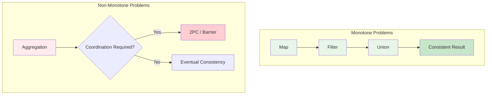

# CALM Theorem: Consistency as Logical Monotonicity

> **Stage**: Struct/ | **Prerequisites**: [Liveness and Safety](liveness-and-safety.md), [Type Safety Derivation](type-safety-derivation.md) | **Formalization Level**: L5
> **Translation Date**: 2026-04-21

## Abstract

The **CALM Theorem** (Consistency as Logical Monotonicity), established by Ameloot et al. and refined by Conway et al., states that a distributed problem has a coordination-free consistent implementation if and only if it is logically monotone. This theorem provides a fundamental boundary for when distributed coordination is strictly necessary.

---

## 1. Definitions

### Def-S-02-13 (Distributed Problem)

A distributed problem $\mathcal{P}$ is a mapping $P: \mathcal{I} \to \mathcal{O}$, where:

- $\mathcal{I}$ is the set of inputs (possibly distributed across multiple nodes)
- $\mathcal{O}$ is the set of outputs
- Each input $I \in \mathcal{I}$ is a set of key-value pairs
- Output $O \in \mathcal{O}$ is similarly defined as a set of key-value pairs

### Def-S-02-14 (Logical Monotonicity)

A problem $P$ is **logically monotone** if and only if:

$$\forall I_1, I_2 \in \mathcal{I}: I_1 \subseteq I_2 \Rightarrow P(I_1) \subseteq P(I_2)$$

That is, monotonic growth of inputs leads to monotonic growth of outputs.

**Intuition**: Monotone problems have a "only grow, never shrink" property. Once an output tuple is produced, it is never retracted when more input arrives. This aligns with SQL monotone operations (selection, projection, natural join).

### Def-S-02-15 (Coordination)

**Coordination** refers to inter-process synchronization mechanisms in distributed computation:

- Global barriers
- Distributed locks
- Consensus protocols
- Two-phase commit (2PC/3PC)

Formally, coordination cost is:

$$\text{CoordCost}(\mathcal{A}) = \{(m, t) : m \text{ is a sync message}, t \text{ is wait time}\}$$

### Def-S-02-16 (Consistency as Result Determinism)

A distributed implementation $\mathcal{A}$ satisfies **consistency** iff for all possible execution traces $\sigma \in \text{Exec}(\mathcal{A})$:

$$\text{result}(\sigma) = P(I)$$

where $I$ is the total input and $P$ is the target problem specification. **Regardless of message delays, failures, or concurrency, the final result always equals the functionally defined value.**

This differs from CAP consistency—CALM concerns **computational determinism relative to specification**, not replica state agreement.

---

## 2. Properties

### Lemma-S-02-05 (Monotone Operations Closure)

The following relational algebra operations are logically monotone:
- Selection ($\sigma$)
- Projection ($\pi$)
- Union ($\cup$)
- Natural join ($\bowtie$)

The following are **not** monotone:
- Difference ($-$)
- Aggregation with grouping ($\gamma$)
- Negation ($\neg$)

**Proof Sketch.** Direct verification against Def-S-02-14. For difference: $I_1 \subseteq I_2$ does not imply $R_1 - S_1 \subseteq R_2 - S_2$ because $S$ may grow faster than $R$. ∎

### Lemma-S-02-06 (Coordination-Free ≠ Wait-Free)

Coordination-free implementations may still exhibit transient inconsistencies during execution. The CALM guarantee applies only to **final** results (eventual consistency under correct delivery).

---

## 3. Relations

### Relation 1: CALM and Stream Processing

In stream processing, stateful operators (aggregation, windowing) require coordination for consistent results. Stateless operators (map, filter) are naturally coordination-free. This directly maps to CALM: stateless transformations are monotone; stateful aggregations are not.

### Relation 2: CALM and CRDTs

Conflict-free Replicated Data Types (CRDTs) are designed for coordination-free consistency. CRDTs are monotone by construction: state only grows (or converges via monotonic merge functions). CALM explains **why** CRDTs work without coordination.

### Relation 3: CALM and the CAP Theorem

CALM refines CAP by showing that coordination is not a binary choice but depends on problem structure:
- **Monotone problems**: Coordination-free consistent implementations exist (AP without sacrificing C for the specification).
- **Non-monotone problems**: Coordination is fundamentally required (choose between C and availability).

---

## 4. Argumentation

### 4.1 Positive Result: Monotone Problems

For logically monotone problems, we can construct coordination-free implementations:

1. Each node computes local results independently.
2. Results are sent to output collectors.
3. By monotonicity, no retraction is ever needed.
4. Final output equals the specification result.

### 4.2 Negative Result: Non-Monotone Problems

For non-monotone problems (e.g., aggregation, negation), any consistent implementation must coordinate:

**Proof Sketch.** Suppose aggregation $\gamma$ has a coordination-free implementation. Consider two nodes each holding partial inputs. Without coordination, each node cannot determine if more input will arrive that changes the aggregate (e.g., a new maximum). Thus, any output produced may need retraction—violating consistency. ∎

### 4.3 Practical Boundary

| Operation | Monotone? | Needs Coordination? |
|-----------|-----------|---------------------|
| Map | Yes | No |
| Filter | Yes | No |
| Union | Yes | No |
| Join | Yes | No (if input-monotone) |
| GroupBy+Count | No | Yes |
| Windowed Sum | No | Yes |
| Distinct | No | Yes |

---

## 5. Formal Proof

### Thm-S-02-05 (CALM Theorem — Ameloot et al.)

A distributed problem $\mathcal{P}$ has a coordination-free consistent implementation if and only if $\mathcal{P}$ is logically monotone.

**Proof.** (→) Suppose $\mathcal{P}$ has a coordination-free consistent implementation $\mathcal{A}$. Consider inputs $I_1 \subseteq I_2$. Run $\mathcal{A}$ on $I_1$; by consistency, result is $P(I_1)$. Now extend to $I_2$ by adding records. Since $\mathcal{A}$ is coordination-free, added records are processed independently. By consistency on $I_2$, the final result is $P(I_2)$. Since records are only added, $P(I_1) \subseteq P(I_2)$. Thus $P$ is monotone.

(←) Suppose $P$ is monotone. Construct $\mathcal{A}$ as follows: each node processes its local input and emits tuples to a collector. By monotonicity, no emitted tuple will ever be invalid. The collector's growing output equals $P(I)$. No coordination is needed. ∎

---

## 6. Examples

### Example 6.1: Monotone — Stream Filter

```java
// Flink: Stateless filter is coordination-free
DataStream<Event> filtered = stream
    .filter(e -> e.getType().equals("CLICK"));
```

No state, no coordination needed. CALM guarantees consistent results.

### Example 6.2: Non-Monotone — CountDistinct

```java
// Stateful aggregation requires coordination
DataStream<Long> distinctCount = stream
    .keyBy(Event::getUserId)
    .window(TumblingEventTimeWindows.of(Time.hours(1)))
    .aggregate(new CountDistinctAggregate());
```

Count-distinct is non-monotone (the count can change as more elements arrive). In distributed settings, consistent results require coordination (e.g., via checkpoint barriers).

---

## 7. Visualizations



**CALM decision boundary**: Monotone problems achieve coordination-free consistency; non-monotone problems require coordination for strong consistency.

---

## 8. References

[^1]: T. J. Ameloot et al., "Relational Transducers for Declarative Networking", JACM, 60(2), 2013.
[^2]: P. Alvaro et al., "Consistency Analysis in Bloom: A CALM and Collected Approach", CIDR, 2011.
[^3]: M. Conway et al., "Logic and Lattices for Distributed Programming", ACM SoCC, 2012.
[^4]: S. A. Weil et al., "CRDTs: Conflict-free Replicated Data Types", 2011.
