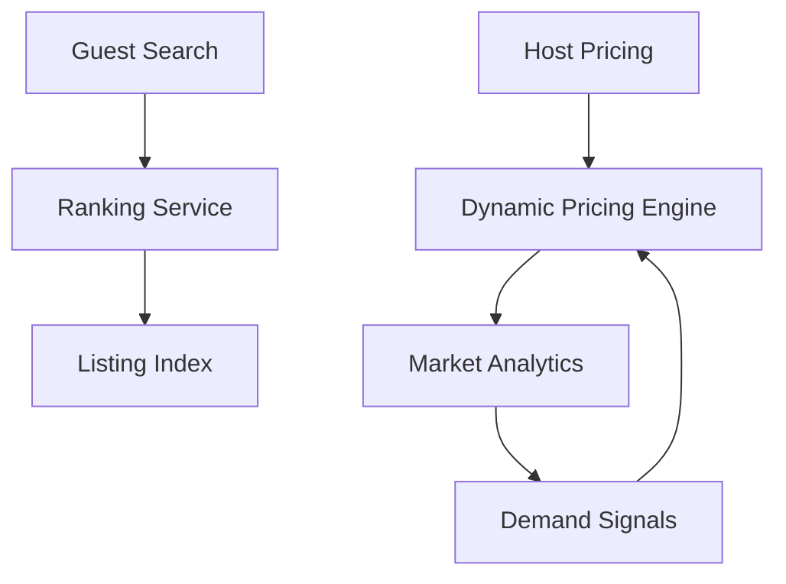

# Airbnb Marketplace Dynamic Pricing — Two-Sided Market Streaming

> **Stage**: Knowledge | **Prerequisites**: [Real-Time Recommendation](../case-real-time-recommendation.md) | **Formal Level**: L3-L4
>
> **Domain**: Sharing Economy | **Complexity**: ★★★★★ | **Latency**: < 500ms | **Scale**: Global short-term rental platform
>
> Airbnb's dynamic pricing and real-time search ranking for two-sided marketplace optimization.

---

## 1. Definitions

**Def-K-03-29: Airbnb Two-Sided Market Event Stream**

Real-time interaction events connecting hosts (supply) and guests (demand): Search, View, Wishlist, BookingRequest, BookingConfirm, Cancellation[^1][^2].

$$
\text{MarketplaceEventStream} \triangleq \langle E, A, T, L \rangle
$$

**Def-K-03-30: Dynamic Pricing Engine**

Real-time price adjustment based on supply-demand signals, seasonality, and competitive positioning.

**Def-K-03-31: Real-Time Search Ranking System**

Personalized listing ranking updated in real time based on user preferences, listing quality, and market conditions.

---

## 2. Properties

**Prop-K-03-15: Pricing Convergence**

Dynamic prices converge to market equilibrium within bounded iterations because demand elasticity is negative and supply is fixed in the short term.

**Lemma-K-03-06: Supply-Demand Matching Efficiency Lower Bound**

With $n$ listings and $m$ searches per second, matching efficiency is bounded by the ranking model's NDCG@10.

---

## 3. Relations

- **with Flink Core**: Uses keyed state for host/listing profiles, event-time windows for market analytics.
- **with Two-Sided Market Theory**: Pricing follows Rochet-Tirole platform economics.

---

## 4. Argumentation

**Three-Phase Architecture Evolution**:

1. **Rule-based pricing**: Static rules (seasonality, minimum stay)
2. **ML-based pricing**: Gradient boosted models for price recommendations
3. **Real-time pricing**: Streaming pipeline with instant demand signal incorporation

**Search Ranking Real-Time Update**: User search triggers personalized ranking computation within 200ms using pre-computed listing embeddings and real-time availability.

---

## 5. Engineering Argument

**Market Equilibrium Existence**: For each listing $i$, let $D_i(p)$ be demand and $S_i$ be supply (0 or 1). Equilibrium price $p^*$ satisfies $D_i(p^*) = S_i$. With continuous $D_i$ and monotonicity, $p^*$ exists and is unique.

---

## 6. Examples

**Dynamic Pricing Pipeline**:

```
Booking Events
  → KeyBy(listing_id)
  → Window(7d Rolling)
  → Aggregate(occupancy_rate, avg_price)
  → Pricing Model
  → Price Update
```

---

## 7. Visualizations

**Airbnb Marketplace Architecture**:



---

## 8. References

[^1]: Airbnb Engineering Blog, "Dynamic Pricing at Airbnb", 2024.
[^2]: J.-C. Rochet and J. Tirole, "Platform Competition in Two-Sided Markets", JEEA, 2003.
