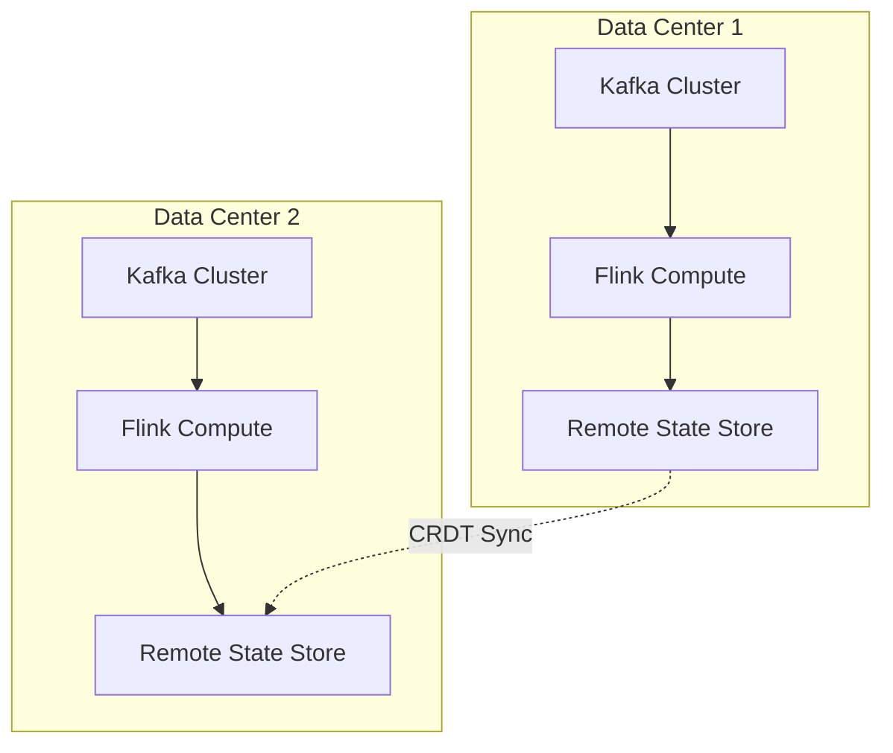

# Alibaba Double 11 Real-Time Computing — World's Largest Stream Processing

> **Stage**: Knowledge | **Prerequisites**: [Flink Architecture](../flink/flink-architecture-overview.md) | **Formal Level**: L3-L4
>
> **Domain**: E-Commerce | **Complexity**: ★★★★★ | **Latency**: < 100ms | **Peak TPS**: 4.4 Billion

---

## 1. Definitions

**Def-K-03-11: Double 11 Real-Time Architecture**

The technical architecture powering Alibaba's annual global shopping festival, processing real-time transactions, inventory, risk control, and logistics across multiple data centers.

**Def-K-03-12: 4.4 Billion+ TPS Processing**

Peak throughput achieved during Double 11 2024, representing the highest recorded stream processing scale in production.

---

## 2. Properties

**Prop-K-03-11: Ultra-Large Scale Characteristics**

- Peak QPS: 4.4B messages/second
- Latency: P99 < 100ms end-to-end
- Availability: 99.999% (5 nines)
- Geo-redundancy: 3+ active-active data centers

**Prop-K-03-12: Disaggregated Architecture Benefits**

Separation of compute and state storage enables independent scaling and reduces recovery time by 10x compared to colocated architectures.

---

## 3. Relations

- **with Flink 2.0**: Uses disaggregated state backend and unified batch/streaming scheduler.
- **with Business Scenarios**: Maps to real-time dashboard, transaction risk control, inventory synchronization, logistics tracking.

---

## 4. Argumentation

**Breakthrough 1: Flink 2.0 Disaggregated Architecture**

State stored in remote KV store (e.g., ApsaraDB) while compute nodes remain stateless. Benefits:

- Fast failover: stateless nodes restart in < 5s
- Elastic scaling: add/remove nodes without state migration
- Resource efficiency: decouple compute from storage bottlenecks

**Breakthrough 2: Second-Level Scaling**

Auto-scaling reacts to traffic surges within seconds by:

1. Monitoring backpressure metrics via Flink REST API
2. Triggering Kubernetes HPA based on CPU/backpressure
3. Stateless workers joining via consistent hashing

**Breakthrough 3: Geo-Active-Active**

Multi-master deployment with CRDT-based conflict resolution for inventory and cart state.

---

## 5. Engineering Argument

**Geo-Active-Active Consistency**: Using CRDTs for mergeable state (counters, sets) and Saga pattern for non-mergeable operations (payments), the system maintains eventual consistency with bounded inconsistency windows (< 200ms).

---

## 6. Examples

**Real-Time Dashboard Pipeline**:

```
Kafka (transaction events)
  → KeyBy(user_id)
  → Window(1s Tumbling)
  → Aggregate(GMV, UV, PV)
  → Redis (dashboard cache)
```

---

## 7. Visualizations

**Double 11 Architecture Overview**:



---

## 8. References
