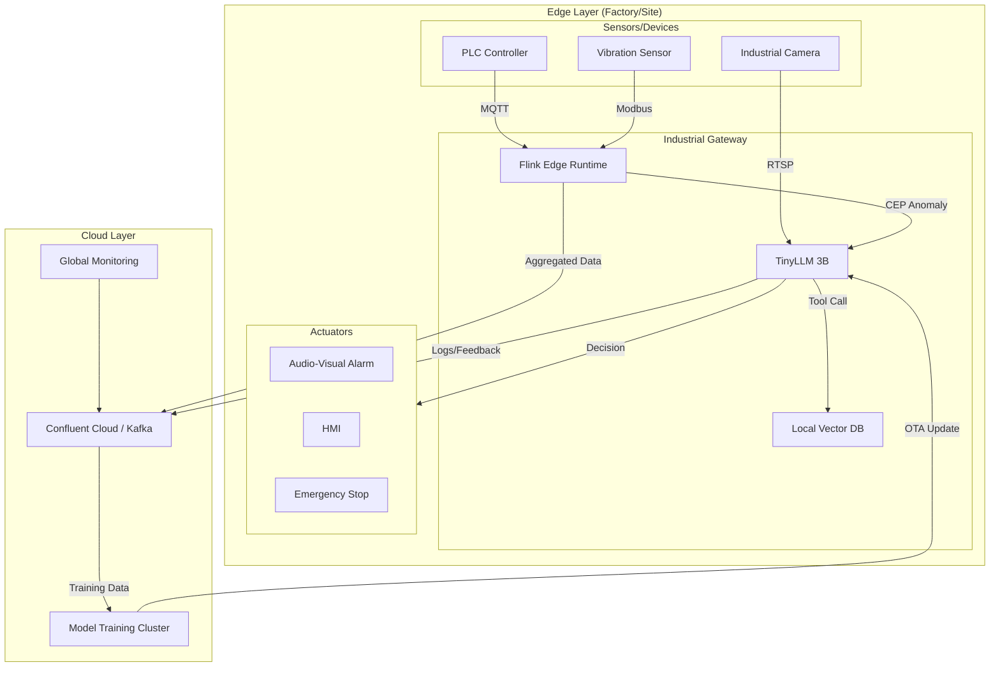
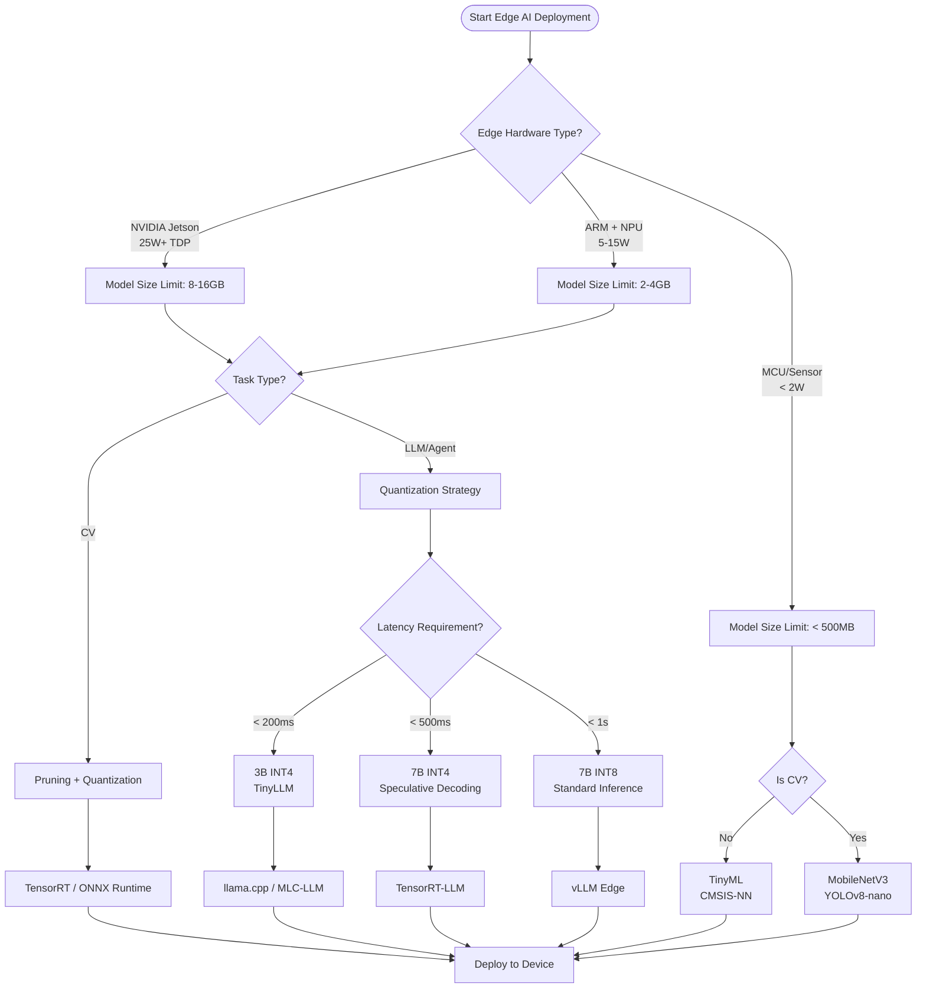

> **Status**: 🔮 Forward-looking Content | **Risk Level**: Medium | **Last Updated**: 2026-04-20
>
> This document covers edge AI production cases based on public reports and research; actual results may vary by scenario.

---

# Stream Processing + Edge AI Production Case Update (2026 Q2)

> **Stage**: Knowledge/10-case-studies/iot | **Prerequisites**: [edge-ai-streaming-architecture.md](../Knowledge/06-frontier/edge-ai-streaming-architecture.md), [flink-edge-streaming-guide.md](../Flink/09-practices/09.05-edge/flink-edge-streaming-guide.md) | **Formalization Level**: L3

---

## 1. Definitions

### Def-K-10-60: Edge-Streaming Inference Pipeline

**Edge-Streaming Inference Pipeline** (边缘流式推理管道) defines the complete chain that continuously receives data streams, executes AI inference, and outputs decision results on resource-constrained edge devices:

```yaml
Edge-Streaming Inference Pipeline:
  Input Layer:
    - Sensor Streams (MQTT/CoAP)
    - Video Streams (RTSP/GB28181)
    - Log Streams (syslog/fluentd)

  Preprocessing Layer:
    - Data Cleaning and Format Standardization
    - Window Aggregation (Sliding/Tumbling)
    - Feature Extraction and Dimensionality Reduction

  Inference Layer:
    - Model Loading and Cache Management
    - Batch Inference
    - Dynamic Batching

  Output Layer:
    - Decision Result Stream (Kafka/Local Action)
    - Anomaly Alerts (edge → cloud)
    - Model Feedback and Local Fine-tuning

  Resource Constraints:
    Memory: typically < 16GB (GPU VRAM < 8GB)
    Power: 15W-75W (industrial grade) / < 5W (IoT grade)
    Network: intermittent connection, limited bandwidth
```

### Def-K-10-61: TinyLLM Edge Deployment

**TinyLLM Edge Deployment** (TinyLLM 边缘部署) defines the engineering practice of deploying small language models with parameter sizes between 1B-7B to edge devices via compression techniques:

```yaml
TinyLLM Deployment Mode:
  Model Compression Stack:
    - Quantization: FP32 → INT8 (4x compression, ~3% accuracy loss) / INT8 → INT4 (8x compression, ~8-12% loss)
    - Pruning: remove low-weight connections (sparsity 30-50%)
    - Distillation: large model (Teacher 70B) → small model (Student 7B), retaining 85-90% capability

  Edge Runtime Environment:
    - WebLLM: in-browser WebGPU inference (Gemma 2B q4f32, ~1.5GB)
    - ONNX Runtime: cross-platform optimized inference
    - TensorRT-LLM: NVIDIA edge device acceleration
    - llama.cpp: CPU-friendly inference

  Stream Processing Integration:
    - Input Token Streaming: segmented processing of long text
    - Output Streaming Response: SSE progressive return
    - Context Cache: KV-Cache persistence to accelerate multi-turn dialogue
```

---

## 2. Properties

### Prop-K-10-60: Edge Inference Latency vs. Model Size Trade-off

**Proposition**: On fixed edge hardware, model inference latency grows super-linearly with model size:

$$
L_{inference}(P) = \alpha \cdot P^{\beta} + L_{fixed}, \quad \beta \in [1.2, 1.8]
$$

Where:

- $P$: model parameter count (B)
- $\alpha$: hardware-dependent coefficient (ms/B^β)
- $L_{fixed}$: fixed overhead (memory allocation, I/O)

**Measured Data** (NVIDIA Jetson Orin Nano, INT8 quantization):

| Model | Parameters | Inference Latency (128 tokens) | Memory Usage |
|-------|-----------|-------------------------------|-------------|
| TinyLlama-1.1B | 1.1B | 120ms | 1.2GB |
| Qwen2-1.5B | 1.5B | 180ms | 1.8GB |
| Gemma-2B | 2.0B | 250ms | 2.4GB |
| Phi-3-mini | 3.8B | 480ms | 4.2GB |
| Qwen2-7B | 7.0B | 920ms | 7.8GB |

---

## 3. Relations

### 3.1 Synergy Between Edge AI and Stream Processing Systems

| Dimension | Edge AI Layer | Stream Processing Layer (Flink/K3s) | Synergy Value |
|-----------|--------------|-------------------------------------|---------------|
| Data Ingestion | Sensor/camera direct connection | MQTT/CoAP Source | Unified data ingestion |
| Preprocessing | Simple filtering/cropping | Complex window aggregation/CEP | Layered compute offloading |
| Inference Execution | Local model (low latency) | Cloud large model (high capability) | Hybrid inference strategy |
| State Management | Device local cache | Flink State Backend | Disconnection resume |
| Model Update | OTA differential update | Streaming model distribution | Hot update without downtime |

### 3.2 Evolution of Edge AI Deployment Modes

```
┌─────────────────────────────────────────────────────────────────┐
│  Mode 1: Pure Cloud Inference (2020-2023)                       │
│  Edge → Cloud API → Result                                      │
│  Cons: High latency, high bandwidth, data privacy risks         │
├─────────────────────────────────────────────────────────────────┤
│  Mode 2: Edge Preprocessing + Cloud Inference (2023-2024)       │
│  Edge [Preprocessing] → Cloud [Inference] → Edge [Action]       │
│  Cons: Still requires frequent cloud communication              │
├─────────────────────────────────────────────────────────────────┤
│  Mode 3: Edge Inference + Cloud Coordination (2025-2026) ★ Mainstream │
│  Edge [TinyLLM/SLM Inference] → Local Decision                  │
│  Cloud [Model Training/Global Optimization/Monitoring]          │
│  Pros: Low latency, offline capable, privacy protection         │
├─────────────────────────────────────────────────────────────────┤
│  Mode 4: Device-Edge-Cloud Collaboration (2026+)                │
│  Device [Micro Model] → Edge [Small Model] → Cloud [Large Model]│
│  Dynamic Routing: Simple tasks on device, complex tasks on cloud│
└─────────────────────────────────────────────────────────────────┘
```

---

## 4. Argumentation

### 4.1 Core Technology Breakthroughs in Edge AI (2026)

**Three Breakthrough Directions**:

1. **Model Compression Technology Maturation**
   - Quantization: GPTQ/AWQ/EXL2 enabling high-quality INT4 inference
   - Distillation: Domain-specific SLM (1-7B) surpassing general-purpose large models on vertical tasks
   - Speculative Decoding (投机解码): small model draft + large model verification, 2-3x speedup

2. **Edge Hardware Compute Leap**
   - NVIDIA Jetson Thor: 100 TOPS, supporting Transformer engine
   - Qualcomm AI Stack: mobile NPU running 7B models
   - Apple M4 Neural Engine: 38 TOPS, local LLM smooth operation

3. **Stream Processing at the Edge**
   - Apache Flink edge deployment (K3s + lightweight TM)
   - Redpanda / NATS replacing Kafka (no Zookeeper)
   - WASM UDF supporting multi-language edge operators

### 4.2 Deployment Differences: Edge LLM vs. Edge CV

| Dimension | Edge Computer Vision | Edge LLM |
|-----------|---------------------|----------|
| Model Size | 10-100MB (MobileNet/YOLO) | 1-8GB (after quantization) |
| Inference Latency | 10-50ms | 100ms-2s |
| Input Data | Image/video frames | Text/token streams |
| State Requirement | Stateless | Stateful with KV-Cache |
| Stream Processing Mode | Frame-by-frame processing | Streaming generation (token-by-token) |
| Compression Focus | Structural pruning | Quantization + Distillation |

---

## 5. Proof / Engineering Argument

### Thm-K-10-60: Availability Upper Bound of Edge Stream Inference Systems

**Theorem**: Under given edge hardware resource constraints, the availability of a stream inference system has a theoretical upper bound:

$$
A_{system} = \frac{T_{available}}{T_{available} + T_{recovery}} \leq \frac{MTBF}{MTBF + MTTR}
$$

**Key Constraints**:

1. **Memory Constraint**: model weights + KV-Cache + stream state < device memory
   - KV-Cache growth: $S_{kv} = 2 \cdot P \cdot L_{seq} \cdot D_{head} \cdot N_{layer}$ bytes
   - Long sequences (L > 4K) require VRAM management or sliding windows

2. **Power Constraint**: sustained inference power < device thermal design power (TDP)
   - Peak power management: dynamic voltage and frequency scaling (DVFS)
   - Batch inference aggregation reduces per-unit energy consumption

3. **Network Constraint**: local cache during disconnection is sufficient to sustain inference
   - Model weights: locally resident
   - Knowledge updates: periodic synchronization (non-real-time dependent)

---

## 6. Examples

### 6.1 Case 1: Automotive Factory Edge LLM Agent — Predictive Maintenance

**Background**: An automotive manufacturer deployed an edge AI system on the production line to analyze machine logs and sensor data in real time.

**Architecture**:

- Edge Node: NVIDIA Jetson AGX Orin (32GB) + Flink K3s
- Model: Qwen2-7B INT4 quantization (3.5GB) + domain fine-tuning
- Data Sources: PLC log stream (MQTT) + vibration sensor (10KHz)

**Stream Processing Pipeline**:

```
Sensor Stream → Flink CEP (Anomaly Pattern Detection) → Edge LLM (Root Cause Analysis) → Maintenance Ticket
```

**Results**:

- Unplanned downtime reduced by **18%**
- Annual savings: **$1.2M**
- Average fault diagnosis latency: **< 2 seconds** (local inference)
- Data never leaves the factory, meeting automotive industry compliance requirements

**Key Success Factors**:

- Domain-specific fine-tuning (maintenance knowledge base + historical fault cases)
- Hybrid inference: simple anomalies handled by rule engine, complex faults analyzed by LLM
- Flink Checkpoint guarantees stream state recovery after device restart

### 6.2 Case 2: Food Processing Plant Multi-Site Edge Orchestration — Quality Report Automation

**Background**: A food processing group deployed a unified edge AI platform across 5 factories.

**Architecture**:

- Per-factory edge: Dell Edge Gateway + Raspberry Pi 5 + Hailo-8L
- Cloud coordination: Kubernetes + Flink Session Cluster
- Models: Visual QA (YOLOv8) + Report Generation (Phi-3-mini 3.8B INT8)

**Stream Processing Pipeline**:

```
Production Line Camera → Edge Vision Detection (Hailo-8L) → Defect Summary → Edge LLM Report Generation → Cloud Aggregation
```

**Results**:

- Quality report generation manpower reduced by **35%**
- Annual savings: **$480K**
- Cross-factory quality data real-time aggregation latency: **< 5 seconds**
- Edge LLM single report generation: **< 3 seconds**

**Key Success Factors**:

- Layered architecture: vision inference on NPU, LLM on CPU/GPU mixed deployment
- Model sharing: 5 factories share base model, local sites only cache differential LoRA
- Edge-cloud collaboration: complex complaint analysis automatically escalated to cloud, daily reports completed locally

### 6.3 Case 3: TinyLLM Edge Agent — Device Function Calling and Autonomous Decision-Making

**Background**: Based on 2026 TinyLLM research, deploying a 3B-parameter small model to an industrial gateway to execute Agent tasks.

**Architecture**:

- Hardware: ARM Cortex-A78 + 8GB RAM (industrial gateway)
- Model: TinyAgent-3B (hybrid fine-tuning + DPO optimization)
- Protocol: MCP (tool calling) + A2A (multi-Agent collaboration)

**Stream Processing Pipeline**:

```
Device Alert Stream → TinyLLM (Intent Recognition) → MCP Tool Call (Query KB/Read Sensor) → A2A Coordination → Execute Action
```

**Results**:

- Function calling accuracy: **88.22%** (surpassing lightweight models by nearly 70%)
- Multi-turn dialogue task accuracy: **55.62%**
- Model size: **1.8GB** (INT4 quantization)
- Single-round inference latency: **< 500ms**

**Key Success Factors**:

- Hybrid fine-tuning (SFT + RLHF + DPO) improves tool calling capability
- Local vector database (embedded Chroma) supports RAG retrieval
- Streaming token generation improves user experience

---

## 7. Visualizations

### 7.1 Edge AI + Stream Processing Production Architecture Overview



### 7.2 Edge AI Model Compression and Deployment Decision Tree



---

## 8. References
