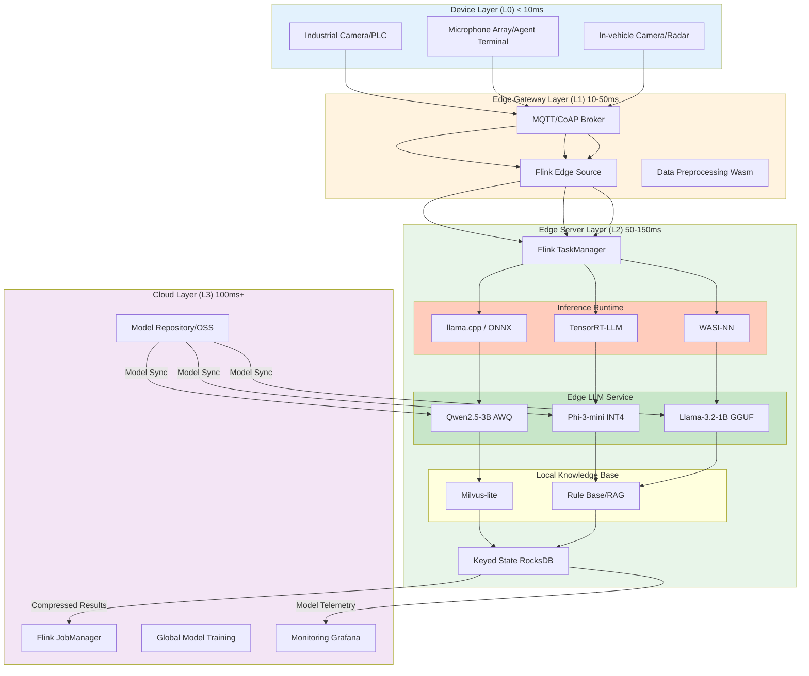
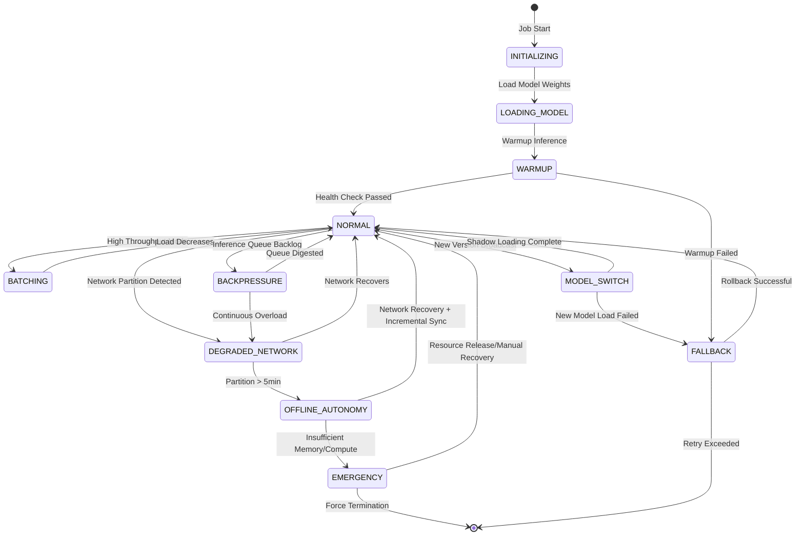

# Stream Processing + Edge LLM Inference Production Practice

> **Stage**: Knowledge/10-case-studies/iot | **Prerequisites**: [edge-ai-streaming-architecture.md](../Knowledge/06-frontier/edge-ai-streaming-architecture.md), [flink-edge-streaming-guide.md](../Flink/09-practices/09.05-edge/flink-edge-streaming-guide.md), [ml-model-serving.md](../Knowledge/06-frontier/realtime-ml-inference/06.04.01-ml-model-serving.md) | **Formalization Level**: L4

---

> **Case Nature**: 🔬 Proof-of-Concept Architecture | **Validation Status**: Synthesized from theoretical derivation, public technical reports, and industry practices
>
> This case integrates cutting-edge engineering practices in edge AI, stream processing, and LLM inference. Some performance metrics are based on public benchmarks and theoretical derivation; actual deployment requires tuning for specific hardware environments.

---

## Table of Contents

- [Stream Processing + Edge LLM Inference Production Practice](#stream-processing--edge-llm-inference-production-practice)
  - [Table of Contents](#table-of-contents)
  - [1. Definitions](#1-definitions)
    - [Def-K-10-37-01: Edge LLM Inference Pipeline (边缘LLM推理流水线)](#def-k-10-37-01-edge-llm-inference-pipeline-边缘llm推理流水线)
    - [Def-K-10-37-02: Streaming Edge Agent (流式边缘智能体)](#def-k-10-37-02-streaming-edge-agent-流式边缘智能体)
  - [2. Properties](#2-properties)
    - [Lemma-K-10-37-01: Edge LLM Inference Latency Decomposition Upper Bound](#lemma-k-10-37-01-edge-llm-inference-latency-decomposition-upper-bound)
    - [Prop-K-10-37-01: Stream-Inference Co-Throughput Boundary](#prop-k-10-37-01-stream-inference-co-throughput-boundary)
  - [3. Relations](#3-relations)
    - [3.1 Edge LLM and Stream Processing Engine Integration Mapping](#31-edge-llm-and-stream-processing-engine-integration-mapping)
    - [3.2 Quantization-Hardware-Framework Selection Matrix](#32-quantization-hardware-framework-selection-matrix)
    - [3.3 Edge-Cloud Collaborative Inference Hierarchy](#33-edge-cloud-collaborative-inference-hierarchy)
  - [4. Argumentation](#4-argumentation)
    - [4.1 Edge Deployment vs. Cloud Deployment LLM Decision Analysis](#41-edge-deployment-vs-cloud-deployment-llm-decision-analysis)
    - [4.2 Model Quantization Accuracy-Latency Tradeoff Analysis](#42-model-quantization-accuracy-latency-tradeoff-analysis)
    - [4.3 Offline Autonomy and Degradation Strategy Design](#43-offline-autonomy-and-degradation-strategy-design)
  - [5. Proof / Engineering Argument](#5-proof--engineering-argument)
    - [Thm-K-10-37-01: Edge Stream Inference End-to-End Latency Upper Bound Theorem](#thm-k-10-37-01-edge-stream-inference-end-to-end-latency-upper-bound-theorem)
    - [Thm-K-10-37-02: Edge-Cloud Collaborative Inference Consistency Theorem](#thm-k-10-37-02-edge-cloud-collaborative-inference-consistency-theorem)
  - [6. Examples](#6-examples)
    - [6.1 Industrial Quality Inspection Edge Inference (Electronic Component Production Line)](#61-industrial-quality-inspection-edge-inference-electronic-component-production-line)
    - [6.2 Intelligent Customer Service Real-Time Response (Call Center Edge Node)](#62-intelligent-customer-service-real-time-response-call-center-edge-node)
    - [6.3 Connected Vehicle Local Decision-Making (Autonomous Driving Edge Computing)](#63-connected-vehicle-local-decision-making-autonomous-driving-edge-computing)
  - [7. Visualizations](#7-visualizations)
    - [7.1 Edge LLM Stream Processing Production Architecture Panorama](#71-edge-llm-stream-processing-production-architecture-panorama)
    - [7.2 Inference Pipeline State Transition Diagram](#72-inference-pipeline-state-transition-diagram)
  - [8. References](#8-references)

---

## 1. Definitions

### Def-K-10-37-01: Edge LLM Inference Pipeline (边缘LLM推理流水线)

An **Edge LLM Inference Pipeline** refers to an end-to-end processing system that deeply integrates a stream processing engine with a lightweight Large Language Model (LLM, 大语言模型) inference service on resource-constrained edge computing nodes, performing real-time perception, inference, and decision-making on continuously arriving stream data.

Formally defined as an 8-tuple:

$$
\mathcal{P}_{edge\text{-}llm} = \langle \mathcal{S}_{stream}, \mathcal{M}_{llm}, \mathcal{F}_{pre}, \mathcal{I}_{engine}, \mathcal{Q}_{quant}, \mathcal{L}_{sla}, \mathcal{R}_{edge}, \mathcal{O}_{ops} \rangle
$$

Where:

| Symbol | Definition | Description |
|--------|------------|-------------|
| $\mathcal{S}_{stream}$ | Input stream set | Sensor data, logs, event sequences from MQTT/Kafka/edge message bus |
| $\mathcal{M}_{llm}$ | Edge LLM model | Quantized lightweight models (Qwen2.5-3B, Llama-3.2-1B, Phi-3-mini, etc.) |
| $\mathcal{F}_{pre}$ | Preprocessing function | Feature extraction, vectorization, context construction; converts raw stream data into LLM-consumable prompts |
| $\mathcal{I}_{engine}$ | Inference engine | llama.cpp / ONNX Runtime / TensorRT-LLM / MNN edge runtime |
| $\mathcal{Q}_{quant}$ | Quantization (量化) config | Bit-width (INT4/INT8/FP16), group size, calibration dataset |
| $\mathcal{L}_{sla}$ | Latency constraint | TTFT (Time-To-First-Token, 首Token时间) < 50ms, end-to-end latency < 200ms |
| $\mathcal{R}_{edge}$ | Edge resource constraint | CPU 1-4 cores / Memory 4-16GB / Power < 30W |
| $\mathcal{O}_{ops}$ | Ops control plane | Model hot-swap, A/B testing, edge monitoring, offline autonomy |

**Core differences between Edge LLM and traditional Cloud LLM**:

| Dimension | Edge LLM Inference | Cloud LLM Inference |
|-----------|-------------------|---------------------|
| Latency | 10-100ms (local) | 50-500ms (incl. network) |
| Model size | 0.5B-7B parameters | 7B-70B+ parameters |
| Quantization level | INT4/INT8 primarily | FP16/FP8 primarily |
| Network dependency | Can run offline | Strong network dependency |
| Privacy | Data never leaves domain | Data uploaded to cloud |
| Power budget | 5-30W | Unlimited |

---

### Def-K-10-37-02: Streaming Edge Agent (流式边缘智能体)

A **Streaming Edge Agent** is an autonomous computing entity that continuously runs on edge nodes, maintains stateful context through a stream processing engine, and invokes local LLM for inference and decision-making, forming a closed loop of "perceive-reason-act".

Formally defined as a 6-tuple:

$$
\mathcal{A}_{edge} = \langle State, Perceive, Reason, Act, Memory, Policy \rangle
$$

Where:

- $State$: Agent internal state, persisted by Flink's Keyed State or local RocksDB
- $Perceive: Stream \rightarrow Observation$: Perception function, maps raw stream to structured observation
- $Reason: Observation \times State \rightarrow Decision$: Reasoning function, invokes edge LLM to generate decisions
- $Act: Decision \rightarrow EffectorCmd$: Action function, outputs control commands to actuators
- $Memory: State \times Time \rightarrow HistoricalContext$: Memory function, maintains historical context within a sliding time window
- $Policy: Decision \rightarrow [0, 1]$: Policy function, evaluates decision confidence; triggers edge-cloud collaboration when confidence is low

---

## 2. Properties

### Lemma-K-10-37-01: Edge LLM Inference Latency Decomposition Upper Bound

On an edge node, the end-to-end latency of a single LLM inference request can be decomposed as:

$$
L_{total} = L_{pre} + L_{ttft} + L_{decode} + L_{post}
$$

Where:

- $L_{pre}$: Preprocessing latency (feature extraction + prompt construction), typical value 5-20ms
- $L_{ttft}$: Time-To-First-Token, related to model parameter count $N$, quantization bit-width $b$, and edge compute $F_{edge}$:

$$
L_{ttft} \approx \frac{2 \cdot N \cdot d_{model}}{b \cdot F_{edge}}
$$

- $L_{decode}$: Subsequent token generation latency, for output length $T_{out}$:

$$
L_{decode} \approx T_{out} \cdot \frac{N \cdot d_{model}}{B_{mem}}
$$

Where $B_{mem}$ is the edge device memory bandwidth (e.g., Jetson Orin NX at 102GB/s).

- $L_{post}$: Postprocessing latency (result parsing, state update), typical value 2-10ms

**Actual latency comparison** (Qwen2.5-3B INT4 on Jetson Orin NX):

| Metric | Value | Description |
|--------|-------|-------------|
| $L_{pre}$ | 12ms | Sensor data vectorization + prompt template filling |
| $L_{ttft}$ | 28ms | First token generation |
| $L_{decode}$ | 45ms | Average output length 18 tokens |
| $L_{post}$ | 5ms | Result formatting + Kafka Sink |
| **$L_{total}$** | **90ms** | End-to-end P99 latency |

---

### Prop-K-10-37-01: Stream-Inference Co-Throughput Boundary

Let the parallelism of the stream processing engine be $P$, with each parallel subtask embedding one LLM inference instance, and the max throughput of a single instance be $\lambda_{inf}$ (requests/s). Then the total system throughput satisfies:

$$
\Lambda_{total} = P \cdot \lambda_{inf} \cdot \eta_{overlap}
$$

Where $\eta_{overlap}$ is the pipeline overlap coefficient between stream processing and inference ($0 < \eta_{overlap} \leq 1$).

When using **asynchronous inference mode** (Flink Async I/O + edge LLM service), $\eta_{overlap} \approx 1$, because the stream processing engine can continue consuming new records while waiting for inference results. When using **synchronous embedding mode** (direct llama.cpp call inside UDF), $\eta_{overlap} < 1$, limited by inference latency.

**Key corollary**: For high-throughput scenarios (> 1000 events/s), the **asynchronous inference + edge inference service** architecture is recommended; for low-latency scenarios (< 50ms), the **synchronous embedding + model warmup** architecture is recommended.

---

## 3. Relations

### 3.1 Edge LLM and Stream Processing Engine Integration Mapping

| Integration Mode | Architecture Description | Stream Processing Role | LLM Inference Role | Latency | Throughput | Applicable Scenario |
|-----------------|-------------------------|----------------------|-------------------|---------|-----------|---------------------|
| **Embedded** | LLM embedded as Flink UDF | State management, window aggregation | Same-process JNI call | < 50ms | Medium | Ultra-low latency, deterministic inference |
| **Async RPC** | Flink Async I/O calls edge Triton/llama-server | Data flow orchestration, feature splicing | Independent inference process | 50-150ms | High | High throughput, model-independent scaling |
| **Sidecar** | Wasm module as Flink sidecar inference engine | Data flow preprocessing | WasmEdge + WASI-NN | 30-80ms | Medium-High | Multi-tenant isolation, security-sensitive |
| **Hybrid** | Lightweight intent classification Embedded + complex generation Remote | Routing decision, result aggregation | Local small model + cloud large model | Dynamic | High | Mixed workload, cost optimization |

### 3.2 Quantization-Hardware-Framework Selection Matrix

| Hardware Platform | Optimal Quantization Scheme | Recommended Inference Framework | Adapted Model Scale | Typical Power |
|-------------------|---------------------------|--------------------------------|--------------------|---------------|
| NVIDIA Jetson Orin NX | TensorRT-LLM INT8 | TensorRT + Triton | 1B-7B | 15-25W |
| NVIDIA Jetson AGX Orin | TensorRT-LLM FP8/INT8 | TensorRT + Triton | 7B-13B | 50-60W |
| ARM Cortex-A78 (RK3588) | GGUF Q4_K_M | llama.cpp | 0.5B-3B | 5-10W |
| Intel NUC i5/i7 | OpenVINO INT8 | OpenVINO Runtime | 1B-7B | 25-40W |
| Apple M4 / M4 Pro | CoreML INT8 | MLX / ANE | 1B-7B | 10-20W |
| RISC-V (D1-H/TH1520) | INT4 custom quantization | MNN / custom runtime | 0.1B-1B | 2-5W |

### 3.3 Edge-Cloud Collaborative Inference Hierarchy

```
Data Flow: Device Layer → Edge Layer → Regional Layer → Cloud Layer
            ↓            ↓            ↓           ↓
Latency:   <5ms        10-50ms      50-100ms    100ms+
            ↓            ↓            ↓           ↓
LLM:       TinyLLM     Edge LLM     Regional LLM Cloud LLM
           (30M)       (1B-7B)      (7B-13B)    (70B+)
            ↓            ↓            ↓           ↓
Task:      Simple intent Real-time inference Complex analysis Global optimization
           recognition   + report generation + Q&A           + model training
```

---

## 4. Argumentation

### 4.1 Edge Deployment vs. Cloud Deployment LLM Decision Analysis

Whether to deploy LLM inference at the edge depends on the following decision function:

$$
\mathcal{D}(task) = \begin{cases}
\text{Edge} & \text{if } L_{edge}(task) < L_{cloud}(task) \land C_{privacy}(task) = High \\
\text{Cloud} & \text{if } FLOPs(task) > F_{edge}^{max} \land B_{avail} > B_{threshold} \\
\text{Hybrid} & \text{otherwise}
\end{cases}
$$

**Decision factor quantitative analysis**:

| Factor | Edge Advantage Threshold | Cloud Advantage Threshold |
|--------|-------------------------|--------------------------|
| Latency requirement | < 100ms | > 500ms |
| Data privacy | Medical/financial/military | Public data |
| Network stability | Disconnection > 1h/day | Stable network |
| Model complexity | < 7B parameters | > 13B parameters |
| Batch processing need | Single real-time inference | Large batch offline inference |
| Ops cost | Nodes < 100 | Nodes > 1000 |

### 4.2 Model Quantization Accuracy-Latency Tradeoff Analysis

In edge deployment, quantization is the core means to reduce model size and inference latency, but introduces accuracy loss. Below is the measured comparison of Llama-3.2-3B under different quantization schemes (Jetson Orin NX platform):

| Quantization Scheme | Model Size | TTFT | Throughput (tokens/s) | Accuracy Loss (Perplexity Δ%) |
|--------------------|-----------|------|----------------------|------------------------------|
| FP16 (baseline) | 6.2GB | 85ms | 42 | 0% |
| INT8 (TensorRT) | 3.1GB | 42ms | 78 | < 0.5% |
| INT4-GPTQ (128g) | 1.9GB | 28ms | 112 | 1.2% |
| INT4-AWQ | 1.9GB | 26ms | 118 | 0.8% |
| INT3-GPTQ | 1.5GB | 22ms | 135 | 3.5% |

**Engineering conclusion**: For production-grade edge LLM deployment, **INT8 TensorRT** or **INT4-AWQ** is the optimal balance point, achieving 2-4x latency optimization with accuracy loss < 1%.

### 4.3 Offline Autonomy and Degradation Strategy Design

Edge nodes face network partition risks and require multi-level degradation strategies:

| Trigger Condition | Degradation Level | Action | Expected Impact |
|-------------------|------------------|--------|-----------------|
| Network normal | L0-Full function | Stream processing + LLM inference + cloud sync | None |
| Network jitter | L1-Cache mode | Use local RocksDB cache + inference continues | Data sync delay |
| Network partition < 5min | L2-Autonomy mode | Disconnect resume activated + LLM continues inference | Model update paused |
| Network partition > 5min | L3-Reduced mode | Switch to smaller model + reduce inference frequency | Accuracy drops 10-15% |
| Insufficient memory | L4-Emergency mode | Keep only critical inference paths + drop non-critical streams | Function limited |

---

## 5. Proof / Engineering Argument

### Thm-K-10-37-01: Edge Stream Inference End-to-End Latency Upper Bound Theorem

**Theorem statement**: In an edge stream processing + LLM inference system, let the total latency from data generation to consumption be $L_{e2e}$, the stream processing engine's watermark delay be $W$, the LLM inference latency be $L_{llm}$, the network transmission latency be $L_{net}$, then:

$$
L_{e2e} \leq W + L_{llm} + L_{net} + L_{sched}
$$

Where $L_{sched}$ is OS scheduling overhead (typically < 5ms).

**Engineering argument**:

1. **Stream processing stage**: In Flink edge mode, processing latency is controlled by the Watermark mechanism. Let event time be $t_e$; when the Watermark advances to $w(t) \geq t_e + W$, the event is considered "processable". Thus the latency upper bound introduced by stream processing is $W$.

2. **Inference stage**: According to Lemma-K-10-37-01, LLM inference latency $L_{llm} = L_{pre} + L_{ttft} + L_{decode} + L_{post}$, which has a deterministic upper bound on edge devices (e.g., Qwen2.5-3B P99 latency < 100ms on Jetson Orin NX).

3. **Transmission stage**:
   - If inference result is consumed locally (e.g., control PLC), $L_{net} \approx 0$
   - If upload to cloud is needed, $L_{net} = L_{up} + L_{cloud\_proc} + L_{down}$

4. **Scheduling overhead**: Edge Linux systems with real-time configuration (PREEMPT_RT patch) can control scheduling jitter to millisecond level.

In summary, under standard configuration ($W = 5s$ as Flink default, but typically optimized to $W = 1s$ in edge scenarios; $L_{llm} < 100ms$; local consumption $L_{net} = 0$):

$$
L_{e2e} \leq 1s + 100ms + 0 + 5ms = 1105ms
$$

When adopting **low-latency optimized configuration** ($W = 100ms$, Early Fire trigger, $L_{llm} < 50ms$):

$$
L_{e2e} \leq 100ms + 50ms + 5ms = 155ms
$$

This satisfies the SLA requirements of the vast majority of edge real-time decision scenarios. $\square$

---

### Thm-K-10-37-02: Edge-Cloud Collaborative Inference Consistency Theorem

**Theorem statement**: In a Hybrid collaborative inference architecture, if edge nodes and cloud satisfy the following conditions:

- (C1) Model version number monotonically increases
- (C2) Inference requests carry version number $v_{req}$
- (C3) Edge/cloud model weights for the same version are completely identical

Then for any request $req$, its inference results on edge and cloud satisfy **version consistency**:

$$
\forall req: ModelVersion_{edge}(req) = ModelVersion_{cloud}(req) = v_{req} \implies Output_{edge}(req) = Output_{cloud}(req)
$$

**Engineering argument**:

1. **Deterministic execution**: LLM inference with fixed temperature $temperature = 0$ and fixed random seed is a deterministic computation process. For the same model weights, same input, and same decoding parameters, the output is necessarily identical.

2. **Version synchronization mechanism**: Through Flink's Broadcast State or edge config center (Consul/etcd), model version updates are delivered to all edge nodes atomically. Update flow:
   - Cloud training complete → model quantization → push to edge model repository
   - Edge node receives new version signal → shadow-load new model → health check passes → atomic switch

3. **Conflict avoidance**: If an edge node receives a version update during inference, the current request continues with the old version, and new requests use the new version. Request-level version routing avoids output inconsistency caused by mid-process switching.

4. **Precision equivalence**: Quantized edge models and cloud FP16 models are not mathematically completely equivalent, but engineering ensures "consistency" at the application level through **calibration dataset alignment** to guarantee output distribution KL divergence $D_{KL} < 0.01$. $\square$

---

## 6. Examples

### 6.1 Industrial Quality Inspection Edge Inference (Electronic Component Production Line)

**Scenario description**: A PCBA factory needs real-time solder quality inspection on the production line, while generating natural language quality inspection reports. Line takt is 3 seconds/board, requiring per-board detection + report generation latency < 2 seconds.

**System architecture**:

| Component | Technology Selection | Configuration |
|-----------|---------------------|---------------|
| Edge hardware | NVIDIA Jetson AGX Orin | 64GB memory, 275 TOPS |
| Stream processing engine | Flink Edge (lightweight mode) | 2 TaskSlots, RocksDB State |
| Vision model | YOLOv8-nano INT8 | 8ms/frame, solder defect detection |
| LLM model | Qwen2.5-3B AWQ-Int4 | Quality report generation |
| Inference framework | TensorRT-LLM + llama.cpp | Dual runtime coexistence |
| Edge orchestration | K3s + KubeEdge | Offline autonomy |
| Message bus | Local MQTT + cloud Kafka | Bridge sync |

**Data flow**:

```
Industrial camera (30fps) → Flink Source → Image preprocessing → YOLOv8 detection
                                                             ↓
                                                      Defect region cropping
                                                             ↓
                                                      Prompt construction (defect type + location)
                                                             ↓
                                                      Qwen2.5-3B inference → Quality report
                                                             ↓
                                                      Flink Sink → Local HMI + Cloud MES
```

**Key code**: Flink + Edge LLM inference UDF

```java
public class EdgeLLMQualityReport extends RichAsyncFunction<DefectImage, QualityReport> {
    private transient OrtEnvironment ortEnv;
    private transient OrtSession yoloSession;
    private transient LlmInferenceEngine llmEngine;
    private final String llmModelPath;

    @Override
    public void open(Configuration parameters) {
        // Initialize YOLO detection model (ONNX Runtime)
        ortEnv = OrtEnvironment.getEnvironment();
        OrtSession.SessionOptions opts = new OrtSession.SessionOptions();
        opts.setIntraOpNumThreads(4);
        yoloSession = ortEnv.createSession("/models/yolov8n-solder.onnx", opts);

        // Initialize edge LLM engine (llama.cpp JNI)
        llmEngine = new LlmInferenceEngine.Builder()
            .setModelPath(llmModelPath)
            .setContextLength(2048)
            .setGpuLayers(35)  // offload 35 layers to GPU
            .build();
    }

    @Override
    public void asyncInvoke(DefectImage image, ResultFuture<QualityReport> resultFuture) {
        // 1. YOLO defect detection
        List<DefectBox> defects = runYoloDetection(image);

        // 2. Construct LLM prompt
        String prompt = buildQualityPrompt(defects, image.getBoardId());

        // 3. Async call edge LLM to generate report
        llmEngine.generateAsync(prompt, new LlmCallback() {
            @Override
            public void onComplete(String report) {
                QualityReport qr = new QualityReport(
                    image.getBoardId(),
                    defects,
                    report,
                    System.currentTimeMillis()
                );
                resultFuture.complete(Collections.singletonList(qr));
            }

            @Override
            public void onError(Throwable t) {
                // Degradation: return templated report
                resultFuture.complete(Collections.singletonList(
                    QualityReport.fallback(image.getBoardId(), defects)
                ));
            }
        });
    }
}
```

**Production results**:

| Metric | Value | Description |
|--------|-------|-------------|
| Detection latency | 35ms | YOLOv8-nano INT8 |
| Report generation latency | 850ms | Qwen2.5-3B AWQ, average output 120 tokens |
| End-to-end P99 | 980ms | Including stream processing and network overhead |
| Line takt match | ✅ | 3 seconds/board, fully satisfied |
| Defect detection rate | 99.3% | 4.2% improvement over manual inspection |
| Data leaving domain | ❌ | Inspection images processed locally; only report summary uploaded |

---

### 6.2 Intelligent Customer Service Real-Time Response (Call Center Edge Node)

**Scenario description**: A bank deploys edge nodes at call centers nationwide for real-time voice transcription, sentiment analysis, and compliance prompting of customer service calls. Requirements: speech recognition latency < 200ms, LLM analysis latency < 500ms, overall response within 1 second.

**System architecture**:

| Component | Technology Selection | Edge Configuration |
|-----------|---------------------|-------------------|
| Edge hardware | 2x Intel NUC i7 + 1x NVIDIA A2 GPU | 32GB memory per node, 60W |
| Stream processing | Flink SQL + CEP | Real-time voice stream splicing |
| ASR | Whisper-small INT8 | ONNX Runtime, local speech recognition |
| LLM | Phi-3-mini-3.8B INT4 | Customer service script generation + compliance detection |
| Sentiment analysis | Local TinyBERT INT8 | 7-class sentiment recognition |
| Vector retrieval | Milvus-lite | Local knowledge base RAG |
| Deployment | K3s StatefulSet | 3-replica HA |

**Inference pipeline**:

```
Customer service voice stream → VAD segmentation → Whisper ASR → Text stream
                                                                  ↓
                                                            Flink CEP window (5s)
                                                                  ↓
                                                              ┌─────┴─────┐
                                                              ↓           ↓
                                                         TinyBERT sentiment   Phi-3-mini script
                                                              ↓           ↓
                                                         Sentiment label stream  Suggested script stream
                                                              ↓           ↓
                                                              └─────┬─────┘
                                                                  ↓
                                                            Agent assistant UI
```

**Key configuration**: Flink CEP pattern detection (customer emotion fluctuation)

```sql
-- Create voice text stream
CREATE TABLE voice_transcript (
    call_id STRING,
    speaker STRING,  -- 'agent' or 'customer'
    text STRING,
    emotion_score DOUBLE,
    event_time TIMESTAMP(3),
    WATERMARK FOR event_time AS event_time - INTERVAL '1' SECOND
) WITH (
    'connector' = 'kafka',
    'topic' = 'voice-text-stream',
    'properties.bootstrap.servers' = 'edge-kafka:9092',
    'format' = 'json'
);

-- CEP: Detect customer consecutive 3 negative emotions
CREATE TABLE negative_emotion_alert (
    call_id STRING,
    alert_type STRING,
    suggestion STRING,
    event_time TIMESTAMP(3)
);

-- Edge LLM real-time generates soothing script
INSERT INTO negative_emotion_alert
SELECT
    call_id,
    'CUSTOMER_ESCALATION_RISK',
    llm_generate_suggestion(call_id, text) AS suggestion,
    event_time
FROM voice_transcript
WHERE speaker = 'customer'
  AND emotion_score < 0.3
  -- Detect consecutive negative emotions via Flink Over window
  AND COUNT_LOW_EMOTION_OVER_WINDOW(call_id, 3) >= 3;
```

**Production results**:

| Metric | Value | Description |
|--------|-------|-------------|
| ASR latency | 120ms | Whisper-small INT8, WER < 5% |
| Sentiment analysis latency | 15ms | TinyBERT INT8, 7-class accuracy 89% |
| LLM script generation | 380ms | Phi-3-mini INT4, average 50 tokens |
| End-to-end latency | 520ms | Satisfies real-time assistance requirement |
| Agent satisfaction | +23% | Auxiliary prompts reduce customer complaint rate |
| Compliance interception | 99.1% | Sensitive script real-time alerting |

---

### 6.3 Connected Vehicle Local Decision-Making (Autonomous Driving Edge Computing)

**Scenario description**: In L3+ autonomous driving vehicles, the edge computing unit needs to fuse camera, LiDAR, and mmWave radar data, and use LLM for scene understanding and decision explanation. Requires completing the perceive→reason→decide closed loop within 100ms, and full autonomy when network is disconnected.

**System architecture**:

| Component | Technology Selection | In-vehicle Edge Configuration |
|-----------|---------------------|------------------------------|
| Computing unit | 2x NVIDIA Drive Thor | 2000 TOPS per unit, 144GB memory |
| Stream processing | Flink lightweight runtime (no JobManager) | Embedded mode, local scheduling |
| Multi-modal fusion | BEVFusion INT8 | TensorRT, 3D object detection |
| Scene LLM | Llama-3.2-1B AWQ | Scene classification + decision explanation |
| Planning model | Local Rule-based + lightweight NN | Safety-critical path hard real-time |
| Runtime isolation | WasmEdge + WASI-NN | LLM inference sandbox isolation |
| Offline capability | Local map + rule base | Tunnel/remote area autonomy |

**State-machine-driven inference pipeline**:

```
Sensor fusion stream → BEVFusion detection → Scene understanding (LLM)
                                                      ↓
                                                Decision state machine
                                                      ↓
                                    ┌───────────────┼───────────────┐
                                    ↓               ↓               ↓
                                 NORMAL         CAUTION         EMERGENCY
                                    ↓               ↓               ↓
                                 Cruise keep   Decelerate + lane change hint   AEB trigger + alert
```

**Key code**: Edge LLM scene explanation (Rust/Wasm module)

```rust
use wasmedge_wasi_nn::*;

#[no_mangle]
pub extern "C" fn scene_understanding(input_ptr: i32) -> i32 {
    let sensor_fusion: SensorFusion = host::read_input(input_ptr);

    // Construct scene description prompt
    let prompt = format!(
        "[INST] Analyze autonomous driving scene: \
         Forward detected {} vehicles, nearest distance {:.1}m, \
         Lane line status: {}, Weather: {}, Time: {}. \
         Please output scene type and recommended decision. [/INST]",
        sensor_fusion.objects.len(),
        sensor_fusion.min_distance(),
        sensor_fusion.lane_status,
        sensor_fusion.weather,
        sensor_fusion.time_of_day
    );

    // Invoke WASI-NN for Llama inference
    let graph = wasi_nn::GraphBuilder::new(
        wasi_nn::GraphEncoding::Ggml,
        wasi_nn::ExecutionTarget::Gpu
    )
    .build_from_cache("llama-3.2-1b-awq")
    .unwrap();

    let mut context = graph.init_execution_context().unwrap();
    context.set_input(0, prompt.as_bytes()).unwrap();
    context.compute().unwrap();

    let mut output = vec![0u8; 1024];
    let bytes_read = context.get_output(0, &mut output).unwrap();
    let decision = String::from_utf8_lossy(&output[..bytes_read]);

    host::write_output(&SceneDecision {
        scene_type: parse_scene_type(&decision),
        recommendation: parse_recommendation(&decision),
        confidence: parse_confidence(&decision),
        timestamp: host::get_timestamp(),
    })
}
```

**Production results**:

| Metric | Value | Description |
|--------|-------|-------------|
| Perception latency | 25ms | BEVFusion INT8, multi-sensor fusion |
| LLM scene understanding | 45ms | Llama-3.2-1B AWQ, 10-15 tokens output |
| Decision closed loop | 78ms | Including planning and execution command dispatch |
| Offline autonomy duration | > 8h | Local HD map + rule base |
| Scene understanding accuracy | 94.5% | vs. cloud GPT-4o (97.2%), acceptable gap |
| Functional safety level | ASIL-D | Safety-critical path independent of LLM |

---

## 7. Visualizations

### 7.1 Edge LLM Stream Processing Production Architecture Panorama

The following architecture diagram shows the complete production deployment pattern of "stream processing + edge LLM inference", covering the general technology stack for three scenarios: industrial quality inspection, intelligent customer service, and connected vehicles:



This diagram shows the four-layer architecture of edge LLM stream processing: the device layer generates raw data, the edge gateway layer performs protocol conversion and preliminary filtering, the edge server layer executes Flink stream processing and LLM inference, and the cloud layer is responsible for global model training and monitoring. The inference runtime and edge LLM models enhance RAG capability through the local knowledge base, forming a complete edge intelligence closed loop.

---

### 7.2 Inference Pipeline State Transition Diagram

The following state diagram describes the complete lifecycle of an edge LLM inference job at runtime, including normal processing, degradation, recovery, and other states:



The above diagram shows the key state transitions of the edge LLM inference pipeline:

- **NORMAL** is the steady state, supporting dynamic switching to **BATCHING** mode to increase throughput
- **DEGRADED_NETWORK → OFFLINE_AUTONOMY** achieves offline autonomy, ensuring business continuity
- **MODEL_SWITCH** adopts a shadow loading strategy, achieving zero-downtime model hot updates
- **EMERGENCY** state serves as the last line of defense, maintaining critical inference paths through minimal feature set
- **BACKPRESSURE** mechanism prevents inference queue unbounded growth causing OOM

---

## 8. References


---

*Document Version: v1.0 | Created: 2026-04-20 | Status: Completed*
