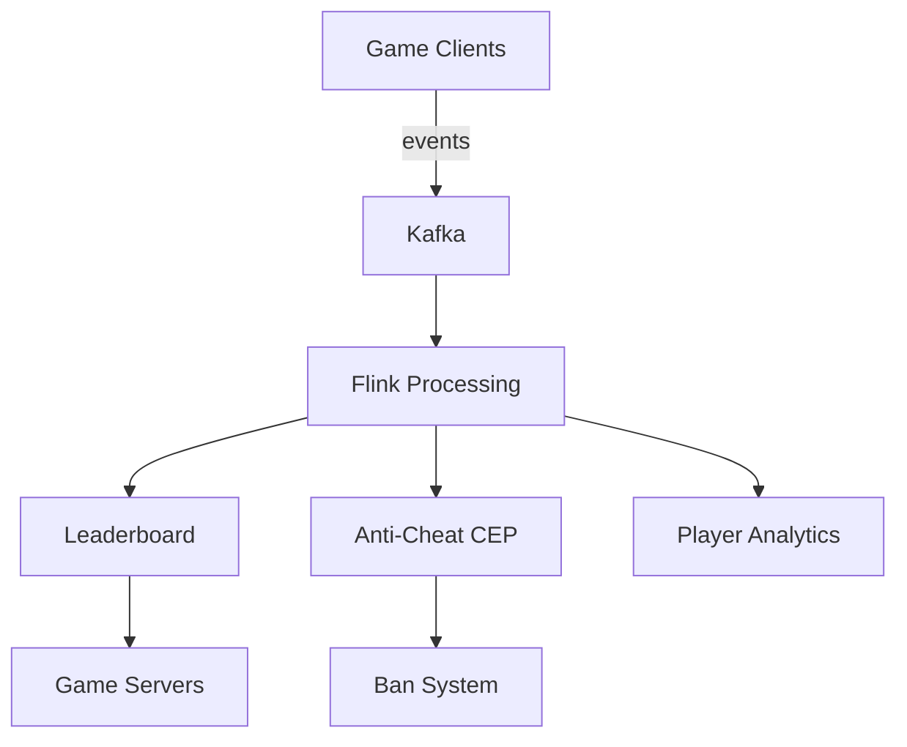

# Business Pattern: Gaming Analytics

> **Stage**: Knowledge | **Prerequisites**: [CEP Pattern](../pattern-cep-complex-event.md), [Stateful Computation](../pattern-stateful-computation.md) | **Formal Level**: L4-L5
>
> **Domain**: Gaming | **Complexity**: ★★★★★ | **Latency**: < 500ms | **Scale**: Millions of concurrent players
>
> High-concurrency event ingestion, real-time leaderboards, anti-cheat detection, and player behavior analysis using Flink + Actor model.

---

## 1. Definitions

**Def-K-03-23: Game Event**

Seven-tuple representing player interactions:

$$
g = (p, e, a, s, w, m, t) \in \mathcal{P} \times \mathcal{E} \times \mathcal{A} \times \mathcal{S} \times \mathcal{W} \times \mathcal{M} \times \mathbb{T}
$$

where $p$ = player, $e$ = event type, $a$ = action, $s$ = server, $w$ = world, $m$ = metadata, $t$ = timestamp.

**Def-K-03-24: Real-Time Leaderboard**

Ranked list of players by score updated in real time with consistency guarantees.

**Def-K-03-25: Anti-Cheat Detection**

CEP-based pattern matching for detecting anomalous player behavior (speed hacks, aimbots, botting).

---

## 2. Properties

**Lemma-K-03-04: Leaderboard Consistency Bound**

Leaderboard updates are eventually consistent with maximum staleness bounded by the aggregation window size.

**Lemma-K-03-05: Cheat Detection Latency Lower Bound**

Minimum detection latency is bounded by the pattern window size: $T_{detect} \geq T_{pattern}$.

**Prop-K-03-12: Out-of-Order Tolerance**

With watermark delay $d$, events arriving up to $d$ late are correctly included in leaderboard computations.

---

## 3. Relations

- **with CEP**: Anti-cheat uses complex event pattern matching (impossible sequences, speed anomalies).
- **with Actor Model**: Per-player state machines manage sessions and inventory.
- **with Window Aggregation**: Leaderboards computed via tumbling windows with keyed aggregation.

---

## 4. Argumentation

**Gaming Analytics Challenges**:

| Challenge | Scale | Solution |
|-----------|-------|----------|
| Event burst | 1M+ events/sec | Kafka partitioning + Flink parallelism |
| Leaderboard consistency | Global ranking | Approximate top-K (Count-Min Sketch) |
| Cheat detection | Real-time | CEP with session windows |
| Player state | Millions | Keyed state with TTL |

**Leaderboard Design**: Exact global leaderboard is expensive. Use approximate algorithms (Space-Saving, Count-Min Sketch) for near-real-time top-K, with periodic exact recomputation.

---

## 5. Engineering Argument

**Performance Benchmark**: With 1M concurrent players and 10 events/sec per player:

- Raw throughput: 10M events/sec
- Flink parallelism: 1000 subtasks → 10K QPS each
- Leaderboard update: Approximate top-1000 every 5s

---

## 6. Examples

```java
// Real-time leaderboard
stream.keyBy(GameEvent::getWorldId)
    .window(TumblingProcessingTimeWindows.of(Time.minutes(1)))
    .aggregate(new ScoreAggregate())
    .process(new TopNFunction(1000));
```

---

## 7. Visualizations

**Gaming Analytics Architecture**:



---

## 8. References
