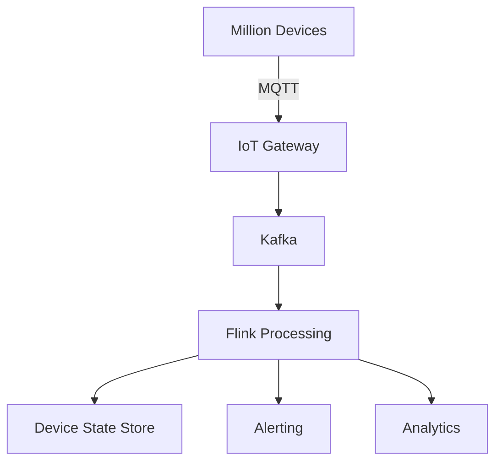

# Business Pattern: IoT Stream Processing

> **Stage**: Knowledge | **Prerequisites**: [Event Time Processing](../pattern-event-time-processing.md), [Stateful Computation](../pattern-stateful-computation.md) | **Formal Level**: L4-L5
>
> **Domain**: IoT | **Complexity**: ★★★★☆ | **Latency**: < 2s | **Scale**: Millions of devices
>
> Million-scale device connectivity, out-of-order data handling, device state maintenance, and session window management using Actor + Dataflow dual architecture.

---

## 1. Definitions

**Def-K-03-20: IoT Data Stream**

Event sequences from device set $D = \{d_1, \ldots, d_n\}$ where $n$ reaches millions:

$$
\mathcal{S}_i = \langle e_{i,1}, e_{i,2}, \ldots \rangle, \quad e_{i,j} = (t_j, d_i, m_j, \rho_j)
$$

**Def-K-03-21: Device Session**

A contiguous sequence of events from a single device with inter-event gap $< g$:

$$
\text{Session}(d) = \{ e_k \mid t_{k+1} - t_k < g \}
$$

**Def-K-03-22: Device Actor**

An Actor-model abstraction managing per-device state machine and command handling.

---

## 2. Properties

**Prop-K-03-08: Device State Consistency**

Per-device state is consistent because all events for device $d_i$ are routed to the same keyed subtask.

**Prop-K-03-09: Session Window Completeness**

With gap $g$, every event belongs to exactly one session window (or triggers new session).

**Prop-K-03-10: State Space Upper Bound**

State size is bounded by active devices: $|S| \leq |D_{\text{active}}| \times |S_{\text{per-device}}|$.

---

## 3. Relations

- **with Event Time**: Watermark handles out-of-order sensor readings.
- **with Stateful Computation**: Device state machines require keyed state.
- **with Actor Model**: Device actors provide command-response semantics.

---

## 4. Argumentation

**Core IoT Challenges**:

| Challenge | Solution | Technology |
|-----------|----------|------------|
| Million devices | Geo-partitioning | Kafka + Flink |
| Out-of-order | Watermark + allowed lateness | Event time |
| Device state | Keyed state + TTL | RocksDB |
| Session mgmt | Session windows | Flink Windows |

**Edge vs Center Computing Boundary**:

- Edge: Real-time control (< 100ms), data filtering, local aggregation
- Center: Complex analytics, cross-device correlation, model training

---

## 5. Engineering Argument

**Million-Device Partitioning**: With 1000 Flink partitions and 1M devices, each partition handles ~1K devices. With 10 events/sec per device, per-partition throughput is ~10K QPS, well within capacity.

---

## 6. Examples

```java
// Device temperature monitoring with session windows
stream.keyBy(SensorEvent::getDeviceId)
    .window(EventTimeSessionWindows.withGap(Time.minutes(5)))
    .aggregate(new TemperatureStats())
    .filter(stats -> stats.getMaxTemp() > 80.0)
    .addSink(new AlertSink());
```

---

## 7. Visualizations

**IoT Architecture**:



---

## 8. References
