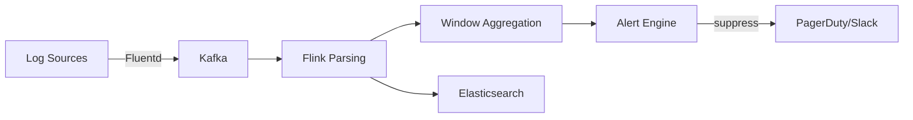

# Business Pattern: Log Analysis & Monitoring

> **Stage**: Knowledge | **Prerequisites**: [Log Analysis Pattern](../pattern-log-analysis.md) | **Formal Level**: L3-L4
>
> **Domain**: DevOps/Observability | **Complexity**: ★★★★☆ | **Latency**: < 5s (alerting) | **Scale**: TB/day
>
> High-throughput, schema-on-read real-time log monitoring using Flink.

---

## 1. Definitions

**Def-K-03-32: Log Monitoring Scenario**

Five-tuple $\mathcal{L} = (S, P, A, T, \Omega)$:

| Component | Definition |
|-----------|-----------|
| $S$ | Log sources producing semi-structured streams |
| $P$ | Parsing pattern library with dynamic schema discovery |
| $A$ | Alert rules: thresholds, CEP patterns, anomaly models |
| $T$ | Time window configurations |
| $\Omega$ | Output targets: alerts, storage, archive |

**Def-K-03-33: Schema-on-Read Parsing**

Parsing logs at query time rather than ingest time, enabling flexibility for evolving log formats.

**Def-K-03-34: Alert Storm Suppression**

Preventing cascading alerts from the same root cause via deduplication and grouping.

---

## 2. Properties

**Prop-K-03-16: Throughput-Latency Trade-off**

Schema-on-read parsing increases latency (~10-50ms) but improves throughput by avoiding ingest-time parsing bottlenecks.

**Prop-K-03-17: Schema Evolution Backward Compatibility**

New log fields are silently ignored by old parsers; missing fields default to null.

---

## 3. Relations

- **with Log Analysis Pattern**: Specialized for operational monitoring use case.
- **with CEP**: Alert rules use complex event pattern matching.

---

## 4. Argumentation

**Multi-Layer Parsing Strategy**:

| Layer | Speed | Flexibility | Use Case |
|-------|-------|-------------|----------|
| Raw JSON | Fast | Low | Structured logs |
| Regex | Medium | Medium | Syslog formats |
| Grok | Slow | High | Custom formats |
| ML Parser | Slowest | Highest | Unstructured |

**Alert Storm Mechanism**: Single infrastructure failure (e.g., database down) can generate thousands of alerts. Suppression groups alerts by root cause and throttles notifications.

---

## 5. Engineering Argument

**Exactly-Once Log Ingestion**: Using Kafka transactional producer + Flink Exactly-Once + idempotent alert deduplication ensures no log loss and no duplicate alerts.

---

## 6. Examples

```java
// Alert rule: error rate > 5% in 1 minute
stream.filter(log -> log.getLevel().equals("ERROR"))
    .keyBy(LogEvent::getService)
    .window(TumblingProcessingTimeWindows.of(Time.minutes(1)))
    .aggregate(new ErrorRateAggregate())
    .filter(rate -> rate > 0.05)
    .addSink(new AlertSink());
```

---

## 7. Visualizations

**Log Monitoring Architecture**:



---

## 8. References
