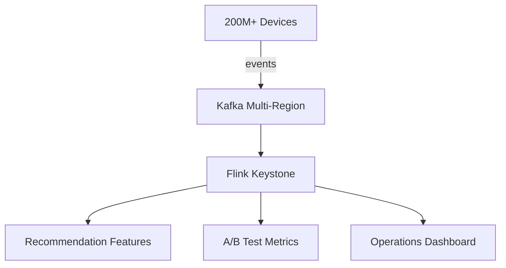

# Netflix Streaming Architecture — From Keystone to Flink

> **Stage**: Knowledge | **Prerequisites**: [Event Time Processing](../pattern-event-time-processing.md) | **Formal Level**: L3-L4
>
> **Domain**: Video Streaming | **Complexity**: ★★★★★ | **Latency**: < 1s P99 | **Scale**: 2 Trillion events/day
>
> Netflix's stream processing evolution from Chukwa to Keystone to Flink, powering personalization and content decisions.

---

## 1. Definitions

**Def-K-03-08: Netflix Data Pipeline**

Distributed stream data infrastructure supporting Netflix global operations, processing playback events from 200M+ subscribers.

$$
\text{NetflixPipeline} \triangleq \langle \text{Sources}, \text{Processors}, \text{Sinks}, \text{SLAs} \rangle
$$

- Sources: Client devices → playback events, user interactions, error logs
- Processors: Keystone → routing/filtering/aggregation/feature engineering
- Sinks: Recommendation service, A/B testing platform, operations dashboards
- SLAs: Latency < 1s (P99), Availability > 99.99%

**Scale**: ~2 trillion events/day, ~15M events/sec peak, 190+ countries.

---

## 2. Properties

**Prop-K-03-03: Event Processing Latency Bound**

End-to-end latency from event generation to feature availability is bounded by 1s (P99) via event-time processing and optimized serialization.

**Prop-K-03-04: Elastic Scaling Response Time**

Auto-scaling reacts to traffic changes within 60s using Kubernetes HPA and Flink's rescaling capabilities.

---

## 3. Relations

- **with Flink Core**: Uses event-time processing, keyed state for user sessions, incremental checkpointing.
- **with A/B Testing**: Real-time feature computation feeds experiment assignment and metrics.

---

## 4. Argumentation

**Why Migrate from Chukwa to Flink?**

| Factor | Chukwa | Flink |
|--------|--------|-------|
| Latency | Minutes | Sub-second |
| Semantics | At-least-once | Exactly-once |
| State management | External | Built-in |
| SQL support | None | Flink SQL |

---

## 5. Engineering Argument

**Keystone SLA Satisfaction**: The platform meets Netflix's SLA through:

1. Geo-distributed Kafka ingestion (multi-region replication)
2. Flink event-time processing with watermarks
3. Incremental checkpoints to S3 with 30s interval
4. Auto-scaling based on consumer lag metrics

---

## 6. Examples

**Viewing Experience Optimization Pipeline**:

```
Device Events (play, pause, buffer)
  → KeyBy(device_id)
  → Session Window (gap 5min)
  → Aggregate(rebuffer ratio, bitrate switches)
  → ML Model
  → Adaptive Bitrate Decision
```

---

## 7. Visualizations

**Keystone Platform Architecture**:



---

## 8. References
