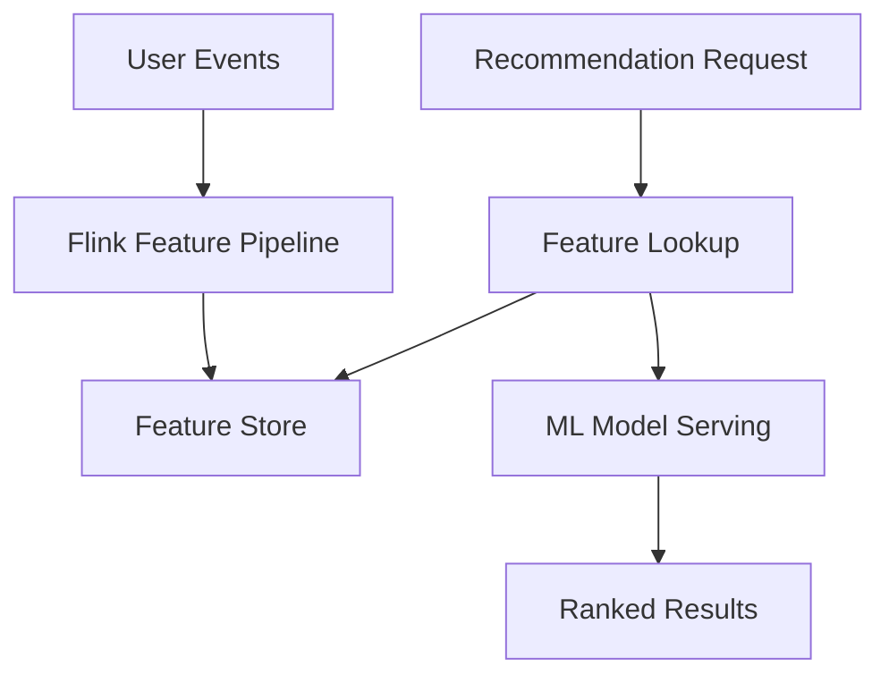

# Business Pattern: Real-Time Recommendation System

> **Stage**: Knowledge | **Prerequisites**: [Async I/O](../pattern-async-io-enrichment.md) | **Formal Level**: L4-L5
>
> **Domain**: E-commerce / Content / Ads | **Complexity**: ★★★★☆ | **Latency**: < 200ms
>
> Real-time user behavior feedback, feature freshness, and low-latency inference using Flink + Async I/O + Window Aggregation.

---

## 1. Definitions

**Def-K-03-02: Real-Time Recommendation Scenario**

Recommendation systems that capture user behavior signals within seconds or milliseconds and incorporate them into recommendation computation.

**Def-K-03-03: Feature Freshness**

The time delta between event occurrence and feature availability for model inference:

$$
\text{Freshness} = t_{\text{inference}} - t_{\text{event}}
$$

**Def-K-03-04: User Behavior Feedback Loop**

The closed loop from user action (click, purchase) → feature update → model inference → next recommendation.

---

## 2. Properties

**Prop-K-03-05: Real-Time Feature Timeliness Constraint**

For effective real-time recommendation, feature freshness must be $<$ 30s for behavioral features and $<$ 5min for aggregated features.

**Prop-K-03-06: Latency-Accuracy Trade-off**

Lower inference latency typically reduces model complexity, which may decrease accuracy. The optimal point depends on business context.

---

## 3. Relations

- **with Async I/O**: Model serving requires async calls to ML inference services.
- **with Window Aggregation**: User session features are computed via tumbling/sliding windows.
- **with Stateful Computation**: User profile state must be maintained and checkpointed.

---

## 4. Argumentation

**Real-Time vs Offline Recommendation Boundary**:

| Factor | Real-Time | Offline |
|--------|-----------|---------|
| Latency | < 200ms | Hours |
| Features | Behavioral + Context | Historical + Batch |
| Model | Lightweight (GBDT, DNN) | Heavy (Deep Learning) |
| Use Case | Feed ranking | Candidate generation |

**Async I/O Necessity**: Synchronous model serving at 50ms per request limits throughput to 20 QPS per thread. With async concurrency of 100, throughput reaches 2,000 QPS.

---

## 5. Engineering Argument

**Latency Upper Bound Analysis**: Total latency = event ingestion (Kafka) + feature computation (Flink) + model inference (Async I/O) + response serialization. With optimization: 20ms + 50ms + 80ms + 10ms = 160ms < 200ms SLA.

---

## 6. Examples

```java
// Real-time feature computation
stream.keyBy(UserEvent::getUserId)
    .window(SlidingEventTimeWindows.of(Time.minutes(10), Time.minutes(1)))
    .aggregate(new UserFeatureAggregate())
    .asyncWaitFor(new ModelInferenceAsyncFunction(), 100, TimeUnit.MILLISECONDS);
```

---

## 7. Visualizations

**Real-Time Recommendation Architecture**:



---

## 8. References
