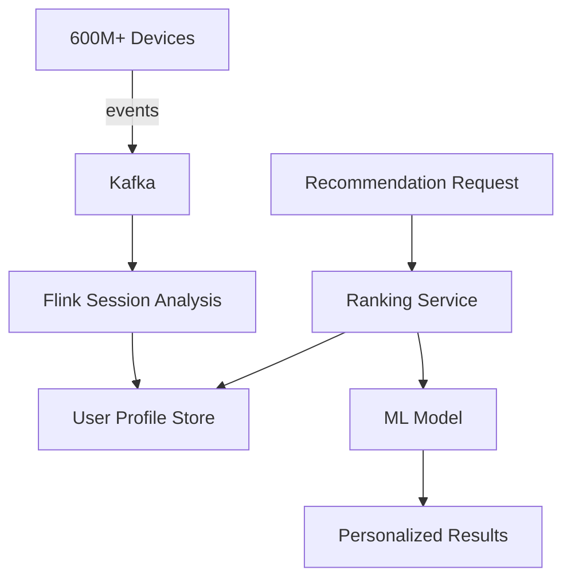

# Spotify Music Recommendation — Real-Time Personalization

> **Stage**: Knowledge | **Prerequisites**: [Real-Time Recommendation](../case-real-time-recommendation.md) | **Formal Level**: L3-L4
>
> **Domain**: Music Streaming | **Complexity**: ★★★★☆ | **Latency**: < 100ms | **Users**: 600M+
>
> Deep analysis of Spotify's real-time recommendation architecture: session analysis, personalized playlist generation, and Discover Weekly pipeline.

---

## 1. Definitions

**Def-K-03-17: Music Playback Event Stream**

Real-time playback interaction events from 600M+ users: Play, Pause, Skip, Like, AddToPlaylist[^1][^2].

$$
\text{MusicEventStream} \triangleq \langle E, U, T, C \rangle
$$

**Def-K-03-18: Real-Time Session Analysis Engine**

Processes user listening sessions to extract contextual features (mood, tempo preference, genre affinity) in real time.

**Def-K-03-19: Personalized Playlist Generator**

Generates personalized playlists (Discover Weekly, Daily Mix) based on collaborative filtering + content-based features.

---

## 2. Properties

**Prop-K-03-07: Real-Time Recommendation Latency Bound**

P99 recommendation response latency < 100ms via edge caching + lightweight model inference.

**Lemma-K-03-03: Session State Consistency**

User session state is consistent across devices because state is keyed by user ID and backed by Flink checkpointing.

---

## 3. Relations

- **with Flink Core**: Uses session windows for listening session detection, keyed state for user profiles.
- **with Dataflow Model**: Event-time processing ensures deterministic session boundaries regardless of playback order.

---

## 4. Argumentation

**Three-Phase Architecture Evolution**:

1. **Batch-based**: Daily Hadoop jobs for recommendations (high latency)
2. **Lambda architecture**: Batch + speed layer (complexity overhead)
3. **Unified streaming**: Flink-based Kappa architecture (simplified)

**Real-Time Feature Engineering**: User mood inference from skip rate, playback completion, and time-of-day patterns.

---

## 5. Engineering Argument

**Session Window Complexity**: Session window computation is $O(n)$ per user where $n$ = events in gap period. With 600M users and 5min session gap, state size is bounded by active sessions (~50M at peak).

---

## 6. Examples

**Discover Weekly Pipeline**:

```
Listening History (6 months)
  → Collaborative Filtering (Matrix Factorization)
  → Content Features (audio analysis)
  → Candidate Generation (10K tracks)
  → Ranking Model ( contextual bandit)
  → Personalized Playlist (30 tracks)
```

---

## 7. Visualizations

**Spotify Recommendation Architecture**:



---

## 8. References

[^1]: Spotify Engineering Blog, "Recommendations at Spotify", 2023.
[^2]: Spotify Research, "Session-Based Recommendation", RecSys, 2024.
