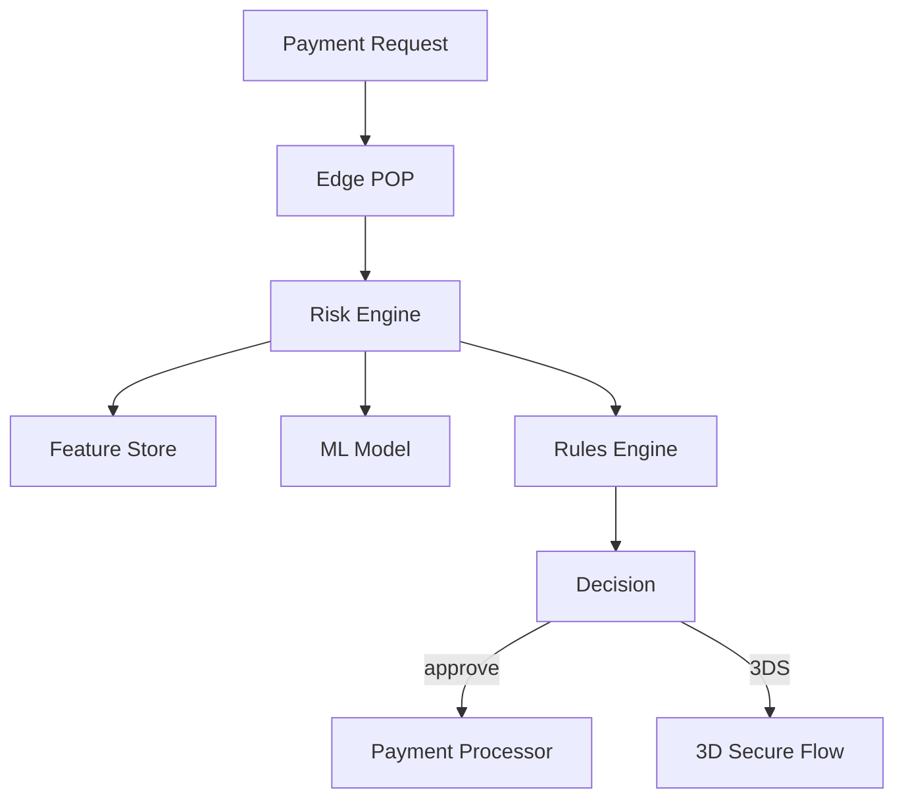

# Stripe Real-Time Payment Processing — Financial-Grade Streaming

> **Stage**: Knowledge | **Prerequisites**: [FinTech Risk Control](../case-fintech-realtime-risk-control.md) | **Formal Level**: L3-L4
>
> **Domain**: FinTech | **Complexity**: ★★★★★ | **Latency**: < 50ms | **Scale**: Global payment network
>
> Stripe's real-time stream processing architecture for fraud detection, 3D Secure triggering, and merchant analytics.

---

## 1. Definitions

**Def-K-03-14: Stripe Payment Event Stream**

Financial transaction events flowing through Stripe's global payment network: Authorization, Capture, Refund, Chargeback, Payout[^1][^2].

$$
\text{PaymentEventStream} \triangleq \langle E, T, K, V \rangle
$$

**Def-K-03-15: Real-Time Risk Decision System**

Sub-50ms fraud scoring engine combining rule-based checks, ML models, and consortium data.

**Def-K-03-16: Real-Time Billing Analytics Engine**

Merchant-facing real-time analytics for transaction volumes, success rates, and dispute trends.

---

## 2. Properties

**Prop-K-03-11: Risk Decision Latency Bound**

P99 risk decision latency < 50ms via pre-computed features, edge caching, and model quantization.

**Lemma-K-03-02: Fraud Detection Accuracy Lower Bound**

With ensemble of rules + GBDT + deep learning, fraud detection accuracy exceeds 99.5% at < 0.1% false positive rate.

---

## 3. Relations

- **with Flink Core**: Uses event-time processing for transaction ordering, keyed state for merchant profiles.
- **with Financial Compliance**: Strong consistency for payment state, immutable audit logs for regulatory requirements.

---

## 4. Argumentation

**Three-Phase Architecture Evolution**:

1. **Monolithic**: Single Ruby on Rails application (simpler, limited scale)
2. **Microservices**: Service-oriented with Kafka (better scale, complex ops)
3. **Streaming-first**: Flink-based real-time processing (unified batch+streaming)

**Multi-Currency Real-Time Rates**: Currency conversion uses streaming FX rates with 1-second freshness, sourced from multiple liquidity providers.

---

## 5. Engineering Argument

**End-to-End Latency Optimization**:

- Network: Edge POPs within 10ms of major markets
- Feature lookup: Redis cluster with local replica
- Model inference: Quantized GBDT (sub-millisecond)
- Total: < 50ms P99

---

## 6. Examples

**Real-Time Fraud Detection**:

```
Authorization Request
  → Feature Enrichment (user history, device fingerprint)
  → Rule Engine (velocity checks, geo-velocity)
  → ML Model (GBDT ensemble)
  → Consortium Lookup (shared fraud signals)
  → Decision (approve / 3DS / decline)
```

---

## 7. Visualizations

**Stripe Payment Architecture**:



---

## 8. References

[^1]: Stripe Engineering Blog, "Real-Time Risk Scoring", 2024.
[^2]: Stripe Documentation, "Payment Processing", 2025.
