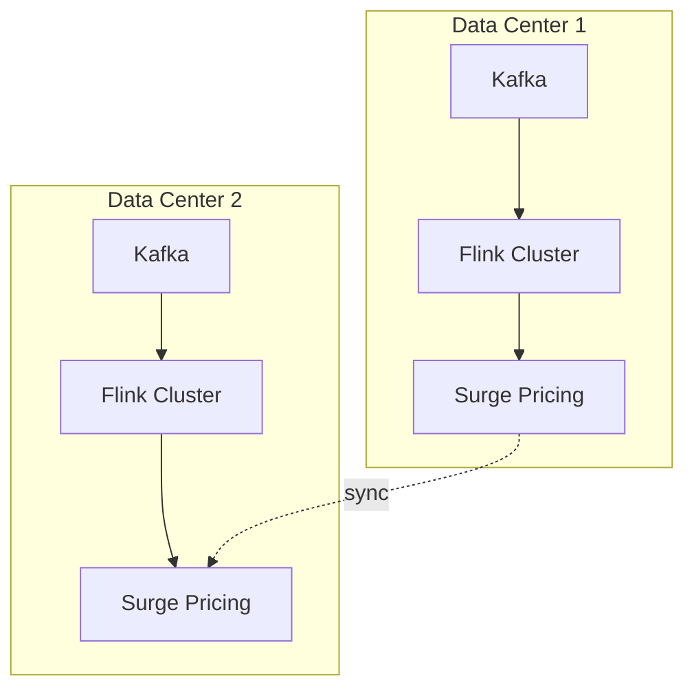

# Uber Real-Time Analytics Platform — Apache Flink at Scale

> **Stage**: Knowledge | **Prerequisites**: [Flink Architecture](../flink/flink-architecture-overview.md) | **Formal Level**: L3-L4
>
> **Domain**: Ride-sharing | **Complexity**: ★★★★★ | **Latency**: < 200ms | **Peak QPS**: Millions
>
> Deep analysis of Uber's Flink-based AthenaX platform: dual-active datacenter design, geo-partitioning, and surge pricing.

---

## 1. Definitions

**Def-K-03-05: Uber Stream Computing Platform (AthenaX)**

Uber's distributed real-time analytics platform based on Apache Flink, powering global real-time supply-demand matching, dynamic pricing, and ETA computation[^1][^2].

**Def-K-03-06: Real-Time Supply-Demand Matching**

Matching riders with nearby drivers based on real-time geospatial stream processing.

**Def-K-03-07: Surge Pricing**

Dynamic fare adjustment based on real-time supply-demand imbalance in geo-fenced areas.

---

## 2. Properties

**Prop-K-03-01: Geo-Partitioning Scalability**

Partitioning by geohash enables horizontal scaling: each partition processes only local supply-demand events.

**Lemma-K-03-01: Supply-Demand Balance Convergence**

With surge pricing feedback loop, local supply-demand imbalance converges to equilibrium within $\Delta t$ proportional to price elasticity.

---

## 3. Relations

- **with Flink Core**: Uses keyed state for driver/rider state, event-time windows for session analysis.
- **with Consistency Model**: Dual-active datacenters use eventual consistency for pricing, strong consistency for payments.

---

## 4. Argumentation

**Three-Phase Architecture Evolution**:

1. **Phase 1**: Kafka + Storm (micro-batch latency)
2. **Phase 2**: Kafka + Flink (true streaming, lower latency)
3. **Phase 3**: Dual-active Flink with geo-partitioning (high availability)

**Latency vs Consistency**: Pricing updates tolerate eventual consistency (200ms window); payment transactions require strong consistency (synchronous cross-DC commit).

---

## 5. Engineering Argument

**Million QPS Scalability**: Geo-partitioning by geohash (e.g., 6-character precision ~1.2km x 0.6km cells) distributes load evenly. With 1000 partitions, each handles ~1K QPS, well within single-task capacity.

---

## 6. Examples

**ETA Computation Pipeline**:

```
GPS Stream (driver locations)
  → KeyBy(geohash)
  → Window(30s Tumbling)
  → Aggregate(avg speed, road segments)
  → Route Model
  → ETA Estimate
```

---

## 7. Visualizations

**Uber Platform Architecture**:



---

## 8. References

[^1]: Uber Engineering Blog, "AthenaX: Uber's Stream Processing Platform", 2023.
[^2]: Apache Flink Blog, "Flink at Uber", 2022.
