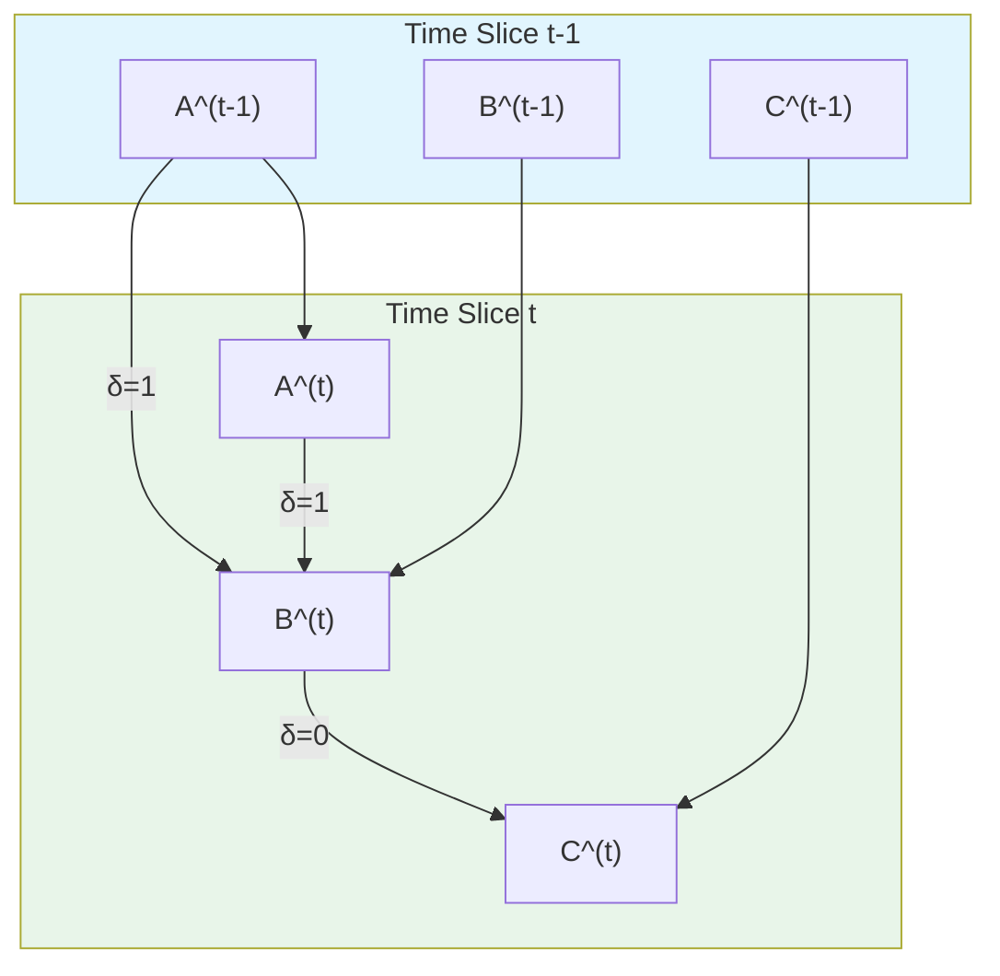
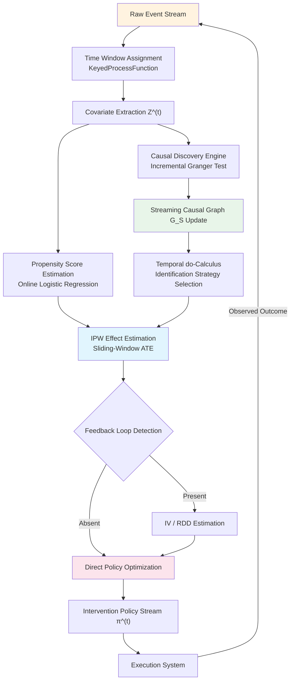

# Formal Foundations of Causal Inference in Stream Processing

> Stage: Struct/06-frontier | Prerequisites: [Struct/01-foundation/stream-processing-formal-model.md](../01-foundation/stream-processing-formal-model.md), [Struct/04-proofs/causal-consistency-theorems.md](../04-proofs/causal-consistency-theorems.md) | Formalization Level: L3-L4

## 1. Concept Definitions (Definitions)

### 1.1 Streaming Causal Graph

**Def-S-06-01** (Streaming Causal Graph). A *Streaming Causal Graph* (流因果图, SCG) is a timestamped directed graph tuple $\mathcal{G}_S = (\mathcal{V}, \mathcal{E}, \mathcal{T}, \Delta)$, where:

- $\mathcal{V} = \{V_1, \ldots, V_n\}$ is a set of variables, and $V_i^{(t)}$ is the observed value at time $t$;
- $\mathcal{E} \subseteq \mathcal{V} \times \mathcal{V} \times \mathbb{Z}_{\geq 0}$ is a set of time-delayed causal edges; $(V_i \xrightarrow{\delta} V_j)$ denotes that $V_i$ influences $V_j$ after delay $\delta$;
- $\mathcal{T} = \{0, 1, 2, \ldots\}$ is the discrete time domain;
- $\Delta = \{0, 1, \ldots, \delta_{\max}\}$ is the delay upper bound.

When $\delta = 0$, the edge is an **instantaneous causal edge**; when $\delta > 0$, it is a **delayed causal edge** (corresponding to Granger causality). A streaming causal graph permits temporal cycles across time slices, but the cross-sectional graph within any single slice must be a DAG. The time-unfolded graph $\mathcal{G}_S^{[t-W,t]}$ expands the dynamic structure into a finite DAG with nodes $\{V_i^{(s)}: s \in [t-W,t]\}$.

### 1.2 Streaming Interventional Distribution

**Def-S-06-02** (Streaming Interventional Distribution). Let the intervention policy be a sequence of functions $\pi = (\pi^{(t)})_{t \in \mathcal{T}}$, where $\pi^{(t)}: \mathcal{H}^{(t)} \to \Delta(\mathcal{X})$ maps the history $\mathcal{H}^{(t)} = \{V_i^{(s)}: s < t\}$ to an interventional distribution. The **streaming interventional distribution** is defined as:

$$
P^{\pi}\big(\mathbf{Y}^{(t)} = \mathbf{y} \big\vert \mathcal{H}^{(t)}\big)
$$

A static point intervention is denoted $P(\mathbf{Y}^{(t)} = \mathbf{y} \mid do(\mathbf{X}^{(s)}=\mathbf{x}), s \leq t)$. Streaming intervention effects propagate through the internal state of the system, naturally corresponding to stateful operators in stream processing.

### 1.3 Temporal do-Calculus

**Def-S-06-03** (Temporal do-Calculus). Let $\mathcal{G}_S^{\underline{t}}$ be the time-unfolded DAG up to time $t$. The rules are as follows:

**Rule T1 (Temporal Observation Insertion/Deletion)**: If $\mathbf{Y}^{(t)}$ and $\mathbf{Z}^{(s)}$ are d-separated by $\{\mathbf{X}^{(r)}\}_{r\leq t}$ in $\mathcal{G}_S^{\underline{t}}$ and $s \leq t$, then
$$P(\mathbf{Y}^{(t)} \mid do(\mathbf{X}), \mathbf{Z}^{(s)}) = P(\mathbf{Y}^{(t)} \mid do(\mathbf{X}))$$

**Rule T2 (Temporal Action-Observation Exchange)**: If $\mathbf{Y}^{(t)}$ and $\mathbf{Z}^{(s)}$ are d-separated in the truncated graph $\mathcal{G}_S^{\underline{t}}[\overline{\mathbf{X}}]$ and $s < t$, then
$$P(\mathbf{Y}^{(t)} \mid do(\mathbf{X}), do(\mathbf{Z}^{(s)})) = P(\mathbf{Y}^{(t)} \mid do(\mathbf{X}), \mathbf{Z}^{(s)})$$

**Rule T3 (Temporal Action Insertion/Deletion)**: If $\mathbf{Y}^{(t)}$ and $\mathbf{Z}^{(s)}$ are d-separated in $\mathcal{G}_S^{\underline{t}}[\overline{\mathbf{X}}, \underline{\mathbf{Z}^{(s)}}]$, then
$$P(\mathbf{Y}^{(t)} \mid do(\mathbf{X}), do(\mathbf{Z}^{(s)})) = P(\mathbf{Y}^{(t)} \mid do(\mathbf{X}))$$

The temporal rules additionally require temporal ordering constraints ($s < t$ or $s \leq t$), ensuring the temporal causal law that "the cause must precede the effect."

## 2. Property Derivation (Properties)

### 2.1 Streaming Markov Factorization

**Lemma-S-06-01** (Streaming Markov Factorization). If the time-unfolded graph satisfies the global Markov property, the joint distribution factorizes as:

$$
P\big(\mathbf{V}^{(0)}, \ldots, \mathbf{V}^{(t)}\big) = \prod_{s=0}^{t} \prod_{i=1}^{n} P\big(V_i^{(s)} \big\vert \mathbf{Pa}^{(s)}(V_i)\big)
$$

where $\mathbf{Pa}^{(s)}(V_i) = \{V_j^{(s-\delta)} : (V_j \xrightarrow{\delta} V_i) \in \mathcal{E}, s-\delta \geq 0\}$. This factorization decomposes the high-dimensional temporal joint distribution into a product of local conditional probabilities, each depending only on bounded history (constrained by $\delta_{\max}$), enabling stream engines to maintain causal structures incrementally within sliding windows.

### 2.2 Recursive Representation of Streaming Interventions

**Prop-S-06-01** (Streaming Interventional Recursive Decomposition). Under a static intervention $do(\mathbf{X}^{(s)} = \mathbf{x}, \forall s \in [0,t])$:

$$
P\big(\mathbf{V}^{(t)} \big\vert do(\mathbf{X}=\mathbf{x})\big) = \sum_{\mathbf{V}^{(t-1)}} P\big(\mathbf{V}^{(t)} \big\vert \mathbf{V}^{(t-1)}, \mathbf{X}^{(t)}=\mathbf{x}\big) \cdot P\big(\mathbf{V}^{(t-1)} \big\vert do(\mathbf{X}=\mathbf{x})\big)
$$

The transition kernel $P(\mathbf{V}^{(t)} \mid \mathbf{V}^{(t-1)}, \mathbf{X}^{(t)}=\mathbf{x})$ is fixed by the causal structure. This recursive formula corresponds to the state-update operator in stream processing and constitutes the mathematical foundation for real-time causal effect tracking.

### 2.3 Equivalence Between Granger Causality and Streaming Causal Edges

**Prop-S-06-02** (Granger-Causal Edge Equivalence). Let $V_i, V_j$ be stationary time series. If there exists $\delta > 0$ such that

$$
P\big(V_j^{(t)} \big\vert \mathcal{H}_{-i}^{(t)}\big) \neq P\big(V_j^{(t)} \big\vert \mathcal{H}^{(t)}\big)
$$

then $\mathcal{G}_S$ must contain a delayed edge $V_i \xrightarrow{\delta'} V_j$ for some $\delta' \leq \delta$. Conversely, if $V_i \xrightarrow{\delta} V_j$ exists and all confounding paths are blocked, the Granger test rejects the null hypothesis with probability 1 (as $t \to \infty$).

Granger causality is **predictive**, whereas streaming causal edges are **structural**; the two may diverge in the presence of unobserved confounding.

## 3. Relation Establishment (Relations)

### 3.1 Mapping to the Potential Outcomes Framework

In streaming environments, each "unit" corresponds to an event stream. Let the key space be $\mathcal{K}$; the streaming average treatment effect is $\tau^{(t)}(k) = \mathbb{E}[Y^{(t)}(1) - Y^{(t)}(0) \mid K=k]$. Flink's KeyedStream supports partitioning by $k$ to maintain state and incrementally compute $\tau^{(t)}(k)$. **Streaming SUTVA** requires consistency ($Y^{(t)} = Y^{(t)}(\mathbf{x}^{(0:t)})$) and no interference ($Y_k^{(t)}$ is not affected by intervention paths of $k' \neq k$). In real-time recommender systems, the no-interference assumption is often violated by social influence, necessitating the introduction of network interference models.

### 3.2 Hierarchy Correspondence with Pearl's SCM

| Level | Static SCM | Streaming Extension | Stream Processing Operator |
|-------|-----------|---------------------|---------------------------|
| Association | $P(\mathbf{y}\mid\mathbf{x})$ | $P(\mathbf{Y}^{(t)}\mid\mathbf{X}^{(t)},\mathcal{H}^{(t)})$ | WindowedJoin |
| Intervention | $P(\mathbf{y}\mid do(\mathbf{x}))$ | $P^{\pi}(\mathbf{Y}^{(t)}\mid\mathcal{H}^{(t)})$ | KeyedProcessFunction |
| Counterfactual | $P(\mathbf{y}_{\mathbf{x}}\mid\mathbf{x}',\mathbf{y}')$ | $\mathbf{Y}^{(t)}(\mathbf{x}^{(0:t)})\mid\mathbf{Y}^{(0:t-1)}=\mathbf{y}^{(0:t-1)}$ | Iterative Processing |

Streaming counterfactual computation grows exponentially in complexity; engineering approximations include particle filtering, surrogate models, and breakpoint approximation.

### 3.3 Causal Semantics Encoding in Stream Processing Systems

The **intervention operator** $\mathcal{I}_{\mathbf{X}=\mathbf{x}}: \mathcal{S} \to \mathcal{S}'$ replaces the $\mathbf{X}$ data source with a policy stream $\pi$, corresponding to a Flink ProcessFunction that intercepts and injects intervention values while blocking upstream raw signals (truncating incoming edges).

The **confounding adjustment operator** takes an incremental form in streaming environments:
$P(\mathbf{Y}^{(t)}\mid do(\mathbf{X}^{(t)}=\mathbf{x})) = \sum_{\mathbf{z}} P(\mathbf{Y}^{(t)}\mid\mathbf{X}^{(t)}=\mathbf{x},\mathbf{Z}^{(t)}=\mathbf{z}) \cdot P(\mathbf{Z}^{(t)}=\mathbf{z})$,
computed via CoGroup / IntervalJoin within temporal windows.

## 4. Argumentation Process (Argumentation)

### 4.1 Dynamic Confounder Evolution

In static causal inference, the confounder set $\mathbf{Z}$ is fixed. In streaming scenarios, the confounding structure evolves: seasonal pattern shifts in e-commerce recommendations, concept drift in financial risk control, and selective attrition in A/B testing. Let confounders be a time-varying process $\mathbf{Z}^{(t)}$ driven by a hidden state $\mathbf{U}^{(t)}$. If $\mathbf{U}^{(t)}$ is unobserved, even if conditional independence $Y^{(t)} \perp\!\!\!\perp X^{(t)} \mid \mathbf{Z}^{(t)}$ holds within a single time slice, unobserved confounding persists across slices—when $U^{(s)}$ ($s<t$) simultaneously influences $X^{(t)}$ and $Y^{(t)}$, the conditional independence is broken.

### 4.2 Identification Dilemma of Feedback Loops

In real-time recommendation, the recommendation outcome $X^{(t)}$ influences user behavior $Y^{(t)}$, which updates the user profile and in turn affects subsequent recommendations $X^{(t+1)}$, forming a closed loop. Identification strategies: (1) **Instrumental variable stream**—an exogenous shock $I^{(t)}$ (e.g., randomized bucketing) satisfying $I^{(t)} \to X^{(t)}$ and $I^{(t)} \perp\!\!\!\perp Y^{(t)}(x)$; (2) **Explore-exploit separation**—execute random exploration with fixed probability $\epsilon$; (3) **Structural assumption**—if the feedback time constant far exceeds the estimation window, the system can be locally approximated as open-loop.

### 4.3 Counterexample: Delay Misspecification Causes Causal Bias

Suppose the true structure is $A \xrightarrow{2} B$, but it is misspecified as $A \xrightarrow{1} B$. The true model is $B^{(t)} = \alpha A^{(t-2)} + \epsilon^{(t)}$, and the misspecified estimator converges to $\hat{\alpha} \xrightarrow{p} \alpha \rho_{A}(1)$. If $A$ is white noise ($\rho_A(1)=0$), then $\hat{\alpha} \xrightarrow{p} 0$, completely masking the true effect.

## 5. Formal Proof / Engineering Argument (Proof / Engineering Argument)

### 5.1 Identifiability Theorem for Streaming Causal Effects

**Thm-S-06-01** (Consistency Under Dynamic Confounding Adjustment). Let $\mathcal{G}_S$ be a streaming causal graph, $X$ a binary intervention, and $Y$ the outcome. Assume:

1. **Temporal Positivity**: $\forall t, \mathbf{z}^{(t)}$, $0 < P(X^{(t)}=1 \mid \mathbf{Z}^{(t)}=\mathbf{z}^{(t)}, \mathcal{H}^{(t-1)}) < 1$;
2. **Temporal Ignorability**: $Y^{(t)}(x) \perp\!\!\!\perp X^{(t)} \mid \mathbf{Z}^{(t)}, \mathcal{H}^{(t-1)}$;
3. **Bounded Delay**: All $X \leadsto Y$ paths have delay upper bounded by $\delta_{\max} < \infty$.

Then the streaming ATE $\tau^{(t)} = \mathbb{E}[Y^{(t)}(1) - Y^{(t)}(0)]$ is identifiable, and the incremental IPW estimator

$$
\hat{\tau}^{(t)} = \frac{1}{W} \sum_{s=t-W+1}^{t} \left[ \frac{X^{(s)} Y^{(s)}}{\hat{e}^{(s)}} - \frac{(1-X^{(s)}) Y^{(s)}}{1-\hat{e}^{(s)}} \right]
$$

converges in probability to $\tau^{(t)}$ as $W \to \infty$, where $\hat{e}^{(s)}$ is the propensity score estimate.

*Proof*. **Step 1**: By temporal ignorability, the single-time-slice potential outcome distribution is identifiable:

$$
P(Y^{(s)}(x)=y \mid \mathcal{H}^{(s-1)}) = \sum_{\mathbf{z}} P(Y^{(s)}=y \mid X^{(s)}=x, \mathbf{Z}^{(s)}=\mathbf{z}, \mathcal{H}^{(s-1)}) P(\mathbf{Z}^{(s)}=\mathbf{z} \mid \mathcal{H}^{(s-1)})
$$

**Step 2**: For the propensity score $e^{(s)}$, by iterated expectation:

$$
\mathbb{E}\left[ \frac{X^{(s)} Y^{(s)}}{e^{(s)}} \right] = \mathbb{E}[Y^{(s)}(1)], \quad \mathbb{E}\left[ \frac{(1-X^{(s)}) Y^{(s)}}{1-e^{(s)}} \right] = \mathbb{E}[Y^{(s)}(0)]
$$

**Step 3**: Let $\eta^{(s)} = X^{(s)} Y^{(s)}/e^{(s)} - (1-X^{(s)}) Y^{(s)}/(1-e^{(s)})$. By bounded delay, $\eta^{(s)}$ is a $\delta_{\max}$-dependent sequence. Under temporal positivity and second-moment conditions, apply the law of large numbers for $\alpha$-mixing sequences:

$$
\frac{1}{W} \sum_{s=t-W+1}^{t} \eta^{(s)} \xrightarrow{p} \mathbb{E}[\eta^{(s)}] = \tau^{(t)}
$$

∎

This theorem provides theoretical guarantees for real-time A/B testing in stream processing: by maintaining a sliding window $W$ and reweighting with propensity scores, causal effects in dynamic environments can be consistently estimated.

### 5.2 Streaming Extension of Regression Discontinuity Design

Regression discontinuity design exploits the jump in treatment assignment at a threshold to identify the local average treatment effect. In a streaming environment, the running variable $R^{(t)}$ crossing threshold $c$ triggers treatment $X^{(t)} = \mathbb{1}_{\{R^{(t)} \geq c\}}$. Within the neighborhood $[c-h, c+h]$, assuming $\mu_x(r) = \mathbb{E}[Y^{(t)}(x) \mid R^{(t)}=r]$ is continuous, we have:

$$
\tau_{RDD}^{(t)} = \lim_{r \downarrow c} \mathbb{E}[Y^{(t)} \mid R^{(t)}=r] - \lim_{r \uparrow c} \mathbb{E}[Y^{(t)} \mid R^{(t)}=r]
$$

The streaming implementation maintains two keyed states ($R<c$ and $R \geq c$) via incremental updates of local linear regression, updating polynomial coefficients with exponentially weighted SGD, consistent with Flink KeyedProcessFunction state semantics.

## 6. Example Validation (Examples)

### 6.1 Causal Effect Estimation in Real-Time Recommender Systems

An e-commerce recommender system estimates the causal effect of "pinning product A to the top" ($X=1$) on "purchase conversion rate" ($Y$). Confounders include user history $\mathbf{Z}_1$, real-time context $\mathbf{Z}_2$, and long-term preferences $\mathbf{Z}_3$ (unobserved). Flink KeyedProcessFunction implementation: (1) extract covariates keyed by user; (2) update propensity scores via online logistic regression; (3) accumulate IPW-weighted outcomes; (4) periodically output the ATE. The window $W$ is set to 30 minutes to balance variance and timeliness.

### 6.2 IoT Anomaly Root Cause Analysis

In a smart manufacturing line, sensors produce high-frequency data streams. When a quality anomaly alert fires, a sliding-window incremental Granger causality test constructs the streaming causal graph; a temporal do-calculus counterfactual query at anomaly time computes the **causal attribution score** for candidate root causes $X_i$: $CAF(X_i) = P(Y^{(t)}=1) - P(Y^{(t)}=1 \mid do(X_i^{(t)} = x_i^{\text{normal}}))$. Incremental computation is realized by maintaining conditional distributions in stream state.

### 6.3 Causal Attribution in Financial Risk Control

Real-time transaction risk control needs to determine whether "transaction rejection" ($Y=1$) is causally due to "triggered rule $X$". The system's random audit mechanism (5% probability of mandatory manual review) serves as an instrumental variable $I$, satisfying $I \to X$, exclusion, and exogeneity. The streaming 2SLS first stage estimates $\hat{X} = \alpha_0 + \alpha_1 I$; the second stage uses $\hat{X}$ to estimate the default equation, implemented via Flink stateful operators and supporting tens of thousands of transactions per second.

## 7. Visualizations (Visualizations)

### Figure 1: Time-Unfolded Structure of the Streaming Causal Graph

The following Mermaid diagram shows the unfolding of three variables $(A, B, C)$ across two time slices. $A \xrightarrow{1} B$ is a delayed causal edge, and $B \xrightarrow{0} C$ is an instantaneous causal edge.

Self-loops denote temporal persistence; cross-slice edges represent Granger causality, and within-slice edges represent instantaneous causality. Truncating incoming edges to $A^{(t)}$ corresponds to executing the intervention $do(A^{(t)}=a)$.

### Figure 2: Causal Inference Architecture in a Stream Processing Pipeline

The following Mermaid diagram illustrates the complete architecture of a streaming causal inference system, covering causal discovery, effect estimation, and policy optimization.

Core loop: events are windowed and then forked to the causal discovery engine (maintaining graph structure) and the effect estimation engine (computing ATE). When a feedback loop is detected, the system switches to IV/RDD methods; the policy optimization module updates the intervention policy based on causal estimates.

## 8. References (References)
