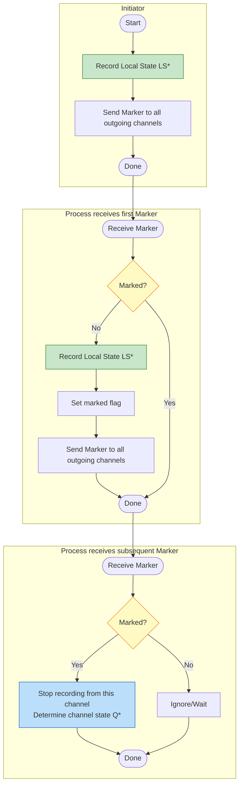
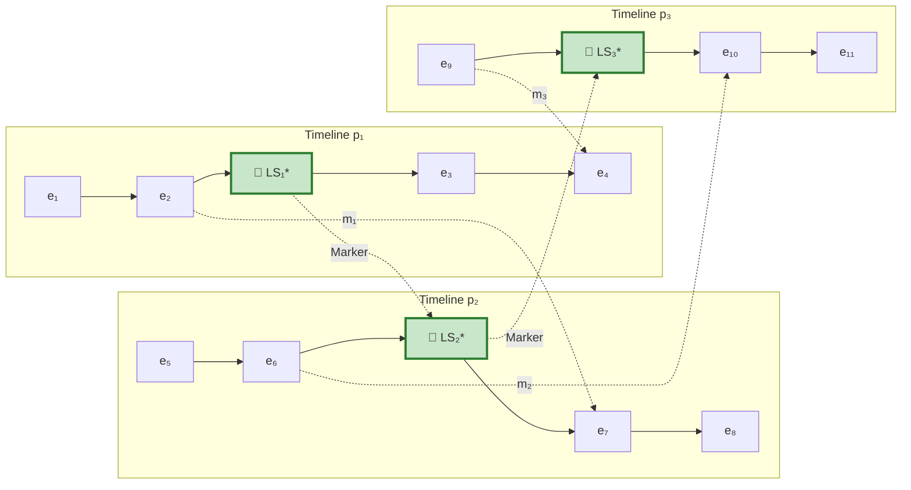
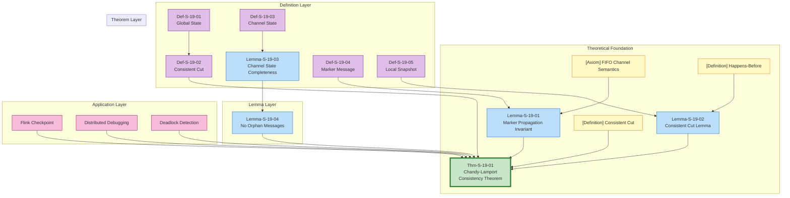

# Chandy-Lamport Snapshot Consistency Proof

> **Stage**: Struct/04-proofs | **Prerequisites**: [../04-proofs/04.01-flink-checkpoint-correctness.md](../04-proofs/04.01-flink-checkpoint-correctness.md) | **Formalization Level**: L5

---

## Table of Contents

- [Chandy-Lamport Snapshot Consistency Proof](#chandy-lamport-snapshot-consistency-proof)
  - [Table of Contents](#table-of-contents)
  - [1. Definitions](#1-definitions)
    - [Def-S-19-01 (Global State)](#def-s-19-01-global-state)
    - [Def-S-19-02 (Consistent Cut)](#def-s-19-02-consistent-cut)
    - [Def-S-19-03 (Channel State)](#def-s-19-03-channel-state)
    - [Def-S-19-04 (Marker Message)](#def-s-19-04-marker-message)
    - [Def-S-19-05 (Local Snapshot)](#def-s-19-05-local-snapshot)
  - [2. Properties](#2-properties)
    - [Lemma-S-19-01 (Marker Propagation Invariant)](#lemma-s-19-01-marker-propagation-invariant)
    - [Lemma-S-19-02 (Consistent Cut Lemma)](#lemma-s-19-02-consistent-cut-lemma)
    - [Lemma-S-19-03 (Channel State Completeness)](#lemma-s-19-03-channel-state-completeness)
    - [Lemma-S-19-04 (No Orphan Messages Guarantee)](#lemma-s-19-04-no-orphan-messages-guarantee)
  - [3. Relations](#3-relations)
    - [Relation 1: Marker Reception `↦` State Recording Trigger](#relation-1-marker-reception--state-recording-trigger)
    - [Relation 2: Channel Recording Rules `⟹` No Message Loss or Duplication](#relation-2-channel-recording-rules--no-message-loss-or-duplication)
    - [Relation 3: Chandy-Lamport `≈` Flink Checkpoint (Semantic Equivalence)](#relation-3-chandy-lamport--flink-checkpoint-semantic-equivalence)
  - [4. Argumentation](#4-argumentation)
    - [Lemma 4.1 (Marker FIFO Partition Lemma)](#lemma-41-marker-fifo-partition-lemma)
    - [Lemma 4.2 (Local Snapshot Moments Form a Global Cut)](#lemma-42-local-snapshot-moments-form-a-global-cut)
    - [Counterexample 4.1 (Non-FIFO Channels Break Consistency)](#counterexample-41-non-fifo-channels-break-consistency)
    - [Counterexample 4.2 (Marker Loss Leads to Incomplete Snapshots)](#counterexample-42-marker-loss-leads-to-incomplete-snapshots)
  - [5. Proofs](#5-proofs)
    - [Thm-S-19-01 (Chandy-Lamport Algorithm Records a Consistent Global State)](#thm-s-19-01-chandy-lamport-algorithm-records-a-consistent-global-state)
  - [6. Examples](#6-examples)
    - [Example 6.1: Snapshot Process in a Three-Process Linear Topology](#example-61-snapshot-process-in-a-three-process-linear-topology)
    - [Example 6.2: Marker Propagation in a Ring Topology](#example-62-marker-propagation-in-a-ring-topology)
    - [Counterexample 6.3: Network Partition Prevents Snapshot Completion](#counterexample-63-network-partition-prevents-snapshot-completion)
  - [7. Visualizations](#7-visualizations)
    - [Snapshot Algorithm Flowchart](#snapshot-algorithm-flowchart)
    - [Consistent Cut Visualization](#consistent-cut-visualization)
    - [Proof Dependency Graph](#proof-dependency-graph)
  - [8. References](#8-references)

---

## 1. Definitions

This section establishes the rigorous mathematical definitions required for the Chandy-Lamport algorithm consistency proof, based on the Chandy-Lamport distributed snapshot theory[^1][^2]. All definitions rely on the characterizations of Barrier, alignment, and global state in the prerequisite document [04.01-flink-checkpoint-correctness.md](../04-proofs/04.01-flink-checkpoint-correctness.md).

---

### Def-S-19-01 (Global State)

**Definition**: Let distributed system $\mathcal{D} = \langle P, C, M, Q, E \rangle$, where $P$ is the set of processes, $C$ is the set of channels, $M$ is the set of messages, $Q$ is the channel state, and $E$ is the set of events. The **Global State** $S_{global}$ is defined as the Cartesian product of all process local states and all channel states:

$$
S_{global} = \langle LS_1, LS_2, \ldots, LS_n, \{Q_c\}_{c \in C} \rangle \in \prod_{p_i \in P} \mathcal{S}_i \times \prod_{c \in C} M^*
$$

Where:

- $LS_i$: Local State of process $p_i$, including internal variables, program counter, stack, etc.
- $Q_c \subseteq M^*$: Message sequence on channel $c$ (in-transit messages)
- $\mathcal{S}_i$: State space of process $p_i$

**State Evolution**: The system transitions through events $e \in E$:

$$
S_{global} \xrightarrow{e} S'_{global}
$$

**Intuitive Explanation**: A global state is not simply a concatenation of all process states; it must also include all messages "in flight" in the communication channels. This is like taking a "panoramic photo" of the distributed system—the photo must record not only what each process is doing, but also all messages in transit.

**Definition Motivation**: Distributed systems have no shared memory; the only coupling between processes is message passing. If in-transit messages in channels are not explicitly included in the global state, the running snapshot of the distributed system cannot be completely characterized. Omitting in-transit messages leads to lost causal associations in the snapshot, making it impossible to determine whether a snapshot is "complete" or "consistent."

---

### Def-S-19-02 (Consistent Cut)

**Definition**: Let $E$ be the set of all events in the system. A **Cut** is a boundary that partitions $E$ into two disjoint subsets $(E_{past}, E_{future})$:

$$
\text{Cut} = (E_{past}, E_{future}) \quad \text{where } E_{past} \cup E_{future} = E \text{ and } E_{past} \cap E_{future} = \emptyset
$$

A cut $\text{Cut}$ is **Consistent** if and only if it satisfies **happens-before downward closure**:

$$
\text{Consistent}(\text{Cut}) \iff \forall e \in E_{past}, \forall f \in E: f \rightarrow e \Rightarrow f \in E_{past}
$$

Where $\rightarrow$ is the happens-before relation defined by Lamport[^2]:

$$
\begin{aligned}
f \rightarrow e \iff& \exists p_i \in P: f \prec_{p_i} e \quad \text{(same process ordering)} \\
\lor& \exists m \in M, c \in C: f = \text{send}(m, c) \land e = \text{receive}(m, c) \quad \text{(send-receive causality)} \\
\lor& \exists g \in E: f \rightarrow g \land g \rightarrow e \quad \text{(transitive closure)}
\end{aligned}
$$

**Equivalent Formulation (No Orphan Messages)**:

$$
\text{Consistent}(\text{Cut}) \iff \nexists m \in M: \text{send}(m) \in E_{future} \land \text{receive}(m) \in E_{past}
$$

That is: there does not exist a message $m$ such that "the sender sends after the cut while the receiver receives before the cut"—the orphan message scenario.

**Intuitive Explanation**: A consistent cut is like using a "causal pair of scissors" to cut through the event history, ensuring that no "effect" is on this side of the scissors while the "cause" is on the other side. If the photo shows that a message has been received, then the sender's state in the photo must show that the message has been sent; conversely, if the photo shows that the message has not yet been sent, the receiver cannot show that it has been received.

**Definition Motivation**: The global state of a distributed system must correspond to some consistent cut; otherwise, paradoxes such as "having received a message but the state sending the message is not in the snapshot" would arise. The consistent cut is the fundamental criterion for determining whether a distributed snapshot is meaningful.

---

### Def-S-19-03 (Channel State)

**Definition**: For channel $c_{ij} \in C$ (from process $p_i$ to $p_j$), its **snapshot state** (Channel State) $Q_{ij}^*$ is defined as:

$$
Q_{ij}^* = \{ m \in M \mid \text{send}(m, c_{ij}) \prec_{hb} \text{send}(\text{Marker}_{ij}, c_{ij}) \land \text{receive}(m, c_{ij}) \succ_{hb} \text{receive}(\text{Marker}_{kj}, c_{kj}) \}
$$

That is: $Q_{ij}^*$ contains all messages $m$ satisfying:

1. $m$ was sent **before** $p_i$ sends Marker to $c_{ij}$
2. $m$ is received **after** $p_j$ records its local state

**Channel State Recording Rules**:

| Scenario | Rule | Result |
|----------|------|--------|
| $p_j$ receives Marker from $c_{ij}$ for the first time | **Rule A** | $Q_{ij}^* := \emptyset$ |
| $p_j$ has already recorded state, subsequently receives Marker from $c_{ij}$ | **Rule B** | $Q_{ij}^* := \{ m \mid m \text{ received after state recording and before receiving Marker} \}$ |

**Intuitive Explanation**: The channel state records "in-transit messages"—messages that have been sent but not yet received. The Marker message in a FIFO channel acts as a clear boundary, partitioning all messages into "before Marker" (already processed or in transit) and "after Marker" (not yet sent).

**Definition Motivation**: If channel states are not recorded explicitly, messages in transit would "disappear" from the snapshot (neither in the sender's state nor in the receiver's state), leading to inconsistency after recovery.

---

### Def-S-19-04 (Marker Message)

**Definition**: A **Marker** is a special control message used to mark snapshot boundaries in channels:

$$
\text{Marker} = \langle \text{type} = \text{MARKER}, \text{snapshotID} \in \mathbb{N}^+, \text{source} \in P \rangle
$$

**Logical Semantics of Marker**: Marker $\text{M}_s$ (from snapshot initiator $s$) defines a **logical time boundary** in channel $c_{ij}$:

$$
Q_{c_{ij}} = Q_{c_{ij}}^{<M_s} \circ \langle \text{M}_s \rangle \circ Q_{c_{ij}}^{>M_s}
$$

Where:

- $Q_{c_{ij}}^{<M_s}$: Messages sent before Marker (already sent and arrived before Marker or in transit)
- $\text{M}_s$: The Marker message itself
- $Q_{c_{ij}}^{>M_s}$: Messages sent after Marker (not yet sent)

**Marker Processing Rules**:

$$
\text{Rules} = \begin{cases}
\textbf{Rule 1}: & \text{If } p_i \text{ decides to initiate snapshot and is not marked, record } LS_i^* \text{, send Marker to all outgoing channels} \\[6pt]
\textbf{Rule 2}: & \text{If } p_j \text{ receives Marker from channel } c \text{ for the first time and is not marked, record } LS_j^* \text{, } Q_c^* := \emptyset \text{, forward Marker} \\[6pt]
\textbf{Rule 3}: & \text{If } p_j \text{ receives Marker from channel } c \text{ and is already marked, then } Q_c^* := \{ m \mid m \text{ received after state recording} \}
\end{cases}
$$

**Intuitive Explanation**: A Marker is like a "time divider" in the data stream. It carries a snapshot ID and propagates among processes, marking the boundary of "data processed before this point, data pending after this point." All processes take snapshots of their own states upon receiving a Marker, thereby capturing the complete processing results up to that Marker.

**Definition Motivation**: In unbounded data streams, there is no natural "global snapshot moment." Having each process independently decide when to snapshot would lead to inconsistent states. The Marker, as a logical clock carrying a snapshot ID, enables processes in a distributed environment to trigger snapshots based on **local events** (receiving a Marker), without requiring global coordination or halting processing.

---

### Def-S-19-05 (Local Snapshot)

**Definition**: The **Local Snapshot** $\mathcal{L}_i$ of process $p_i$ is defined as:

$$
\mathcal{L}_i = \langle LS_i^*, \{ Q_{ji}^* \}_{c_{ji} \in \text{In}(i)} \rangle
$$

Where:

- $LS_i^*$: Local state of process $p_i$ recorded **when Marker is first received**
- $Q_{ji}^*$: Snapshot state of input channel $c_{ji}$
- $\text{In}(i) = \{ c_{ji} \mid (p_j, p_i) \in C \}$: Set of input channels of $p_i$

**Snapshot Moment**: Let $t_i$ be the moment when $p_i$ first receives a Marker from any channel:

$$
LS_i^* = \text{State}(p_i, t_i) \quad \text{where} \quad t_i = \min \{ t \mid \exists c \in \text{In}(i): \text{receive}(\text{Marker}, c) \text{ at time } t \}
$$

**Global Snapshot**:

$$
\mathcal{G} = \bigcup_{p_i \in P} \mathcal{L}_i = \left\langle \{ LS_i^* \}_{p_i \in P}, \{ Q_{ij}^* \}_{c_{ij} \in C} \right\rangle
$$

**Intuitive Explanation**: A local snapshot is a component of the global snapshot, containing the state of a process at a specific moment, as well as all messages "still on the way" in its input channels. Each process only needs to care about its own state and input channels, without knowing the global situation.

**Definition Motivation**: The core insight of the Chandy-Lamport algorithm is that a globally consistent snapshot can be constructed by each process independently recording its local state and channel states, without global coordination. This "distributed construction" enables the algorithm to complete snapshots while the system continues running.

---

## 2. Properties

This section derives the core properties of the Chandy-Lamport snapshot algorithm from the definitions in Section 1. All lemmas provide necessary support for the proof of theorem Thm-S-19-01.

---

### Lemma-S-19-01 (Marker Propagation Invariant)

**Statement**: For any channel $c_{ij} \in C$, if the sending process $p_i$ has sent a Marker to $c_{ij}$, then before sending the Marker, $p_i$ has:

1. Completed local state recording $LS_i^*$
2. Processed all "pre-Marker" data from its inputs
3. Sent all "pre-Marker" data processing results (including outputs to $c_{ij}$) downstream

**Formal Statement**:

$$
\forall c_{ij} \in C: \text{Marker} \in \text{Sent}(p_i, c_{ij}) \implies LS_i^* \text{ recorded} \land \text{Output}_{<\text{Marker}}(p_i, c_{ij}) \text{ sent}
$$

**Proof**:

**Step 1: Analyze $p_i$'s state transitions**

By Rules 1 and 2 of Def-S-19-04, a process only records its local state and forwards the Marker when it receives a Marker for the first time. The state transition sequence is:

$$
\text{RUNNING} \xrightarrow{\text{receive first Marker}} \text{RECORDING} \xrightarrow{\text{record } LS_i^*} \text{MARKING} \xrightarrow{\text{send Marker to all outgoing channels}} \text{RUNNING}
$$

**Step 2: Causal preconditions for Marker sending**

The action of process $p_i$ sending a Marker to channel $c_{ij}$ occurs in the $\text{MARKING}$ phase, whose prerequisites are:

- Recorded: Local state $LS_i^*$ has been captured (Def-S-19-05)
- Processed: All "pre-Marker" input data has been processed and produced outputs
- FIFO guarantee: Because channels are FIFO, all "pre-Marker" outputs arrive before the Marker

**Step 3: Inductive derivation**

Induction on the system topology using topological ordering:

- **Base Case (Initiator)**: The snapshot initiator $p_s$ records its initial state before sending Markers, satisfying the invariant.
- **Inductive Step**: Assume all upstream processes satisfy the invariant. Then the Marker they forward to the current process $p_i$ must arrive after all "pre-Marker" data. After $p_i$ receives the first Marker, it records its state and forwards the Marker, maintaining this invariant.

**Step 4: Conclusion**

By induction, Marker propagation on all channels $c_{ij}$ satisfies this invariant. ∎

> **Inference [Theory→Implementation]**: The Marker propagation invariant guarantees that **when a downstream process receives a Marker, the upstream has finished processing all pre-Marker data**, thereby ensuring the causal consistency of the global snapshot.

---

### Lemma-S-19-02 (Consistent Cut Lemma)

**Statement**: Let $\mathcal{G} = \langle \{LS_i^*\}, \{Q_{ij}^*\} \rangle$ be the global snapshot collected by the Chandy-Lamport algorithm. Then $\mathcal{G}$ corresponds to a **consistent cut** in the execution history.

**Formal Statement**:

$$
\text{Consistent}(\mathcal{G}) \iff \forall e \in E_{past}, \forall f \in E: f \rightarrow e \Rightarrow f \in E_{past}
$$

Where $E_{past} = \{ e \mid \exists p_i: e \text{ occurs before } p_i \text{ records } LS_i^* \}$.

**Proof**:

**Step 1: Recall the consistent cut definition**

By Def-S-19-02, $\mathcal{G}$ is consistent if and only if there are no orphan messages, i.e., there does not exist a message $m$ such that:

$$
\text{send}(m) \in E_{future} \land \text{receive}(m) \in E_{past}
$$

**Step 2: Analyze the lifecycle of message $m$**

For any message $m$ on channel $c_{ij}$, consider its position at the snapshot moment:

Let $t_i$ be the moment when $p_i$ records $LS_i^*$ and sends Marker to $c_{ij}$, and $t_j$ be the moment when $p_j$ records $LS_j^*$.

**Step 3: Case analysis**

| Case | $\text{send}(m)$ time | $\text{receive}(m)$ time | Belongs to $Q_{ij}^*$? | Orphan? |
|------|----------------------|-------------------------|-------------------|---------|
| 1 | $< t_i$ (pre-Marker) | $< t_j$ (before recording) | No (already received) | No |
| 2 | $< t_i$ (pre-Marker) | $\geq t_j$ (after recording) | **Yes** (in transit) | No |
| 3 | $\geq t_i$ (post-Marker) | $< t_j$ (before recording) | Impossible (FIFO) | — |
| 4 | $\geq t_i$ (post-Marker) | $\geq t_j$ (after recording) | No (not yet sent) | No |

**Step 4: Key role of FIFO channels**

The Chandy-Lamport algorithm requires channels to satisfy FIFO (First-In-First-Out) semantics:

$$
\text{FIFO}(c_{ij}) \implies \text{order}_{\text{send}} = \text{order}_{\text{recv}}
$$

Since $p_i$ sends a Marker to $c_{ij}$ at $t_i$, and $t_i$ is the first moment after $p_i$ records its state, Case 3 (sent after Marker, received before recording) cannot occur—the Marker would arrive at $p_j$ before $m$, so $p_j$'s recording moment $t_j$ is not earlier than the Marker arrival moment.

**Step 5: Conclusion**

For all channels $c_{ij} \in C$, $Q_{ij}^*$ only contains messages from Case 2 (sent before Marker, received after recording); there are no orphan messages. Therefore $\mathcal{G}$ satisfies the consistency definition of Def-S-19-02. ∎

---

### Lemma-S-19-03 (Channel State Completeness)

**Statement**: For any channel $c_{ij} \in C$, its snapshot state $Q_{ij}^*$ **exactly contains** all messages sent after the sending process recorded its snapshot and not received before the receiving process recorded its snapshot.

**Formal Statement**:

Let $t_i$ be the moment when $p_i$ records $LS_i^*$, and $t_j$ be the moment when $p_j$ records $LS_j^*$. Then:

$$
Q_{ij}^* = \{ m \mid t(\text{send}(m)) < t_i \land t(\text{receive}(m)) \geq t_j \}
$$

**Proof**:

**Step 1: Analyze the composition of $Q_{ij}^*$**

By Def-S-19-03, there are two cases for recording the channel state $Q_{ij}^*$:

**Case A**: $p_j$ receives the first Marker from $c_{ij}$

- $p_j$ records $LS_j^*$ immediately upon receiving the Marker from $c_{ij}$
- At this point $Q_{ij}^* := \emptyset$
- By FIFO, all messages before the Marker in $c_{ij}$ have already been processed
- Therefore $Q_{ij}^* = \emptyset = \{ m \mid t(\text{send}(m)) < t_i \land t(\text{receive}(m)) \geq t_j \}$ (empty set equals empty set)

**Case B**: $p_j$ receives the first Marker from another channel $c_{kj}$ ($k \neq i$)

- $p_j$ records $LS_j^*$ upon receiving the Marker from $c_{kj}$
- At this point $p_j$ starts recording messages received from $c_{ij}$
- When the Marker from $c_{ij}$ is subsequently received, $Q_{ij}^*$ is set to "all messages received from $c_{ij}$ after recording $LS_j^*$ and before receiving the Marker"
- By FIFO, these messages were all sent before $p_i$ sent the Marker

**Step 2: Completeness proof**

For any message $m$:

- If $t(\text{send}(m)) < t_i$ and $t(\text{receive}(m)) \geq t_j$:
  - $m$ was sent before $p_i$ sent the Marker
  - $m$ arrived after $p_j$ recorded its state
  - By the recording rule of Case B, $m \in Q_{ij}^*$

- If $m \in Q_{ij}^*$:
  - By the recording rule, $m$ was received after $p_j$ recorded its state and before receiving the Marker
  - By FIFO, $m$ was sent before $p_i$ sent the Marker
  - Therefore $t(\text{send}(m)) < t_i$ and $t(\text{receive}(m)) \geq t_j$

**Step 3: Conclusion**

Both cases satisfy $Q_{ij}^* = \{ m \mid t(\text{send}(m)) < t_i \land t(\text{receive}(m)) \geq t_j \}$. ∎

---

### Lemma-S-19-04 (No Orphan Messages Guarantee)

**Statement**: Let $\mathcal{G} = \langle \{LS_i^*\}, \{Q_{ij}^*\} \rangle$ be the Chandy-Lamport global snapshot. Then $\mathcal{G}$ contains **no orphan messages**.

**Formal Statement**:

$$
\forall c_{ij} \in C, \forall m \in M: \neg \text{Orphan}(m, \mathcal{G})
$$

Where the orphan message is defined as:

$$
\text{Orphan}(m, \mathcal{G}) \iff \text{send}(m) \in E_{past} \land \text{receive}(m) \in E_{future} \land m \notin Q_{ij}^*
$$

**Proof**:

**Step 1: Recall the orphan message condition**

An orphan message requires all three conditions to be satisfied simultaneously:

1. The message has been sent (send event is in $E_{past}$)
2. The message has not been received (receive event is in $E_{future}$)
3. The message is not in the channel state

**Step 2: Apply Lemma-S-19-03**

By Lemma-S-19-03:

$$
Q_{ij}^* = \{ m \mid t(\text{send}(m)) < t_i \land t(\text{receive}(m)) \geq t_j \}
$$

Where $t_i$ is the moment $p_i$ records its state ($\text{send}(m) \in E_{past} \iff t(\text{send}(m)) < t_i$), and $t_j$ is the moment $p_j$ records its state ($\text{receive}(m) \in E_{future} \iff t(\text{receive}(m)) \geq t_j$).

Therefore:

$$
m \in Q_{ij}^* \iff \text{send}(m) \in E_{past} \land \text{receive}(m) \in E_{future}
$$

**Step 3: Exclude orphan messages**

Assume there exists an orphan message $m$. Then:

- $\text{send}(m) \in E_{past}$ ✓
- $\text{receive}(m) \in E_{future}$ ✓
- $m \notin Q_{ij}^*$ ✓ (orphan definition)

But by Step 2, $\text{send}(m) \in E_{past} \land \text{receive}(m) \in E_{future} \implies m \in Q_{ij}^*$, which contradicts $m \notin Q_{ij}^*$.

**Step 4: Conclusion**

No message satisfies all orphan conditions. ∎

---

## 3. Relations

This section establishes strict mapping relationships between the Chandy-Lamport snapshot algorithm, the Flink Checkpoint mechanism, and consistency hierarchy theory.

---

### Relation 1: Marker Reception `↦` State Recording Trigger

**Argument**:

In the Chandy-Lamport algorithm, **receiving a Marker message** directly **triggers** a process to record its local state. This causal relationship is the core of the algorithm's distributed nature:

$$
\text{receive}(\text{Marker}, c) \xrightarrow{\text{trigger}} \text{record}(LS^*) \quad \text{if } \neg\text{marked}
$$

**Mapping Details**:

| Trigger Condition | Action | Resulting State |
|-------------------|--------|-----------------|
| $p_i$ decides to initiate snapshot (external trigger) | Record $LS_i^*$, send Marker to all outgoing channels | $\text{marked}_i = \text{true}$ |
| $p_j$ receives Marker from channel $c$ for the first time | Record $LS_j^*$, $Q_c^* := \emptyset$, forward Marker | $\text{marked}_j = \text{true}$ |
| $p_j$ subsequently receives Marker from channel $c$ | Stop recording from $c$, $Q_c^*$ determined | Channel state complete |

**Key Insight**: Each process records its state when it **first** receives any Marker. This guarantees that all processes' snapshot moments are "synchronized" in causal order—they all lie at some consistent point on the Marker propagation path.

---

### Relation 2: Channel Recording Rules `⟹` No Message Loss or Duplication

**Argument**:

The **channel recording rules** of the Chandy-Lamport algorithm (Rules 2 and 3 of Def-S-19-04) ensure that the snapshot **neither loses nor duplicates messages**:

**No Message Loss**:

Let message $m$ be on channel $c_{ij}$, and $m$ be sent before $p_i$ sends the Marker:

- If $m$ arrives before $p_j$ records its state: the effect of $m$ is included in $LS_j^*$
- If $m$ arrives after $p_j$ records its state: $m \in Q_{ij}^*$ (by Lemma-S-19-03)

Therefore, $m$ is either in the process state or in the channel state; it is not lost.

**No Message Duplication**:

Each message $m$ appears exactly once in the snapshot:

- $m$ cannot be in both $LS_j^*$ and $Q_{ij}^*$ ($Q_{ij}^*$ only contains messages received after state recording)
- $m$ cannot appear in multiple $Q_{ij}^*$ (each message is transmitted on only one channel)

**Formal Expression**:

$$
\forall m \in M: \text{count}(m, \mathcal{G}) = \begin{cases} 1 & \text{if } m \text{ in transit or already processed} \\ 0 & \text{otherwise} \end{cases}
$$

Where $\text{count}(m, \mathcal{G})$ is the number of occurrences of $m$ in the global snapshot (counted as processed if in process state, counted as in transit if in channel state).

---

### Relation 3: Chandy-Lamport `≈` Flink Checkpoint (Semantic Equivalence)

**Argument**:

Flink Checkpoint is a structured implementation of the Chandy-Lamport distributed snapshot algorithm in the stream processing scenario:

| Chandy-Lamport Concept | Flink Implementation | Semantic Equivalence |
|------------------------|----------------------|----------------------|
| **Marker message** | Checkpoint Barrier $B_n$ | Equivalent: both are control events carrying snapshot ID |
| **Process state recording** | Operator state snapshot $S_v^{(n)}$ | Equivalent: both are instantaneous captures of local state |
| **Sending Marker** | Broadcasting $B_n$ downstream | Equivalent: propagating snapshot boundary along all outgoing edges |
| **Receiving Marker** | Barrier alignment | Enhanced: multi-input operators need to wait for Markers from all incoming edges |
| **Channel state** | Data buffered during alignment | Extension: explicitly recording in-transit messages |
| **Snapshot completion notification** | ACK message | Enhanced: coordinator explicitly collects acknowledgments |

**Encoding Existence**: There exists a bijection from the Flink Checkpoint execution tree to the Chandy-Lamport snapshot history:

$$
\forall \mathcal{T}_{CP}, \exists \mathcal{H}_{CL}: \text{Encode}(\mathcal{T}_{CP}) = \mathcal{H}_{CL}
$$

Where the Encode function maps Flink's Barrier injection, alignment, snapshot, and acknowledgment to Chandy-Lamport's Marker sending, receiving, and state recording.

**Semantics Preservation**: The Barrier alignment mechanism guarantees that the snapshot collection forms a consistent cut (Def-S-19-02), which is completely consistent with the "no message crosses the cut boundary" guarantee of the Chandy-Lamport algorithm (Lemma-S-19-04).

> **Cross-reference**: See "Relation 1: Flink Checkpoint `↦` Chandy-Lamport Distributed Snapshot" in [04.01-flink-checkpoint-correctness.md](../04-proofs/04.01-flink-checkpoint-correctness.md) for details.

---

## 4. Argumentation

This section provides auxiliary lemmas, counterexample analysis, and boundary discussions to prepare for the main theorem Thm-S-19-01 in Section 5.

---

### Lemma 4.1 (Marker FIFO Partition Lemma)

**Statement**: In a FIFO channel $c_{ij}$, a Marker $M$ partitions the message sequence into two disjoint subsets: $Q_{before}$ (messages sent before Marker) and $Q_{after}$ (messages sent after Marker).

**Proof**:

**Step 1: Premise analysis**

Channel $c_{ij}$ satisfies FIFO, and messages arrive in sending order (channel definition in Def-S-19-01).

**Step 2: Constructive derivation**

- Let sending process $p_i$ send Marker $M$ to channel $c_{ij}$ at time $t$
- Let $M_{before} = \{ m \mid \text{send}(m, c_{ij}) \prec_{p_i} \text{send}(M, c_{ij}) \}$
- Let $M_{after} = \{ m \mid \text{send}(M, c_{ij}) \prec_{p_i} \text{send}(m, c_{ij}) \}$
- By FIFO, all messages in $M_{before}$ arrive at the receiving process before $M$
- By FIFO, all messages in $M_{after}$ arrive at the receiving process after $M$
- $M_{before} \cap M_{after} = \emptyset$, $M_{before} \cup M_{after} = M^*$

**Step 3: Conclusion**

A Marker creates a clear, unambiguous message partition boundary in a FIFO channel. ∎

---

### Lemma 4.2 (Local Snapshot Moments Form a Global Cut)

**Statement**: In the Chandy-Lamport algorithm, the moments at which each process records its local state constitute a cut $Cut_{CL}$ in the global event sequence.

**Proof**:

**Step 1: Premise analysis**

Each process $p_i$ records $LS_i^*$ at some event time $t_i$ when it receives the first Marker (Def-S-19-05).

**Step 2: Constructive derivation**

- For each process $p_i$, $t_i$ partitions its local event sequence into $E_{past}^{(i)}$ (events before $t_i$) and $E_{future}^{(i)}$ (events after $t_i$)
- Globally, define $E_{past} = \bigcup_i E_{past}^{(i)}$, $E_{future} = \bigcup_i E_{future}^{(i)}$
- Since each process's event sequence is precisely partitioned into two parts, the global event set is also partitioned into two parts

**Step 3: Conclusion**

$Cut_{CL} = (E_{past}, E_{future})$ is a valid cut. ∎

---

### Counterexample 4.1 (Non-FIFO Channels Break Consistency)

**Scenario**: Assume channel $c_{12}$ does not satisfy FIFO, and messages may arrive out of order.

**Execution Timeline**:

```
t=0:  p₁ records LS₁*, then sends message m₁ and Marker M to c₁₂ in sequence
t=1:  Due to c₁₂ being non-FIFO, M arrives at p₂ before m₁
t=2:  p₂ receives M and records LS₂*, setting Qc₁₂* = ∅
t=3:  m₁ arrives at p₂
```

**Analysis**:

- **Violated premise**: Channel FIFO assumption
- **Resulting anomaly**: The send event of $m_1$ is in $E_{future}$ (because $p_1$ has already recorded its state), but the receive event of $m_1$ is processed after the boundary of $E_{past}$
- **Result**: An orphan message is produced—$m_1$ has been sent (after the sender's state snapshot) and received (after the receiver's state snapshot), but is not in $Q_{c_{12}}^*$

**Conclusion**: Non-FIFO channels destroy the message partitioning capability of Markers, causing the snapshot to fail to correspond to a consistent cut.

---

### Counterexample 4.2 (Marker Loss Leads to Incomplete Snapshots)

**Scenario**: Assume Marker $M$ in channel $c_{12}$ is lost during network transmission.

**Execution Timeline**:

```
t=0:  p₁ initiates snapshot, records LS₁*, sends Marker to c₁₂ and c₁₃
t=1:  M in c₁₂ is lost, p₂ never receives Marker from c₁₂
t=2:  p₃ receives Marker, records LS₃*, sends Marker to c₃₂
t=3:  p₂ receives Marker from c₃₂, records LS₂*, but Qc₁₂* can never be determined
```

**Analysis**:

- **Violated premise**: Network reliable transmission assumption
- **Resulting anomaly**: Channel $c_{12}$'s state is missing from the global snapshot $\mathcal{G}$, and the algorithm cannot terminate
- **Conclusion**: Reliable delivery of Markers is a necessary condition for algorithm termination and snapshot completeness. In practical systems (such as Flink), this is mitigated through TCP reliable transmission and timeout retry mechanisms.

---

## 5. Proofs

### Thm-S-19-01 (Chandy-Lamport Algorithm Records a Consistent Global State)

**Statement**: The global snapshot $\mathcal{G}$ produced by the Chandy-Lamport distributed snapshot algorithm is a **consistent global state**, that is:

$$
\text{Consistent}(\mathcal{G}) \land \text{NoOrphans}(\mathcal{G}) \land \text{Reachable}(\mathcal{G})
$$

Where:

- $\text{Consistent}(\mathcal{G})$: $\mathcal{G}$ corresponds to a consistent cut
- $\text{NoOrphans}(\mathcal{G})$: There are no orphan messages in $\mathcal{G}$
- $\text{Reachable}(\mathcal{G})$: $\mathcal{G}$ is some reachable global state of the system

**Proof Structure**:

This proof is divided into three parts:

1. **Part 1**: Prove the correctness of Marker injection and propagation
2. **Part 2**: Prove the completeness of channel state recording
3. **Part 3**: Prove that the global snapshot forms a consistent cut and is reachable

---

**Part 1: Correctness of Marker Injection and Propagation**

**Goal**: Prove that the Marker injected by the snapshot initiator and propagated downstream satisfies causal closure.

**Step 1.1: Initiator Marker Injection**

Let snapshot initiator $p_s$ record $LS_s^*$ at time $t_s$ and send Markers to all outgoing channels:

$$
\forall r \in \text{Input}(p_s): \text{processed}(r) \text{ at } t_s \implies r \text{ 's effect is contained in } LS_s^*
$$

$$
\forall r \in \text{Input}(p_s): \neg\text{processed}(r) \text{ at } t_s \implies r \text{ 's effect is not contained in } LS_s^*
$$

Therefore, $LS_s^*$ precisely corresponds to the state where "all inputs up to sending the Marker have been processed."

**Step 1.2: Marker Propagation Invariant**

By Lemma-S-19-01, for any channel $c_{ij}$:

$$
\text{Marker} \in \text{Sent}(p_i, c_{ij}) \implies LS_i^* \text{ recorded} \land \text{Output}_{<\text{Marker}}(p_i, c_{ij}) \text{ sent}
$$

This indicates that the Marker is physically located after all pre-Marker output data.

**Step 1.3: Inductive Propagation**

Topological sort on the system topology; let the topological order be $p_1, p_2, \ldots, p_n$:

- **Base Case**: The snapshot initiator (smallest in topological order) satisfies Step 1.1
- **Inductive Step**: Assume all processes with topological order less than $k$ satisfy the propagation invariant. For process $p_k$, all its predecessor processes have sent Markers to the corresponding channels. By the Marker reception rule, $p_k$ records its state and forwards the Marker after receiving the first Marker, so $p_k$ also satisfies the propagation invariant

**Part 1 Conclusion**: Marker propagation of all processes satisfies causal closure.

---

**Part 2: Completeness of Channel State Recording**

**Goal**: Prove that the snapshot state $Q_{ij}^*$ of any channel $c_{ij}$ precisely captures all in-transit messages.

**Step 2.1: Apply Lemma-S-19-03**

By Lemma-S-19-03:

$$
Q_{ij}^* = \{ m \mid t(\text{send}(m)) < t_i \land t(\text{receive}(m)) \geq t_j \}
$$

Where $t_i$ is the moment $p_i$ records its state, and $t_j$ is the moment $p_j$ records its state.

**Step 2.2: Categorical Verification**

For any message $m$ on $c_{ij}$:

| Message Status | In $Q_{ij}^*$? | Reason |
|----------------|----------------|--------|
| $t(\text{send}) < t_i$ and $t(\text{recv}) < t_j$ | No | Already processed, effect is in $LS_j^*$ |
| $t(\text{send}) < t_i$ and $t(\text{recv}) \geq t_j$ | **Yes** | In-transit message |
| $t(\text{send}) \geq t_i$ and $t(\text{recv}) < t_j$ | Impossible | FIFO guarantees Marker arrives first |
| $t(\text{send}) \geq t_i$ and $t(\text{recv}) \geq t_j$ | No | Not yet sent |

**Step 2.3: Completeness Conclusion**

$Q_{ij}^*$ precisely contains all in-transit messages—neither losing any (all in-transit messages are included) nor duplicating any (each message appears only once).

**Part 2 Conclusion**: Channel state recording is complete and accurate.

---

**Part 3: Global Snapshot Forms a Consistent Cut and Is Reachable**

**Goal**: Prove that $\mathcal{G} = \langle \{LS_i^*\}, \{Q_{ij}^*\} \rangle$ satisfies the consistent cut definition and is a reachable state.

**Step 3.1: Consistent Cut Proof**

By Lemma-S-19-02, $\mathcal{G}$ corresponds to a consistent cut:

$$
\forall e \in E_{past}, \forall f \in E: f \rightarrow e \Rightarrow f \in E_{past}
$$

This is equivalent to: $\nexists m: \text{send}(m) \in E_{future} \land \text{receive}(m) \in E_{past}$

**Step 3.2: No Orphan Messages Proof**

By Lemma-S-19-04:

$$
\forall c_{ij} \in C, \forall m \in M: \neg \text{Orphan}(m, \mathcal{G})
$$

**Step 3.3: State Reachability Proof**

Every $LS_i^*$ in $\mathcal{G}$ is the state of some real execution moment $t_i$ (when the first Marker is received). Therefore:

1. **Process state**: Each $LS_i^*$ is a valid state of process $p_i$ at moment $t_i$
2. **Channel state**: Each $Q_{ij}^*$ contains messages in transit between moments $t_i$ and $t_j$
3. **Global reachability**: Consider "pausing" all processes sequentially at moments $t_1, t_2, \ldots, t_n$ along the execution path; the global state at this point is exactly $\mathcal{G}$

Therefore, $\mathcal{G}$ is a reachable global state.

**Part 3 Conclusion**: $\mathcal{G}$ satisfies consistent cut, no orphan messages, and state reachability.

---

**Theorem Summary**:

| Property | Proof Basis | Key Lemma/Definition |
|----------|-------------|----------------------|
| **Consistent($\mathcal{G}$)** | Happens-before closure | Def-S-19-02, Lemma-S-19-02 |
| **NoOrphans($\mathcal{G}$)** | Marker propagation and FIFO | Lemma-S-19-04 |
| **Reachable($\mathcal{G}$)** | Snapshot moment existence | Def-S-19-05, Lemma-S-19-01 |

∎

---

## 6. Examples

### Example 6.1: Snapshot Process in a Three-Process Linear Topology

**Scenario**: Linear topology $p_1 \rightarrow p_2 \rightarrow p_3$, $p_1$ initiates the snapshot.

**Execution Timeline**:

```
t=0:  p₁ records LS₁*, sends Marker to c₁₂
t=1:  p₂ receives Marker from c₁₂ (first), records LS₂*, sends Marker to c₂₃
t=2:  p₃ receives Marker from c₂₃ (first), records LS₃*
t=3:  All processes complete state recording
```

**Verification**:

1. **$p_1$**: $LS_1^*$ contains all internal states at the moment of initiating the snapshot
2. **$p_2$**: $LS_2^*$ contains the state after processing all messages before the Marker in $c_{12}$
3. **$p_3$**: $LS_3^*$ contains the state after processing all messages before the Marker in $c_{23}$
4. **Channel states**: $Q_{12}^* = Q_{23}^* = \emptyset$ (recorded when Marker is first received)

The global state $\mathcal{G}$ corresponds to a "consistent instant at each process along the Marker propagation path."

---

### Example 6.2: Marker Propagation in a Ring Topology

**Scenario**: Ring topology $p_1 \rightarrow p_2 \rightarrow p_3 \rightarrow p_1$, $p_1$ initiates the snapshot.

**Execution Timeline**:

```
t=0:  p₁ records LS₁*, sends Marker to c₁₂ and c₁₃ (note: in a directed ring, p₁'s output goes to p₃)
t=1:  p₂ receives Marker from c₁₂, records LS₂*, sends Marker to c₂₃
t=2:  p₃ receives Marker from c₂₃ (first), records LS₃*, sends Marker to c₃₁
t=3:  p₁ receives Marker from c₃₁ (already marked, only determines Qc₃₁*)
t=4:  p₃ receives Marker from c₁₃ (already marked, only determines Qc₁₃*)
```

**Verification**:

- $p_3$ has two input channels $c_{23}$ and $c_{13}$
- $p_3$ records $LS_3^*$ when it first receives the Marker from $c_{23}$
- When the Marker from $c_{13}$ is subsequently received, $Q_{13}^*$ is determined
- In a ring topology, every process eventually receives Markers from all incoming edges

---

### Counterexample 6.3: Network Partition Prevents Snapshot Completion

**Scenario**:

```
       c₁₂
  p₁ ──────→ p₂
d  │          │
  │ c₁₃      │ c₂₃
  ↓          ↓
  p₃ ←────── p₄
d       c₄₃
```

Network partition divides the system into two partitions: $\{p_1, p_3\}$ and $\{p_2, p_4\}$.

**Execution Timeline**:

```
t=0:  p₁ initiates snapshot, but cannot reach p₂ and p₄ (network partition)
t=1:  p₁ and p₃ complete snapshot (they are in the same partition)
t=2:  p₂ and p₄ never receive Markers
```

**Analysis**:

- **Violated premise**: Network connectivity assumption
- **Resulting anomaly**: Global snapshot cannot be completed; states of $p_2$ and $p_4$ are missing
- **Conclusion**: The Chandy-Lamport algorithm requires the system topology to remain weakly connected during the snapshot (or the snapshot must be initiated from each connected component)

---

## 7. Visualizations

### Snapshot Algorithm Flowchart



**Figure Description**:

- This figure shows the complete flow of the Chandy-Lamport algorithm
- **Green nodes**: Local state recording (each process executes only once)
- **Yellow nodes**: Conditional judgment (whether Marker is received for the first time)
- **Blue nodes**: Channel state determination (subsequent Marker processing)

---

### Consistent Cut Visualization



**Figure Description**:

- This figure shows the timelines and snapshot moments of three processes
- **Green thick border**: Moments at which each process records its local snapshot
- **Dashed arrows**: Message passing ($m_1, m_2, m_3$) and Marker propagation
- **Consistent Cut**: The cut formed by all snapshot moments satisfies happens-before downward closure
- Note $m_1$: sent before $p_1$'s snapshot, received after $p_2$'s snapshot—belongs to $Q_{12}^*$

---

### Proof Dependency Graph



**Figure Description**:

- This figure shows the complete proof dependency structure of Thm-S-19-01
- **Yellow nodes**: Theoretical foundation layer (FIFO, Happens-Before, Consistent Cut)
- **Purple nodes**: Five core definitions defined in this document
- **Blue nodes**: Four key lemmas supporting the theorem
- **Green thick border node**: Main theorem Thm-S-19-01
- **Pink nodes**: Downstream applications of the theorem

---

## 8. References

[^1]: K. M. Chandy and L. Lamport, "Distributed Snapshots: Determining Global States of Distributed Systems," *ACM Transactions on Computer Systems*, vol. 3, no. 1, pp. 63-75, 1985. [Online]. Available: <https://doi.org/10.1145/214451.214456>

[^2]: L. Lamport, "Time, Clocks, and the Ordering of Events in a Distributed System," *Communications of the ACM*, vol. 21, no. 7, pp. 558-565, 1978. [Online]. Available: <https://doi.org/10.1145/359545.359563>

---

*Document version: v1.0 | Translation date: 2026-04-24*
