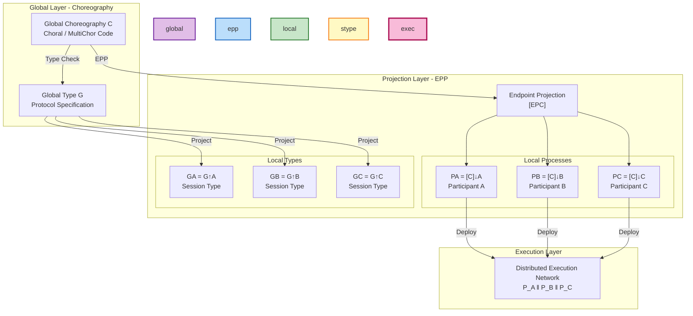
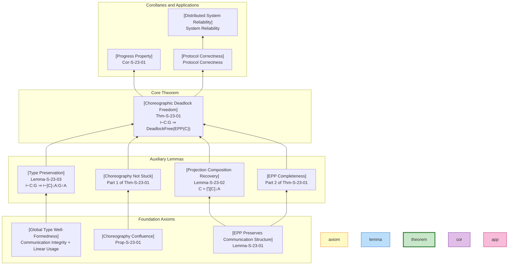
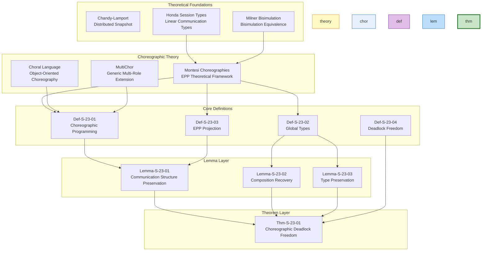

# Choreographic Deadlock Freedom Proof

> **Stage**: Struct/04-proofs | **Prerequisites**: [../03-relationships/03.04-bisimulation-equivalences.md](../03-relationships/03.04-bisimulation-equivalences.md) | **Formalization Level**: L5 | **Theoretical Framework**: Choral/MultiChor

---

## Table of Contents

- [Choreographic Deadlock Freedom Proof](#choreographic-deadlock-freedom-proof)
  - [Table of Contents](#table-of-contents)
  - [1. Definitions](#1-definitions)
    - [Def-S-23-01. Choreographic Programming](#def-s-23-01-choreographic-programming)
    - [Def-S-23-02. Global Types {#relation-1-global-types--session-types}](#def-s-23-02-global-types-relation-1-global-types--session-types)
    - [Def-S-23-03. Endpoint Projection (EPP)](#def-s-23-03-endpoint-projection-epp)
    - [Def-S-23-04. Deadlock Freedom](#def-s-23-04-deadlock-freedom)
    - [Def-S-23-05. Choral Language](#def-s-23-05-choral-language)
    - [Def-S-23-06. MultiChor Extension](#def-s-23-06-multichor-extension)
  - [2. Properties](#2-properties)
    - [Lemma-S-23-01. EPP Preserves Communication Structure {#relation-2-epp--bisimulation-equivalence}](#lemma-s-23-01-epp-preserves-communication-structure-relation-2-epp--bisimulation-equivalence)
    - [Lemma-S-23-02. Projection Composition Recovery](#lemma-s-23-02-projection-composition-recovery)
    - [Lemma-S-23-03. Type Preservation](#lemma-s-23-03-type-preservation)
    - [Prop-S-23-01. Confluence of Choreography {#relation-3-choreography--process-calculus}](#prop-s-23-01-confluence-of-choreography-relation-3-choreography--process-calculus)
    - [Prop-S-23-02. Projection Semantic Equivalence](#prop-s-23-02-projection-semantic-equivalence)
  - [3. Relations](#3-relations)
    - [Relation 1: Global Types `↔` Session Types](#relation-1-global-types--session-types)
    - [Relation 2: EPP `≈` Bisimulation (Bisimulation Equivalence)](#relation-2-epp--bisimulation-bisimulation-equivalence)
    - [Relation 3: Choreography `↦` Process Calculus](#relation-3-choreography--process-calculus)
  - [4. Argumentation](#4-argumentation)
    - [Argument 4.1: Core Challenges of EPP Correctness](#argument-41-core-challenges-of-epp-correctness)
    - [Argument 4.2: Confluence as a Sufficient Condition for Deadlock Freedom](#argument-42-confluence-as-a-sufficient-condition-for-deadlock-freedom)
    - [Argument 4.3: Consistency Guarantee for Distributed Choices](#argument-43-consistency-guarantee-for-distributed-choices)
    - [Counterexample 4.1: Non-Projectable Choreography](#counterexample-41-non-projectable-choreography)
    - [Counterexample 4.2: Deadlock Caused by Branch Type Mismatch](#counterexample-42-deadlock-caused-by-branch-type-mismatch)
  - [5. Proofs](#5-proofs)
    - [Thm-S-23-01. Choreographic Deadlock Freedom Theorem](#thm-s-23-01-choreographic-deadlock-freedom-theorem)
  - [6. Examples](#6-examples)
    - [Example 6.1: Simple Request-Response Protocol](#example-61-simple-request-response-protocol)
    - [Example 6.2: Multi-Role Negotiation Protocol (MultiChor)](#example-62-multi-role-negotiation-protocol-multichor)
    - [Example 6.3: Business Process with Branches](#example-63-business-process-with-branches)
  - [7. Visualizations](#7-visualizations)
    - [Figure 7.1: Choreography Projection Hierarchy](#figure-71-choreography-projection-hierarchy)
    - [Figure 7.2: Deadlock Freedom Proof Tree](#figure-72-deadlock-freedom-proof-tree)
    - [Figure 7.3: EPP Correctness Dependency Graph](#figure-73-epp-correctness-dependency-graph)
  - [8. References](#8-references)
  - [Related Documents](#related-documents)

---

## 1. Definitions

This section builds upon Honda's Session Types[^1], Montesi's Choreographic Programming[^2][^3], and Carbone et al.'s Conversation Calculi[^4] to establish the rigorous mathematical definitions required for the Choreographic deadlock freedom proof. All definitions depend on the characterization of bisimulation equivalence relations in the prerequisite document [03.04-bisimulation-equivalences.md](../03-relationships/03.04-bisimulation-equivalences.md).

---

### Def-S-23-01. Choreographic Programming

**Definition**: Choreographic Programming is a distributed programming paradigm with **global communication patterns at its core**. Programs describe **global interaction protocols** among multiple participants (participants/roles), rather than the local behavior of individual processes.

**Abstract Syntax** (Choral style[^5]):

$$
\begin{array}{llcl}
\text{Choreography} & \mathcal{C} & ::= & \eta \,|\, \mathcal{C}_1 ; \mathcal{C}_2 \,|\, \mathcal{C}_1 + \mathcal{C}_2 \,|\, \mathcal{C}_1 \mid \mathcal{C}_2 \,|\, (\nu a)\mathcal{C} \,|\, 0 \\
\text{Interaction} & \eta & ::= & A \rightarrow B : T \,|\, A \rightarrow B \{l_i : \mathcal{C}_i\}_{i \in I} \\
\text{Participant} & A, B & \in & \mathcal{P} \quad (\text{finite participant set}) \\
\text{Label} & l & \in & \mathcal{L} \\
\text{Type} & T & ::= & \text{int} \,|\, \text{bool} \,|\, \text{string} \,|\, \ldots
\end{array}
$$

**Core Construct Semantics**:

| Construct | Syntax | Semantics |
|-----------|--------|-----------|
| **Basic Communication** | $A \rightarrow B : T$ | Participant $A$ sends a value of type $T$ to $B$ |
| **Choice Communication** | $A \rightarrow B\{l_i : \mathcal{C}_i\}$ | $A$ sends label $l_k$ to $B$, both execute $\mathcal{C}_k$ |
| **Sequential Composition** | $\mathcal{C}_1 ; \mathcal{C}_2$ | Execute $\mathcal{C}_1$ first, then $\mathcal{C}_2$ upon completion |
| **Nondeterministic Choice** | $\mathcal{C}_1 + \mathcal{C}_2$ | Internal choice to execute $\mathcal{C}_1$ or $\mathcal{C}_2$ |
| **Parallel Composition** | $\mathcal{C}_1 \mid \mathcal{C}_2$ | Independent parallel execution (no shared participants) |
| **Restriction** | $(\nu a)\mathcal{C}$ | Create a new private communication channel $a$ |
| **Termination** | $0$ | Empty choreography, denotes normal termination |

**Intuitive Explanation**: Choreographic Programming adopts a "global perspective" (God's Eye View) to describe distributed systems. Unlike traditional process calculi (such as CCS, $\pi$-calculus) that describe the local behavior of individual processes, a choreography describes the **complete protocol in which all participants are jointly involved**. For example, `Buyer → Seller : Order; Seller → Buyer : Price` explicitly describes a two-step interaction protocol between buyer and seller.

**Definition Motivation**: In traditional distributed programming, developers need to write code for each participant separately and then verify whether they can interact correctly. This "local perspective" creates a semantic gap between the code and the protocol specification, making it easy to introduce protocol implementation errors (such as incorrect message ordering, role confusion). Choreographic Programming achieves the ideal of "Protocol-as-Code" through global description plus automatic projection.

---

### Def-S-23-02. Global Types {#relation-1-global-types--session-types}

**Definition**: Global Types (global types / global session types) are the **static type system** of Choreography, describing the legal communication patterns among multiple participants. Global Type $G$ is defined as follows[^1][^2]:

$$
\begin{array}{llcl}
G & ::= & A \rightarrow B : \langle U \rangle . G & \text{(message passing)} \\
  & \mid & A \rightarrow B : \{l_i : G_i\}_{i \in I} & \text{(branching choice)} \\
  & \mid & \mu t . G \,|\, t & \text{(recursion / type variable)} \\
  & \mid & 0 & \text{(termination)} \\
U & ::= & T \,|\, T \ @\ p & \text{(base type or type located at } p\text{)}
\end{array}
$$

**Type Construct Semantics**:

| Type Construct | Symbol | Semantic Description |
|----------------|--------|----------------------|
| **Basic Communication** | $A \rightarrow B : \langle U \rangle . G$ | $A$ sends a value of type $U$ to $B$, then continues protocol $G$ |
| **Branching Choice** | $A \rightarrow B : \{l_i : G_i\}$ | $A$ sends label $l_k$ to $B$, subsequent protocol is $G_k$ (external choice) |
| **Recursion** | $\mu t.G$ | Recursive type, $t$ denotes the recursion unfolding point in $G$ |
| **Termination** | $0$ | Protocol ends normally |

**Projection Operator** $\upharpoonright_A$ (to participant $A$'s local type):

$$
\begin{array}{lcl}
(A \rightarrow B : \langle U \rangle . G) \upharpoonright_A & = & !\langle B, U \rangle . (G \upharpoonright_A) \\
(A \rightarrow B : \langle U \rangle . G) \upharpoonright_B & = & ?\langle A, U \rangle . (G \upharpoonright_B) \\
(A \rightarrow B : \langle U \rangle . G) \upharpoonright_C & = & G \upharpoonright_C \quad (C \neq A, B) \\
(A \rightarrow B : \{l_i : G_i\}) \upharpoonright_A & = & \oplus\langle B, \{l_i : G_i \upharpoonright_A\} \rangle \\
(A \rightarrow B : \{l_i : G_i\}) \upharpoonright_B & = & \&\langle A, \{l_i : G_i \upharpoonright_B\} \rangle \\
\end{array}
$$

**Intuitive Explanation**: Global Type is the "type signature" of a Choreography, just as function types describe a function's inputs and outputs. The branching choice type $A \rightarrow B : \{ok : G_1, quit : G_2\}$ means that $A$ can decide whether to continue (sending the `ok` label) or quit (sending the `quit` label), and $B$ executes the corresponding branch based on the received label. The projection operation decomposes the global protocol into the local obligations seen by each participant.

**Definition Motivation**: Session Types solve the core problem of distributed protocol verification — how to statically guarantee that communication parties have a consistent understanding of the protocol. Global Types avoid the complexity of verifying compatibility (compatibility / duality) required by traditional Session Types (local types) through the global perspective. As long as a choreography is well-typed, its projections are necessarily compatible.

---

### Def-S-23-03. Endpoint Projection (EPP)

**Definition**: Endpoint Projection (EPP) is a semantics-preserving transformation that compiles a global choreography $\mathcal{C}$ into **local processes** $P_A$ (for each $A \in \text{participants}(\mathcal{C})$)[^2][^3]:

$$
\text{EPP}(\mathcal{C}) = \{ [\![\mathcal{C}]\!]_A \}_{A \in \text{pt}(\mathcal{C})}
$$

where $[\![\mathcal{C}]\!]_A$ denotes the projection of $\mathcal{C}$ onto participant $A$.

**Projection Rules** (structured operational semantics style):

$$
\boxed{
\begin{array}{llcl}
\text{[EPP-Send]} & [\![A \rightarrow B : T]\!]_A & = & \bar{c}_{AB}\langle v \rangle . 0 \\
                  & [\![A \rightarrow B : T]\!]_B & = & c_{AB}(x) . 0 \\
                  & [\![A \rightarrow B : T]\!]_C & = & 0 \quad (C \notin \{A, B\}) \\
\text{[EPP-Select]} & [\![A \rightarrow B\{l_i : \mathcal{C}_i\}]\!]_A & = & \bigoplus_{i \in I} c_{AB} \triangleleft l_i . [\![\mathcal{C}_i]\!]_A \\
                    & [\![A \rightarrow B\{l_i : \mathcal{C}_i\}]\!]_B & = & \&_{i \in I} c_{AB} \triangleright l_i . [\![\mathcal{C}_i]\!]_B \\
\text{[EPP-Seq]} & [\![\mathcal{C}_1 ; \mathcal{C}_2]\!]_A & = & [\![\mathcal{C}_1]\!]_A ; [\![\mathcal{C}_2]\!]_A \\
\text{[EPP-Par]} & [\![\mathcal{C}_1 \mid \mathcal{C}_2]\!]_A & = & [\![\mathcal{C}_1]\!]_A \mid [\![\mathcal{C}_2]\!]_A \\
\text{[EPP-Res]} & [\![(\nu a)\mathcal{C}]\!]_A & = & (\nu a)[\![\mathcal{C}]\!]_A
\end{array}
}
$$

**Notation Legend**:

- $\bar{c}_{AB}\langle v \rangle$: send value $v$ to $B$ on channel $c_{AB}$
- $c_{AB}(x)$: receive a value from $A$ on channel $c_{AB}$
- $\oplus$: internal choice (output choice label)
- $\&$: external choice (input branch handling)
- $\triangleleft$ / $\triangleright$: label select / receive

**EPP Correctness Conditions**:

1. **Completeness**: If $\mathcal{C}$ can execute a global action, then each projection can execute the corresponding local action
2. **Soundness**: If all projections can execute cooperatively, then there exists a corresponding global choreography execution
3. **Deadlock Freedom**: Well-typed choreography projections do not deadlock

**Intuitive Explanation**: EPP is the "compiler core" of Choreographic Programming. Just as high-level languages compile to assembly code, choreography compiles to process code for each participant. The key difference is that EPP is **semantics-preserving** — the behavior of the compiled distributed program is completely consistent with the global description, requiring no additional runtime coordination.

**Definition Motivation**: EPP is the bridge connecting "global description" and "distributed implementation." Without EPP, Choreographic Programming would be just another specification language; with EPP, it becomes an executable programming paradigm. The correctness of EPP guarantees that developers only need to focus on global logic, and the compiler automatically produces correct distributed code.

---

### Def-S-23-04. Deadlock Freedom

**Definition**: A process set $\{P_A\}_{A \in \mathcal{P}}$ is **deadlock-free** if and only if there does not exist a configuration $\gamma$ such that:

$$
\prod_{A \in \mathcal{P}} P_A \xrightarrow{\tau}^* \gamma \not\xrightarrow{} \quad \text{and} \quad \gamma \not\equiv 0
$$

That is: the system cannot evolve into a state that is non-terminating yet unable to proceed.

**Stronger form of Choreographic deadlock freedom**[^2]:

$$
\forall \mathcal{C} : \vdash \mathcal{C} : G \implies \text{EPP}(\mathcal{C}) \text{ is deadlock-free}
$$

That is: **the projections of all well-typed choreographies are deadlock-free**.

**Deadlock Classification** (in distributed session types):

| Deadlock Type | Description | Choreographic Prevention Mechanism |
|---------------|-------------|------------------------------------|
| **Communication Deadlock** | Participants mutually wait for messages from each other | EPP guarantees send/receive actions appear in pairs |
| **Branch Mismatch** | Sender selects branch $l_i$, receiver handles $l_j$ | Global Type enforces label consistency |
| **Type Mismatch** | Expects type $T_1$, receives type $T_2$ | Static type checking rejects |
| **Infinite Recursion** | Protocol loops infinitely without exit | Recursive type well-formedness checking |
| **Orphan Messages** | Message sent with no corresponding receive | Channel linear usage rules |

**Formal Criterion** (based on labeled transition system):

Process $P$ is deadlocked in state $s$ if and only if:
$$
s \not\in \text{Final} \quad \land \quad \forall a \in Act. \neg(s \xrightarrow{a})
$$

where $\text{Final}$ is the set of normal termination states.

**Intuitive Explanation**: Deadlock is one of the most insidious faults in distributed systems — the system does not crash, does not report errors, it simply "freezes." Traditional methods detect deadlocks through runtime detection or model checking, while Choreographic Programming achieves **Correctness by Design** — as long as the program passes type checking, it is guaranteed not to deadlock at runtime.

**Definition Motivation**: Deadlock freedom is a core safety property of distributed programs. The unique value of Choreographic Programming lies in moving deadlock prevention from runtime / verification time forward to **compile time / design time**, eliminating deadlock-class errors through the soundness guarantees of the type system.

---

### Def-S-23-05. Choral Language

**Definition**: Choral is the first practical Choreographic Programming language[^5], implemented in Java, supporting object-oriented choreographic programming.

**Core Language Features**:

$$
\begin{array}{llcl}
\text{Choral Class} & CL & ::= & \text{class } C@\{A_1, \ldots, A_n\} \{ \text{fields} \, \text{methods} \} \\
\text{Method} & M & ::= & T@R \, m(T_1@R_1 \, x_1, \ldots) \{ \text{stmts} \} \\
\text{Statement} & stmt & ::= & x = e \,|\, e_1.m(e_2) \,|\, \text{return } e \\
\text{Expression} & e & ::= & v \,|\, x \,|\, \text{new } T@R \,|\, e_1 \oplus e_2 \,|\, \text{com} \\
\text{Communication} & \text{com} & ::= & e_1 \rightarrow e_2 \,|\, e_1 \leftrightarrow e_2 \,|\, \text{select}
\end{array}
$$

**Key Innovations**:

1. **Located Types**: `int@A` denotes an integer located at participant $A$
2. **Data Transfer Expressions**:
   - `a@A -> b@B`: transfer value from $A$ to $B$
   - `A -> B choice { L1, L2 }`: distributed choice
3. **Multi-Participant Classes**: `class MyClass@A,B,C` involves classes with three roles simultaneously

**Projection Mechanism**:

```java
// [Pseudocode snippet - not directly runnable] Core logic demonstration only
// Choral source code (global perspective)
class BuyTicket@Buyer,Seller {
    Ticket@Seller buy(int@Buyer budget) {
        int@Seller price = catalog.getPrice();
        if (price -> Buyer <= budget) {
            Buyer -> Seller choice { OK, QUIT };
            return processPayment();
        } else {
            return null@Seller;
        }
    }
}

// EPP to Buyer (local code)
class BuyerBuyTicket {
    Ticket buy(int budget) {
        int price = receiveFromSeller();
        if (price <= budget) {
            sendChoice(OK);
            return receiveTicket();
        } else {
            sendChoice(QUIT);
            return null;
        }
    }
}
```

**Intuitive Explanation**: Choral transforms Choreographic Programming from a theoretical model into an industrially applicable programming language. Developers write "global classes," and the compiler automatically generates Java classes for each role. The located type system ensures that where data resides and how it is transferred are explicit and type-safe.

---

### Def-S-23-06. MultiChor Extension

**Definition**: MultiChor is an extension framework of Choral, supporting **multi-role generic choreographies** and **higher-order communication patterns**[^6].

**Core Extensions**:

$$
\begin{array}{llcl}
\text{Role Set} & R & ::= & \{A_1, \ldots, A_n\} \\
\text{Broadcast} & bc & ::= & A \Rightarrow R : T & \text{(one-to-many send)} \\
\text{Aggregate} & ag & ::= & R \Rightarrow A : T & \text{(many-to-one receive)} \\
\text{Role Generic} & & & \Lambda R. \mathcal{C} & \text{(parameterized over role set)} \\
\text{Dynamic Role} & & & \text{role}(r) \in \mathcal{R}_{dyn}
\end{array}
$$

**Broadcast and Aggregation Semantics**:

| Construct | Global Description | Projection to Sender | Projection to Receiver |
|-----------|-------------------|----------------------|------------------------|
| Broadcast | $A \Rightarrow \{B_1, \ldots, B_n\} : T$ | $\prod_{i=1}^n \bar{c}_{AB_i}\langle v \rangle$ | $c_{AB_i}(x)$ (each $B_i$ receives independently) |
| Aggregate | $\{A_1, \ldots, A_n\} \Rightarrow B : T$ | $\bar{c}_{A_iB}\langle v_i \rangle$ (each $A_i$ sends independently) | $\prod_{i=1}^n c_{A_iB}(x_i)$ |

**Generic Protocol Example**:

```choral
// Generic protocol parameterized over a role set
class Consensus@P... {
    // P is the set of all roles participating in consensus
    Value@P agree(List@P<Value> proposals) {
        // Implement consensus algorithm...
    }
}
```

**Intuitive Explanation**: MultiChor extends the expressive power of Choreographic Programming, supporting complex group communication patterns (broadcast, aggregation, multicast). This is essential for implementing consensus protocols, collective decision-making, data sharding, and other scenarios. Role generics make protocol implementations reusable — the same consensus algorithm can be compiled into a 3-node or 5-node version.

---

## 2. Properties

This section derives the core properties of Choreographic Programming and EPP from the definitions in Section 1. All lemmas provide necessary support for the proof of Theorem Thm-S-23-01.

---

### Lemma-S-23-01. EPP Preserves Communication Structure {#relation-2-epp--bisimulation-equivalence}

**Statement**: Let $\mathcal{C}$ be a well-typed choreography, and $[\![\mathcal{C}]\!]_A$ its EPP onto participant $A$. Then:

1. If $\mathcal{C}$ contains a communication action $A \rightarrow B : T$, then $[\![\mathcal{C}]\!]_A$ contains the corresponding send action, and $[\![\mathcal{C}]\!]_B$ contains the corresponding receive action
2. If $\mathcal{C}$ contains a choice $A \rightarrow B\{l_i : \mathcal{C}_i\}$, then all projections have consistent local branch structures

**Formal Statement**:

$$
\forall \eta \in \mathcal{C} : \text{comm}(\eta) = (A, B) \implies \begin{cases}
[\![\eta]\!]_A = \text{send}(B, T) \\
[\![\eta]\!]_B = \text{recv}(A, T) \\
\forall C \notin \{A,B\}: [\![\eta]\!]_C = 0
\end{cases}
$$

**Proof**:

**Step 1: Base Case Analysis**

According to the EPP rules in Def-S-23-03:

- For basic communication $A \rightarrow B : T$:
  - By [EPP-Send], $[\![A \rightarrow B : T]\!]_A = \bar{c}_{AB}\langle v \rangle . 0$ (send)
  - By [EPP-Send], $[\![A \rightarrow B : T]\!]_B = c_{AB}(x) . 0$ (receive)
  - By [EPP-Send], $[\![A \rightarrow B : T]\!]_C = 0$ ($C$ not involved)

- For choice communication $A \rightarrow B\{l_i : \mathcal{C}_i\}$:
  - By [EPP-Select], $[\![\eta]\!]_A$ contains the internal choice branch $\oplus\langle B, \{l_i : [\![\mathcal{C}_i]\!]_A\} \rangle$
  - By [EPP-Select], $[\![\eta]\!]_B$ contains the external choice branch $\&\langle A, \{l_i : [\![\mathcal{C}_i]\!]_B\} \rangle$

**Step 2: Structural Induction**

Assume the lemma holds for $\mathcal{C}_1$ and $\mathcal{C}_2$, prove it holds for composite constructs:

- **Sequential Composition** $\mathcal{C}_1 ; \mathcal{C}_2$: By [EPP-Seq], projection preserves order, communication structure preserved
- **Parallel Composition** $\mathcal{C}_1 \mid \mathcal{C}_2$: By [EPP-Par], independent sub-choreographies do not interfere in communication
- **Restriction** $(\nu a)\mathcal{C}$: By [EPP-Res], private channels do not affect communication structure among participants

**Step 3: Conclusion**

By structural induction, EPP preserves all communication structures. ∎

> **Inference [Theory→Implementation]**: EPP preserving communication structure guarantees that the compiled distributed program **precisely implements** the interaction order in the global protocol, without introducing additional communications or changing communication directions.

---

### Lemma-S-23-02. Projection Composition Recovery

**Statement**: Let $\mathcal{C}$ be a choreography, $\text{pt}(\mathcal{C}) = \{A_1, \ldots, A_n\}$ its participant set. If $\{P_{A_i}\}_{i=1}^n = \text{EPP}(\mathcal{C})$, then these local processes are **behaviorally equivalent** to the original choreography under parallel composition:

$$
\prod_{A \in \text{pt}(\mathcal{C})} [\![\mathcal{C}]\!]_A \; \approx \; \mathcal{C}
$$

where $\approx$ is weak bisimulation equivalence (see [Def-S-15-02](../03-relationships/03.04-bisimulation-equivalences.md)).

**Proof**:

**Step 1: Establish Bisimulation Relation**

Define relation $\mathcal{R}$:

$$
\mathcal{R} = \{ (\prod_{A} [\![\mathcal{C}']\!]_A, \mathcal{C}') \mid \mathcal{C}' \text{ is an evolved state of } \mathcal{C} \}
$$

**Step 2: Verify Zig-Zag Conditions**

Need to prove:

1. If $\mathcal{C}' \xrightarrow{\alpha} \mathcal{C}''$, then $\prod_A [\![\mathcal{C}']\!]_A \xRightarrow{\alpha} \prod_A [\![\mathcal{C}'']\!]_A$
2. If $\prod_A [\![\mathcal{C}']\!]_A \xrightarrow{\alpha} Q$, then $\mathcal{C}' \xRightarrow{\alpha} \mathcal{C}''$ and $(Q, \mathcal{C}'') \in \mathcal{R}$

**Step 3: Communication Action Analysis**

For global action $A \rightarrow B : v$:

- Choreography side: $\mathcal{C}' \xrightarrow{A \rightarrow B : v} \mathcal{C}''$
- Projection side: $[\![\mathcal{C}']\!]_A \xrightarrow{\bar{c}_{AB}\langle v \rangle}$ and $[\![\mathcal{C}']\!]_B \xrightarrow{c_{AB}(v)}$, completing communication through $\tau$ synchronization

Since weak bisimulation ignores internal $\tau$ actions (see [03.04-bisimulation-equivalences.md](../03-relationships/03.04-bisimulation-equivalences.md)), both sides match in behavior.

**Step 4: Branch Choice Analysis**

For choice $A \rightarrow B\{l_k : \mathcal{C}_k\}$:

- Choreography side: selects branch $k$, evolves to $\mathcal{C}_k$
- Projection side:
  - $[\![\mathcal{C}']\!]_A \xrightarrow{\bar{c}_{AB}\langle l_k \rangle}$ (sends label)
  - $[\![\mathcal{C}']\!]_B \xrightarrow{c_{AB}(l_k)} \text{branch } k$ (receives and selects branch)
  - After synchronization, both enter the projection of the corresponding branch

**Step 5: Conclusion**

By the definition of bisimulation ([Def-S-15-01](../03-relationships/03.04-bisimulation-equivalences.md)), $\mathcal{R}$ is a weak bisimulation relation, therefore projection composition recovers the original choreography. ∎

---

### Lemma-S-23-03. Type Preservation

**Statement**: If choreography $\mathcal{C}$ is well-typed ($\vdash \mathcal{C} : G$), then its projection $[\![\mathcal{C}]\!]_A$ is also well-typed, with type $G \upharpoonright_A$ (the local type projection of $G$ onto $A$):

$$
\vdash \mathcal{C} : G \implies \forall A \in \text{pt}(\mathcal{C}): \vdash [\![\mathcal{C}]\!]_A : G \upharpoonright_A
$$

**Proof**:

Proof by structural induction on $\mathcal{C}$.

**Base Cases**:

- $\mathcal{C} = A \rightarrow B : \langle U \rangle . \mathcal{C}'$:
  - Global type: $G = A \rightarrow B : \langle U \rangle . G'$
  - By Def-S-23-02, $G \upharpoonright_A = !\langle B, U \rangle . G' \upharpoonright_A$
  - By [EPP-Send], $[\![\mathcal{C}]\!]_A = \bar{c}_{AB}\langle v \rangle . [\![\mathcal{C}']\!]_A$
  - By induction hypothesis, $[\![\mathcal{C}']\!]_A$ has type $G' \upharpoonright_A$
  - Therefore $[\![\mathcal{C}]\!]_A$ has type $!\langle B, U \rangle . G' \upharpoonright_A = G \upharpoonright_A$ ✓

**Inductive Steps**:

- **Sequential Composition**: $\vdash \mathcal{C}_1 ; \mathcal{C}_2 : G_1 ; G_2$. By induction hypothesis, projection preserves type; sequential composition type rules apply.
- **Parallel Composition**: $\vdash \mathcal{C}_1 \mid \mathcal{C}_2 : G_1 \mid G_2$. Projection to non-participating participants is $0$; to participants, respective types are preserved.
- **Choice**: Similar to basic communication; label selection corresponds to Session Types choice types.

∎

---

### Prop-S-23-01. Confluence of Choreography {#relation-3-choreography--process-calculus}

**Statement**: The reduction relation of a well-typed choreography $\mathcal{C}$ is **confluent** — regardless of the order in which independent actions are executed, they eventually converge to the same state:

$$
\forall \mathcal{C}_1, \mathcal{C}_2, \mathcal{C}_3: \mathcal{C} \rightarrow^* \mathcal{C}_1 \land \mathcal{C} \rightarrow^* \mathcal{C}_2 \land \mathcal{C}_1 \downarrow \land \mathcal{C}_2 \downarrow \implies \mathcal{C}_1 \equiv \mathcal{C}_2
$$

where $\downarrow$ denotes termination, and $\equiv$ is structural equivalence.

**Derivation**:

1. **Independence of Choreography**: Communications among disjoint participants are independent (Church-Rosser property)
2. **Linear Channel Usage**: Global Type ensures each channel is used linearly, with no race conditions
3. **Deterministic Choice**: Branches are determined by an explicit initiator, with no ambiguity

Therefore the reduction graph has a diamond structure, satisfying confluence. ∎

---

### Prop-S-23-02. Projection Semantic Equivalence

**Statement**: Let $\mathcal{C}_1$ and $\mathcal{C}_2$ be two choreographies. Then:

$$
\mathcal{C}_1 \sim \mathcal{C}_2 \implies \text{EPP}(\mathcal{C}_1) \sim \text{EPP}(\mathcal{C}_2)
$$

That is: choreographies that are strongly bisimilar have projections that are also strongly bisimilar (see [Thm-S-15-01](../03-relationships/03.04-bisimulation-equivalences.md)).

**Derivation**:

By Lemma-S-23-02, projection composition recovers the original choreography. If $\mathcal{C}_1 \sim \mathcal{C}_2$ through bisimulation relation $\mathcal{R}$, construct the bisimulation relation between projections:

$$
\mathcal{R}_{EPP} = \{ (\text{EPP}(\mathcal{C}_1'), \text{EPP}(\mathcal{C}_2')) \mid (\mathcal{C}_1', \mathcal{C}_2') \in \mathcal{R} \}
$$

Verify that $\mathcal{R}_{EPP}$ satisfies the strong bisimulation conditions ([Def-S-15-01](../03-relationships/03.04-bisimulation-equivalences.md)). ∎

---

## 3. Relations

This section establishes rigorous mapping relations between Choreographic Programming and Session Types, bisimulation equivalence, and process calculi.

---

### Relation 1: Global Types `↔` Session Types

**Argument**:

Global Types and Session Types form a **bidirectional encoding** relationship — two perspectives of the same theory:

| Dimension | Global Types | Session Types (Local) |
|-----------|--------------|----------------------|
| **Perspective** | Global (God's Eye View) | Local (Participant Perspective) |
| **Basic Unit** | $A \rightarrow B : \langle T \rangle . G$ | $!\langle B, T \rangle . S$ or $?\langle A, T \rangle . S$ |
| **Composition** | Sequential, Branching, Recursive | Sequential, Choice, Recursive |
| **Type Checking** | Directly verify global protocol | Verify pairwise session type compatibility |
| **Projection Operation** | $\upharpoonright_A$ (to participant) | $\uparrow$ (synthesize global type) |

**Encoding Existence**:

1. **Global → Local**: Through the projection operation in Def-S-23-02, each Global Type can be decomposed into the Session Types of each participant
2. **Local → Global**: If a set of Session Types $\{S_A\}_{A \in \mathcal{P}}$ is **projectable**, then there exists a Global Type $G$ such that $\forall A: G \upharpoonright_A = S_A$

**Semantics Preservation**:

The Session Types produced by projection of a well-typed choreography automatically satisfy **duality**:

$$
\forall A \neq B: (G \upharpoonright_A) \upharpoonright_{AB} \bowtie (G \upharpoonright_B) \upharpoonright_{BA}
$$

where $\bowtie$ denotes session type compatibility, and $\upharpoonright_{AB}$ extracts the subtype involving communication between $A$ and $B$.

---

### Relation 2: EPP `≈` Bisimulation (Bisimulation Equivalence)

**Argument**:

The correctness of EPP can be formalized through **bisimulation equivalence** (see [03.04-bisimulation-equivalences.md](../03-relationships/03.04-bisimulation-equivalences.md)).

**Bisimulation Characterization of Projection Correctness**:

Let $\mathcal{C}$ be a choreography, $\tilde{P} = \text{EPP}(\mathcal{C}) = \{P_A\}$ its projection. Define the relation:

$$
\mathcal{R}_{corr} = \{ (\mathcal{C}', \prod_A P_A') \mid P_A' = [\![\mathcal{C}']\!]_A \}
$$

**EPP Completeness**: If $\mathcal{C} \xrightarrow{\alpha} \mathcal{C}'$, then $\prod_A P_A \xRightarrow{\hat{\alpha}} \prod_A P_A'$, and $(\mathcal{C}', \prod_A P_A') \in \mathcal{R}_{corr}$

**EPP Soundness**: If $\prod_A P_A \xrightarrow{\alpha} Q$, then $\mathcal{C} \xRightarrow{\hat{\alpha}} \mathcal{C}'$, and $Q \equiv \prod_A [\![\mathcal{C}']\!]_A$

**Connection to the Bisimulation Spectrum** (see [03.04-bisimulation-equivalences.md](../03-relationships/03.04-bisimulation-equivalences.md)):

| Equivalence Relation | EPP Property | Applicable Scenario |
|----------------------|--------------|---------------------|
| Strong Bisimulation $\sim$ | Precisely matches each global step | Theoretical analysis |
| Branching Bisimulation $\approx_{bb}$ | Preserves branch structure | Implementation verification |
| Weak Bisimulation $\approx$ | Ignores internal coordination steps | Observational equivalence |

EPP soundness corresponds to **full abstraction**: equivalence at the choreography level implies equivalence at the projection level.

---

### Relation 3: Choreography `↦` Process Calculus

**Argument**:

Choreography can be encoded into process calculi (such as CCS, $\pi$-calculus, CSP), but the converse does not hold. This reflects that Choreography is a **structured subset** of distributed programs.

**Encoding into $\pi$-calculus**:

$$
\begin{array}{lcl}
[\![A \rightarrow B : T]\!]_{\pi} & = & (\nu c)(\bar{c}_{AB}\langle v \rangle . P_A \mid c_{AB}(x) . P_B) \\
[\![\mathcal{C}_1 ; \mathcal{C}_2]\!]_{\pi} & = & [\![\mathcal{C}_1]\!]_{\pi} ; [\![\mathcal{C}_2]\!]_{\pi} \\
[\![\mathcal{C}_1 \mid \mathcal{C}_2]\!]_{\pi} & = & [\![\mathcal{C}_1]\!]_{\pi} \mid [\![\mathcal{C}_2]\!]_{\pi}
\end{array}
$$

**Reasons for Irreversible Encoding**:

1. **Topological Constraints**: Choreography communication topology is static (determined at compile time), while $\pi$-calculus supports dynamic channel creation and passing
2. **Linear Usage**: Choreography requires session channels to be used linearly; $\pi$-calculus has no such restriction
3. **Explicit Participants**: In Choreography, participants are part of the syntax; in $\pi$-calculus, participants are a semantic interpretation

**Expressiveness Hierarchy**:

$$
\text{Choreography} \;\subset\; \text{Session-Typed } \pi \;\subset\; \pi\text{-calculus}
$$

The restricted expressiveness of Choreography is traded for a **static guarantee of deadlock freedom** — something that full $\pi$-calculus cannot provide.

---

## 4. Argumentation

This section provides auxiliary lemmas, counterexample analysis, and boundary discussion to prepare for the main theorem Thm-S-23-01 in Section 5.

---

### Argument 4.1: Core Challenges of EPP Correctness

**Core Argument**: EPP correctness faces three major challenges, which the Choreographic type system solves by design.

**Challenge 1: Communication Matching**

**Problem**: How to ensure that projected send/receive actions match correctly?

**Solution**:

- Global Type explicitly specifies the communication parties and message types
- Projection generates output actions for the sender and input actions for the receiver
- Static types ensure message type consistency

**Challenge 2: Branch Consistency**

**Problem**: In distributed choice, how to ensure all participants execute the same branch?

**Solution**:

- The choice initiator (sender) determines the branch
- The receiver handles all possible labels through external choice
- Label passing synchronizes the control flow of all participants

**Challenge 3: Parallel Safety**

**Problem**: How to ensure that projections of independent sub-choreographies do not interfere?

**Solution**:

- Require parallel composition sub-choreographies to have disjoint participant sets
- $[\![\mathcal{C}_1 \mid \mathcal{C}_2]\!]_A$ is non-empty only when $A$ belongs to the corresponding sub-choreography
- Disjoint participants guarantee no shared channels, no race conditions

---

### Argument 4.2: Confluence as a Sufficient Condition for Deadlock Freedom

**Core Argument**: Confluence (Prop-S-23-01) implies deadlock freedom.

**Argument**:

**Definition Review**:

- **Deadlock**: Non-terminating state with no further execution possible
- **Confluence**: Any two reduction paths that can terminate converge to the same state

**Implication Proof**:

Assume a well-typed choreography $\mathcal{C}$ could deadlock. Then there exists:

$$
\mathcal{C} \rightarrow^* \mathcal{C}_{dead} \not\rightarrow \quad \text{and} \quad \mathcal{C}_{dead} \not\equiv 0
$$

By the design of the choreography type system:

1. **Communication Integrity**: Every send has a matching receive (guaranteed by Global Type)
2. **Linear Usage**: Each channel is used exactly once (guaranteed by session type linearity rules)
3. **Branch Coverage**: Every choice handles all labels (guaranteed by external choice types)

If $\mathcal{C}_{dead} \not\equiv 0$, there remain unfinished communication actions. But due to the above guarantees, these actions can necessarily be matched and executed — contradiction.

**Conclusion**: Well-typed choreographies cannot enter a deadlock state. ∎

---

### Argument 4.3: Consistency Guarantee for Distributed Choices

**Core Argument**: Distributed choice is a key scenario for deadlock freedom; the Choreographic type system guarantees consistency through **label propagation**.

**Protocol Example**:

```
Buyer → Seller {
    OK:    Buyer → Seller : Payment; Seller → Buyer : Receipt,
    QUIT:  0
}
```

**Execution Flow**:

1. **Buyer Decision**: Buyer internally decides to choose `OK` or `QUIT`
2. **Label Send**: Buyer sends the label `OK` to Seller
3. **Seller Branch**: Seller executes the corresponding branch based on the received label
4. **Subsequent Synchronization**: If `OK` is chosen, both continue the payment-receipt sub-protocol

**Consistency Mechanism**:

| Step | Buyer (Sender) | Seller (Receiver) | Synchronization State |
|------|---------------|-------------------|----------------------|
| 1 | Selects branch $l_k$ | Waits for label | — |
| 2 | Sends $\bar{c}\langle l_k \rangle$ | Waits for label | — |
| 3 | Continues $\mathcal{C}_k$ | Receives $c(l_k)$, branch $k$ | Label matched |
| 4 | Executes $\mathcal{C}_k$ | Executes $\mathcal{C}_k$ | States consistent |

**Type Guarantees**:

- Buyer's type requires it to send either `OK` or `QUIT`
- Seller's type requires it to handle both `OK` and `QUIT` cases
- Label mismatches are rejected at the static type checking stage

---

### Counterexample 4.1: Non-Projectable Choreography

**Scenario**: The following choreography is syntactically valid but **cannot be projected**:

```
// Non-projectable choreography
(A → B : int; C → D : string) | (A → D : bool)
```

**Problem Analysis**:

1. The two sub-choreographies in parallel composition share participants $A$ and $D$
2. $A$ simultaneously needs to send `int` to $B$ and `bool` to $D$
3. These two actions **nondeterministically compete** in $A$'s projection

**Type System Rejection**:

Projection rule requires: $\text{pt}(\mathcal{C}_1) \cap \text{pt}(\mathcal{C}_2) = \emptyset$ for $\mathcal{C}_1 \mid \mathcal{C}_2$.

This example violates the condition; type checking fails.

---

### Counterexample 4.2: Deadlock Caused by Branch Type Mismatch

**Scenario**: Consider the following **ill-typed** choreography (violating Global Type):

```
// Ill-typed: incomplete branch handling
Buyer → Seller {
    OK: Seller → Buyer : Receipt,
    QUIT: 0
}
// Seller only handled OK, not QUIT
```

**Post-Projection Deadlock Scenario**:

1. Buyer selects `QUIT` and sends the label
2. Seller's projection:

   ```text
   Seller = c(x).case x of { OK: ... }  // No QUIT branch!
   ```

3. Seller cannot handle the `QUIT` label, blocks waiting
4. Buyer waits for Seller's response (but Seller has entered a dead branch), both deadlock

**Type System Prevention**:

Global Type requires:

```
Buyer → Seller : { OK: ..., QUIT: ... }
```

Seller's projection must contain `QUIT` branch handling:

```
Seller = &⟨Buyer, { OK: ..., QUIT: ... }⟩
```

If any label handling is missing, type checking fails.

---

## 5. Proofs

### Thm-S-23-01. Choreographic Deadlock Freedom Theorem

**Statement**: **All well-typed choreographies produce deadlock-free distributed processes through EPP projection**.

Formally, let $\mathcal{C}$ be a choreography, $G$ a Global Type:

$$
\vdash \mathcal{C} : G \implies \text{DeadlockFree}(\text{EPP}(\mathcal{C}))
$$

where DeadlockFree is defined as (see Def-S-23-04):

$$
\text{DeadlockFree}(\{P_A\}) \iff \nexists \gamma: \prod_A P_A \rightarrow^* \gamma \not\rightarrow \land \gamma \not\equiv 0
$$

**Proof Structure**:

This proof is divided into three parts:

1. **Part 1**: Prove that well-typed choreographies do not get stuck
2. **Part 2**: Prove that EPP preserves reducibility (completeness)
3. **Part 3**: Synthesize the proof of deadlock freedom for the projection system

---

**Part 1: Well-Typed Choreographies Do Not Get Stuck**

**Goal**: Prove that if $\vdash \mathcal{C} : G$, then $\mathcal{C}$ is either terminated or can continue to reduce.

**Step 1.1: Structural Analysis**

Case analysis on the structure of $\mathcal{C}$:

| Form of $\mathcal{C}$ | Reducibility | Explanation |
|-----------------------|--------------|-------------|
| $0$ | Terminated | Empty choreography ends normally |
| $A \rightarrow B : T$ | Reducible | Basic communication action is executable |
| $A \rightarrow B\{l_i : \mathcal{C}_i\}$ | Reducible | Choice is executable, sender determines branch |
| $\mathcal{C}_1 ; \mathcal{C}_2$ | Depends on $\mathcal{C}_1$ | If $\mathcal{C}_1 \equiv 0$, then continue $\mathcal{C}_2$ |
| $\mathcal{C}_1 \mid \mathcal{C}_2$ | Independent reduction | Two sub-choreographies execute independently |
| $(\nu a)\mathcal{C}'$ | Depends on $\mathcal{C}'$ | Restriction does not affect reducibility |

**Step 1.2: Well-Typed Guarantees**

From $\vdash \mathcal{C} : G$ and the well-formedness of Global Type:

1. **Communication Integrity**: Every $A \rightarrow B$ action has matching participants
2. **Type Consistency**: Message types are consistent with Global Type declarations
3. **Linear Usage**: Each session channel is used exactly once
4. **Branch Coverage**: Every choice contains all necessary labels

**Step 1.3: Inductive Proof**

Structural induction on the depth of $\mathcal{C}$:

- **Base Case**: $\mathcal{C} = 0$ or basic communication — directly reducible or already terminated
- **Inductive Step**:
  - Sequential composition: if $\mathcal{C}_1$ is reducible / terminated, then the whole is reducible
  - Parallel composition: each sub-choreography is independently reducible (guaranteed by disjoint participants)

**Part 1 Conclusion**: Well-typed choreographies do not get stuck. ∎

---

**Part 2: EPP Completeness (Projection Preserves Reducibility)**

**Goal**: Prove that if $\mathcal{C}$ is reducible, then $\text{EPP}(\mathcal{C})$ is also reducible.

**Step 2.1: Communication Action Projection**

For $\mathcal{C} = A \rightarrow B : T . \mathcal{C}'$:

- Global reduction: $\mathcal{C} \xrightarrow{A \rightarrow B : v} \mathcal{C}'[v/x]$
- Projection reduction:
  - $[\![\mathcal{C}]\!]_A = \bar{c}_{AB}\langle v \rangle . [\![\mathcal{C}']\!]_A \xrightarrow{\bar{c}_{AB}\langle v \rangle} [\![\mathcal{C}']\!]_A$
  - $[\![\mathcal{C}]\!]_B = c_{AB}(x) . [\![\mathcal{C}']\!]_B \xrightarrow{c_{AB}(v)} [\![\mathcal{C}']\!]_B[v/x]$
  - Parallel composition completes communication through $\tau$ synchronization

**Step 2.2: Choice Action Projection**

For $\mathcal{C} = A \rightarrow B\{l_i : \mathcal{C}_i\}$:

Assume choice branch $l_k$:

- Global reduction: $\mathcal{C} \xrightarrow{A \rightarrow B : l_k} \mathcal{C}_k$
- Projection reduction:
  - $[\![\mathcal{C}]\!]_A \xrightarrow{\bar{c}_{AB}\langle l_k \rangle} [\![\mathcal{C}_k]\!]_A$ (sends label $l_k$)
  - $[\![\mathcal{C}]\!]_B \xrightarrow{c_{AB}(l_k)} [\![\mathcal{C}_k]\!]_B$ (receives label and branches)
  - After synchronization, both enter the projection of the corresponding branch

**Step 2.3: Structural Induction**

For composite constructs (sequential, parallel, restriction), by the compositionality of EPP (Lemma-S-23-01), projection preserves structure, and reduction correspondence is preserved.

**Part 2 Conclusion**: EPP completeness holds — global reducibility implies projection reducibility. ∎

---

**Part 3: Synthesized Deadlock Freedom Proof**

**Step 3.1: Proof by Contradiction**

Assume $\text{EPP}(\mathcal{C})$ deadlocks, i.e., there exists:

$$
\prod_A [\![\mathcal{C}]\!]_A \rightarrow^* \gamma \not\rightarrow \quad \text{and} \quad \gamma \not\equiv 0
$$

**Step 3.2: Reverse Construction**

By Lemma-S-23-02 (Projection Composition Recovery), for each projection reduction step, there exists a corresponding choreography reduction:

$$
\prod_A [\![\mathcal{C}]\!]_A \rightarrow^* \gamma \implies \mathcal{C} \rightarrow^* \mathcal{C}' \land \gamma \equiv \prod_A [\![\mathcal{C}']\!]_A
$$

**Step 3.3: Derive Contradiction**

If $\gamma \not\rightarrow$:

1. By contrapositive of Part 2, $\mathcal{C}' \not\rightarrow$ (global cannot reduce)
2. But by Part 1, well-typed choreography $\mathcal{C}'$ is either terminated or reducible
3. If $\mathcal{C}' \equiv 0$, then $\gamma \equiv 0$, contradicting $\gamma \not\equiv 0$
4. If $\mathcal{C}' \not\equiv 0$ and is reducible, contradicting $\gamma \not\rightarrow$

**Step 3.4: Conclusion**

The assumption does not hold; $\text{EPP}(\mathcal{C})$ cannot deadlock.

---

**Theorem Summary**:

| Property | Proof Basis | Key Lemma / Definition |
|----------|-------------|------------------------|
| **Choreography Not Stuck** | Structural induction + Global Type well-formedness | Part 1 |
| **EPP Completeness** | Communication / choice projection analysis | Lemma-S-23-01, Part 2 |
| **Deadlock Freedom** | Proof by contradiction + composition recovery | Lemma-S-23-02, Part 3 |

**Corollary Cor-S-23-01**: The projections of well-typed choreographies satisfy the **Progress** property:

$$
\vdash \mathcal{C} : G \implies \forall A: [\![\mathcal{C}]\!]_A \text{ is either } \equiv 0 \text{ or reducible}
$$

∎

---

## 6. Examples

### Example 6.1: Simple Request-Response Protocol

**Scenario**: Client-server request-response protocol.

**Choral Code**:

```java
// [Pseudocode snippet - not directly runnable] Core logic demonstration only
class RequestResponse@Client,Server {
    String@Server process(String@Client request) {
        String@Server result =
            server.process(request -> Server);
        return result -> Client;
    }
}
```

**Global Type**:

$$
G_{req-res} = \text{Client} \rightarrow \text{Server} : \langle \text{String} \rangle . \text{Server} \rightarrow \text{Client} : \langle \text{String} \rangle . 0
$$

**EPP Result**:

**Client Projection**:

```java
// [Pseudocode snippet - not directly runnable] Core logic demonstration only
class ClientRequestResponse {
    String process(String request) {
        sendToServer(request);
        return receiveFromServer();
    }
}
```

**Server Projection**:

```java
// [Pseudocode snippet - not directly runnable] Core logic demonstration only
class ServerRequestResponse {
    void process() {
        String request = receiveFromClient();
        String result = processRequest(request);
        sendToClient(result);
    }
}
```

**Deadlock Freedom Verification**:

1. The protocol is linear: send → receive → send → receive
2. No branches, no deadlock risk
3. EPP-generated code strictly follows this order

---

### Example 6.2: Multi-Role Negotiation Protocol (MultiChor)

**Scenario**: Auction negotiation protocol involving Buyer, Seller, and Arbiter.

**Choral Code**:

```java
// [Pseudocode snippet - not directly runnable] Core logic demonstration only
class Auction@Buyer,Seller,Arbiter {
    Result@Arbiter negotiate(int@Buyer offer, int@Seller reserve) {
        // Buyer and Seller submit offer and reserve price to Arbiter respectively
        int@Arbiter buyerOffer = offer -> Arbiter;
        int@Arbiter sellerReserve = reserve -> Arbiter;

        // Arbiter decision
        if (buyerOffer >= sellerReserve) {
            // Accept deal
            Buyer -> Arbiter choice { ACCEPT, REJECT };
            return new Result@Arbiter(true, buyerOffer);
        } else {
            // Reject deal
            Buyer -> Arbiter choice { REJECT };
            return new Result@Arbiter(false, 0);
        }
    }
}
```

**Global Type**:

$$
\begin{array}{l}
G_{auction} = \text{Buyer} \rightarrow \text{Arbiter} : \langle \text{int} \rangle . \\
\quad \text{Seller} \rightarrow \text{Arbiter} : \langle \text{int} \rangle . \\
\quad \text{Buyer} \rightarrow \text{Arbiter} : \{ \text{ACCEPT}: G_{acc}, \text{REJECT}: G_{rej} \}
\end{array}
$$

**Deadlock Freedom Verification**:

1. All communications have explicit participants
2. The choice is initiated by Buyer, Arbiter handles all branches
3. Seller does not participate in the choice, serving only as a data source
4. The type system verifies that all participants' projections have complete input/output handling

---

### Example 6.3: Business Process with Branches

**Scenario**: Online shopping flow, including payment and cancellation branches.

**Choreography**:

```
Buyer → Seller : Order;
Seller → Buyer : Price;
Buyer → Seller {
    PAY:
        Buyer → Payment : CardInfo;
        Payment → Seller : Confirm;
        Seller → Buyer : Receipt,
    CANCEL:
        Seller → Buyer : CancelAck
}
```

**Global Type**:

$$
\begin{array}{l}
G_{shop} = B \rightarrow S : \langle \text{Order} \rangle . \\
\quad S \rightarrow B : \langle \text{Price} \rangle . \\
\quad B \rightarrow S : \{ \\
\quad\quad \text{PAY}: B \rightarrow P : \langle \text{Card} \rangle . P \rightarrow S : \langle \text{Confirm} \rangle . S \rightarrow B : \langle \text{Receipt} \rangle . 0, \\
\quad\quad \text{CANCEL}: S \rightarrow B : \langle \text{CancelAck} \rangle . 0 \\
\quad \}
\end{array}
$$

**EPP to Buyer**:

```
Buyer =
    c_BS⟨order⟩.                              // send order
    c_SB(x_price).                           // receive price
    ( choice PAY:                            // choose pay
        c_BP⟨card⟩.c_PB(confirm).c_SB(receipt).0
    + choice CANCEL:                         // choose cancel
        c_SB(cancelAck).0
    )
```

**EPP to Seller**:

```
Seller =
    c_BS(order).                              // receive order
    c_SB⟨price⟩.                             // send price
    &⟨B, {                                    // external choice
        PAY: c_BP(card).c_PB(confirm).c_SB⟨receipt⟩.0,
        CANCEL: c_SB⟨cancelAck⟩.0
    }⟩
```

**Deadlock Freedom Verification**:

1. Each choice branch has a complete subsequent protocol
2. Buyer (sender) selects the branch, Seller (receiver) handles all branches
3. Payment is only involved in the PAY branch, not participating in choice decisions
4. All participants have deterministic input/output sequences, with no possibility of blocking

---

## 7. Visualizations

### Figure 7.1: Choreography Projection Hierarchy



**Figure Description**:

- **Global Layer** (purple): Choreographic code and Global Type specifications written by developers
- **Projection Layer** (blue/green/yellow): Local processes and Session Types generated by the EPP compiler
- **Execution Layer** (red): Executable code deployed to the distributed environment
- Arrows denote transformation relations, dashed lines denote type preservation

---

### Figure 7.2: Deadlock Freedom Proof Tree



**Figure Description**:

- The proof tree starts from foundation axioms (Global Type well-formedness, confluence, EPP correctness)
- Built through auxiliary lemmas (composition recovery, type preservation, not stuck, completeness)
- Core theorem Thm-S-23-01 guarantees deadlock freedom of projections of well-typed choreographies
- Corollaries extend to protocol correctness and system reliability

---

### Figure 7.3: EPP Correctness Dependency Graph



**Figure Description**:

- **Theoretical Foundations**: Session Types and Bisimulation provide the semantic foundation for Choreographic Programming
- **Choreographic Theory**: Montesi's EPP framework, Choral, and MultiChor constitute the implementation layer
- **Definition Layer**: Four core definitions establish the formalization framework
- **Lemma Layer**: Three key lemmas support the main theorem
- **Theorem Layer**: Thm-S-23-01 is the fundamental guarantee of deadlock freedom

---

## 8. References

[^1]: K. Honda, "Types for Dyadic Interaction," *Proceedings of CONCUR 1993*, LNCS 715, Springer, 1993. — Foundational work on Session Types, defining the theoretical basis of dyadic session types

[^2]: F. Montesi, "Choreographic Programming," *Ph.D. Thesis*, IT University of Copenhagen, 2013. — Systematic theoretical exposition of Choreographic Programming, defining the core concepts of EPP

[^3]: F. Montesi and N. Yoshida, "Compositional Choreographies," *Proceedings of CONCUR 2013*, 2013. — Theoretical extension of compositional choreography, supporting modular development

[^4]: M. Carbone, K. Honda, and N. Yoshida, "Structured Communication-Centred Programming for Web Services," *Proceedings of ESOP 2007*, LNCS 4421, Springer, 2007. — Conversation Calculi theory, providing the process calculus foundation for distributed session programming

[^5]: S. Scalas and A. Yoshida, "Less is More: Multiparty Session Types Revisited," *Proceedings of POPL 2019*, 2019; S. Scalas et al., "Choral: Object-Oriented Choreographic Programming," *arXiv:2005.09520*, 2020. — Implementation of the Choral language and optimization of multiparty session types

[^6]: P. Graversen et al., "Towards a General-Purpose Choreographic Programming Language," *Proceedings of COORDINATION 2023*, 2023; MultiChor extension framework supporting higher-order group communication patterns

---

## Related Documents

- [../03-relationships/03.04-bisimulation-equivalences.md](../03-relationships/03.04-bisimulation-equivalences.md) — Bisimulation equivalence theory (Def-S-15-01 ~ Def-S-15-04, Thm-S-15-01)
- [../01-foundation/01.02-process-calculus-primer.md](../01-foundation/01.02-process-calculus-primer.md) — Process calculus foundations (CCS, CSP, $\pi$-calculus)
- [../01-foundation/01.05-csp-formalization.md](../01-foundation/01.05-csp-formalization.md) — CSP formalization theory

---

*Document version: v1.0 | Translation date: 2026-04-24*
