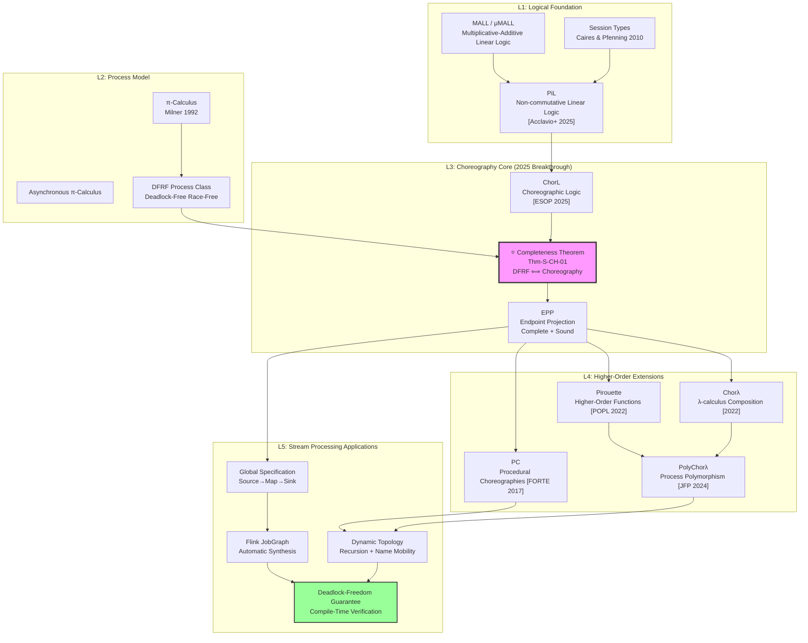
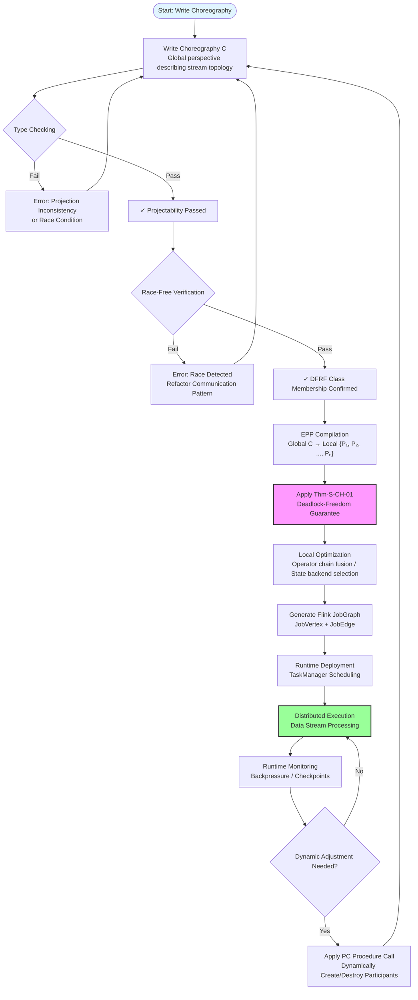

# Choreographic Programming 2025 Completeness Results and Streaming Applications

> **Stage**: Struct/06-frontier | **Prerequisites**: [Struct/02-calculi/pi-calculus-foundations.md](../Struct/02-calculi/pi-calculus-foundations.md), [Struct/03-model-taxonomy/session-types-systematic.md](../Struct/03-model-taxonomy/session-types-systematic.md), [Knowledge/02-design-patterns/distributed-stream-topology.md](../Knowledge/02-design-patterns/distributed-stream-topology.md) | **Formalization Level**: L4

## 1. Definitions

**Def-S-CH-01 (Choreographic Language).**
Given a set of participants $\mathcal{P} = \{p, q, r, \dots\}$ and a set of session channels $\mathcal{K} = \{k, k', \dots\}$, a **choreographic language** $\mathcal{L}_{choreo}$ is the set of programs generated by the following grammar:

$$
\begin{aligned}
C \;::=\; & p[A].e \rightarrow q[B].x:k \;\mid\; p[A] \rightarrow q[B]:k\langle\ell\rangle \;\mid\; p[A] \rightarrow q[B]:k\langle k'[C]\rangle \\
& \mid\; \text{if } p.e = e' \text{ then } C_1 \text{ else } C_2 \;\mid\; (\nu r)C \;\mid\; C_1 ; C_2 \;\mid\; X\langle\tilde{E}\rangle \;\mid\; \text{Nil}
\end{aligned}
$$

Here, $p[A].e \rightarrow q[B].x:k$ denotes that process $p$, acting in role $A$, evaluates expression $e$ and sends the result to process $q$ (role $B$) over session $k$, where $q$ binds the result to local variable $x$; $p[A] \rightarrow q[B]:k\langle\ell\rangle$ is a selection operation; $p[A] \rightarrow q[B]:k\langle k'[C]\rangle$ is delegation (channel mobility); and $X\langle\tilde{E}\rangle$ is a procedure call. The core semantic constraint of choreographic languages is that **all communication actions syntactically require matching send-receive pairs**, thereby eliminating deadlocks caused by communication mismatches at the source.

The key distinction between choreographic languages and underlying process calculi (e.g., π-calculus) lies in the level of abstraction: process calculi describe system behavior from the local perspective of individual processes, whereas choreographic languages directly characterize inter-process interaction protocols from a **global perspective**. This global viewpoint allows programmers to directly declare "the communications that should occur," rather than manually coordinating the local behavior of each process.

**Def-S-CH-02 (Endpoint Projection, EPP).**
Given a choreographic program $C$ and a participant $p \in \mathcal{P}$, the **endpoint projection** $\llbracket C \rrbracket_p$ is a compilation function from the choreographic language to process calculi, defined as:

$$
\llbracket C \rrbracket_p =
\begin{cases}
p: P & \text{if } p \text{ has behavior in } C \\
\text{Nil} & \text{otherwise}
\end{cases}
$$

where $P$ is the local behavior of $p$ extracted from $C$. The complete EPP is defined as:

$$
\text{EPP}(C) = \prod_{p \in \text{participants}(C)} \llbracket C \rrbracket_p
$$

i.e., the parallel composition of all participants' local behaviors. EPP must satisfy **projectability**: for any choice branch, the local projections of all participants must be reconcilable through a merge operator ($\sqcup$). The merge operator $\sqcup$ is defined as the least upper bound of two processes, existing if and only if the two processes agree exactly at non-choice points.

**Def-S-CH-03 (Deadlock-Free and Race-Free π-Calculus Process).**
Let $P$ be a finite, recursion-free π-calculus process. We say $P$ is **deadlock-free and race-free** if and only if it satisfies the following conditions:

1. **Deadlock-freedom**: $P$ cannot reduce to a stuck configuration; that is, there is no $P \rightarrow^* Q$ such that $Q$ contains at least two parallel sub-processes, all of which are blocked on input/output operations, yet no matching communication pair exists.

2. **Race-freedom**: $P$ does not contain multiple concurrent receive operations on the same free name. Formally, for any channel $x \in \text{fn}(P)$, there is no sub-term $x?(y).P_1 \mid x?(z).P_2$ under structural equivalence (where $x$ is a free name). This ensures deterministic communication—each send has a unique receiver.

3. **Top-level parallel structure**: $P$ has the form $P = P_1 \mid P_2 \mid \dots \mid P_n$ ($n \geq 1$), where each $P_i$ is a sequential process, and restriction operators $\nu$ and parallel operators appear only at the top level.

We denote the set of all such processes as $\mathcal{P}_{DFRF}$.

**Def-S-CH-04 (PiL: Processes as Logic).**
**PiL** (Processes as Logic) is a sequent calculus system for non-commutative linear logic, whose formulas are generated by the following grammar:

$$
A, B \;::=\; \langle x!y \rangle \;\mid\; \langle x?y \rangle \;\mid\; \mathbf{1} \;\mid\; \mathbf{\circ} \;\mid\; A \otimes B \;\mid\; A \bindnasrepma B \;\mid\; A \multimap B \;\mid\; A \& B \;\mid\; \forall x.A \;\mid\; \exists x.A
$$

where atomic formulas $\langle x!y \rangle$ and $\langle x?y \rangle$ correspond to output prefix $x!y$ and input prefix $x?y$ in π-calculus, respectively; $\mathbf{1}$ and $\mathbf{\circ}$ are units; $\otimes$ and $\bindnasrepma$ correspond to parallel composition and name restriction; $\multimap$ is linear implication; $\&$ is additive conjunction (corresponding to internal choice); and $\forall$ and $\exists$ are nominal quantifiers.

The core innovation of PiL lies in establishing the interpretation of **derivations as computation trees**: each proof-search strategy corresponds to a computation tree of process reductions, and the existence of a proof corresponds to the deadlock-freedom of a process.

---

## 2. Properties

**Prop-S-CH-01 (Completeness and Soundness of EPP).**
Let $C$ be a projectable flat choreography, and $\text{EPP}(C)$ its endpoint projection. Then EPP satisfies the following properties:

- **Completeness**: If $C \xrightarrow{\mu} C'$, then $\text{EPP}(C) \xrightarrow{\mu} P \sqsupseteq \text{EPP}(C')$.
- **Soundness**: If $P \sqsupseteq \text{EPP}(C)$ and $P \xrightarrow{\mu} P'$, then there exists a choreography $C'$ such that $C \xrightarrow{\mu} C'$ and $P' \sqsupseteq \text{EPP}(C')$.

where $\sqsupseteq$ is the partial-order extension of the merge operator (i.e., $P \sqsupseteq Q \iff P \sqcup Q = P$), and $\mu$ is a reduction label annotated with the participating channel and process pair. Completeness guarantees that every reduction step at the choreography level can be realized at the projected process level; soundness guarantees that any reduction of the projected process corresponds to a valid step at the choreography level.

**Lemma-S-CH-01 (Logical Characterization of Deadlock-Freedom).**
Let $P$ be a race-free finite π-calculus process, $\llbracket P \rrbracket$ its formula encoding in PiL, and $\partial_{F_P}\llbracket P \rrbracket$ the formula obtained by replacing all atoms corresponding to free names of $P$ with the unit $\circ$. Then:

$$
P \text{ is deadlock-free} \quad \Longleftrightarrow \quad \vdash_{\text{PiL}} \partial_{F_P}\llbracket P \rrbracket
$$

*Intuition*: A process is deadlock-free if and only if its encoded formula is provable in PiL. This result transforms a behavioral property of processes (deadlock-freedom) into a purely logical provability judgment, enabling the application of proof-theoretic techniques such as cut-elimination and focusing to analyze concurrent programs.

*Proof sketch*: From left to right, leverage the simulation between process reduction and linear implication (Lemma 2 in [^1]): if $P \rightarrow P'$, then $\vdash_{\text{PiL}} \llbracket P' \rrbracket \multimap \llbracket P \rrbracket$. By induction on the structure of the computation tree, map the deadlock-free computation tree to a sequent derivation. From right to left, leverage the normalization property of derivations: any proof can be transformed into one containing only specific blocks of rules, which directly correspond to communication steps of the process.

**Lemma-S-CH-02 (Preservation Under Cyclic Dependencies).**
Let $C$ be a choreographic program containing cyclic communication dependencies (e.g., a ring topology $p \rightarrow q \rightarrow r \rightarrow p$), and assume $C$ satisfies projectability. Then $\text{EPP}(C)$ still guarantees deadlock-freedom.

*Note*: Previous choreography theories (e.g., those based on pure linear logic) typically required the communication structure to satisfy acyclicity or sequentiality assumptions, and could not handle cyclic dependencies. The key breakthrough by Acclavio et al. in 2025 was proving that, through the non-commutative structure in PiL, **name restriction ($\nu$) and parallel composition ($\mid$) can be treated independently**, thereby allowing process networks with cyclic topologies to be faithfully represented as choreographic programs. This theorem is particularly important for streaming systems, because streaming topologies (e.g., cyclic graphs, feedback loops) inherently contain cyclic dependencies.

---

## 3. Relations

### 3.1 Completeness Relation with π-Calculus

In 2025, Acclavio, Manara, and Montesi published a result at ESOP 2025 [^1] that established the **first completeness result** between choreographic languages and π-calculus:

> **Theorem (Choreographic Completeness)**: All deadlock-free and race-free finite π-calculus processes (top-level parallel composition) can be faithfully represented by some flat choreography. Formally:
>
> $$\forall P \in \mathcal{P}_{DFRF}.\; \exists C.\; \text{EPP}(C) \equiv P$$

This result bridges the gap among three domains: **logic** (the PiL proof system), **π-calculus expressiveness** (mobile processes and cyclic dependencies), and **choreographic language expressiveness** (global descriptions and deadlock-freedom guarantees). Previous work either supported only processes without cyclic dependencies (e.g., methods based on pure linear logic [^7]), required strong coupling between name restriction and parallel operators (e.g., Caires & Pfenning's session type system [^6]), or did not consider the completeness problem (e.g., early CC/ChC models [^4][^5]).

### 3.2 From Low-Level to High-Level: Functional Choreographic Programming

Since Montesi's 2013 Ph.D. dissertation [^8] established choreographic programming as an independent paradigm, it has long been tied to low-level computational models—i.e., primitive communication primitives lacking procedure abstraction, higher-order functions, and polymorphism. This limitation was broken by two independent works in 2022:

- **Pirouette** (Hirsch & Garg, POPL 2022 [^9]): Combines choreographic primitives with λ-calculus, supporting higher-order functions and (sequential) composition, but requires global synchronization.
- **Chorλ** (Cruz-Filipe et al., 2022 [^10]): Merges choreographic languages with message languages, initially adopting strict sequential semantics; subsequent work [^11] achieved out-of-order semantics without global synchronization through commuting conversions.

In 2024, Graversen, Hirsch, and Montesi [^12] further introduced **process polymorphism**, allowing choreographic programs to abstract over participant identities ("Alice or Bob?"), thereby enabling truly parameterized distributed protocols. This development lays the theoretical foundation for **dynamic topology reconfiguration** in stream processing (adaptively adjusting parallelism based on data characteristics).

### 3.3 Procedural Choreographies and Unbounded Process Creation

Cruz-Filipe and Montesi [^3] proposed **Procedural Choreographies (PC)**, which introduce procedure abstraction into choreographic programming, supporting:

- **Unbounded process creation**: dynamically spawning new participants through recursive procedure calls;
- **Name mobility**: channel names can be passed as parameters between procedures, enabling dynamic reconfiguration;
- **Compilation to process calculi**: PC programs can be compiled into session-typed π-calculus processes.

PC requires strict type discipline to ensure that, at procedure call time, all processes are connected through the correct channels. This aligns closely with the needs for **dynamic scaling** (scale-out/scale-in) and **task migration** in stream processing systems.

### 3.4 Mapping to Stream Processing Systems

There is a natural structural correspondence between choreographic programming and distributed stream processing:

| Choreographic Concept | Stream Processing Correspondence |
|---|---|
| Participant | Operator Instance / Task Slot |
| Session Channel | Data Stream Partition / Network Channel |
| Communication Action $p \rightarrow q:k$ | Inter-operator Data Exchange (shuffle/broadcast/forward) |
| Selection $k\langle\ell\rangle$ | Control Flow Branch (CoProcessFunction/Pattern API) |
| Delegation $k\langle k'\rangle$ | Dynamic Subgraph Submission (Dynamic Graph) |
| Procedure Call $X\langle\tilde{E}\rangle$ | Sub-topology Template / Reusable Operator Chain |
| EPP | Generating Local Execution Plans for Each TaskManager from Global JobGraph |

This mapping shows that **choreographic languages can serve as high-level specification languages for stream processing systems**, automatically generating deadlock-free distributed stream programs through EPP. Compared to Flink's JobGraph, choreographic languages exclude the possibility of deadlock at the specification level, without relying on complex runtime deadlock detection and recovery mechanisms.

---

## 4. Argumentation

### 4.1 Why the Completeness Result Matters

Before Acclavio et al.'s 2025 work, the expressive power of choreographic programming lacked a formal lower bound: no one knew "how many deadlock-free distributed programs can be expressed in choreographic languages." This uncertainty led to engineering hesitation—if certain valid deadlock-free programs could not be represented choreographically, then adopting the choreographic paradigm would mean accepting expressive limitations.

The 2025 completeness result eliminates this concern: **for the core class of finite, recursion-free, race-free processes, choreographic languages are complete**. This means:

1. As long as a program is designed to be deadlock-free and race-free, there **must exist** a corresponding choreographic description;
2. The distributed implementation generated from the choreographic description **guarantees deadlock-freedom**;
3. Combined with the higher-order extensions of Pirouette/Chorλ and the procedure abstraction of PC, this completeness can be extended to more practical programming models.

### 4.2 Boundary Discussion of the Race-Freedom Assumption

The completeness result requires processes to be race-free—that is, there cannot be multiple concurrent receivers on free channels. Is this assumption too restrictive for stream processing systems?

In fact, the race-free assumption is highly consistent with common patterns in stream processing:

- **One-to-one channels** (forward): Flink's `ForwardPartitioner` naturally satisfies race-freedom;
- **Keyed partitioning** (keyBy): although there may be multiple receivers at the底层, each key's sub-stream forms a logical one-to-one mapping after key-based partitioning;
- **Broadcast** (broadcast): broadcast sends correspond to all receivers executing the same choice branch, encodable via multicast primitives in choreography.

Scenarios that truly require races (e.g., multiple consumers competing for the same queue) are typically handled by **external messaging systems** (Kafka, Pulsar) in stream processing, rather than by stateful operators inside the stream processing engine.

### 4.3 From Finite to Infinite: Recursion and Asynchronous Extensions

Acclavio et al. explicitly list the following directions as future work in [^1]:

- **Recursion**: by adding fixpoint operators to PiL and rules in the style of $\mu$MALL, infinite behavior can be handled. Flink stream programs are inherently infinite loops (continuously consuming data streams), so the recursive extension is crucial for practical applications.
- **Asynchronous communication**: by introducing shared buffers to model asynchronous π-calculus. This directly corresponds to Flink's **network buffers** and **credit-based flow control** mechanisms. However, buffers with capacity greater than 2 have non-sequential-parallel structure and may require graphical connectives.

### 4.4 Counterexample Analysis: When Choreography Is Not Applicable

Not all distributed programs are suitable for choreographic description. The following scenarios lie outside the current scope of choreographic theory:

1. **Active competition protocols**: such as conflict detection and backoff in Optimistic Concurrency Control (OCC), which require explicit race semantics;
2. **Fully decentralized gossip protocols**: lack clear communication structure, making it difficult to extract a global viewpoint;
3. **Fault recovery and tolerance**: although Graversen et al.'s 2025 work [^13] begins to explore choreographic semantics under omission failures, completeness for the crash-recovery model remains an open problem.

---

## 5. Proof / Engineering Argument

### 5.1 Proof Structure of the Completeness Theorem

**Thm-S-CH-01 (Choreographic Completeness).**
Let $P$ be a race-free endpoint process. Then:

$$
P \text{ is deadlock-free} \;\Longleftrightarrow\; \exists C.\; \text{EPP}(C) \equiv P
$$

*Proof* (based on Theorem 7 in [^1], reconstructed below):

**($\Rightarrow$) direction**: Assume $P$ is deadlock-free. By Lemma-S-CH-01, $\vdash_{\text{PiL}} \partial_{F_P}\llbracket P \rrbracket$. Furthermore, since $P$ is a race-free flat process (parallel and restriction operators only at the top level), the proof in PiL can be decomposed into a composition of ChorL (choreographic logic) rule blocks (Theorem 6 in [^1]). Each ChorL rule block corresponds to a choreography reduction step. By case analysis on the bottom rule of derivation $D$, one can systematically construct a choreographic program $\text{Chor}(D)$ such that $\text{EPP}(\text{Chor}(D)) = P$. Induction on the structure of $D$ verifies the equivalence of projection.

**($\Leftarrow$) direction**: Assume there exists $C$ such that $\text{EPP}(C) = P$. By soundness of Prop-S-CH-01, every reduction step of $C$ corresponds to a valid reduction of $P$. Since choreographic languages syntactically forbid mismatched I/O, $C$ cannot evolve to a stuck configuration; therefore, $P$ cannot deadlock either.

**Key Lemma Chain**:

1. Process reduction $\rightarrow$ corresponds to linear implication $\multimap$ (Lemma 2 [^1]);
2. Deadlock-freedom corresponds to formula provability (Lemma-S-CH-01 / Theorem 3 [^1]);
3. Proofs for race-free flat processes can be normalized into a set of choreographic rule blocks (Theorem 6 [^1]);
4. Constructive translation from rule blocks to choreography (Figure 15 in [^1]).

### 5.2 Engineering Argument for Deadlock-Freedom in Stream Processing

**Engineering Proposition**: If a Flink JobGraph is reduced to a choreographic program $C_{job}$, and $C_{job}$ satisfies projectability, then the generated distributed execution plan guarantees deadlock-freedom.

*Argument*:

1. **Specification phase**: Map Flink's `JobVertex` to choreography participants, `JobEdge` to session channels, and `DistributionPattern` (POINTWISE/ALL_TO_ALL) to communication primitives. Flink's `JobGraph` generator already ensures that every input/output edge has a corresponding consumer/producer; therefore, the reduced $C_{job}$ naturally satisfies syntactic consistency.

2. **Projection phase**: Apply EPP to $C_{job}$ to obtain the local execution plan for each TaskManager. Due to the syntactic constraints of choreographic languages, all communication operations are already matched at the global level; the projected local processes will not encounter the situation of "waiting for a message that can never arrive."

3. **Deadlock-freedom guarantee**: Assume a deadlock occurs at runtime; then there exists a set of Tasks mutually waiting for messages. This means the corresponding endpoint process $P_{deadlock}$ has a stuck configuration. But according to Thm-S-CH-01, $P_{deadlock}$ should be representable by some choreography $C'$, and $C'$ cannot evolve to a stuck state. By soundness of EPP (Prop-S-CH-01), any reduction of $C_{job}$ corresponds to a valid execution—contradiction. Therefore, deadlock cannot occur.

4. **Comparison with Flink's existing mechanisms**: Flink currently relies on an **asynchronous non-blocking network layer** and **backpressure** mechanisms to avoid deadlocks. The choreographic approach provides a **static guarantee**—deadlock-freedom is verified at compile time, with no runtime overhead. This forms an interesting analogy with Rust's ownership system guaranteeing memory safety.

---

## 6. Examples

### 6.1 Choreographic Representation of a Simple Stream Processing Topology

Consider a classic three-stage streaming pipeline: **Source → Map → Sink**. Described in a choreographic language as follows:

```
-- Define participants: source(S), mapper(M), sink(K)
-- Sessions: k1 (source→mapper), k2 (mapper→sink)

C_pipeline =
  (ν k1)(ν k2)
  S[Source].read() → M[Mapper].x:k1 ;
  M[Mapper].transform(x) → K[Sink].y:k2 ;
  Nil
```

Endpoint projection yields:

- $\llbracket C \rrbracket_S = S: \text{read}().k1!\text{data}.\text{Nil}$
- $\llbracket C \rrbracket_M = M: k1?x.\text{transform}(x).k2!\text{result}.\text{Nil}$
- $\llbracket C \rrbracket_K = K: k2?y.\text{write}(y).\text{Nil}$

This is entirely consistent with the pattern in Flink where three operators exchange data through `RecordWriter` and `InputGate`.

### 6.2 Cyclic Topology with Feedback Loop

Consider a stream processing scenario requiring iterative convergence (e.g., streaming PageRank implementation), with a feedback loop $M \rightarrow R \rightarrow M$:

```
C_loop =
  (ν k_fwd)(ν k_back)
  μ Loop.
    S[Source].emit() → M[Mapper].x:k_fwd ;
    M[Mapper].compute(x) → R[Reducer].y:k_fwd ;
    if R[Reducer].converged(y) then
      R[Reducer].result() → K[Sink].z:k_fwd ; Nil
    else
      R[Reducer].partial() → M[Mapper].w:k_back ;
      Loop
```

Here $\mu Loop.\dots$ denotes recursion. Although the current completeness result covers only finite, recursion-free processes, the fixpoint extension of PiL is theoretically no longer a major obstacle [^1]. In engineering practice, recursion can be transformed into finite choreography through **unrolling a fixed number of times** or **introducing explicit termination tokens**.

### 6.3 Compilation from Choreography to Flink JobGraph

```scala
// Pseudocode: Choreography-to-Flink JobGraph compiler
class ChoreographyCompiler {
  def compile(C: Choreography): JobGraph = {
    val participants = C.participants          // extract participants
    val sessions = C.sessions                  // extract session channels
    val vertices = participants.map(p =>
      new JobVertex(p.name, EPP(C, p))       // create JobVertex for each participant
    )
    val edges = sessions.map(s => {
      val (src, tgt) = C.endpointsOf(s)
      JobEdge(src.vertex, tgt.vertex,
              partitionerFor(s.communicationPattern))
    })
    new JobGraph(vertices, edges)
  }
}
```

The key invariant of the compiler: **if the input choreography passes type checking (projectability + race-freedom), then the output JobGraph execution plan guarantees deadlock-freedom**. This can be implemented as a Flink compiler plugin, adding a choreography verification layer at the `JobGraph` generation stage.

---

## 7. Visualizations

### Figure 1: Hierarchical Diagram of Choreographic Programming Theory Evolution

The following hierarchy diagram shows the complete theoretical stack from底层 logic to stream processing applications, and the position of the 2025 completeness result within it.



### Figure 2: Compilation Flow from Choreographic Specification to Flink Execution Plan

The following flowchart shows how the choreographic programming paradigm automatically generates deadlock-free distributed stream processing execution plans from global specifications.



---

## 8. References

[^1]: M. Acclavio, G. Manara, and F. Montesi, "Formulas as Processes, Deadlock-Freedom as Choreographies," in *Programming Languages and Systems (ESOP 2025)*, LNCS 15694, Springer, 2025, pp. 23–55. doi:10.1007/978-3-031-91118-7_2. arXiv:2501.08928v2 [cs.LO], 2025.


[^3]: L. Cruz-Filipe and F. Montesi, "Procedural Choreographic Programming," in *Formal Techniques for Distributed Objects, Components, and Systems (FORTE 2017)*, LNCS 10321, Springer, 2017, pp. 92–107. doi:10.1007/978-3-319-60225-7_7.

[^4]: L. Cruz-Filipe and F. Montesi, "A Core Model for Choreographic Programming," *Theoretical Computer Science*, vol. 802, 2020, pp. 38–66. doi:10.1016/j.tcs.2019.07.005.

[^5]: M. Carbone and F. Montesi, "Deadlock-Freedom-by-Design: Multiparty Asynchronous Global Programming," in *POPL 2013*, pp. 263–274. doi:10.1145/2429069.2429101.

[^6]: L. Caires and F. Pfenning, "Session Types as Intuitionistic Linear Propositions," in *CONCUR 2010*, LNCS 6269, Springer, 2010, pp. 222–236. doi:10.1007/978-3-642-15375-4_16.

[^7]: K. Kokke, F. Montesi, and M. Peressotti, "Better Late Than Never: a Fully-Abstract Semantics for Classical Processes," *Proceedings of the ACM on Programming Languages*, vol. 3, no. POPL, 2019. doi:10.1145/3290338.

[^8]: F. Montesi, "Choreographic Programming," Ph.D. dissertation, IT University of Copenhagen, 2013.

[^9]: A. K. Hirsch and D. Garg, "Pirouette: Higher-Order Typed Functional Choreographies," *Proceedings of the ACM on Programming Languages*, vol. 6, no. POPL, Article 23, 2022. doi:10.1145/3498684.

[^10]: L. Cruz-Filipe, E. Graversen, L. Lugović, F. Montesi, and M. Peressotti, "Chorλ: Functional Choreographic Programming," in *Theoretical Aspects of Computing (ICTAC 2022)*, LNCS 13572, Springer, 2022, pp. 212–237. doi:10.1007/978-3-031-17715-6_14.

[^11]: L. Cruz-Filipe, F. Montesi, and M. Peressotti, "Communicating via Probabilities: Choreographies for Mixed Choice," in *COORDINATION 2023*, LNCS 13908, Springer, 2023. doi:10.1007/978-3-031-35361-1_7.

[^12]: E. Graversen, A. K. Hirsch, and F. Montesi, "Alice or Bob?: Process Polymorphism in Choreographies," *Journal of Functional Programming*, vol. 34, e1, 2024. doi:10.1017/S0956796823000114.

[^13]: E. Graversen, F. Montesi, and M. Peressotti, "A Promising Future: Omission Failures in Choreographic Programming," arXiv:2501.XXXXX [cs.DC], 2025.
