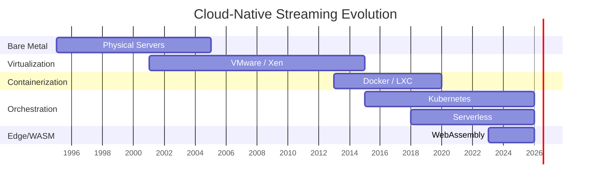

# Cloud-Native Streaming Architecture Evolution

> **Stage**: Struct/06-frontier | **Prerequisites**: [Flink Distributed Architecture](flink-distributed-architecture.md) | **Formalization Level**: L4
> **Translation Date**: 2026-04-21

## Abstract

Cloud-native streaming runtimes decouple computation, orchestration, state management, lifecycle, and isolation. This document traces the evolution from bare metal to WASM edge runtimes.

---

## 1. Definitions

### Def-S-28-01 (Cloud-Native Streaming Runtime)

A **cloud-native streaming runtime** $\mathcal{R}_{cn}$ is a 5-tuple:

$$\mathcal{R}_{cn} = \langle \mathcal{C}, \mathcal{O}, \mathcal{S}, \mathcal{L}, \mathcal{I} \rangle$$

where:

- $\mathcal{C}$: compute abstraction (VM / Container / Function / WASM)
- $\mathcal{O}$: orchestration plane (Static / K8s / Event-Driven / Edge)
- $\mathcal{S}$: state persistence (Local Disk / DFS / External KV / In-Memory)
- $\mathcal{L}$: lifecycle model (Long-Running / On-Demand / Cold-Start / Instant)
- $\mathcal{I}$: isolation boundary (Hypervisor / CGroup / Namespace / v8 Isolate / Hardware Enclave)

### Def-S-28-02 (Architectural Generation)

Generation $G_i = \langle A_i, M_i, \Delta_i \rangle$:

- $A_i$: core abstraction of generation $i$
- $M_i$: key mechanisms introduced
- $\Delta_i = A_i \setminus A_{i-1}$: abstraction delta

**Evolution chain**: $G_0 \to G_1 \to G_2 \to G_3 \to G_4$

| Generation | Era | Abstraction | Key Mechanism |
|------------|-----|-------------|---------------|
| $G_0$ | Pre-2001 | Bare metal | Hardware virtualization |
| $G_1$ | 2001-2013 | VM | Image layering |
| $G_2$ | 2013-2018 | Container | CGroups, namespaces |
| $G_3$ | 2018-2023 | K8s / Serverless | Declarative API, event-driven |
| $G_4$ | 2023+ | WASM Module | Capability-based security |

---

## 2. Properties

### Prop-S-28-01 (Decoupling Enables Portability)

Decoupling $\mathcal{C}, \mathcal{O}, \mathcal{S}, \mathcal{L}, \mathcal{I}$ enables deployment across the continuum from datacenter to edge:

$$\text{Portable}(job) \iff \forall G_i: job \text{ deployable on } G_i$$

### Prop-S-28-02 (Lifecycle-Latency Trade-off)

| Lifecycle | Startup Latency | Use Case |
|-----------|----------------|----------|
| Long-Running | 0ms | Always-on streaming |
| On-Demand | 100ms-1s | Event-triggered processing |
| Cold-Start | 1-10s | Batch-like streaming |
| Instant (WASM) | <1ms | Edge real-time |

---

## 3. Visualizations

---

## 4. References
