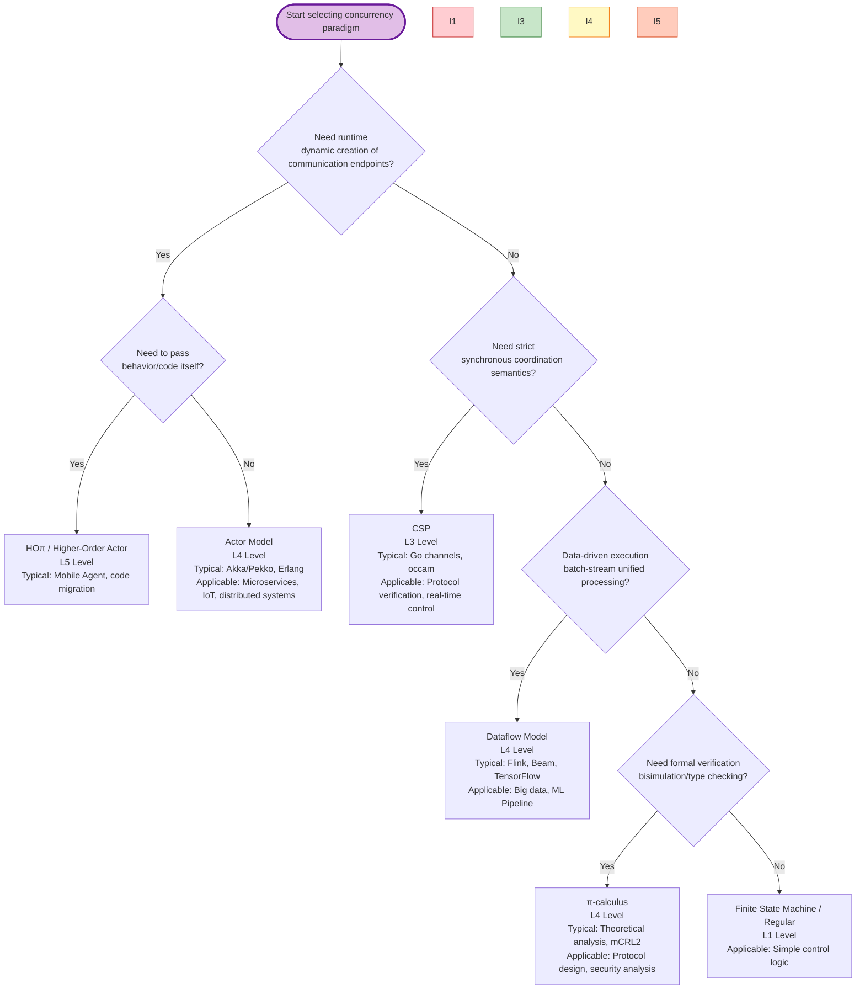
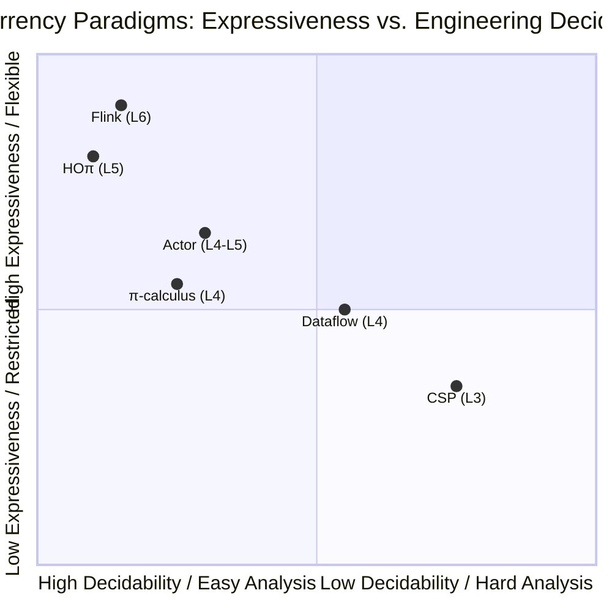
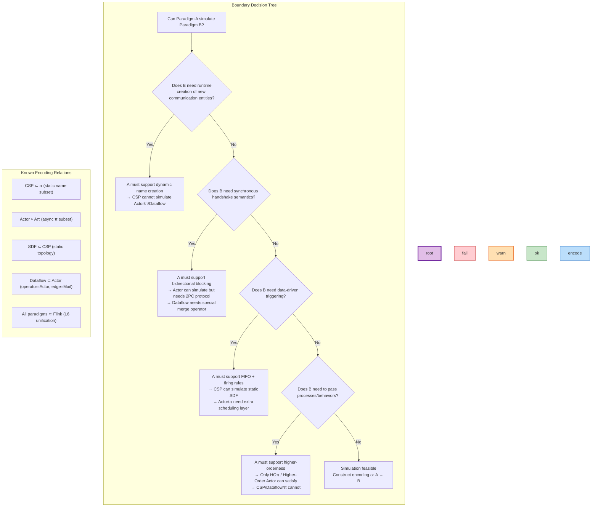

# Clarification of Boundaries among Four Major Concurrency Paradigms

> **Stage**: Struct/05-comparative-analysis | **Prerequisites**: [USTM-F-Reconstruction/04-encoding-verification/04.04-expressiveness-hierarchy-v2.md](../../USTM-F-Reconstruction/04-encoding-verification/04.04-expressiveness-hierarchy-v2.md), [Struct/03-relationships/03.03-expressiveness-hierarchy.md](expressiveness-hierarchy.md) | **Formalization Level**: L4-L5
> **Document ID**: S-05-06 | **Version**: 2026.04 | **Status**: Complete

---

## Table of Contents

- [Clarification of Boundaries among Four Major Concurrency Paradigms](#clarification-of-boundaries-among-four-major-concurrency-paradigms)
  - [Table of Contents](#table-of-contents)
  - [1. Concept Definitions (Definitions)](#1-concept-definitions-definitions)
    - [Def-S-05-06-01. Actor Model (演员模型)](#def-s-05-06-01-actor-model-演员模型)
    - [Def-S-05-06-02. CSP (Communicating Sequential Processes)](#def-s-05-06-02-csp-communicating-sequential-processes)
    - [Def-S-05-06-03. π-calculus (π演算)](#def-s-05-06-03-π-calculus-π演算)
    - [Def-S-05-06-04. Dataflow Model (数据流模型)](#def-s-05-06-04-dataflow-model-数据流模型)
    - [Def-S-05-06-05. USTM Six-Layer Expressiveness Positioning](#def-s-05-06-05-ustm-six-layer-expressiveness-positioning)
  - [2. Property Derivation (Properties)](#2-property-derivation-properties)
    - [Lemma-S-05-06-01. Existence of Actor-to-π Encoding](#lemma-s-05-06-01-existence-of-actor-to-π-encoding)
    - [Lemma-S-05-06-02. Restricted Encoding from CSP to Dataflow](#lemma-s-05-06-02-restricted-encoding-from-csp-to-dataflow)
    - [Prop-S-05-06-01. Proposition on State Management Model Comparison of Four Paradigms](#prop-s-05-06-01-proposition-on-state-management-model-comparison-of-four-paradigms)
  - [3. Relation Establishment (Relations)](#3-relation-establishment-relations)
    - [Relation 1: Strict Expressiveness Inclusion Chain](#relation-1-strict-expressiveness-inclusion-chain)
    - [Relation 2: Communication Primitive Mapping](#relation-2-communication-primitive-mapping)
    - [Relation 3: Fault Tolerance Mechanism Comparison](#relation-3-fault-tolerance-mechanism-comparison)
  - [4. Argumentation Process (Argumentation)](#4-argumentation-process-argumentation)
    - [Argument 1: Essential Divergence between Actor and CSP — Synchronous vs Asynchronous](#argument-1-essential-divergence-between-actor-and-csp--synchronous-vs-asynchronous)
    - [Argument 2: π-calculus as the "Calculus of Concurrent Calculi"](#argument-2-π-calculus-as-the-calculus-of-concurrent-calculi)
    - [Argument 3: Industrial Advantages of the Dataflow Model](#argument-3-industrial-advantages-of-the-dataflow-model)
  - [5. Formal Proof / Engineering Argument (Proof / Engineering Argument)](#5-formal-proof--engineering-argument-proof--engineering-argument)
    - [Thm-S-05-06-01. Sufficient and Necessary Conditions for Actor to Simulate CSP](#thm-s-05-06-01-sufficient-and-necessary-conditions-for-actor-to-simulate-csp)
    - [Thm-S-05-06-02. Boundary Theorem for CSP Simulating Dataflow](#thm-s-05-06-02-boundary-theorem-for-csp-simulating-dataflow)
    - [Thm-S-05-06-03. Unified Instantiation of Four Paradigms in Flink](#thm-s-05-06-03-unified-instantiation-of-four-paradigms-in-flink)
  - [6. Example Verification (Examples)](#6-example-verification-examples)
    - [Example 1: Multi-Paradigm Expression of the Same Counter System](#example-1-multi-paradigm-expression-of-the-same-counter-system)
    - [Example 2: Dynamic Topology — Server Load Balancing](#example-2-dynamic-topology--server-load-balancing)
  - [7. Visualizations (Visualizations)](#7-visualizations-visualizations)
    - [Figure 7.1: "Which Paradigm Should I Choose for My Scenario?" Decision Tree](#figure-71-which-paradigm-should-i-choose-for-my-scenario-decision-tree)
    - [Figure 7.2: Four Paradigms × Core Dimension Concept Matrix](#figure-72-four-paradigms--core-dimension-concept-matrix)
    - [Figure 7.3: Paradigm Simulation Relationship and Boundary Decision Tree](#figure-73-paradigm-simulation-relationship-and-boundary-decision-tree)
  - [8. References (References)](#8-references-references)

## 1. Concept Definitions (Definitions)

### Def-S-05-06-01. Actor Model (演员模型)

**Definition** (Hewitt, Bishop, Steiger 1973[^1]): The Actor Model (演员模型) is a **message-passing-based** concurrent computation model, where Actor is the fundamental primitive of concurrent computation. Upon receiving a message, each Actor can:

1. Send a finite number of messages to other Actors
2. Create a finite number of new Actors
3. Specify the behavior for the next message received

**Formal Syntax** (Agha 1986[^2] simplified):

$$
\begin{aligned}
P, Q &::= a \langle \vec{v} \rangle \quad \text{(asynchronous send)} \\
  &\mid \nu a. P \quad \text{(create new Actor)} \\
  &\mid P \mid Q \quad \text{(parallel composition)} \\
  &\mid a(\vec{x}).P \quad \text{(behavior definition / message receive)} \\
  &\mid 0 \quad \text{(empty process)}
\end{aligned}
$$

**Core Characteristics**: No shared state, unforgeable addresses, message passing decouples sender and receiver, communication topology evolves dynamically.

---

### Def-S-05-06-02. CSP (Communicating Sequential Processes)

**Definition** (Hoare 1978[^3]): CSP (Communicating Sequential Processes, 通信顺序进程) is a concurrent process algebra based on **synchronous channel communication**. Processes communicate through named channels via input/output; communication is **bidirectional handshake synchronization**.

**Formal Syntax** (CSP core):

$$
\begin{aligned}
P, Q &::= a \to P \quad \text{(prefix / sequence)} \\
  &\mid P \sqcap Q \quad \text{(nondeterministic choice)} \\
  &\mid P \square Q \quad \text{(external choice)} \\
  &\mid P \parallel Q \quad \text{(parallel composition)} \\
  &\mid P \setminus A \quad \text{(hiding)} \\
  &\mid \text{STOP} \mid \text{SKIP} \quad \text{(termination / skip)}
\end{aligned}
$$

**Core Characteristics**: Channel set statically determined at syntax level, synchronous communication (sender blocks until receiver is ready), trace-based denotational semantics.

---

### Def-S-05-06-03. π-calculus (π演算)

**Definition** (Milner, Parrow, Walker 1992[^4]): π-calculus (π演算) is an extension of CCS introducing **name passing** (名字传递) capability, allowing channels themselves to be passed as messages, thereby supporting dynamic communication topologies.

**Formal Syntax**:

$$
\begin{aligned}
P, Q &::= \bar{x}\langle y \rangle.P \quad \text{(output name)} \\
  &\mid x(z).P \quad \text{(input name)} \\
  &\mid \tau.P \quad \text{(silent action)} \\
  &\mid (\nu x)P \quad \text{(name restriction / creation)} \\
  &\mid P \mid Q \quad \text{(parallel)} \\
  &\mid !P \quad \text{(replication)} \\
  &\mid P + Q \quad \text{(choice)} \\
  &\mid 0 \quad \text{(empty)}
\end{aligned}
$$

**Core Characteristics**: Names are the sole computational resource, topology dynamic reconstruction through name passing, first-order name mobility (higher-order π-calculus supports process passing).

---

### Def-S-05-06-04. Dataflow Model (数据流模型)

**Definition** (Kahn 1974[^5], Lee & Parks 1995[^6]): The Dataflow Model (数据流模型) represents computation as a **directed graph**, where nodes are operators (Actor/Operator) and edges are unbounded FIFO channels. Operator execution ("firing") is driven by the availability of input data.

**Formal Definition** (Kahn Process Network):

$$
\text{DPN} = (A, C, F, R)
$$

where:

- $A$: set of actors/operators
- $C \subseteq A \times A$: set of directed channels (FIFO)
- $F: \text{Tokens}^* \to \text{Tokens}^*$: firing function (kernel)
- $R \subseteq \mathcal{P}(\text{Tokens}^*)$: firing rules

**Core Characteristics**: Data-driven execution, no centralized control, determinism (Kahn condition[^5]), expressing computation granularity through firing rules.

---

### Def-S-05-06-05. USTM Six-Layer Expressiveness Positioning

Based on the USTM-F expressiveness hierarchy (Def-F-04-04-02)[^7], the four major paradigms are positioned as follows:

| Paradigm | USTM Level | Core Characteristic | Formal Boundary |
|----------|-----------|---------------------|-----------------|
| **CSP** | $L_3$ (Process Algebra) | Static named channels, synchronous communication | Channel set determined at compile time |
| **π-calculus** | $L_4$ (Mobile) | Dynamic name creation and passing | $(\nu a)(\bar{b}\langle a \rangle \mid a(x).P)$ |
| **Actor Model** | $L_4$-$L_5$ (Mobile/Higher-Order) | Dynamic topology + supervision tree higher-order structure | Can simulate HOπ subset |
| **Dataflow Model** | $L_4$ (Mobile) | Data-driven, directed FIFO edges | Topology dynamic but communication pattern fixed |

**Level Relationship**: $\text{CSP}_{L3} \sqsubset \text{Dataflow}_{L4} \approx \text{π}_{L4} \approx \text{Actor}_{L4} \sqsubseteq \text{Actor}_{L5}$

---

## 2. Property Derivation (Properties)

### Lemma-S-05-06-01. Existence of Actor-to-π Encoding

**Lemma**: There exists a **faithful encoding** from the Actor Model to asynchronous π-calculus (Aπ calculus[^8]).

**Encoding Summary**:

| Actor Concept | π-calculus Encoding |
|---------------|---------------------|
| Actor address | Private channel name |
| Message send `a ! v` | `$\bar{a}\langle v \rangle$` |
| Behavior receive `a ? { case v => P }` | `$a(x).P$` |
| Create new Actor | `$(\nu a)P$` |
| MailBox queue | Channel buffering semantics |

**Proof Sketch**: Agha & Thati (2004)[^8] proved that this encoding satisfies Gorla's criteria (structural preservation, semantic preservation, compositionality, name invariance, operationality). ∎

---

### Lemma-S-05-06-02. Restricted Encoding from CSP to Dataflow

**Lemma**: CSP processes can be encoded as a **restricted subset** of Dataflow Process Network if and only if the following conditions are met:

1. Channels are unidirectional FIFO
2. No external choice (`$\square$`) or can be encoded via priority
3. No hiding operator (`$\setminus$`) or hidden events are mapped to internal triggers

**Proof Sketch**: CSP synchronous communication can be decomposed into two asynchronous messages "request-acknowledgment", mapped to two Dataflow edges. However, CSP's external choice (multiplexed waiting) requires introducing special merge operators in pure Dataflow, exceeding the basic DPN model. ∎

---

### Prop-S-05-06-01. Proposition on State Management Model Comparison of Four Paradigms

**Proposition**: The four paradigms present a clear spectrum in state management:

| Paradigm | State Model | State Visibility | Persistence Mechanism |
|----------|-------------|------------------|----------------------|
| **Actor** | Private local state (behaviour) | Visible only to this Actor | Persistent within Actor lifecycle |
| **CSP** | Theoretically stateless (or process parameters) | Internal to process | Lost upon process termination |
| **π-calculus** | Stateless (pure name passing) | — | — |
| **Dataflow** | Operator internal state (optional) | Operator scope | Checkpoint / state backend |

**Proof**: Directly derived from their respective formal definitions. Actor's `become` explicitly updates local state; CSP process algebra is traditionally stateless but can carry parameters in implementation; π-calculus is a pure communication calculus with no explicit state concept; Dataflow operators can be designed as stateful (e.g., Flink's `KeyedProcessFunction`) or stateless (pure function firing). ∎

---

## 3. Relation Establishment (Relations)

### Relation 1: Strict Expressiveness Inclusion Chain

Based on USTM-F strict inclusion theorems (Thm-F-04-04-01 ~ Thm-F-04-04-04)[^7]:

$$
\text{CSP} \sqsubset_{L3}^{L4} \text{Dataflow} \approx_{L4} \text{π-calculus} \approx_{L4} \text{Actor} \sqsubseteq_{L4}^{L5} \text{HOπ} \sqsubseteq_{L5}^{L6} \text{Flink}
$$

**Key Separation Problems**:

- CSP $\to$ Dataflow/π: **Dynamic name creation** ($(\nu a)$ creates new channels at runtime)
- π $\to$ HOπ: **Process as value passing** ($a\langle Q \rangle.R$, Sangiorgi theorem[^9])
- All paradigms $\to$ Flink: **Turing-complete + built-in time/fault tolerance semantics**

### Relation 2: Communication Primitive Mapping

| Paradigm | Communication Mechanism | Synchronicity | Topology Characteristic | Decoupling Degree |
|----------|------------------------|---------------|------------------------|-------------------|
| **Actor** | Async message → Mailbox | Asynchronous | Dynamic (address passable) | Temporal/spatial decoupling |
| **CSP** | Channel input/output | Synchronous | Static (syntax-determined) | Tight coupling |
| **π-calculus** | Name passing on channels | Synchronous (basic) | Dynamic (name passable) | Medium decoupling |
| **Dataflow** | Token flow on edges | Asynchronous (write non-blocking / read blocking) | Static mainly | Spatial decoupling |

### Relation 3: Fault Tolerance Mechanism Comparison

| Paradigm | Fault Tolerance Strategy | Implementation Mechanism | Formal Foundation |
|----------|-------------------------|--------------------------|-------------------|
| **Actor** | Supervision Tree | Parent Actor monitors child Actor lifecycle, restarts/escalates on failure | "Let it crash" philosophy |
| **CSP** | No built-in fault tolerance | Depends on external process management (e.g., occam's PRI ALT + timeout) | Deadlock/livelock detection (FDR4) |
| **π-calculus** | No built-in fault tolerance | Theoretical model, does not involve runtime failures | Session types can encode partial safety properties |
| **Dataflow** | Checkpoint + state backend | Chandy-Lamport distributed snapshot, Exactly-Once semantics | Consistency proof (Thm-F-04-04-05)[^7] |

---

## 4. Argumentation Process (Argumentation)

### Argument 1: Essential Divergence between Actor and CSP — Synchronous vs Asynchronous

Hewitt (2010)[^1] explicitly identified six differences between CSP and the Actor Model:

1. **Concurrency primitives**: CSP has input/output/guarded commands/parallel composition; Actor has asynchronous unidirectional messages
2. **Execution unit**: CSP is based on sequential processes; Actor is based on inherent concurrency
3. **Topology**: CSP communication topology is fixed; Actor topology changes dynamically
4. **Structure**: CSP processes are hierarchical parallel composition; Actor allows non-hierarchical execution (through Future)
5. **Synchronicity**: CSP communication is synchronous; Actor communication is asynchronous
6. **Data**: CSP data is numbers/strings/arrays; in Actor, data structures themselves are Actors

**Engineering Inference**:

- Need **temporal/spatial decoupling** (e.g., microservices, IoT) → Choose Actor
- Need **precise synchronous coordination** (e.g., real-time signal processing, protocol verification) → Choose CSP

### Argument 2: π-calculus as the "Calculus of Concurrent Calculi"

The design goal of π-calculus is to provide a **minimal complete primitive set** for mobile computing. Compared with Actor and CSP:

**Advantages of π-calculus**:

- Minimal syntax, easy to formalize analysis
- Name passing = capability passing (capability-based security)
- Rich bisimulation theory (strong/weak/early/late/open bisimulation)

**Limitations of π-calculus**:

- No built-in fault tolerance or distribution semantics
- No explicit time/priority
- High theoretical depth but few industrial implementations

**Relationship between Actor and π**: The Aπ calculus[^8] proves that Actor can be encoded as typed asynchronous π-calculus. Conversely, untyped π-calculus cannot fully encode Actor's locality axioms (organization/operation axioms).

### Argument 3: Industrial Advantages of the Dataflow Model

The rise of the Dataflow Model (represented by Flink/Beam) stems from its **engineering advantages in batch-stream unification and fault tolerance**:

1. **Determinism**: Kahn condition guarantees output independent of execution order, facilitating debugging and reproduction
2. **Automatic parallelism**: Operator graphs provide natural parallel granularity for compilers/schedulers
3. **Time abstraction**: Built-in Event Time / Processing Time / Ingestion Time semantics
4. **State fault tolerance**: Checkpoint mechanism combines distributed snapshots with operator states

**Theoretical Cost**: To achieve engineering usability, the Dataflow model sacrifices some pure formalization characteristics (e.g., bounded memory guarantee of Kahn networks is undecidable in general Dataflow).

---

## 5. Formal Proof / Engineering Argument (Proof / Engineering Argument)

### Thm-S-05-06-01. Sufficient and Necessary Conditions for Actor to Simulate CSP

**Theorem**: The Actor Model can simulate CSP processes if and only if the following conditions are satisfied:

$$
\forall P_{CSP}. \exists \sigma: P_{CSP} \to P_{Actor}. \quad \text{traces}(P_{CSP}) = \text{traces}(\sigma(P_{Actor}))
$$

**Sufficient Conditions**:

1. CSP channel set is finite and known at compile time
2. Allow Actors to use **two-phase commit mode** to simulate synchronous handshake
3. Do not rely on CSP external choice timeout semantics

**Necessary Conditions**:

1. Actor system provides **reliable message passing** (at least at-least-once)
2. Actor address space contains a bijective mapping of CSP channel names

**Proof**:

**Forward** (Actor simulates CSP):

- Map each CSP process to an Actor
- Map CSP channel $c$ to a pair of Actor addresses $(c_{in}, c_{out})$
- CSP synchronous output `c!v → P` is encoded as: Actor sends `v` to $c_{out}$, waits for ACK from $c_{in}$, then executes $P$
- CSP synchronous input `c?x → P` is encoded as: Actor receives `v` from $c_{in}$, sends ACK to $c_{out}$, then executes $P[v/x]$

**Reverse** (CSP cannot simulate general Actor):

- By $L_3 \sqsubset L_4$ strict inclusion (Thm-F-04-04-03)[^7]
- Actor can create infinitely many new addresses (channels) at runtime; CSP channel set is syntactically fixed
- Separation problem: $(\nu a)(\bar{b}\langle a \rangle \mid a(x).P)$ cannot be directly expressed in CSP ∎

---

### Thm-S-05-06-02. Boundary Theorem for CSP Simulating Dataflow

**Theorem**: CSP can simulate the **static topology subset** of Dataflow Process Network.

**Simulable Subset**:

- Operator graph fixed at compile time
- Firing rules are static SDF (Synchronous Dataflow) type
- No dynamic branching/merging

**Non-simulable Characteristics**:

- Dynamic operator creation/destruction
- Runtime topology reconstruction
- Data-dependent firing rule changes

**Proof**:

In static SDF networks, each operator's firing consumption/production rate is fixed. Each operator can be encoded as a CSP process, and FIFO channels encoded as CSP channel buffers. Since SDF scheduling can be statically determined, CSP's fixed channel topology is sufficient for expression.

However, general Dataflow (such as Kahn Process Networks) allows operators to decide consumption/production rates based on input data, requiring process-internal-state-driven channel usage patterns, exceeding the expressive power of CSP static processes. ∎

---

### Thm-S-05-06-03. Unified Instantiation of Four Paradigms in Flink

**Theorem**: Flink's runtime semantics can instantiate (encode) engineering subsets of the four major concurrency paradigms.

**Evidence Table**:

| Paradigm | Flink Corresponding Abstraction | Encoding Method | Preserved Properties |
|----------|--------------------------------|-----------------|---------------------|
| **Actor** | `ProcessFunction` + `KeyedState` | Actor → KeyedProcessFunction, Mailbox → NetworkBuffer | State isolation, single-threaded execution |
| **CSP** | `ConnectedStreams` + `keyBy` | CSP channel → DataStream partition edge | Deterministic routing, FIFO |
| **π-calculus** | Dynamic `DataStream` connection | Name → `TypeInformation` + serialization | Type safety, dynamic connection |
| **Dataflow** | `StreamGraph` / `JobGraph` | Native correspondence | Firing rules, Checkpoint |

**Proof Sketch**: Guaranteed by the USTM-F model instantiation framework (Def-I-00-01 ~ Def-I-00-07)[^10]. As an $L_6$ Turing-complete implementation, Flink possesses the computational resources needed to express all lower-level paradigms (infinite recursion, dynamic data structures, built-in time model). ∎

---

## 6. Example Verification (Examples)

### Example 1: Multi-Paradigm Expression of the Same Counter System

**Actor (Scala/Akka style)**:

```scala
counter = Actor {
  case Increment => count += 1
  case Get => sender ! count
}
```

**CSP (CSP-M style)**:

```csp
COUNTER(n) = increment -> COUNTER(n+1)
           [] get?c -> c!n -> COUNTER(n)
```

**π-calculus**:

```
Counter(n) = inc().Counter(n+1) + get(reply).(reply<n>.Counter(n))
```

**Dataflow (Flink style)**:

```java
dataStream
  .keyBy("counterId")
  .process(new CountFunction()) // ValueState<Long> count
```

---

### Example 2: Dynamic Topology — Server Load Balancing

**Scenario**: Worker nodes dynamically register with a load balancer, which distributes tasks to available nodes.

**Actor Implementation**:

- `Balancer` Actor maintains `Map<String, ActorRef>` available node table
- New node sends `Register(address)` to Balancer upon startup
- Balancer selects node via `round-robin` and forwards after receiving task

**CSP Implementation Difficulties**:

- New node channels cannot be added to static process definition at runtime
- Need to predefine all possible node channels (impractical)
- Or use unified `request`/`response` channels + nodeID (degrades to Actor-like pattern)

**π-calculus Implementation**:

```
Balancer = register(node).Balancer'(node)
Balancer'(n) = task(data).(n<data>.Balancer'(n) + register(m).Balancer''(n,m))
```

---

## 7. Visualizations (Visualizations)

### Figure 7.1: "Which Paradigm Should I Choose for My Scenario?" Decision Tree

The following decision tree helps select the most appropriate concurrency paradigm based on application scenario characteristics:



---

### Figure 7.2: Four Paradigms × Core Dimension Concept Matrix



**Detailed Concept Matrix**:

| Comparison Dimension | Actor Model | CSP | π-calculus | Dataflow Model |
|---------------------|-------------|-----|------------|----------------|
| **USTM Level** | $L_4$-$L_5$ | $L_3$ | $L_4$ | $L_4$ |
| **Expressiveness** | ★★★★☆ | ★★★☆☆ | ★★★★☆ | ★★★★☆ |
| **State Model** | Private local state | None / process parameters | Stateless | Operator internal state |
| **Communication Primitive** | Async message | Synchronous handshake | Synchronous name passing | Async token flow |
| **Topology Characteristic** | Dynamic | Static | Dynamic | Static mainly |
| **Composability** | Actor reference composition | Parallel/sequential/choice | Parallel/restriction | Graph connection |
| **Fault Tolerance Mechanism** | Supervision tree | External detection | None built-in | Checkpoint |
| **Typical Implementation** | Akka/Pekko, Erlang | Go channels, FDR4 | mCRL2, Pi4SOA | Flink, Beam |
| **Decidability** | Partial reachability decidable | Finite-state bisimulation decidable | Partial type checking decidable | Checkpoint consistency provable |
| **Ecosystem Maturity** | ★★★★★ | ★★★★☆ | ★★☆☆☆ | ★★★★★ |

---

### Figure 7.3: Paradigm Simulation Relationship and Boundary Decision Tree

The following decision tree shows under what conditions one paradigm can simulate another:



**Key Boundary Determinations**:

| Simulation Direction | Condition | Conclusion | Formal Basis |
|---------------------|-----------|------------|--------------|
| Actor → CSP | Static finite Actor set + reliable messages | ✅ Simulable | Two-phase commit encoding |
| CSP → Actor | No additional conditions | ✅ Simulable | Channel = Actor address pair |
| CSP → Dataflow | Static SDF subset | ✅ Simulable | Lee & Parks (1995)[^6] |
| Dataflow → CSP | Dynamic topology or data-dependent triggering | ❌ Not simulable | Kahn condition vs. static process |
| π → Actor | With type constraints (Aπ) | ✅ Simulable | Agha & Thati (2004)[^8] |
| Actor → π | No type constraints | ⚠️ Approximate encoding | Locality axioms lost |
| All → Flink | Engineering subset | ✅ Instantiable | USTM-F framework[^10] |

---

## 8. References (References)

[^1]: C. Hewitt, "Actor Model of Computation: Scalable Robust Information Systems", _arXiv:1008.1459_, 2010. <https://arxiv.org/abs/1008.1459>

[^2]: G. Agha, "Actors: A Model of Concurrent Computation in Distributed Systems", MIT Press, 1986.

[^3]: C. A. R. Hoare, "Communicating Sequential Processes", _Communications of the ACM_, 21(8), 666-677, 1978.

[^4]: R. Milner, J. Parrow, D. Walker, "A Calculus of Mobile Processes, Parts I-II", _Information and Computation_, 100(1), 1-77, 1992.

[^5]: G. Kahn, "The Semantics of a Simple Language for Parallel Programming", _Information Processing 74_, North-Holland, 471-475, 1974.

[^6]: E. A. Lee and T. M. Parks, "Dataflow Process Networks", _Proceedings of the IEEE_, 83(5), 773-801, 1995.

[^7]: AnalysisDataFlow USTM-F, "Expressiveness Hierarchy v2 - Strict", 2026. [USTM-F-Reconstruction/04-encoding-verification/04.04-expressiveness-hierarchy-v2.md](../../USTM-F-Reconstruction/04-encoding-verification/04.04-expressiveness-hierarchy-v2.md)

[^8]: G. Agha and P. Thati, "An Algebraic Theory of Actors and Its Application to a Simple Object-Based Language", _Objects, Components, Models and Patterns (TOOLS Europe)_, 2004.

[^9]: D. Sangiorgi, "Expressing Mobility in Process Algebras: First-Order and Higher-Order Paradigms", Ph.D. Thesis, University of Edinburgh, 1992.

[^10]: AnalysisDataFlow USTM-F, "Model Instantiation Framework", 2026. [USTM-F-Reconstruction/02-model-instantiation/02.00-model-instantiation-framework.md](../../USTM-F-Reconstruction/02-model-instantiation/02.00-model-instantiation-framework.md)

---

_Document creation time: 2026-04-30 | Formalization level: L4-L5 | Status: Complete_
