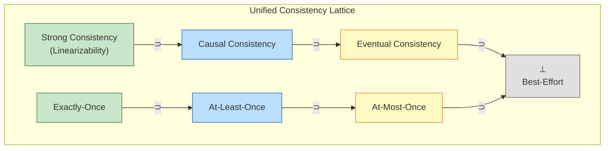
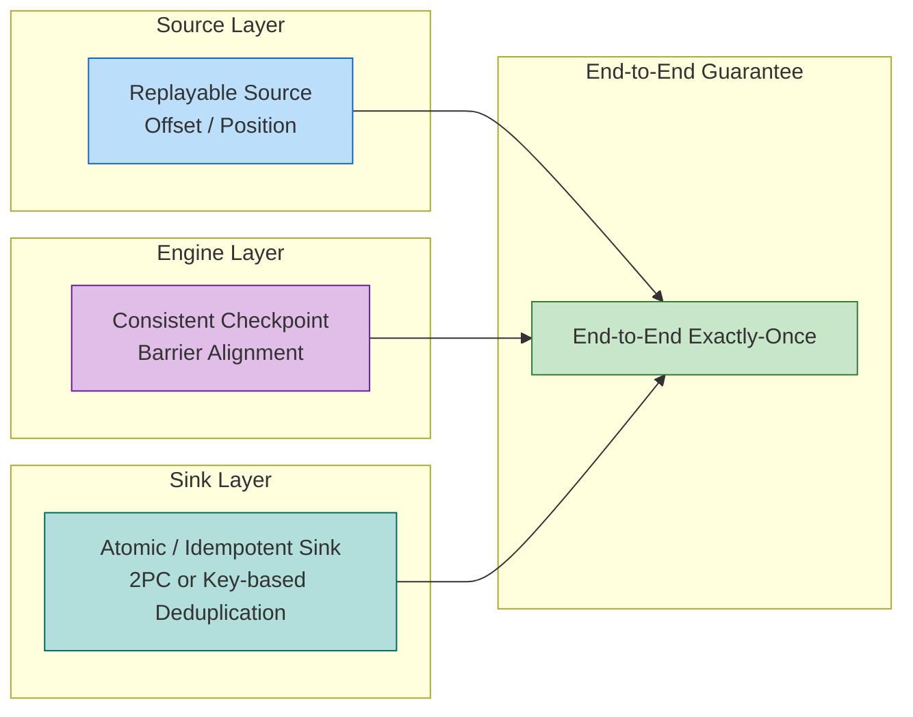

# Consistency Hierarchy in Streaming

> Stage: Struct/02-properties | Prerequisites: [01.04-dataflow-model-formalization.md](../Struct/01-foundation/01.04-dataflow-model-formalization.md) | Formalization Level: L5

---

## Table of Contents

- [Consistency Hierarchy in Streaming](#consistency-hierarchy-in-streaming)
  - [Table of Contents](#table-of-contents)
  - [1. Definitions](#1-definitions)
    - [Def-S-08-01 (Dataflow Execution Trace)](#def-s-08-01-dataflow-execution-trace)
    - [Def-S-08-02 (At-Most-Once Semantics)](#def-s-08-02-at-most-once-semantics)
    - [Def-S-08-03 (At-Least-Once Semantics)](#def-s-08-03-at-least-once-semantics)
    - [Def-S-08-04 (Exactly-Once Semantics)](#def-s-08-04-exactly-once-semantics)
    - [Def-S-08-05 (End-to-End Consistency)](#def-s-08-05-end-to-end-consistency)
    - [Def-S-08-06 (Internal Consistency)](#def-s-08-06-internal-consistency)
    - [Def-S-08-07 (Strong Consistency)](#def-s-08-07-strong-consistency)
    - [Def-S-08-08 (Causal Consistency)](#def-s-08-08-causal-consistency)
    - [Def-S-08-09 (Eventual Consistency)](#def-s-08-09-eventual-consistency)
  - [2. Properties](#2-properties)
    - [Lemma-S-08-01 (Exactly-Once Implies At-Least-Once)](#lemma-s-08-01-exactly-once-implies-at-least-once)
    - [Lemma-S-08-02 (Exactly-Once Implies At-Most-Once)](#lemma-s-08-02-exactly-once-implies-at-most-once)
    - [Lemma-S-08-03 (Error Complementarity of At-Least-Once and At-Most-Once)](#lemma-s-08-03-error-complementarity-of-at-least-once-and-at-most-once)
    - [Lemma-S-08-04 (Strong Consistency Implies Causal Consistency)](#lemma-s-08-04-strong-consistency-implies-causal-consistency)
    - [Lemma-S-08-05 (Causal Consistency Implies Eventual Consistency)](#lemma-s-08-05-causal-consistency-implies-eventual-consistency)
    - [Prop-S-08-01 (Decomposition of End-to-End Consistency)](#prop-s-08-01-decomposition-of-end-to-end-consistency)
  - [3. Relations](#3-relations)
    - [Relation 1: Dataflow Determinism Theorem and Consistency Hierarchy](#relation-1-dataflow-determinism-theorem-and-consistency-hierarchy)
    - [Relation 2: Internal Consistency ≈ Chandy-Lamport Distributed Snapshot](#relation-2-internal-consistency--chandy-lamport-distributed-snapshot)
    - [Relation 3: Exactly-Once Semantics and Linearizability](#relation-3-exactly-once-semantics-and-linearizability)
  - [4. Argumentation](#4-argumentation)
    - [Lemma 4.1 (Replayable Source Guarantees No Data Loss)](#lemma-41-replayable-source-guarantees-no-data-loss)
    - [Lemma 4.2 (Barrier Alignment Guarantees Snapshot Consistency)](#lemma-42-barrier-alignment-guarantees-snapshot-consistency)
    - [Counterexample 4.1 (Internal Consistency ≠ End-to-End Consistency)](#counterexample-41-internal-consistency--end-to-end-consistency)
    - [Boundary Discussion 4.2 (Compensating Power of Idempotent Sinks)](#boundary-discussion-42-compensating-power-of-idempotent-sinks)
  - [5. Proofs](#5-proofs)
    - [Thm-S-08-01 (Necessary Conditions for Exactly-Once Under Network Partition)](#thm-s-08-01-necessary-conditions-for-exactly-once-under-network-partition)
    - [Thm-S-08-02 (End-to-End Exactly-Once Correctness Theorem)](#thm-s-08-02-end-to-end-exactly-once-correctness-theorem)
    - [Thm-S-08-03 (Unified Consistency Hierarchy Implication Chain)](#thm-s-08-03-unified-consistency-hierarchy-implication-chain)
  - [6. Examples](#6-examples)
    - [Example 6.1: Flink Kafka End-to-End Exactly-Once](#example-61-flink-kafka-end-to-end-exactly-once)
    - [Example 6.2: Idempotent HBase Sink for Exactly-Once](#example-62-idempotent-hbase-sink-for-exactly-once)
    - [Counterexample 6.3: Non-Idempotent HTTP Sink Breaks At-Most-Once](#counterexample-63-non-idempotent-http-sink-breaks-at-most-once)
    - [Counterexample 6.4: Eager Source Offset Commit Breaks At-Least-Once](#counterexample-64-eager-source-offset-commit-breaks-at-least-once)
  - [7. Visualizations](#7-visualizations)
    - [Unified Consistency Lattice](#unified-consistency-lattice)
    - [End-to-End Consistency Composition](#end-to-end-consistency-composition)
  - [8. References](#8-references)

## 1. Definitions

This section establishes rigorous mathematical definitions for the consistency hierarchy of stream computing systems, building upon the formal foundation of the Dataflow model. All definitions rely on the characterization of Dataflow graphs, operator semantics, partially ordered multisets, and event time in the prerequisite document [01.04-dataflow-model-formalization.md](../Struct/01-foundation/01.04-dataflow-model-formalization.md)[^4][^6].

---

### Def-S-08-01 (Dataflow Execution Trace)

Let $\mathcal{G} = (V, E, P, \Sigma, \mathbb{T})$ be a Dataflow graph (see Def-S-04-01). Its **global execution trace** $\mathcal{T}$ is defined as an alternating sequence of global states and system events:

$$
\mathcal{T} = \langle s_0, e_1, s_1, e_2, s_2, \dots, e_n, s_n \rangle
$$

where each global state $s_i$ consists of three components:

- **Operator states**: $\{ \sigma_v^{(i)} \}_{v \in V_{op}}$, recording the local state of each operator at time $i$;
- **Channel states**: $\{ Q_c^{(i)} \}_{c \in E}$, recording the in-flight message sequences on each data channel $c$;
- **Source offsets**: $\{ o_{src}^{(i)} \}_{src \in V_{src}}$, recording the external system positions (e.g., Kafka offsets) that each Source operator has acknowledged consuming.

System events $e_i$ belong to the following set:

$$
e_i \in \{ \text{Process}(v, r), \; \text{BarrierArrive}(v, c, k), \; \text{CheckpointTrigger}(k), \; \text{SinkCommit}(T_k) \}
$$

corresponding respectively to: operator $v$ processing record $r$, Barrier $k$ arriving at channel $c$, triggering the $k$-th Checkpoint, and Sink committing transaction $T_k$.

**Intuitive explanation**: The execution trace is the "film strip" of all dynamic behaviors of a Dataflow graph at runtime. By tracing the trace, we can precisely know when each record is processed by which operator, how each operator's state evolves, and when each Sink exposes results to the external world[^1][^2].

**Motivation for definition**: Without mapping runtime into a trace, "exactly once" cannot be formalized—because "once" must be countable along the time dimension. This definition unifies discrete Checkpoint events and continuous data processing within the same temporal framework, providing a common measure for subsequent consistency hierarchy comparisons.

---

### Def-S-08-02 (At-Most-Once Semantics)

Given an input record set $I$ and an execution trace $\mathcal{T}$, let the observation function $\mathcal{O}(\mathcal{T})$ extract the multiset of all output records that have been **committed to and visible in** the external system by the Sink. For any input record $r \in I$, define its **causal influence count** as:

$$
c(r, \mathcal{T}) = |\{ o \in \mathcal{O}(\mathcal{T}) \mid \text{caused\_by}(o, r) \}|
$$

where $\text{caused\_by}(o, r)$ means that the generation of output record $o$ causally depends on the processing of input record $r$ (i.e., $r$ contributes to the production of $o$ via some Dataflow path).

A stream computing system satisfies **At-Most-Once** semantics iff:

$$
\forall r \in I. \; c(r, \mathcal{T}) \leq 1
$$

**Intuitive explanation**: Each input data item affects the external world **at most once**. The system may lose data during transmission or processing (i.e., $c(r, \mathcal{T}) = 0$), but it absolutely prohibits the same record from producing two or more visible side effects. At-Most-Once is the weakest level of consistency guarantee, commonly used in scenarios such as monitoring metrics and log sampling that can tolerate a small amount of loss[^3][^5].

**Motivation for definition**: At-Most-Once eliminates all deduplication, retry, and transaction overhead in exchange for the lowest latency and highest throughput. Formalizing this semantics as an upper bound on causal influence count allows the engineering goal of "no duplication" to directly interface with correctness proofs of fault-tolerance mechanisms.

---

### Def-S-08-03 (At-Least-Once Semantics)

A stream computing system satisfies **At-Least-Once** semantics iff:

$$
\forall r \in I. \; c(r, \mathcal{T}) \geq 1
$$

**Intuitive explanation**: Each input data item affects the external world **at least once**. The system does not allow permanent data loss (i.e., $c(r, \mathcal{T}) \geq 1$), but may cause the same record to be processed multiple times in failure recovery or retry scenarios, thereby producing duplicate side effects. At-Least-Once is the basic guarantee provided by most stream processing engines (e.g., Flink under default configuration), applicable to scenarios such as log aggregation and event-driven microservices[^1][^5].

**Motivation for definition**: In distributed environments, network partitions, node failures, or timeout retries are the norm. At-Least-Once simplifies the design of fault-tolerance protocols by allowing duplication—the system only needs to ensure "every message is eventually processed" without dealing with complex deduplication logic. This definition mathematically formalizes the engineering trade-off between "no loss" and "possible duplication".

---

### Def-S-08-04 (Exactly-Once Semantics)

A stream computing system satisfies **Exactly-Once** semantics iff:

$$
\forall r \in I. \; c(r, \mathcal{T}) = 1
$$

**Intuitive explanation**: Each input data item affects the external world **exactly once**. The system neither loses data (excluding $c(r) = 0$) nor produces duplicate side effects (excluding $c(r) \geq 2$). Exactly-Once is the core requirement for business scenarios with extremely high correctness demands, such as financial transactions, billing systems, and inventory deductions[^3][^5].

**Motivation for definition**: Exactly-Once does not mean "each record is physically processed by the machine only once"—this is impossible in distributed failure recovery. It emphasizes **observational equivalence**: regardless of how many failures, replays, or reschedules the system experiences, the state changes eventually observed by external systems are completely consistent with those obtained in an ideal failure-free environment where each record is processed exactly once. This definition elevates the semantic guarantee from "message delivery count" to "observable uniqueness of side effects".

---

### Def-S-08-05 (End-to-End Consistency)

For a complete stream processing job $J = (Src, Ops, Snk)$, **End-to-End Consistency** refers to the consistency guarantee of the entire pipeline from the external data source to the external data sink. Specifically, end-to-end Exactly-Once is constituted by the conjunction of the following three sub-properties:

$$
\text{End-to-End-EO}(J) \iff \text{Replayable}(Src) \land \text{ConsistentCheckpoint}(Ops) \land \text{AtomicOutput}(Snk)
$$

where:

- **$\text{Replayable}(Src)$**: The Source supports re-reading data from persistent position markers (offset / position). After a failure, the Source can replay from the offset recorded by the last successful Checkpoint.
- **$\text{ConsistentCheckpoint}(Ops)$**: The engine internally captures a consistent global state of all operators through distributed snapshots (e.g., Chandy-Lamport algorithm), so that after recovery the internal state is consistent with the state of a failure-free execution up to the same moment[^2].
- **$\text{AtomicOutput}(Snk)$**: The Sink's writes to the external system satisfy atomicity (transactional commit) or idempotency, ensuring that duplicate processing does not lead to duplicate visible output.

**Intuitive explanation**: End-to-end consistency is not an isolated mechanism inside the stream processing engine, but the result of **collaboration among Source, engine, and Sink**. If only the engine's internal Exactly-Once is guaranteed, while the Source commits offsets prematurely or the Sink is non-idempotent, data may be lost before entering the engine or duplicated after leaving the engine[^1][^5].

**Motivation for definition**: A common misconception in engineering practice is to equate Flink's Checkpoint mechanism with end-to-end Exactly-Once. This definition explicitly extends the consistency boundary to external systems, forcing architects to implement corresponding fault-tolerance protocols on both the Source and Sink sides.

---

### Def-S-08-06 (Internal Consistency)

**Internal Consistency** refers to the consistency of the stream processing engine's own operator states with the global snapshot after failure recovery. Formally, let $\mathcal{G}_k$ be the global snapshot captured by the $k$-th Checkpoint, then:

$$
\text{Internal-Consistency}(Ops) \iff \forall k. \; \text{Consistent}(\mathcal{G}_k) \land \text{NoOrphans}(\mathcal{G}_k) \land \text{Reachable}(\mathcal{G}_k)
$$

where $\text{Consistent}(\mathcal{G}_k)$, $\text{NoOrphans}(\mathcal{G}_k)$, and $\text{Reachable}(\mathcal{G}_k)$ correspond to the three core properties of the Chandy-Lamport distributed snapshot algorithm: consistent cut, no orphan messages, and state reachability[^2].

**Intuitive explanation**: Internal consistency answers the question: "After recovery, is the internal state of the engine valid?" It does not care whether the Sink has repeatedly committed data to the external system, nor whether the Source has irrecoverably discarded offsets.

**Motivation for definition**: Distinguishing internal consistency from end-to-end consistency is key to understanding stream computing fault-tolerance mechanisms. Internal consistency is a **necessary but not sufficient condition** for end-to-end consistency. It provides an independent verification target for the correctness of Checkpoint algorithms, while also revealing why certain systems (such as jobs that only enable Checkpoint but use non-transactional Sinks) still exhibit data duplication or loss.

---

### Def-S-08-07 (Strong Consistency)

In the context of distributed shared state, **Strong Consistency** (also known as Linearizability) requires that all operations have a unique linearization point in the global history, such that any external observer sees an execution order fully consistent with the real-time order[^8]. Formally, for any operation sequence $\langle op_1, op_2, \dots \rangle$ acting on shared state $S$ in a stream processing system:

$$
\forall op_i, op_j.\; \text{if } t_{\text{real}}(op_i) \prec t_{\text{real}}(op_j) \text{ then } op_i \prec_S op_j
$$

where $\prec_S$ is the serial order unanimously agreed upon by all processes. Strong consistency is the strongest element in the distributed consistency lattice.

**Intuitive explanation**: Strong consistency means the system behaves like a single-threaded replica: all read and write operations take effect atomically, with no concurrent conflicts or visibility delays. For stream computing, when the Sink writes results to external shared storage, strong consistency guarantees that all subsequent readers immediately see the latest result.

**Motivation for definition**: Incorporating strong consistency into the unified framework clarifies the upper bound that stream computing's Exactly-Once semantics can achieve when exporting outward—end-to-end Exactly-Once can be equivalent to strong consistency only when the external system itself provides linearizability.

---

### Def-S-08-08 (Causal Consistency)

**Causal Consistency** requires that the system at least preserves the order among operations that have causal dependencies. If operation $op_i$ happens before $op_j$ under the happens-before relation (denoted $op_i \prec_{hb} op_j$), then any process observing the order must satisfy $op_i \prec_{obs} op_j$; for concurrent, causally unrelated operations, different processes may observe different orders. Formally:

$$
\forall op_i, op_j.\; op_i \prec_{hb} op_j \implies op_i \prec_{obs} op_j
$$

**Intuitive explanation**: Causal consistency relaxes the requirement of global real-time order, only requiring that causally related events be seen in causal order. In stream computing, if two records pass through the same operator or have data dependencies, their output order must be preserved downstream; records from different sources that are unrelated may be processed in any order.

**Motivation for definition**: Many distributed stream processing systems (such as Flink's parallel operators) naturally satisfy causal consistency but not necessarily strong consistency. Explicitly defining causal consistency explains why systems can still produce deterministic results without global locks.

---

### Def-S-08-09 (Eventual Consistency)

**Eventual Consistency** guarantees that if the system receives no new updates for a period of time, all replicas will eventually converge to the same state[^7]. Formally, let $S_p(t)$ be the state replica observed by process $p$ at time $t$, then:

$$
\forall p, q.\; \left( \lim_{t \to \infty} \text{Updates}(t) = \emptyset \right) \implies \left( \lim_{t \to \infty} S_p(t) = \lim_{t \to \infty} S_q(t) \right)
$$

**Intuitive explanation**: Eventual consistency only promises that all replicas will be consistent in the long run, without guaranteeing real-time consistency, causal order, or correctness of values read during the convergence process. It is the weakest element in the distributed consistency lattice, commonly found in cross-region replication, caching systems, and certain Sinks without transaction guarantees.

**Motivation for definition**: At the very end of a stream computing pipeline, if the external system can only provide eventual consistency (such as Elasticsearch or certain Cassandra configurations), then even if Flink internally implements Exactly-Once, the end-to-end semantics can only degrade to eventual consistency. This definition clarifies the lower bound of system capability.

---

## 2. Properties

From the definitions in Section 1, this section derives the basic logical relationships and error bounds among the consistency hierarchy levels.

---

### Lemma-S-08-01 (Exactly-Once Implies At-Least-Once)

**Statement**: If a stream computing system satisfies Exactly-Once semantics for input set $I$, then the system necessarily satisfies At-Least-Once semantics.

**Proof**:

By Def-S-08-04, Exactly-Once requires:

$$
\forall r \in I. \; c(r, \mathcal{T}) = 1
$$

Since $1 \geq 1$, the above directly implies:

$$
\forall r \in I. \; c(r, \mathcal{T}) \geq 1
$$

which is precisely the At-Least-Once semantics defined by Def-S-08-03. ∎

> **Inference [Theory→Model]**: Exactly-Once adds the constraint of "no duplication" on top of At-Least-Once. Therefore, any system implementing Exactly-Once must first solve the data loss problem (through replayable Sources and consistent Checkpoints), and then introduce deduplication or transaction mechanisms[^1][^5].

---

### Lemma-S-08-02 (Exactly-Once Implies At-Most-Once)

**Statement**: If a stream computing system satisfies Exactly-Once semantics for input set $I$, then the system necessarily satisfies At-Most-Once semantics.

**Proof**:

By Def-S-08-04, Exactly-Once requires:

$$
\forall r \in I. \; c(r, \mathcal{T}) = 1
$$

Since $1 \leq 1$, the above directly implies:

$$
\forall r \in I. \; c(r, \mathcal{T}) \leq 1
$$

which is precisely the At-Most-Once semantics defined by Def-S-08-02. ∎

> **Inference [Theory→Model]**: Exactly-Once also adds the constraint of "no loss" on top of At-Most-Once. Therefore, any system implementing Exactly-Once must ensure that unacknowledged data can be replayed during failure recovery, rather than simply skipping it[^3][^5].

---

### Lemma-S-08-03 (Error Complementarity of At-Least-Once and At-Most-Once)

To uniformly analyze the three semantics, define two error metrics for a single record $r$:

- **Loss error**: $\varepsilon_{\text{loss}}(r) = \max(0, 1 - c(r, \mathcal{T}))$
- **Duplication error**: $\varepsilon_{\text{dup}}(r) = \max(0, c(r, \mathcal{T}) - 1)$

Then the three semantics can be equivalently characterized as:

| Semantics Level | Error Constraint |
|---------|---------|
| At-Most-Once | $\forall r. \; \varepsilon_{\text{dup}}(r) = 0$ |
| At-Least-Once | $\forall r. \; \varepsilon_{\text{loss}}(r) = 0$ |
| Exactly-Once | $\forall r. \; \varepsilon_{\text{loss}}(r) = 0 \land \varepsilon_{\text{dup}}(r) = 0$ |

**Statement**: The error constraint set of Exactly-Once equals the intersection of the error constraint sets of At-Least-Once and At-Most-Once.

**Proof**:

Let $C_{\text{EO}}$, $C_{\text{AL}}$, $C_{\text{AM}}$ be the error constraint sets corresponding to the three semantics respectively.

- $C_{\text{AM}} = \{ (\varepsilon_{\text{loss}}, \varepsilon_{\text{dup}}) \mid \forall r, \varepsilon_{\text{dup}}(r) = 0 \}$
- $C_{\text{AL}} = \{ (\varepsilon_{\text{loss}}, \varepsilon_{\text{dup}}) \mid \forall r, \varepsilon_{\text{loss}}(r) = 0 \}$
- $C_{\text{EO}} = \{ (\varepsilon_{\text{loss}}, \varepsilon_{\text{dup}}) \mid \forall r, \varepsilon_{\text{loss}}(r) = 0 \land \varepsilon_{\text{dup}}(r) = 0 \}$

Obviously:

$$
C_{\text{EO}} = C_{\text{AL}} \cap C_{\text{AM}}
$$

That is, Exactly-Once is equivalent to simultaneously satisfying "no loss" and "no duplication". ∎

> **Inference [Model→Implementation]**: From an engineering implementation perspective, At-Least-Once and At-Most-Once correspond to two independent fault-tolerance axes—the **replay axis** (solving loss) and the **deduplication axis** (solving duplication). Implementing Exactly-Once requires simultaneously investing mechanisms on both axes (Checkpoint + transaction/idempotency)[^1][^3][^5].

---

### Lemma-S-08-04 (Strong Consistency Implies Causal Consistency)

**Statement**: If a distributed system satisfies strong consistency (Def-S-08-07), then the system necessarily satisfies causal consistency (Def-S-08-08).

**Proof**:

By the definition of strong consistency, all operations have a unique serial order $\prec_S$ in the global history that is consistent with real time. The happens-before relation $\prec_{hb}$ is a subset of the real-time partial order (i.e., $op_i \prec_{hb} op_j$ means $op_i$ physically or logically occurred before $op_j$). Therefore:

$$
op_i \prec_{hb} op_j \implies op_i \prec_S op_j
$$

Strong consistency requires that the order observed by all processes $\prec_{obs}$ is exactly $\prec_S$. Thus:

$$
op_i \prec_{hb} op_j \implies op_i \prec_{obs} op_j
$$

This is precisely the definition of causal consistency. ∎

> **Inference [Theory→Model]**: Strong consistency is a sufficient condition for causal consistency. Any stream processing output implemented through global locks or single primary replicas (such as writing to a strongly consistent database) naturally inherits causal consistency.

---

### Lemma-S-08-05 (Causal Consistency Implies Eventual Consistency)

**Statement**: If a distributed system satisfies causal consistency (Def-S-08-08), then the system necessarily satisfies eventual consistency (Def-S-08-09).

**Proof**:

Causal consistency requires that all causally dependent operations are observed in the same order by all processes. Consider a finite operation sequence: after stopping new updates, each process applies all operations in the same causal order, so its final state depends only on the content of the operation sequence and not on the observing process. Therefore:

$$
\lim_{t \to \infty} S_p(t) = \text{Apply}(\text{AllOps}, \prec_{hb})
$$

This limit is independent of process $p$, so for all processes $p, q$ we have $\lim_{t \to \infty} S_p(t) = \lim_{t \to \infty} S_q(t)$. This is precisely the definition of eventual consistency. ∎

> **Inference [Model→Implementation]**: In engineering implementations, causal consistency usually relies on vector clocks or logical timestamps. As long as the system continuously propagates and merges these timestamps, eventual consistency automatically holds as a byproduct.

---

### Prop-S-08-01 (Decomposition of End-to-End Consistency)

**Statement**: For stream processing job $J = (Src, Ops, Snk)$, end-to-end Exactly-Once holds iff internal consistency, Source replayability, and Sink atomicity simultaneously hold.

**Proof**:

**$(\Rightarrow)$ Direction**:

Assume $\text{End-to-End-EO}(J)$ holds. By Def-S-08-05:

1. $\text{Replayable}(Src)$ holds directly;
2. $\text{AtomicOutput}(Snk)$ holds directly;
3. If internal consistency does not hold, then after recovery the operator state may be in an inconsistent cut, with orphan messages or unreachable states. Even if the Source replays correctly, the operator may produce different output from the ideal execution, leading to $c(r, \mathcal{T}) \neq 1$, contradicting end-to-end Exactly-Once. Therefore $\text{ConsistentCheckpoint}(Ops)$ must hold.

**$(\Leftarrow)$ Direction**:

Assume the three sub-properties simultaneously hold. By internal consistency, after recovery the operator state is equivalent to the state of a failure-free execution up to some consistent cut (see Def-S-08-06 and the Chandy-Lamport theorem[^2]). By Source replayability, all data arriving after the Checkpoint can be completely replayed, guaranteeing $c(r) \geq 1$. By Sink atomicity (transaction or idempotency), duplicate processing does not produce duplicate external visible output, guaranteeing $c(r) \leq 1$. Combining both, $c(r) = 1$, i.e., end-to-end Exactly-Once holds. ∎

---

## 3. Relations

This section establishes strict mappings between the consistency hierarchy and the Dataflow formal model, distributed snapshot theory, and linearizability.

---

### Relation 1: Dataflow Determinism Theorem and Consistency Hierarchy

The prerequisite document [01.04-dataflow-model-formalization.md](../Struct/01-foundation/01.04-dataflow-model-formalization.md) states **Thm-S-04-01 (Dataflow Determinism Theorem)**: under the premises of pure functions for operators, FIFO channels, and fixed input partially ordered multisets, the output of a Dataflow graph is uniquely determined and independent of scheduling strategy[^4][^6].

**Argument**:

- This theorem provides the **baseline** for comparing consistency hierarchy levels: the output of $\mathcal{T}_{\text{ideal}}$ (ideal failure-free execution trace) is unique.
- At-Most-Once allows the output to be a **sub-multiset** of $\mathcal{O}(\mathcal{T}_{\text{ideal}})$ (possibly missing some records);
- At-Least-Once allows the output to be a **super-multiset** of $\mathcal{O}(\mathcal{T}_{\text{ideal}})$ (possibly containing duplicate records);
- Exactly-Once requires the output to **equal** $\mathcal{O}(\mathcal{T}_{\text{ideal}})$.

Therefore, the consistency hierarchy can be understood as: an upper bound on the **degree of deviation** between the system output and the ideal Dataflow deterministic output.

---

### Relation 2: Internal Consistency ≈ Chandy-Lamport Distributed Snapshot

**Argument**:

Flink's Checkpoint mechanism is semantically equivalent to the Chandy-Lamport distributed snapshot algorithm[^2]. The specific correspondence is as follows:

| Flink Concept | Chandy-Lamport Concept |
|-----------|-------------------|
| Checkpoint Barrier | Marker message |
| Operator state snapshot | Process local state recording |
| Barrier alignment condition | "Record state after receiving markers from all incoming edges" |
| Global Checkpoint | Global consistent snapshot $\mathcal{G}$ |

By the Chandy-Lamport consistency theorem (see [04.03-chandy-lamport-consistency.md](../Struct/04-proofs/04.03-chandy-lamport-consistency.md)), this snapshot satisfies consistent cut, no orphan messages, and state reachability[^2]. Therefore:

$$
\text{Flink-Checkpoint} \approx \text{Chandy-Lamport-Snapshot}
$$

Furthermore:

$$
\text{Internal-Consistency}(Ops) \iff \text{Consistent}(\mathcal{G}) \land \text{NoOrphans}(\mathcal{G}) \land \text{Reachable}(\mathcal{G})
$$

---

### Relation 3: Exactly-Once Semantics and Linearizability

**Argument**:

Exactly-Once semantics can be viewed as a restricted instance of **Linearizability** in the stream processing scenario:

- Linearizability requires that each operation has a unique **linearization point** in the system history, making all operations appear to execute atomically;
- For Exactly-Once, the side effect production of each input record $r$ on the Sink can also be viewed as an "operation", whose linearization point is the moment of Sink transaction commit or idempotent write taking effect;
- Therefore, Exactly-Once guarantees that each $r$'s side-effect operation is linearized **exactly once** in the global history.

Formally:

$$
\text{Exactly-Once}(J) \implies \text{Linearizable}(\{ \text{SideEffect}(r) \mid r \in I \})
$$

But the converse does not hold: linearizability only guarantees the correctness of operation ordering, not that no operations are omitted (i.e., it does not guarantee At-Least-Once)[^3].

---

## 4. Argumentation

This section provides auxiliary lemmas, counterexample analyses, and boundary discussions in preparation for the main theorems in Section 5.

---

### Lemma 4.1 (Replayable Source Guarantees No Data Loss)

**Statement**: If the Source supports replay from a persisted offset, and Flink persists the Source's current offset upon each successful Checkpoint, then no data is lost after failure recovery.

**Proof**:

1. **Premise analysis**: Let $C_n$ be the last successfully completed Checkpoint, and let $o_n$ be the Source offset recorded by $C_n$.
2. **Construction / Derivation**: After a failure occurs, the job recovers from $C_n$, and the Source is reset to offset $o_n$. Since the Source is replayable, all records from $o_n$ onward can be re-read.
3. **Conclusion**: Data that arrived after $C_n$ but before the failure will be reprocessed, so no data is permanently lost. ∎

> **Inference [Execution→Data]**: This lemma directly corresponds to the "no loss" axis in At-Least-Once semantics. Regardless of whether the Sink has deduplication capability, as long as the Source is replayable and Checkpoints are bound to offsets, data will be processed at least once[^1][^5].

---

### Lemma 4.2 (Barrier Alignment Guarantees Snapshot Consistency)

**Statement**: In barrier alignment mode, each operator $v$ takes a state snapshot only after receiving Barriers $b_{id}$ from all input channels. This snapshot captures the state of $v$ after it has finished processing all data belonging to before Checkpoint $id$.

**Proof**:

1. **Premise analysis**: Let operator $v$ have $k$ input channels $ch_1, \dots, ch_k$.
2. **Construction / Derivation**: Barrier $b_{id}$ divides each channel's data stream into two parts—records before $b_{id}$ and records after $b_{id}$. The alignment condition requires $v$ to trigger the snapshot only after finishing processing all records before $b_{id}$ from all $k$ channels.
3. **Conclusion**: Therefore the snapshot state contains no processing effects from any record after $b_{id}$, nor omits any processing effects from records before $b_{id}$. The snapshot corresponds to a consistent cut in logical time, satisfying the consistency requirement of the Chandy-Lamport algorithm[^2]. ∎

> **Inference [Theory→Implementation]**: Barrier alignment is the core mechanism for Flink to achieve internal consistency. It ensures that the recovered operator state is equivalent to the state of a failure-free execution up to the same logical moment, providing the foundation for extending the Dataflow determinism theorem (Thm-S-04-01) to failure scenarios[^4][^6].

---

### Counterexample 4.1 (Internal Consistency ≠ End-to-End Consistency)

**Scenario**: A Flink job uses a replayable Kafka Source and enables Aligned Checkpoint, but the Sink is a simple HTTP POST call (non-transactional, non-idempotent).

**Execution timeline**:

1. Record $r$ is read by the Source, processed by operators, and reaches the Sink.
2. The Sink executes `httpClient.post(url, result_of_r)`, and the external system has received and processed the request.
3. At this point Checkpoint $C_n$ has not yet successfully completed (possibly still waiting for downstream Barrier alignment).
4. The job suddenly fails, and Checkpoint $C_n$ fails.
5. During recovery, the job rolls back to the state of the last successful Checkpoint $C_{n-1}$.
6. The Source replays from the offset recorded by $C_{n-1}$, and record $r$ is processed again.
7. The Sink issues the same HTTP POST request again.

**Analysis**:

- **Internal consistency**: Since the Checkpoint mechanism is correct, the operator state after recovery is consistent.
- **End-to-end consistency**: The external system observed two side effects of $r$, i.e., $c(r, \mathcal{T}) = 2$, violating Exactly-Once and At-Most-Once.

**Conclusion**: Internal consistency alone is insufficient to guarantee end-to-end Exactly-Once. The Sink must possess transactional or idempotent properties to translate the engine's internal consistency into externally visible consistency[^1][^3][^5].

---

### Boundary Discussion 4.2 (Compensating Power of Idempotent Sinks)

In certain scenarios, the Sink does not support 2PC (such as HBase, file systems). In such cases, end-to-end Exactly-Once can be achieved through **idempotency**.

**Key observation**: If the Sink write operation $f$ satisfies:

$$
\forall r, S. \; f(r, f(r, S)) = f(r, S)
$$

then after failure recovery, even if record $r$ is reprocessed and repeatedly written to the Sink, the effect of multiple writes is the same as a single write. Combined with Lemma 4.1 (no loss) and Lemma 4.2 (internal consistency), the system's final output effect is equivalent to Exactly-Once.

**Boundary risks**:

1. **Concurrent modifications**: If the external system processes duplicate writes while other concurrent writes modify the same key, then read-modify-write based idempotent operations may fail.
2. **State scope**: Idempotency usually relies on the primary key or version number of the external system. If the Sink's write involves cross-key atomic updates (such as multi-table transactions), relying solely on single-key idempotency cannot guarantee global consistency.

Therefore, idempotent Sinks are a **sufficient but not necessary** alternative path to transactional Sinks, applicable to key-value stores or file systems without transaction support[^1][^3][^5].

---

## 5. Proofs

### Thm-S-08-01 (Necessary Conditions for Exactly-Once Under Network Partition)

**Statement**: In a distributed stream processing system with network partitions, if the system wishes to guarantee Exactly-Once state consistency (Def-S-08-04), then it must satisfy at least one of the following three mechanisms[^7][^8]:

1. **Idempotent Sinks**: The Sink's write operation satisfies idempotency, so that reprocessing the same record does not produce additional visible side effects;
2. **Transactional 2PC**: The Sink and engine atomize output through a two-phase commit protocol, so that the output of each Checkpoint cycle is either all visible or all invisible;
3. **Deterministic Replay**: The system can precisely replay the input record sequence from a consistent global snapshot, and the computation path after replay is completely consistent with the original path, thereby eliminating duplication through internal state.

**Formal statement**:

Let $\mathcal{P}$ denote that the system has network partitions, and $\text{EO}(J)$ denote that job $J$ satisfies Exactly-Once semantics, then:

$$
\mathcal{P} \land \text{EO}(J) \implies \text{Idempotent}(Snk) \lor \text{Transactional2PC}(Snk) \lor \text{DeterministicReplay}(J)
$$

**Proof**:

**Step 1: Analyze failure modes caused by network partitions**

Under network partitions, two types of failures may occur[^7]:

- **Sink-side partition**: Communication interruption between the Coordinator (e.g., Flink JobManager) and Sink participants causes the Sink to be unable to confirm whether a transaction has been committed. If the transaction has been partially committed, duplicate commit instructions may be received after recovery.
- **Source/Engine-side partition**: Offset synchronization between Source and engine fails, or internal Barrier alignment times out causing Checkpoint failure. After recovery, the system must replay data from the last successful Checkpoint.

Regardless of the partition type, **duplicate processing** (i.e., some record $r$ being processed multiple times) is unavoidable: because the partition may cause acknowledgment of processed records to be lost, and the system must replay to avoid loss.

**Step 2: Exclude the case where "none of the three mechanisms are satisfied"**

Assume the system uses neither idempotent Sinks, nor transactional 2PC, nor deterministic replay. Consider record $r$ being processed between Checkpoints $C_{n-1}$ and $C_n$ and reaching the Sink:

- Since there is no idempotency, each write of $r$ by the Sink produces new visible side effects;
- Since there is no transactional 2PC, the Sink's write cannot be aligned with Checkpoint boundaries, and $r$ may become externally visible before $C_n$ completes;
- Since there is no deterministic replay, the operator state after recovery may be inconsistent with the original path, and the duplicate effect cannot be offset through state.

Therefore, when network partitions cause $r$ to be replayed, $c(r, \mathcal{T}) \geq 2$, i.e., Exactly-Once is violated.

**Step 3: Constructive proof—any single mechanism can restore Exactly-Once**

- **If Sink is idempotent**: Even if $r$ is processed $k \geq 1$ times, by idempotency $\text{write}(r, \text{write}(r, S)) = \text{write}(r, S)$, the final effect is the same as a single write, so $c(r, \mathcal{T}) = 1$.
- **If Sink uses transactional 2PC**: Transaction commits are aligned with Checkpoint boundaries. Records from committed transactions will not be replayed (Source offset has advanced), while records from uncommitted transactions are aborted upon recovery and reprocessed, so the externally visible effect is exactly once.
- **If the system supports deterministic replay**: Even if records are replayed, because the global snapshot is consistent and the computation path is deterministic, the operator state after replay is logically equivalent to the original path. If the Sink's side effects depend only on the final state, then duplicate processing does not change the final state, so $c(r, \mathcal{T}) = 1$.

**Step 4: Conclusion**

Under network partitions, duplicate processing is an unavoidable system behavior. If the system wishes to guarantee Exactly-Once, it must eliminate the side effects of duplicate processing through idempotent Sinks, transactional 2PC, or deterministic replay. Therefore:

$$
\mathcal{P} \land \text{EO}(J) \implies \text{Idempotent}(Snk) \lor \text{Transactional2PC}(Snk) \lor \text{DeterministicReplay}(J)
$$

∎

---

### Thm-S-08-02 (End-to-End Exactly-Once Correctness Theorem)

**Statement**: Let stream processing job $J = (Src, Ops, Snk)$ satisfy the following conditions:

1. $Src$ is replayable (Def-S-08-05);
2. $Ops$ uses Barrier-aligned Checkpoint mechanism and satisfies internal consistency (Def-S-08-06);
3. $Snk$ satisfies atomic output (transactional 2PC or idempotent write).

Then $J$ guarantees end-to-end Exactly-Once semantics.

**Proof**:

We need to prove: $\forall r \in I. \; c(r, \mathcal{T}) = 1$.

**Step 1: No loss (At-Least-Once)**

By Lemma 4.1, the replayable Source guarantees replay from the offset of the last successful Checkpoint $C_n$ after failure recovery. Therefore all records arriving after $C_n$ will be reprocessed. No record is permanently lost, i.e.:

$$
\forall r \in I. \; c(r, \mathcal{T}) \geq 1
$$

**Step 2: No duplication (At-Most-Once)**

Consider any record $r$. Let $r$ be read by the Source between Checkpoints $C_{n-1}$ and $C_n$, flow through operators, and finally reach the Sink.

- When Checkpoint $C_n$ is triggered, if the Sink adopts a transactional protocol:
  - The Sink transaction $T_n$ enters pre-committed state (data written but not visible).
  - If $C_n$ completes successfully, JobManager calls $T_n$.commit(). At this point the effect of $r$ becomes externally visible.
  - If the job fails after $C_n$ succeeds and recovers:
    - The job state recovers to the snapshot of $C_n$.
    - The Source starts from the offset recorded by $C_n$ and will not replay $r$ (because $r$ was acknowledged before $C_n$).
    - The operator will not reprocess $r$.
    - The Sink will not re-submit $T_n$ (or even if re-submitted, idempotent commit guarantees no duplicate effect).
  - If the job fails before $C_n$ completes:
    - The job recovers to the state of $C_{n-1}$.
    - The Source replays from the offset of $C_{n-1}$, and $r$ will be reprocessed.
    - But $T_n$ will be abort()ed, and the previously pre-committed effect of $r$ is rolled back and externally invisible.
    - The reprocessed $r$ will enter a new transaction $T_n'$, eventually committed through a new Checkpoint.

- If the Sink adopts idempotency rather than transactions:
  - By Boundary Discussion 4.2, the effect of repeatedly writing the same record is offset.
  - Therefore regardless of at which stage the failure occurs, the visible effect of $r$ on the external system does not exceed once.

In summary, under any failure recovery path, the visible effect of $r$ on the external system satisfies:

$$
\forall r \in I. \; c(r, \mathcal{T}) \leq 1
$$

**Step 3: Combination**

From Step 1 and Step 2, $\forall r \in I, c(r, \mathcal{T}) \geq 1 \land c(r, \mathcal{T}) \leq 1$, therefore:

$$
\forall r \in I. \; c(r, \mathcal{T}) = 1
$$

This is precisely the definition of Exactly-Once. ∎

---

### Thm-S-08-03 (Unified Consistency Hierarchy Implication Chain)

**Statement**: In distributed stream computing systems, the following two implication chains strictly hold:

1. **Exactly-Once ⊃ At-Least-Once ⊃ At-Most-Once**: By Lemma-S-08-01 and Lemma-S-08-02, Exactly-Once implies At-Least-Once and At-Most-Once respectively; their conjunction squeezes out Exactly-Once.
2. **Strong Consistency ⊃ Causal Consistency ⊃ Eventual Consistency**: By Lemma-S-08-04 and Lemma-S-08-05, strong consistency implies causal consistency, and causal consistency implies eventual consistency.

**Proof**:

Directly引用 the corresponding lemmas. ∎

---

## 6. Examples

This section verifies the above theoretical results through Flink engineering examples.

---

### Example 6.1: Flink Kafka End-to-End Exactly-Once

The following code demonstrates the standard configuration for achieving end-to-end Exactly-Once in Flink: Kafka Source with Checkpoint offset commit, and Kafka Sink with two-phase commit (2PC)[^1][^5].

```java

// [Pseudo-code snippet - not directly runnable] Core logic only
import org.apache.flink.streaming.api.datastream.DataStream;
import org.apache.flink.streaming.api.windowing.time.Time;

// 1. Kafka Source: replayable, offset committed with Checkpoint
FlinkKafkaConsumer<String> source = new FlinkKafkaConsumer<>(
    "input-topic",
    new SimpleStringSchema(),
    properties
);
source.setCommitOffsetsOnCheckpoints(true);

// 2. Flink processing logic
DataStream<Result> processed = env
    .addSource(source)
    .map(new ProcessingMap())
    .keyBy(Result::getKey)
    .window(TumblingEventTimeWindows.of(Time.seconds(5)))
    .aggregate(new ResultAggregate());

// 3. Kafka Sink: enable EXACTLY_ONCE semantics (internally uses 2PC)
FlinkKafkaProducer<Result> sink = new FlinkKafkaProducer<>(
    "output-topic",
    new ResultSerializer(),
    properties,
    FlinkKafkaProducer.Semantic.EXACTLY_ONCE
);

processed.addSink(sink);
```

**Formal verification**:

1. **Source replayability**: `setCommitOffsetsOnCheckpoints(true)` ensures Kafka offsets are only committed when Checkpoint succeeds. After failure, offsets roll back to the position of the last successful Checkpoint, satisfying the no-loss condition of Lemma 4.1.
2. **Internal consistency**: Flink's Aligned Checkpoint captures a consistent global state through Barrier alignment, satisfying Lemma 4.2 and Def-S-08-06.
3. **Sink atomicity**: `FlinkKafkaProducer.Semantic.EXACTLY_ONCE` internally maps each Checkpoint cycle to a Kafka transaction (Kafka Transactional IDs). Upon Checkpoint success the transaction is committed; upon failure it is aborted, satisfying the atomic output condition of Thm-S-08-02.

Therefore, this configuration guarantees end-to-end Exactly-Once.

---

### Example 6.2: Idempotent HBase Sink for Exactly-Once

For external systems that do not support distributed transactions (such as HBase), Exactly-Once can be achieved through idempotent writes.

```java
public class IdempotentHBaseSink implements SinkFunction<Event> {
    @Override
    public void invoke(Event value, Context context) {
        // Use event ID as RowKey to guarantee uniqueness
        String rowKey = value.getId();
        Put put = new Put(Bytes.toBytes(rowKey));
        put.addColumn(
            Bytes.toBytes("cf"),
            Bytes.toBytes("payload"),
            Bytes.toBytes(value.toString())
        );
        // Repeated Put of the same RowKey overwrites the same value, effect unchanged
        hbaseTable.put(put);
    }
}
```

**Formal verification**:

- HBase's `Put` operation uses RowKey as a unique identifier. Repeatedly executing `put(put)` on the same RowKey overwrites the original value (if the value is the same, the state remains unchanged).
- Therefore this Sink satisfies the idempotency condition: $\text{write}(r, \text{write}(r, S)) = \text{write}(r, S)$.
- Combined with Flink internal Checkpoint (Lemma 4.2) and Kafka Source replayability (Lemma 4.1), according to Thm-S-08-02, this job is equivalent to end-to-end Exactly-Once in effect.

---

### Counterexample 6.3: Non-Idempotent HTTP Sink Breaks At-Most-Once

```java
import org.apache.flink.streaming.api.functions.sink.SinkFunction;

class HttpSink implements SinkFunction<Record> {
    @Override
    public void invoke(Record value, Context context) {
        // No transaction, no idempotency guarantee
        httpClient.post("https://api.example.com/charge", value);
    }
}
```

**Scenario**: Financial transaction stream processing, each record triggers an account deduction HTTP request.

**Analysis**:

- **Violated premise**: Sink is non-transactional (HTTP POST cannot be rolled back) and non-idempotent (duplicate POST causes multiple deductions).
- **Resulting anomaly**: Before Checkpoint $C_n$ succeeds, the Sink has already issued the deduction request. After job failure and recovery to $C_{n-1}$, the record is replayed and the deduction request is issued again. The user is deducted multiple times, i.e., $c(r, \mathcal{T}) \geq 2$.
- **Conclusion**: Non-transactional, non-idempotent Sinks cannot guarantee end-to-end Exactly-Once or At-Most-Once.

---

### Counterexample 6.4: Eager Source Offset Commit Breaks At-Least-Once

```java
import org.apache.flink.streaming.api.functions.source.SourceFunction;

class EagerKafkaSource implements SourceFunction<Record> {
    @Override
    public void run(SourceContext<Record> ctx) {
        while (running) {
            Record r = kafkaConsumer.poll();
            ctx.collect(r);
            // ERROR: commits offset before Checkpoint succeeds
            kafkaConsumer.commitSync();
        }
    }
}
```

**Scenario**: Kafka Source commits offset immediately after each record is collected, rather than waiting for Checkpoint success.

**Analysis**:

- **Violated premise**: Source offset commit is not synchronized with Flink Checkpoint. Def-S-08-05 requires the Source to be replayable and offsets to be bound to Checkpoints.
- **Resulting anomaly**:
  1. Records $r_1, r_2, r_3$ are read and collected.
  2. Source immediately commits offset = 3.
  3. Checkpoint $C_n$ is triggered but not yet completed (operator state snapshot in progress).
  4. Job fails, Checkpoint $C_n$ fails.
  5. Upon recovery, Source reads from Kafka and finds offset is already 3, so $r_1, r_2, r_3$ will not be replayed.
  6. But Flink internal state recovers to $C_{n-1}$, and the processing effects of $r_1, r_2, r_3$ are lost, i.e., $c(r, \mathcal{T}) = 0$.
- **Conclusion**: Eager Source offset commit destroys the "no loss" guarantee, causing At-Least-Once to fail.

---

## 7. Visualizations

### Unified Consistency Lattice

The following diagram shows the lattice structure of six core consistency guarantees in stream computing systems. The left side is the state consistency dimension (Strong → Causal → Eventual), and the right side is the delivery guarantee dimension (Exactly-Once → At-Least-Once → At-Most-Once). The two converge at the Best-Effort node at the bottom, forming a complete consistency partial-order lattice.



**Diagram notes**:

- **Green nodes** (Strong Consistency, Exactly-Once) represent the strongest guarantees, corresponding to the peaks of the state consistency and delivery semantics dimensions respectively.
- **Blue nodes** (Causal Consistency, At-Least-Once) are intermediate-level guarantees, satisfying the availability and correctness requirements of most engineering scenarios.
- **Yellow nodes** (Eventual Consistency, At-Most-Once) are the weakest acceptable guarantees, commonly used in latency-sensitive scenarios or scenarios that can tolerate a small amount of inconsistency.
- **Gray node** (⊥ Best-Effort) is the common lower bound of the lattice structure, representing the baseline state with no consistency承诺.

---

### End-to-End Consistency Composition

The following diagram shows the three necessary components of end-to-end Exactly-Once and their collaborative relationship.



**Diagram notes**:

- **Blue node** represents Source-layer replayability, responsible for eliminating data loss.
- **Purple node** represents engine-layer Checkpoint consistency, responsible for reconstructing consistent internal state after failure recovery.
- **Cyan node** represents Sink-layer atomicity or idempotency, responsible for eliminating duplicate external visible output.
- All three are indispensable, jointly constituting end-to-end Exactly-Once (green node).

---

## 8. References

[^1]: Apache Flink Documentation, "Checkpointing" and "Exactly-Once Semantics", 2025. <https://nightlies.apache.org/flink/flink-docs-stable/docs/dev/datastream/fault-tolerance/checkpointing/>

[^2]: K. M. Chandy and L. Lamport, "Distributed Snapshots: Determining Global States of Distributed Systems," *ACM Trans. Comput. Syst.*, 3(1), 1985.

[^3]: M. Kleppmann, *Designing Data-Intensive Applications*, O'Reilly Media, 2017. (Chapter 11: Stream Processing)

[^4]: T. Akidau et al., "The Dataflow Model: A Practical Approach to Balancing Correctness, Latency, and Cost in Massive-Scale, Unbounded, Out-of-Order Data Processing," *PVLDB*, 8(12), 2015.

[^5]: Apache Flink Documentation, "Consistency Guarantees", 2025. <https://nightlies.apache.org/flink/flink-docs-stable/docs/learn-flink/fault_tolerance/>

[^6]: P. Carbone et al., "Apache Flink: Stream and Batch Processing in a Single Engine," *IEEE Data Eng. Bull.*, 38(4), 2015.

[^7]: E. Brewer, "Towards Robust Distributed Systems," *PODC*, 2000. (CAP Theorem)

[^8]: L. Lamport, "The Part-Time Parliament," *ACM Trans. Comput. Syst.*, 16(2), 1998. (Paxos)

---

*Document version: v1.0 | Translation date: 2026-04-24*
