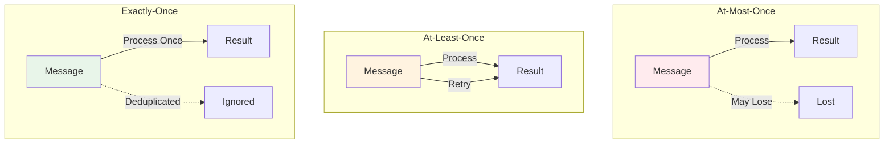

# Consistency Models

> **Stage**: Knowledge/01-concept-atlas | **Prerequisites**: [State Management Concepts](state-management-concepts.md) | **Formalization Level**: L4-L5
> **Translation Date**: 2026-04-21

## Abstract

Consistency models define the observable behavior of data operations in distributed systems. This document formalizes At-Most-Once, At-Least-Once, and Exactly-Once semantics, along with end-to-end consistency guarantees and their engineering implications.

---

## 1. Definitions

### Def-K-05-01 (Consistency Model)

A **consistency model** defines valid execution orderings of operations in distributed systems:

$$\text{ConsistencyModel} = \{ \text{AtMostOnce}, \text{AtLeastOnce}, \text{ExactlyOnce} \}$$

### Def-K-05-02 (At-Most-Once)

**At-Most-Once** guarantees each message is processed at most once:

$$\forall m \in \text{Messages}: \text{Count}_{process}(m) \leq 1$$

**Characteristics**:
- May lose data, never duplicates
- Simplest implementation
- Suitable for logging, metrics, loss-tolerant scenarios

### Def-K-05-03 (At-Least-Once)

**At-Least-Once** guarantees each message is processed at least once:

$$\forall m \in \text{Messages}: \text{Count}_{process}(m) \geq 1$$

**Characteristics**:
- No data loss, may duplicate
- Requires idempotency or deduplication
- Suitable for most business applications

### Def-K-05-04 (Exactly-Once)

**Exactly-Once** guarantees each message is processed exactly once:

$$\forall m \in \text{Messages}: \text{Count}_{process}(m) = 1$$

**Characteristics**:
- No data loss, no duplicates
- Complex implementation, performance overhead
- Required for financial transactions, order processing

### 1.2 End-to-End Consistency

**End-to-End Exactly-Once** requires consistency across the entire pipeline:

$$\text{EndToEndEO} = \text{SourceEO} \land \text{ProcessingEO} \land \text{SinkEO}$$

A system with Exactly-Once processing but At-Least-Once sink does **not** provide end-to-end Exactly-Once.

---

## 2. Properties

### Lemma-K-05-01 (Exactly-Once implies At-Least-Once)

If a system provides Exactly-Once semantics, it also provides At-Least-Once:

$$\text{ExactlyOnce} \Rightarrow \text{AtLeastOnce}$$

**Proof.** $\forall m: \text{Count}(m) = 1 \Rightarrow \text{Count}(m) \geq 1$. ∎

### Lemma-K-05-02 (At-Most-Once + At-Least-Once = Exactly-Once)

A system providing both At-Most-Once and At-Least-Once provides Exactly-Once:

$$(\forall m: \text{Count}(m) \leq 1) \land (\forall m: \text{Count}(m) \geq 1) \Rightarrow \forall m: \text{Count}(m) = 1$$

**Proof.** Direct from the definition of equality. ∎

---

## 3. Relations

### Relation 1: Consistency and State Management

Exactly-Once requires idempotent state updates. The state backend must support:
- Atomic multi-key updates
- Transactional snapshots
- Deduplication via transaction IDs

### Relation 2: Consistency and Checkpointing

Flink's Exactly-Once is implemented via:
1. Barriers propagate through the dataflow
2. Operator states are snapshotted asynchronously
3. Sink commits transactions atomically on checkpoint completion

### Relation 3: CAP Trade-off

| Consistency | Partition Tolerance | Availability |
|-------------|---------------------|--------------|
| Exactly-Once | Required | Reduced (coordination overhead) |
| At-Least-Once | Required | High |
| At-Most-Once | Required | Maximum |

---

## 4. Engineering Implications

### 4.1 Idempotency Patterns

```java
// Idempotent state update via transaction ID dedup
ValueState<Set<String>> processedIds = ...;

public void process(Event event) {
    Set<String> ids = processedIds.value();
    if (!ids.contains(event.getTxnId())) {
        // Process event
        ids.add(event.getTxnId());
        processedIds.update(ids);
    }
}
```

### 4.2 Two-Phase Commit for Exactly-Once Sinks

```
Phase 1 (Pre-commit):
  - Flush buffered data
  - Record transaction metadata in state
  - Acknowledge checkpoint

Phase 2 (Commit on checkpoint success):
  - Commit transaction to external system
  - On failure: rollback and retry from last successful checkpoint
```

---

## 5. Visualizations



---

## 6. References

[^1]: J. Armstrong, "Making Reliable Distributed Systems in the Presence of Software Errors", KTH PhD Thesis, 2003.
[^2]: M. Kleppmann, "Designing Data-Intensive Applications", O'Reilly, 2017.
[^3]: Apache Flink Documentation, "Exactly-Once Semantics", 2025.
[^4]: S. Gilbert & N. Lynch, "Brewer's Conjecture and the Feasibility of Consistent, Available, Partition-Tolerant Web Services", ACM SIGACT, 2002.
