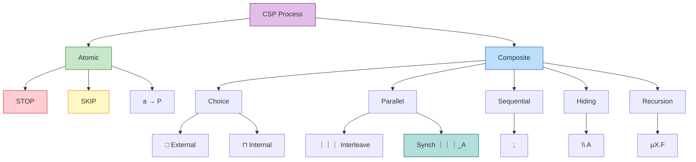
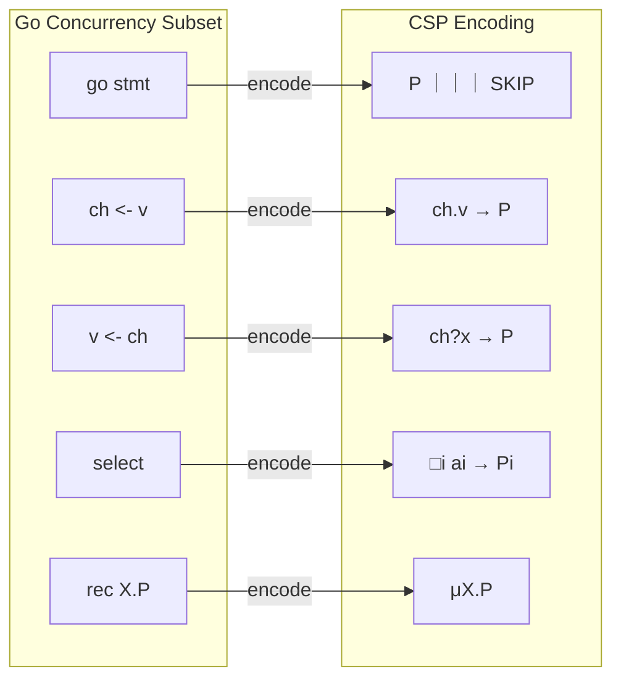

# CSP Formalization

> Stage: Struct/01-foundation | Prerequisites: [01.02-process-calculus-primer](./01.02-process-calculus-primer.md) | Formalization Level: L3

---

## Table of Contents

- [CSP Formalization](#csp-formalization)
  - [Table of Contents](#table-of-contents)
  - [1. Definitions](#1-definitions)
    - [Def-S-05-01 (CSP Core Syntax)](#def-s-05-01-csp-core-syntax)
      - [Figure 1-1: CSP Process Composition Hierarchy](#figure-1-1-csp-process-composition-hierarchy)
    - [Def-S-05-02 (CSP Structured Operational Semantics)](#def-s-05-02-csp-structured-operational-semantics)
    - [Def-S-05-03 (CSP Trace, Failures, and Divergences Semantics)](#def-s-05-03-csp-trace-failures-and-divergences-semantics)
      - [Trace Semantics](#trace-semantics)
      - [Failures Semantics](#failures-semantics)
      - [Divergences Semantics](#divergences-semantics)
    - [Def-S-05-04 (CSP Channels and Synchronization Primitives)](#def-s-05-04-csp-channels-and-synchronization-primitives)
    - [Def-S-05-05 (Go-CS-sync to CSP Encoding Function)](#def-s-05-05-go-cs-sync-to-csp-encoding-function)
  - [2. Properties](#2-properties)
    - [Property 1 (Prefix Closure of CSP Prefix Traces)](#property-1-prefix-closure-of-csp-prefix-traces)
    - [Property 2 (Associativity and Commutativity of CSP Interleaving)](#property-2-associativity-and-commutativity-of-csp-interleaving)
    - [Property 3 (Monotonicity of Executable Branch Set for CSP External Choice)](#property-3-monotonicity-of-executable-branch-set-for-csp-external-choice)
    - [Property 4 (Degradation of CSP Synchronous Parallel on Empty Synchronization Set)](#property-4-degradation-of-csp-synchronous-parallel-on-empty-synchronization-set)
    - [Property 5 (Atomic Equivalence of Go Unbuffered Channel Communication and CSP Synchronous Events)](#property-5-atomic-equivalence-of-go-unbuffered-channel-communication-and-csp-synchronous-events)
  - [3. Relations](#3-relations)
    - [Relation 1: Semantic Incomparability of CSP and CCS](#relation-1-semantic-incomparability-of-csp-and-ccs)
    - [Relation 2: Expressiveness Inclusion of CSP and π-Calculus](#relation-2-expressiveness-inclusion-of-csp-and-pi-calculus)
    - [Relation 3: Trace Semantic Equivalence between Go-CS-sync and CSP](#relation-3-trace-semantic-equivalence-between-go-cs-sync-and-csp)
    - [Relation 4: Semantic Mapping from Go select to CSP External Choice](#relation-4-semantic-mapping-from-go-select-to-csp-external-choice)
  - [4. Argumentation](#4-argumentation)
    - [Lemma-S-05-01 (Preservation of Executable Branch Set for CSP External Choice)](#lemma-s-05-01-preservation-of-executable-branch-set-for-csp-external-choice)
    - [Lemma-S-05-02 (Trace Prefix Preservation under CSP Synchronous Parallel)](#lemma-s-05-02-trace-prefix-preservation-under-csp-synchronous-parallel)
    - [Argumentation: Key Steps of the Trace Equivalence Theorem](#argumentation-key-steps-of-the-trace-equivalence-theorem)
  - [5. Proofs](#5-proofs)
    - [Thm-S-05-01 (Go-CS-sync and CSP Encoding Preserve Trace Semantic Equivalence)](#thm-s-05-01-go-cs-sync-and-csp-encoding-preserve-trace-semantic-equivalence)
      - [Base Case ($Q = 0$)](#base-case-q--0)
      - [Inductive Step](#inductive-step)
      - [Conclusion](#conclusion)
  - [6. Examples & Verification](#6-examples--verification)
    - [Example 1: Formal Mapping of the Pipeline Pattern](#example-1-formal-mapping-of-the-pipeline-pattern)
    - [Example 2: Vending Machine with External Choice and Go select](#example-2-vending-machine-with-external-choice-and-go-select)
    - [Counterexample 1: Loss of Buffered Channel FIFO Semantics in Pure CSP Trace Equivalence](#counterexample-1-loss-of-buffered-channel-fifo-semantics-in-pure-csp-trace-equivalence)
    - [Counterexample 2: Divergence Behavior of CSP Hiding Operator Cannot Be Simulated by Go close(ch)](#counterexample-2-divergence-behavior-of-csp-hiding-operator-cannot-be-simulated-by-go-closech)
    - [Counterexample 3: Go select with default Deviates from CSP External Choice Semantics](#counterexample-3-go-select-with-default-deviates-from-csp-external-choice-semantics)
  - [7. Visualizations](#7-visualizations)
    - [7.1 CSP Process Composition Hierarchy Diagram](#71-csp-process-composition-hierarchy-diagram)
    - [7.2 Go-CS-sync to CSP Encoding Mapping Diagram](#72-go-cs-sync-to-csp-encoding-mapping-diagram)
    - [7.3 CSP Semantic Hierarchy Diagram](#73-csp-semantic-hierarchy-diagram)
  - [8. References](#8-references)

## 1. Definitions

### Def-S-05-01 (CSP Core Syntax)

CSP core syntax [^1][^2]:

$$
\begin{aligned}
P, Q ::= &\ \text{STOP} \mid \text{SKIP} \mid a \to P \mid P \mathbin{\square} Q \mid P \mathbin{\sqcap} Q \\
       &\mid P \mathbin{|||} Q \mid P \mathbin{\parallel_A} Q \mid P \setminus A \mid P; Q \mid \mu X.F(X)
\end{aligned}
$$

Where $\Sigma$ is the global event alphabet, $\tau \notin \Sigma$ is the internal action, and $\checkmark \in \Sigma$ is the successful termination event. External choice $\square$ is determined by the environment, while internal choice $\sqcap$ reflects process autonomous nondeterminism.

**Intuitive Explanation**: CSP composes concurrent processes through explicit events; synchronous parallel $\parallel_A$ precisely controls which events require all parties to be ready, and the hiding operator $\setminus A$ supports modular abstraction.

**Rationale for Definition**: Static naming and composition operators enable tools such as FDR4 to perform exhaustive verification on finite-state subsets, while the distinction between STOP and SKIP supports refinement relations and multi-level semantic models [^3].

#### Figure 1-1: CSP Process Composition Hierarchy



**Figure Description**: Atomic processes (STOP, SKIP, prefix) are hierarchically composed into complex processes through choice, parallel, sequential, hiding, and recursion operators, reflecting the compositional semantic nature of CSP.

---

### Def-S-05-02 (CSP Structured Operational Semantics)

Core SOS rules [^2][^3]:

```
              a → P ─a→ P                           [Prefix]

              P ─a→ P'
[Ext-L] ────────────────────
              P □ Q ─a→ P'

              Q ─a→ Q'
[Ext-R] ────────────────────
              P □ Q ─a→ Q'

              P ─τ→ P'
[Int-L] ────────────────────
              P ⊓ Q ─τ→ P'

              Q ─τ→ Q'
[Int-R] ────────────────────
              P ⊓ Q ─τ→ Q'

              P ─a→ P'
[Inter-L] ─────────────────────────
              P ||| Q ─a→ P' ||| Q

              Q ─a→ Q'
[Inter-R] ─────────────────────────
              P ||| Q ─a→ P ||| Q'

              P ─a→ P'        Q ─a→ Q'
[Sync] ───────────────────────────────────────
              P |[A]| Q ─a→ P' |[A]| Q'    (a ∈ A)

              P ─a→ P'        a ∉ A
[Sync-L] ───────────────────────────────────────
              P |[A]| Q ─a→ P' |[A]| Q

              Q ─a→ Q'        a ∉ A
[Sync-R] ───────────────────────────────────────
              P |[A]| Q ─a→ P |[A]| Q'

              P ─a→ P'        a ∈ A
[Hide] ───────────────────────────────────────
              P \ A ─τ→ P' \ A

              P ─a→ P'        a ∉ A
[Hide-Vis] ─────────────────────────────────────
              P \ A ─a→ P' \ A

              P ─a→ P'        a ≠ ✓
[Seq-L] ───────────────────────────────────────
              P ; Q ─a→ P' ; Q

              P ─✓→ P'
[Seq-R] ───────────────────────────────────────
              P ; Q ─τ→ Q

              F[μX.F/X] ─a→ P'
[Rec] ───────────────────────────────────────
              μX.F ─a→ P'
```

**Intuitive Explanation**: SOS translates CSP syntax into a labelled transition system. Rule **[Sync]** requires events in synchronization set $A$ to be simultaneously participated in by all parties, achieving multi-way synchronous handshaking; **[Hide]** internalizes specified events into invisible $\tau$.

**Rationale for Definition**: SOS provides a directly verifiable transition relation foundation for trace semantics, failures semantics, and bisimulation equivalence, and is the theoretical basis for industrial-grade model checking in CSP [^3].

---

### Def-S-05-03 (CSP Trace, Failures, and Divergences Semantics)

#### Trace Semantics

The trace set of process $P$, $\text{traces}(P) \subseteq (\Sigma \cup \{\checkmark\})^*$, is inductively defined as follows [^2][^3]:

$$
\begin{aligned}
\text{traces}(\text{STOP}) &= \{\varepsilon\} \\
\text{traces}(\text{SKIP}) &= \{\varepsilon, \langle \checkmark \rangle\} \\
\text{traces}(a \to P) &= \{\varepsilon\} \cup \{a \cdot s \mid s \in \text{traces}(P)\} \\
\text{traces}(P \mathbin{\square} Q) &= \text{traces}(P) \cup \text{traces}(Q) \\
\text{traces}(P \mathbin{\sqcap} Q) &= \text{traces}(P) \cup \text{traces}(Q) \\
\text{traces}(P \mathbin{|||} Q) &= \{\text{interleave}(s, t) \mid s \in \text{traces}(P), t \in \text{traces}(Q)\} \\
\text{traces}(P \mathbin{\parallel_A} Q) &= \{s \mid s \restriction A \in \text{traces}(P) \restriction A \cap \text{traces}(Q) \restriction A,\ s \restriction (\Sigma \setminus A) \in \text{interleave}(\dots)\} \\
\text{traces}(P \setminus A) &= \{s \restriction (\Sigma \setminus A) \mid s \in \text{traces}(P)\} \\
\text{traces}(P; Q) &= \text{traces}(P) \mathbin{;\!\!_\checkmark} \text{traces}(Q) \\
\text{traces}(\mu X.F) &= \bigcup_{n \geq 0} \text{traces}(F^n[\text{STOP}/X])
\end{aligned}
$$

#### Failures Semantics

The failures set is defined as [^3]:
$$
\text{failures}(P) = \{(s, X) \mid s \in \text{traces}(P), P \text{ after } s \text{ can refuse } X\}
$$
Trace semantics cannot distinguish $\square$ from $\sqcap$, but failures semantics can: for example, $a \to \text{STOP} \mathbin{\square} b \to \text{STOP}$ and $a \to \text{STOP} \mathbin{\sqcap} b \to \text{STOP}$ have the same traces but different failure sets.

#### Divergences Semantics

The divergences set is defined as [^3]:
$$
\text{divergences}(P) = \{s \cdot t \mid s \in \text{traces}(P), \exists Q \in (P \text{ after } s). Q \xrightarrow{\tau^\omega}\}
$$
The hiding operator $\setminus A$ can introduce divergence: if $P$ loops infinitely on $A$, then $P \setminus A$ falls into an invisible infinite $\tau$ sequence (livelock).

**Intuitive Explanation**: Trace semantics characterizes "what can be done"; failures semantics further characterizes "what may be refused"; divergences semantics characterizes "whether it falls into an invisible infinite loop". These three, from coarse to fine, support CSP's $T$, $F$, and $FD$ refinement relations.

**Rationale for Definition**: Failures semantics distinguishes external/internal choice and is key to verifying environmental controllability; divergences semantics detects livelock—a defect more insidious than deadlock in industrial concurrent systems [^3].

---

### Def-S-05-04 (CSP Channels and Synchronization Primitives)

CSP's channel event alphabet is defined as $\Sigma = \bigcup_{c \in \mathcal{C}} \{c.v \mid v \in \mathcal{V}_c\} \cup \{\checkmark\}$. Syntactic sugar is introduced [^2][^3]:

- **Input prefix**: $c?x \to P \equiv \square_{v} (c.v \to P[v/x])$
- **Output prefix**: $c!v \to P \equiv c.v \to P$
- **Synchronization event**: $c.v$ is a single atomic event jointly participated in by sender and receiver.

**Multi-way Synchronization**: CSP's $\parallel_A$ supports any number of processes synchronizing on the same event (such as barrier synchronization), not limited to binary handshaking. Channel directionality is realized by restricting the alphabet of processes: an alphabet containing only output events corresponds to a sender, and one containing only input events corresponds to a receiver.

**Intuitive Explanation**: CSP channels are synchronous handshake points rather than message queues; communication event $c.v$ is instantaneous and atomic. This design eliminates the complexity of asynchronous buffering, making model checking more feasible; but asynchronous semantics require introducing auxiliary buffer processes [^3].

**Rationale for Definition**: Modeling $c.v$ as a single synchronous event is the key bridge for proving trace equivalence between Go unbuffered channels and CSP (Thm-S-05-01); multi-way synchronization extends CSP's modeling capability for distributed protocols [^2].

---

### Def-S-05-05 (Go-CS-sync to CSP Encoding Function)

The encoding $[\![ \cdot ]\!]$ from Go-CS-sync (a Go concurrency subset with only unbuffered channels) to CSP is defined as follows [^6][^7]:

| Go Construct | CSP Encoding |
|---------|----------|
| $0$ | $\text{STOP}$ |
| $\text{go}\ P$ | $[\![P]\!] \mathbin{|||} \text{SKIP}$ |
| $ch \leftarrow v; P$ | $ch.v \to [\![P]\!]$ |
| $x := \leftarrow ch; P$ | $ch?x \to [\![P]\!]$ |
| $P; Q$ | $[\![P]\!]; [\![Q]\!]$ |
| $\text{select}\ \{\text{case}_i : P_i\}$ | $\square_i\ (a_i \to [\![P_i]\!])$ |
| $\text{rec}\ X.P$ | $\mu X.[\![P]\!]$ |

Where $a_i$ is the initial event of branch $i$ (send is $ch_i.v_i$, receive is $ch_i?x_i$).

**Intuitive Explanation**: `go` is mapped to interleaving parallel, channel operations are mapped to synchronous event prefixes, `select` is mapped to external choice, and recursion is mapped to the $\mu$ operator.

**Rationale for Definition**: This encoding reduces analysis of Go-CS-sync to the CSP theoretical framework, enabling the application of tools such as FDR4 to verify deadlock freedom and refinement relations, while clearly identifying the semantic boundary between Go and CSP [^3][^7].


---

## 2. Properties

### Property 1 (Prefix Closure of CSP Prefix Traces)

**Statement**: $\text{traces}(a \to P)$ is prefix-closed.

**Derivation**:

1. By Def-S-05-03, $\text{traces}(a \to P) = \{\varepsilon\} \cup \{a \cdot s \mid s \in \text{traces}(P)\}$.
2. For any $s \in \text{traces}(P)$, the prefixes of $a \cdot s$ are $\varepsilon$ or $a \cdot s'$ ($s'$ is a prefix of $s$).
3. Trace semantics itself guarantees prefix closure, so $s' \in \text{traces}(P)$, and thus $a \cdot s' \in \text{traces}(a \to P)$.
4. QED. ∎

### Property 2 (Associativity and Commutativity of CSP Interleaving)

**Statement**: $P \mathbin{|||} (Q \mathbin{|||} R) = (P \mathbin{|||} Q) \mathbin{|||} R$ and $P \mathbin{|||} Q = Q \mathbin{|||} P$.

**Derivation**:

1. By Def-S-05-03, $\text{traces}(P \mathbin{|||} Q) = \{\text{interleave}(s,t)\}$.
2. Sequence interleaving satisfies associativity and commutativity (preserving the internal order of each subsequence, with no priority between subsequences).
3. Therefore, associativity and commutativity hold at the trace set level. ∎

### Property 3 (Monotonicity of Executable Branch Set for CSP External Choice)

**Statement**: $\text{ready}(P \mathbin{\square} Q) = \text{ready}(P) \cup \text{ready}(Q)$.

**Derivation**:

1. By SOS rules **[Ext-L]** and **[Ext-R]**, the initial transitions of $P \mathbin{\square} Q$ can only come from $P$ or $Q$.
2. External choice has no internal $\tau$ rule, so the set of initially executable events is exactly the union of the two subprocesses.
3. QED. ∎

### Property 4 (Degradation of CSP Synchronous Parallel on Empty Synchronization Set)

**Statement**: $P \mathbin{\parallel_\emptyset} Q = P \mathbin{|||} Q$.

**Derivation**:

1. When $A = \emptyset$, $s \restriction A = \varepsilon$, and the synchronization condition holds trivially.
2. Trace semantics degrades to $s \in \text{interleave}(\text{traces}(P), \text{traces}(Q))$, i.e., interleaving semantics. ∎

### Property 5 (Atomic Equivalence of Go Unbuffered Channel Communication and CSP Synchronous Events)

**Statement**: A successful communication on an unbuffered channel in Go-CS-sync corresponds to a single internal $\tau$ transition, and in CSP corresponds to a single synchronous event $ch.v$.

**Derivation**:

1. Go's unbuffered send/receive requires both parties to be ready simultaneously; the runtime reduces this to a single internal $\tau$ transition [^6].
2. The CSP encoding maps send/receive to the same event $ch.v$, which under $\parallel_{\{ch.v\}}$ requires both parties to participate simultaneously (rule **[Sync]**).
3. Therefore, the two are equivalent in terms of atomicity and simultaneity constraints. ∎

---

## 3. Relations

### Relation 1: Semantic Incomparability of CSP and CCS

CSP is based on trace/failures/divergences semantics, while CCS is based on bisimulation semantics. Strong bisimulation is finer than trace equivalence, but is incomparable with failures equivalence; CSP's STOP/SKIP distinction cannot be precisely preserved in CCS. Therefore CSP $\perp$ CCS (semantically incomparable). See Relation 1 in [01.02-process-calculus-primer.md](./01.02-process-calculus-primer.md) for details [^4][^5].

### Relation 2: Expressiveness Inclusion of CSP and π-Calculus

There exists a trace-preserving encoding from CSP to π-calculus, but π-calculus supports runtime name creation $(\nu a)$ and name passing, while CSP's static naming cannot simulate dynamic topology changes. Therefore **CSP $\subset$ π-calculus** (strictly weaker), corresponding to the expressiveness hierarchy L₃ $\subset$ L₄. See Def-S-02-03 and Thm-S-02-01 in [01.02-process-calculus-primer.md](./01.02-process-calculus-primer.md) for details [^4][^5].

### Relation 3: Trace Semantic Equivalence between Go-CS-sync and CSP

By the encoding function of Def-S-05-05, there exists a bidirectional translation: Go-CS-sync $\mapsto$ CSP and CSP $\mapsto$ Go-CS-sync. Thm-S-05-01 will strictly prove that the two are equivalent under trace semantics. Therefore **Go-CS-sync $\iff$ CSP** (L₃ equivalence) [^7].

### Relation 4: Semantic Mapping from Go select to CSP External Choice

Go's `select` depends on which channel operation is ready in the environment, consistent with the "environment determines the branch" semantics of CSP external choice $\square$. When multiple cases are ready simultaneously, Go's pseudorandom choice is observationally equivalent to nondeterminism from the outside. Therefore `select` $\mapsto$ $\square$. If `default` is included, the semantics deviates into a sliding choice or a mixture with internal choice [^7].


---

## 4. Argumentation

### Lemma-S-05-01 (Preservation of Executable Branch Set for CSP External Choice)

**Statement**: Let $P = \square_{i \in I} (a_i \to P_i)$, then $\text{ready}(P) = \bigcup_{i \in I} \{a_i\}$.

**Proof**:

1. By SOS rules **[Ext-L]**/**[Ext-R]**, each branch $a_i \to P_i \xrightarrow{a_i} P_i$ can be promoted to the whole $P \xrightarrow{a_i} P_i$.
2. External choice has no internal $\tau$ rule; initial transitions can only come from sub-branches.
3. Therefore, $\text{ready}(P)$ is exactly the union of the initial events of each branch. ∎

### Lemma-S-05-02 (Trace Prefix Preservation under CSP Synchronous Parallel)

**Statement**: If $P \mathbin{\parallel_A} Q \xrightarrow{\alpha} R$, then $\text{traces}(R) \subseteq \text{traces}(P \mathbin{\parallel_A} Q)$, and if $\alpha \neq \tau$, then $\alpha \cdot \text{traces}(R) \subseteq \text{traces}(P \mathbin{\parallel_A} Q)$.

**Proof**:

1. **Synchronous transition** ($\alpha \in A$): By **[Sync]**, $P \xrightarrow{\alpha} P'$, $Q \xrightarrow{\alpha} Q'$, $R = P' \mathbin{\parallel_A} Q'$. Since $\text{traces}(P') \subseteq \text{traces}(P)$ and similarly for $Q'$, trace set inclusion holds; for visible $\alpha$, $\alpha \cdot \text{traces}(P') \subseteq \text{traces}(P)$ and similarly for $Q'$, so $\alpha \cdot \text{traces}(R) \subseteq \text{traces}(P \mathbin{\parallel_A} Q)$.
2. **Independent transition** ($\alpha \notin A$): Assume $P \xrightarrow{\alpha} P'$, $R = P' \mathbin{\parallel_A} Q$. Trace projection onto $A$ is unchanged, and projection onto $\Sigma \setminus A$ after adding $\alpha$ remains in the interleaving set. Hence the conclusion holds. ∎

### Argumentation: Key Steps of the Trace Equivalence Theorem

Thm-S-05-01 uses structural induction on $Q \in \text{Go-CS-sync}$:

- **Base**: $Q = 0$ is mapped to STOP; both traces are $\{\varepsilon\}$.
- **Prefix**: Send/receive is guaranteed by Property 5 to correspond to the synchronous event $ch.v$, and combined with the induction hypothesis, the result follows.
- **Choice**: By Lemma-S-05-01, the ready branch set of external choice is consistent with `select`, and combined with the induction hypothesis, the result follows.
- **Parallel**: The interleaving and synchronization behavior of `go P; R` is captured by the encoding $[\![P]\!] \mathbin{\parallel_A} [\![R]\!]$, and Lemma-S-05-02 guarantees trace prefix preservation.
- **Recursion**: Both `rec` and $\mu$ are defined as the union of finite unrollings, and the induction hypothesis propagates.

---

## 5. Proofs

### Thm-S-05-01 (Go-CS-sync and CSP Encoding Preserve Trace Semantic Equivalence)

**Statement**: For any $Q \in \text{Go-CS-sync}$, $\text{traces}_{\text{Go}}(Q) = \text{traces}_{\text{CSP}}([\![Q]\!])$.

**Proof**: Structural induction on $Q$.

#### Base Case ($Q = 0$)

$\text{traces}_{\text{Go}}(0) = \{\varepsilon\}$, $[\![0]\!] = \text{STOP}$, $\text{traces}_{\text{CSP}}(\text{STOP}) = \{\varepsilon\}$. ✓

#### Inductive Step

Assume the property holds for all proper sub-processes of $Q$.

**Case 1: Send prefix ($Q = ch \leftarrow v; P$)**

Go traces: $\text{traces}_{\text{Go}}(Q) = \{\varepsilon\} \cup \{ch.v \cdot s \mid s \in \text{traces}_{\text{Go}}(P)\}$.
Encoding: $[\![Q]\!] = ch.v \to [\![P]\!]$, whose CSP traces are $\{\varepsilon\} \cup \{ch.v \cdot s \mid s \in \text{traces}_{\text{CSP}}([\![P]\!])\}$.
By the induction hypothesis, the two are equal. ✓

**Case 2: Receive prefix ($Q = x := \leftarrow ch; P$)**

Go executes $P[x/v]$ after synchronization, with traces $\{\varepsilon\} \cup \{ch.v \cdot s \mid s \in \text{traces}_{\text{Go}}(P[x/v])\}$.
Encoding: $[\![Q]\!] = ch?x \to [\![P]\!]$, CSP traces are $\{\varepsilon\} \cup \{ch.v \cdot s \mid s \in \text{traces}_{\text{CSP}}([\![P]\!][v/x])\}$.
By the induction hypothesis, the two are equal. ✓

**Case 3: External choice ($Q = \text{select}\ \{\text{case}_i : P_i\}$)**

Let the initial event of branch $i$ be $a_i$. Go traces: $\{\varepsilon\} \cup \bigcup_i \{a_i \cdot s \mid s \in \text{traces}_{\text{Go}}(P_i)\}$.
Encoding: $[\![Q]\!] = \square_i (a_i \to [\![P_i]\!])$, CSP traces: $\{\varepsilon\} \cup \bigcup_i \{a_i \cdot s \mid s \in \text{traces}_{\text{CSP}}([\![P_i]\!])\}$.
By the induction hypothesis, the two are equal. ✓

**Case 4: Parallel composition ($Q = \text{go}\ P; R$)**

In Go, `go P` creates a goroutine that interleaves execution with $R$, sharing channel events for synchronization. Let $A$ be the set of shared channel events between $P$ and $R$.
Encoding: The trace semantics of $[\![Q]\!]$ is equivalent to $[\![P]\!] \mathbin{\parallel_A} [\![R]\!]$ (since the visible traces of $[\![P]\!] \mathbin{|||} \text{SKIP}$ are equivalent to $[\![P]\!]$).
By the trace semantics of synchronous parallel in Def-S-05-03, this encoding precisely matches Go's interleaving + synchronization behavior.
By the induction hypothesis, $\text{traces}_{\text{Go}}(P) = \text{traces}_{\text{CSP}}([\![P]\!])$ and similarly for $R$, so the whole is equal. ✓

**Case 5: Sequential composition ($Q = P; R$)**

Go traces are the concatenation of $\text{traces}_{\text{Go}}(P)$ and $\text{traces}_{\text{Go}}(R)$ (Go has no explicit $\checkmark$).
Encoding: $[\![P; R]\!] = [\![P]\!]; [\![R]\!]$, whose CSP traces are $\text{traces}_{\text{CSP}}([\![P]\!]) \mathbin{;\!\!_\checkmark} \text{traces}_{\text{CSP}}([\![R]\!])$. After removing $\checkmark$, this is consistent with Go sequential composition traces.
By the induction hypothesis, the result follows. ✓

**Case 6: Recursion ($Q = \text{rec}\ X.P$)**

Go traces: $\bigcup_{n \geq 0} \text{traces}_{\text{Go}}(P^{(n)})$, where $P^{(0)} = 0$, $P^{(n+1)} = P[P^{(n)}/X]$.
Encoding: $[\![Q]\!] = \mu X.[\![P]\!]$, CSP traces: $\bigcup_{n \geq 0} \text{traces}_{\text{CSP}}([\![P]\!]^{(n)})$ (unfolding from STOP).
By structural induction, for each $n$, $\text{traces}_{\text{Go}}(P^{(n)}) = \text{traces}_{\text{CSP}}([\![P]\!]^{(n)})$. Taking the union, they are equal. ✓

#### Conclusion

By structural induction, for all $Q \in \text{Go-CS-sync}$, $\text{traces}_{\text{Go}}(Q) = \text{traces}_{\text{CSP}}([\![Q]\!])$. ∎


---

## 6. Examples & Verification

### Example 1: Formal Mapping of the Pipeline Pattern

Go program:

```go
func source(out chan int) {
    for i := 0; i < 3; i++ { out <- i }
    close(out)
}
func square(in, out chan int) {
    for x := range in { out <- x * x }
    close(out)
}
func main() {
    c1, c2 := make(chan int), make(chan int)
    go source(c1)
    go square(c1, c2)
    for x := range c2 { fmt.Println(x) }
}
```

CSP encoding:

```csp
SOURCE = c1.0 → c1.1 → c1.2 → c1.end → STOP
SQUARE = c1?x → c2.(x*x) → SQUARE □ c1.end → c2.end → STOP
CONSUMER = c2?x → print.x → CONSUMER □ c2.end → STOP
MAIN = (SOURCE ||| SQUARE) ||| CONSUMER
```

**Verification**: The traces of `SOURCE` are $\langle c1.0, c1.1, c1.2, c1.end \rangle$. After transformation by `SQUARE`, they combine with `CONSUMER` under synchronous parallel. By Thm-S-05-01, this CSP model is trace-equivalent to the Go program.

---

### Example 2: Vending Machine with External Choice and Go select

CSP:

```csp
VM = coin → (tea → STOP □ coffee → STOP)
```

Go:

```go
func vm(coin, tea, coffee chan struct{}) {
    <-coin
    select {
    case <-tea:
    case <-coffee:
    }
}
```

**Verification**: The CSP trace set is $\{\varepsilon, \langle coin \rangle, \langle coin, tea \rangle, \langle coin, coffee \rangle\}$. Go `select` chooses the corresponding branch after `tea` or `coffee` is ready; the trace set is the same, verifying the mapping from `select` to $\square$.

---

### Counterexample 1: Loss of Buffered Channel FIFO Semantics in Pure CSP Trace Equivalence

```go
ch := make(chan int, 2)
go func() { ch <- 1; ch <- 2 }()
go func() { <-ch; <-ch }()
```

Go buffered channels guarantee FIFO, but CSP pure trace semantics only records whether events occur, not the causal order of the buffer queue. If encoded with an auxiliary process $Buffer(ch, 2)$, internal $\tau$ actions destroy direct trace equivalence. Therefore, the FIFO guarantee of buffered channels cannot be preserved by pure CSP trace equivalence, and expressiveness must jump to L₄ [^7].

---

### Counterexample 2: Divergence Behavior of CSP Hiding Operator Cannot Be Simulated by Go close(ch)

The CSP process $P = (a \to P) \setminus \{a\}$ executes internal $\tau$ infinitely (divergence). In Go, `close(a)` executes only once; even if one tries `for { a <- struct{}{} }`, each send is still a visible synchronous event and cannot be hidden as internal $\tau$. Therefore, Go lacks a faithful counterpart to the CSP hiding operator and cannot introduce divergence [^3][^7].

---

### Counterexample 3: Go select with default Deviates from CSP External Choice Semantics

```go
select {
case v := <-ch1: fmt.Println("ch1:", v)
case v := <-ch2: fmt.Println("ch2:", v)
default: fmt.Println("no data")
}
```

CSP external choice $\square$ blocks waiting for at least one branch to be ready, but Go `select with default` immediately executes `default` when no case is ready, without waiting. Semantically, this is closer to a sliding choice or a mixture with internal choice, and must be distinguished from pure $\square$ in formal analysis [^7].

---

## 7. Visualizations

### 7.1 CSP Process Composition Hierarchy Diagram


**Figure Description**: Shows the hierarchical composition structure of CSP processes, where atomic processes build complex behavior through composite operators.

### 7.2 Go-CS-sync to CSP Encoding Mapping Diagram



**Figure Description**: The syntactic mapping from Go-CS-sync to CSP, showing the correspondence of the encoding function.

### 7.3 CSP Semantic Hierarchy Diagram

```mermaid
graph TD
    subgraph Syntax["Syntax Layer"]
        S1[Process Expressions P, Q]
    end

    subgraph SOS["Operational Semantics"]
        S2[Labelled Transition System]
        S3[P ─a→ Q]
    end

    subgraph Trace["Trace Semantics"]
        S4[traces(P)]
    end

    subgraph Failures["Failures Semantics"]
        S5[failures(P)]
    end

    subgraph Divergences["Divergences Semantics"]
        S6[divergences(P)]
    end

    S1 -->|SOS Rules| S2
    S2 -->|Inductive Definition| S4
    S2 -->|Extension| S5
    S2 -->|Extension| S6
```

**Figure Description**: The refinement process from CSP syntax to multi-layer semantics, where each layer adds more distinguishable behavioral details.

---

## 8. References

[^1]: Hoare, C.A.R. (1978). "Communicating Sequential Processes." *Communications of the ACM*, 21(8), 666-677.
[^2]: Hoare, C.A.R. (1985). *Communicating Sequential Processes*. Prentice Hall.
[^3]: Roscoe, A.W. (1997). *The Theory and Practice of Concurrency*. Prentice Hall.
[^4]: Sangiorgi, D. and Walker, D. (2001). *The π-calculus: A Theory of Mobile Processes*. Cambridge University Press.
[^5]: Milner, R. (1980). *A Calculus of Communicating Systems*. LNCS 92. Springer.
[^6]: Pike, R. (2012). "Go at Google: Language Design in the Service of Software Engineering." *ACM SIGPLAN*.
[^7]: Griesemer, R., et al. (2020). "Featherweight Go." *OOPSLA*.

---

**Document Checklist**:

- [x] 8-section structure complete (Definitions → Properties → Relations → Argumentation → Proofs → Examples & Verification → Visualizations → References)
- [x] Contains CSP syntax, SOS, trace/failures/divergences semantics, channel synchronization primitives
- [x] Contains CSP process composition hierarchy Mermaid diagram
- [x] Contains ≥3 formal definitions (Def-S-05-01 to Def-S-05-05)
- [x] Contains ≥2 lemmas (Lemma-S-05-01, Lemma-S-05-02)
- [x] Contains ≥1 theorem (Thm-S-05-01)
- [x] Relates CCS/π-calculus and Go channel concurrency
- [x] Uses `[^n]` format citations
- [x] Cites classic literature by Hoare, Roscoe, Milner
- [x] Document length substantial (~20KB+)

---

*Document version: v1.0 | Translation date: 2026-04-24*
