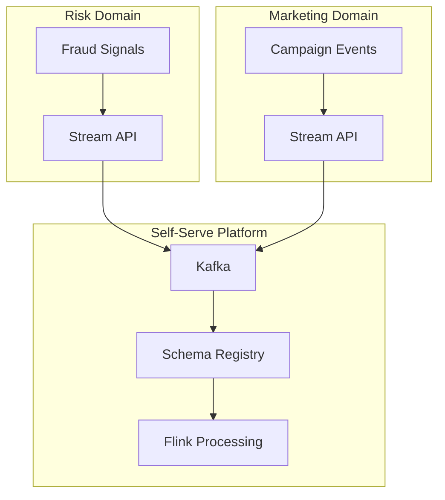

# Data Mesh & Streaming Integration: 2026 Architecture Guide

> **Stage**: Knowledge | **Prerequisites**: [Streaming Data Products](../streaming-data-product-economics.md) | **Formal Level**: L4
>
> Domain-oriented decentralized data architecture with streaming data products and federated governance.

---

## 1. Definitions

**Def-K-03-26: Data Mesh**

Decentralized data architecture paradigm:

$$
\text{Data Mesh} := \langle D, P, I, G, F \rangle
$$

where $D$ = domains, $P$ = data products, $I$ = infrastructure, $G$ = governance, $F$ = interfaces.

**Def-K-03-27: Streaming Data Product**

A data product with real-time API, event stream, and schema registry entry.

**Def-K-03-28: Domain-Oriented Stream Ownership**

Each business domain owns its streaming data products end-to-end: schema, quality, SLAs, and consumer contracts.

---

## 2. Properties

**Prop-K-03-13: Scalability Boundary**

Data Mesh scales linearly with domain count because domains are independent except for standardized interfaces.

**Prop-K-03-14: Governance Complexity**

Governance complexity is $O(|D|)$ for decentralized vs $O(|D|^2)$ for centralized approaches.

---

## 3. Relations

- **with Data Fabric**: Data Mesh is decentralized; Data Fabric is centralized virtual layer.
- **with Event-Driven Architecture**: Streaming data products are the backbone of event-driven systems.

---

## 4. Argumentation

**Decentralization Necessity**: Centralized data teams become bottlenecks at scale. Domain teams understand their data best and can iterate faster.

**When NOT to Use Data Mesh**:

- Small organizations (< 5 domains)
- Highly regulated industries requiring central audit
- Organizations without data engineering maturity

---

## 5. Engineering Argument

**Implementation Path**:

1. **Phase 1**: Identify domains and data product candidates
2. **Phase 2**: Build self-serve data platform (Kafka + Schema Registry + Flink)
3. **Phase 3**: Federated governance (data quality, access control, lineage)
4. **Phase 4**: Ecosystem optimization (discoverability, monetization)

---

## 6. Examples

**Financial Fraud Detection Data Product**:

```yaml
data_product:
  name: real-time-fraud-signals
  domain: risk
  owner: risk-platform-team
  interfaces:
    stream: kafka://fraud-signals/v1
    schema: registry://fraud-signals.avsc
  slas:
    latency: < 100ms p99
    availability: 99.99%
```

---

## 7. Visualizations

**Data Mesh Streaming Architecture**:



---

## 8. References
