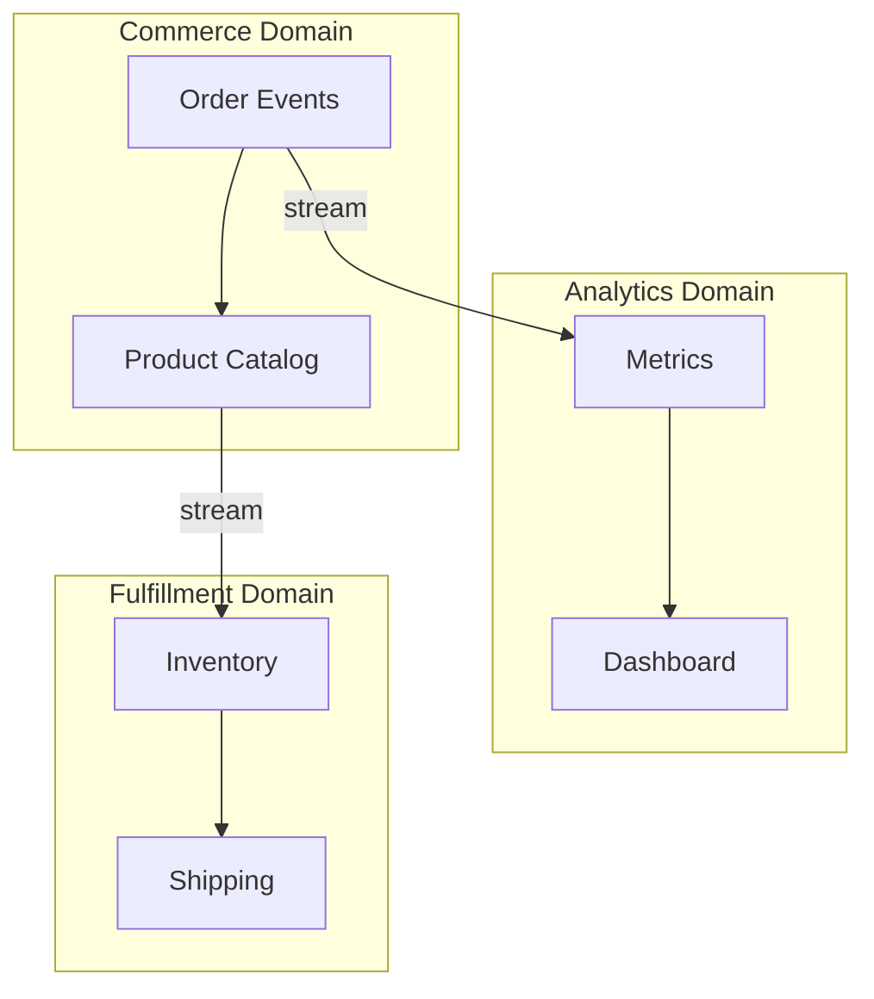

# Data Mesh & Streaming Integration Architecture

> **Stage**: Knowledge | **Prerequisites**: [Data Mesh Architecture](../data-mesh-streaming-architecture.md) | **Formal Level**: L3
>
> Streaming-native Data Mesh with domain stream autonomy, cross-domain interoperability, and latency budgeting.

---

## 1. Definitions

**Def-K-03-40: Streaming-Native Data Mesh**

$$
\mathcal{M}_{stream} = \langle \mathcal{D}, \mathcal{P}, \mathcal{I}, \mathcal{G}, \mathcal{S}, \mathcal{C} \rangle
$$

where $\mathcal{D}$ = domains, $\mathcal{P}$ = streaming data products, $\mathcal{I}$ = interoperability layer, $\mathcal{G}$ = federated governance, $\mathcal{S}$ = self-serve platform, $\mathcal{C}$ = consumption contracts.

**Def-K-03-41: Domain Stream Autonomy Boundary**

$$
\partial(d_i) = \langle \mathcal{O}_i, \mathcal{E}_i, \mathcal{T}_i, \mathcal{Q}_i, \mathcal{R}_i \rangle
$$

Autonomy degree:

$$
\alpha(d_i) = 1 - \frac{|\{op \in \mathcal{T}_i : \text{cross-domain dependency}\}|}{|\mathcal{T}_i|}
$$

---

## 2. Properties

**Prop-K-03-22: Cross-Domain Latency Accumulation**

If $d_i$ consumes $d_j$ and $d_j$ consumes $d_k$:

$$
L_{i \leftarrow k} = L_{i \leftarrow j} + L_{j \leftarrow k}
$$

**Prop-K-03-23: Autonomy-Consistency Trade-off**

Higher autonomy ($\alpha \to 1$) reduces cross-domain consistency guarantees.

---

## 3. Relations

- **with Traditional Data Mesh**: Streaming-native mesh uses event streams as primary data product form.
- **with Data Fabric**: Data Mesh is decentralized; Data Fabric provides centralized virtual layer.

---

## 4. Argumentation

**Latency Budget Allocation**: For nested domain chains ($d_1 \leftarrow d_2 \leftarrow d_3 \leftarrow d_4$), allocate per-hop latency budgets to ensure end-to-end SLA compliance.

**Interoperability Layer**:

| Component | Purpose |
|-----------|---------|
| Schema Registry | Cross-domain schema evolution |
| Event Catalog | Data product discoverability |
| SLA Contracts | Quality guarantees |

---

## 5. Engineering Argument

**Streaming Data Product Contract**: Each data product specifies:

- Schema (Avro/Protobuf/JSON Schema)
- Latency SLA (e.g., < 1s p99)
- Freshness guarantee
- Access control (RBAC)
- Pricing tier

---

## 6. Examples

```yaml
# Data product manifest
data_product:
  name: order-events
  domain: commerce
  interfaces:
    stream: kafka://order-events/v2
    schema: registry://order.avsc
  sla:
    latency: < 500ms p99
    freshness: < 1s
  consumers:
    - domain: analytics
      purpose: real-time-dashboard
    - domain: fulfillment
      purpose: inventory-update
```

---

## 7. Visualizations

**Streaming Data Mesh**:



---

## 8. References
