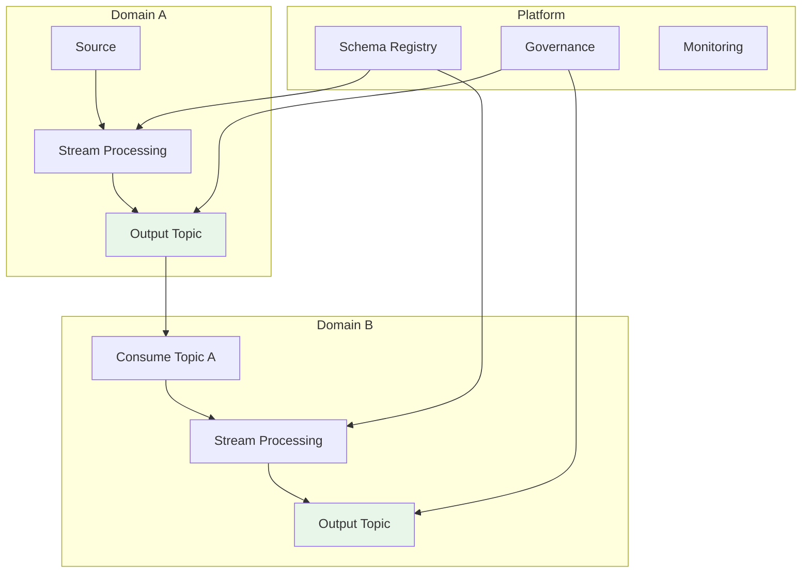

# Data Mesh and Streaming Integration Architecture

> **Stage**: Knowledge/03-business-patterns | **Prerequisites**: [Data Mesh Streaming Architecture](data-mesh-streaming-architecture-2026.md) | **Formalization Level**: L3
> **Translation Date**: 2026-04-21

## Abstract

**Streaming-Native Data Mesh** extends the Data Mesh paradigm by treating event streams as the primary data product interface. This pattern formalizes domain autonomy boundaries, cross-domain streaming contracts, and self-serve stream processing infrastructure.

---

## 1. Definitions

### Def-K-03-60-01 (Streaming-Native Data Mesh)

A **streaming-native data mesh** $\mathcal{M}_{stream}$ is a 6-tuple:

$$\mathcal{M}_{stream} = \langle \mathcal{D}, \mathcal{P}, \mathcal{I}, \mathcal{G}, \mathcal{S}, \mathcal{C} \rangle$$

where:
- $\mathcal{D} = \{d_1, \ldots, d_n\}$: business domains, each with autonomous data product teams
- $\mathcal{P}$: data products, each providing **stream interfaces** as primary output (Kafka topics, event streams, CDC feeds)
- $\mathcal{I}$: interoperability layer (Schema Registry, Event Catalog, SLA Contracts)
- $\mathcal{G}$: federated governance framework
- $\mathcal{S}$: self-serve platform (Stream Processing as a Service)
- $\mathcal{C}$: consumption contracts (QoS, access control, billing)

**Difference from traditional Data Mesh**: Traditional Data Mesh uses **datasets/tables** as core products; streaming-native uses **event streams/change feeds** with low-latency, continuously updated interfaces.

### Def-K-03-60-02 (Domain Stream Autonomy Boundary)

Domain $d_i$'s **stream autonomy boundary** $\partial(d_i)$:

$$\partial(d_i) = \langle \mathcal{O}_i, \mathcal{E}_i, \mathcal{T}_i, \mathcal{Q}_i, \mathcal{R}_i \rangle$$

where:
- $\mathcal{O}_i$: output streams owned by $d_i$
- $\mathcal{E}_i$: input streams consumed from other domains
- $\mathcal{T}_i$: internal stream processing topology
- $\mathcal{Q}_i$: SLA quality contracts (latency, freshness, availability)
- $\mathcal{R}_i$: resource budget and quota

**Autonomy metric**:

$$\alpha(d_i) = 1 - \frac{|\{op \in \mathcal{T}_i : \text{cross-domain dependency}\}|}{|\mathcal{T}_i|}$$

Full autonomy: $\alpha = 1$; full dependency: $\alpha = 0$.

---

## 2. Properties

### Prop-K-03-60-01 (Cross-Domain Stream Dependency Transitivity)

If domain $d_i$ depends on stream from $d_j$, and $d_j$ depends on stream from $d_k$, then $d_i$ transitively depends on $d_k$.

**Implication**: Deep dependency chains increase coupling and reduce autonomy. Recommendation: maximum dependency depth of 3.

### Prop-K-03-60-02 (Schema Evolution Contract)

Data products must guarantee backward-compatible schema evolution:

$$\text{Schema}_{v+1} \supseteq \text{Schema}_v \text{ (field addition only, no removal)}$$

or provide explicit deprecation timeline.

---

## 3. Architecture



**Domain topology**: Each domain owns its streams; cross-domain consumption via governed contracts.

---

## 4. Implementation

### 4.1 Self-Serve Stream Platform

| Capability | Technology | Responsibility |
|------------|-----------|----------------|
| Stream ingestion | Kafka Connect / Debezium | Platform team |
| Stream processing | Flink / Kafka Streams | Domain team |
| Schema governance | Confluent Schema Registry | Platform team |
| Monitoring | Prometheus + Grafana | Platform team |
| Access control | OAuth + ACLs | Platform team |

### 4.2 Data Product Contract Template

```yaml
data_product:
  name: user-behavior-events
  domain: recommendation
  owner: team-rec@company.com
  
  interface:
    type: kafka-topic
    topic: rec.user-behavior.v1
    schema: avro://registry/user-behavior.avsc
    
  qos:
    latency_p99: 500ms
    freshness: 1s
    availability: 99.9%
    
  access:
    consumers: [analytics, ml-platform]
    auth: mTLS + OAuth
```

---

## 5. References

[^1]: Z. Dehghani, "How to Move Beyond a Monolithic Data Lake to a Distributed Data Mesh", MartinFowler.com, 2019.
[^2]: Confluent, "Data Mesh and Event Streaming", 2024.
[^3]: Apache Kafka Documentation, "Kafka as a Data Mesh Backbone", 2025.
