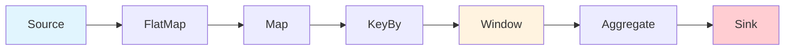

# Dataflow Model Formalization

> **Stage**: Struct/01-foundation | **Prerequisites**: [Unified Streaming Theory](unified-streaming-theory.md) | **Formalization Level**: L5
> **Translation Date**: 2026-04-21

## Abstract

The **Dataflow Model**, introduced by Akidau et al., provides a unified framework for batch and stream processing. This document formalizes the Dataflow graph, operator semantics, streams as partially ordered multisets, event-time semantics, and window formalization.

---

## 1. Definitions

### Def-S-04-01 (Dataflow Graph)

A **Dataflow graph** is a directed acyclic graph (DAG):

$$\mathcal{G} = (V, E, P, \Sigma, \mathbb{T})$$

where:

- $V = V_{src} \cup V_{op} \cup V_{sink}$: vertices (sources, operators, sinks)
- $E \subseteq V \times V$: directed edges (data channels)
- $P: V_{op} \to \mathbb{N}$: parallelism function
- $\Sigma$: state space
- $\mathbb{T}$: time domain

### Def-S-04-02 (Operator Semantics)

An operator $v \in V_{op}$ is a tuple:

$$v = (f_v, \sigma_v, \text{in}_v, \text{out}_v)$$

where:

- $f_v: \text{Input}^* \times \Sigma \to \text{Output}^* \times \Sigma$: transformation function
- $\sigma_v \in \Sigma$: operator state
- $\text{in}_v$: input ports
- $\text{out}_v$: output ports

### Def-S-04-03 (Stream as Partially Ordered Multiset)

A **stream** $S$ is a partially ordered multiset of records:

$$S = (R, \prec, \mu)$$

where:

- $R$: set of records
- $\prec \subseteq R \times R$: partial order (happens-before)
- $\mu: R \to \mathbb{N}$: multiplicity function

For event-time streams, $\prec$ is induced by event timestamps: $r_1 \prec r_2 \iff t_e(r_1) < t_e(r_2)$.

### Def-S-04-04 (Event Time, Processing Time, Watermark)

- **Event time** $t_e(r)$: when the event occurred in the physical world
- **Processing time** $t_p(r)$: when the record is processed by the system
- **Watermark** $w(t)$: progress metric in event time:

$$w(t) = \min_{s \in \text{Sources}} \left( \max_{r \in R_s(t)} t_e(r) - \delta_s \right)$$

### Def-S-04-05 (Window)

A **window** $W$ is a function from streams to finite subsets:

$$W: S \to 2^S$$

Window types:

- **Fixed (Tumbling)**: $W_k = [k\Delta, (k+1)\Delta)$
- **Sliding**: $W_k = [k\Delta_s, k\Delta_s + \Delta_w)$
- **Session**: $W = [t_{first}, t_{last} + \Delta_g)$

---

## 2. Properties

### Lemma-S-04-01 (Operator Local Determinism)

For stateless operators with deterministic $f_v$, given the same input sequence and initial state, the output sequence is uniquely determined.

### Lemma-S-04-02 (Watermark Monotonicity)

Watermarks are monotone non-decreasing in processing time:

$$t_1 \leq t_2 \Rightarrow w(t_1) \leq w(t_2)$$

### Prop-S-04-01 (Stateful Operator Idempotency Condition)

A stateful operator is idempotent under replay iff its state update is associative and commutative:

$$\text{update}(\sigma, a, b) = \text{update}(\sigma, b, a) \land \text{update}(\text{update}(\sigma, a), b) = \text{update}(\sigma, a, b)$$

---

## 3. Relations

### Relation 1: Dataflow Model $\supset$ Kahn Process Networks (KPN)

KPN is a special case of Dataflow where:

- Channels are unbounded FIFO queues
- Processes are deterministic functions
- Blocking read semantics

### Relation 2: Synchronous Dataflow (SDF) $\subset$ Dynamic Dataflow (DDF) $\approx$ Dataflow Model

| Aspect | SDF | DDF | Dataflow Model |
|--------|-----|-----|----------------|
| Rates | Fixed | Dynamic | Dynamic |
| Scheduling | Static | Dynamic | Dynamic |
| Expressiveness | Limited | Turing-complete | Turing-complete |

### Relation 3: Dataflow Theory $\mapsto$ Flink Runtime

| Theoretical Concept | Flink Implementation |
|---------------------|---------------------|
| Dataflow Graph | JobGraph / ExecutionGraph |
| Operator | Task / Subtask |
| Stream | Network Buffer Queue |
| Watermark | Event-time progress metric |
| Window | WindowOperator |

---

## 4. Determinism Theorem

### Thm-S-04-01 (Dataflow Determinism)

A Dataflow graph $\mathcal{G}$ computes a deterministic result if:

1. All operators have deterministic transformation functions
2. Watermarks propagate monotonically
3. Window triggers depend only on watermark progress
4. State snapshots are consistent (barrier-aligned)

**Proof Sketch.** By structural induction over the DAG:

- **Base**: Sources produce deterministic streams (given input)
- **Step**: Each operator's output is deterministic from deterministic inputs (Lemma-S-04-01)
- **Window completion**: Triggered by watermark, which is deterministic given source inputs
- **State recovery**: Consistent snapshots ensure deterministic restoration ∎

---

## 5. Examples

### 5.1 WordCount Dataflow Formalization

```
Source(text) → FlatMap(split) → Map((word, 1)) → KeyBy(word) → Sum(count) → Sink
```

Formalized as:

- $V_{src} = \{\text{Source}\}$, $V_{op} = \{\text{FlatMap}, \text{Map}, \text{KeyBy}, \text{Sum}\}$, $V_{sink} = \{\text{Sink}\}$
- $E = \{(\text{Source}, \text{FlatMap}), (\text{FlatMap}, \text{Map}), \ldots\}$
- $P(\text{Sum}) = N$ (parallelism for key distribution)

---

## 6. Visualizations



**Dataflow graph structure**: Directed edges represent data flow; operators transform streams.

---

## 7. References
