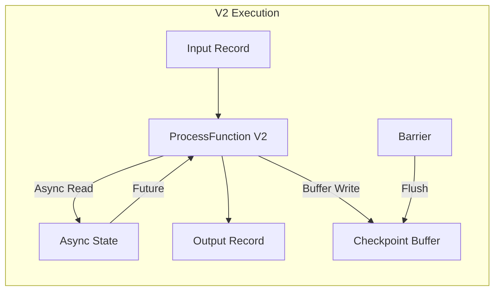

# DataStream V2 API Semantics

> **Language**: English | **Source**: [Flink/01-concepts/datastream-v2-semantics.md](../Flink/01-concepts/datastream-v2-semantics.md) | **Last Updated**: 2026-04-21

---

## 1. Definitions

### Def-F-01-EN-01: DataStream V2 Type Abstraction

$$
\text{DataStreamV2}\langle T \rangle = \langle \Sigma_T, \mathcal{E}, \mathcal{C}_{V2}, \mathcal{R}, \mathcal{A} \rangle
$$

| Symbol | Semantics |
|--------|-----------|
| $\Sigma_T$ | `Stream[T]` with elements, Watermarks, Checkpoint Barriers |
| $\mathcal{E}$ | `StreamExecutionEnvironmentV2` — declarative state + async execution |
| $\mathcal{C}_{V2}$ | `RuntimeContextV2` with type-safe `StateAccessorV2` |
| $\mathcal{R}$ | `RecordAttributes` — per-record metadata |
| $\mathcal{A}$ | `AsyncState` — non-blocking state access API |

### Def-F-01-EN-02: Async State Access

Async state access decouples state I/O from record processing:

```java
// V1: Blocking
ValueState<Integer> state = ...;
int value = state.value();  // Blocks if cache miss

// V2: Non-blocking
AsyncState<Integer> state = ...;
CompletableFuture<Integer> future = state.asyncValue();
future.thenAccept(v -> process(v));
```

### Def-F-01-EN-03: Record Attributes

Per-record metadata carried through the pipeline:

| Attribute | Type | Description |
|-----------|------|-------------|
| `timestamp` | `Long` | Event time timestamp |
| `watermark` | `Boolean` | Whether this is a watermark record |
| `barrier` | `Integer` | Checkpoint barrier ID |
| `priority` | `Integer` | Processing priority hint |

## 2. Properties

### Lemma-F-01-EN-01: V2 State Access Type Safety

V2 state accessors are parameterized by type at compile time:

$$
\forall s : \text{StateAccessorV2}\langle T \rangle. \; \text{read}(s) : \text{Future}\langle T \rangle
$$

Eliminates runtime `ClassCastException` from V1's raw `ValueState`.

### Lemma-F-01-EN-02: Async State Access Monotonicity

Async state reads observe monotonically increasing versions:

$$
\forall t_1 < t_2. \; Version(Read_{t_1}) \leq Version(Read_{t_2})
$$

### Prop-F-01-EN-01: Declarative State Idempotent Initialization

V2 state declared via annotations is idempotently initialized:

$$
\text{Init}(s) = \text{Init}(\text{Init}(s))
$$

## 3. V1 vs V2 Comparison

| Dimension | DataStream V1 | DataStream V2 |
|-----------|--------------|---------------|
| State access | Blocking | Async (non-blocking) |
| Type safety | Runtime casts | Compile-time generics |
| State declaration | Imperative (open) | Declarative (annotations) |
| Backpressure | Reactive | Proactive (credit-based) |
| Record metadata | None | `RecordAttributes` |
| Disaggregated state | Manual | Native support |

## 4. Exactly-Once Under Async State

**Thm-F-01-EN-02**: Exactly-Once is preserved under async state access when:

1. State writes are buffered until checkpoint barrier alignment
2. Async futures complete before checkpoint acknowledgement
3. Recovery replays from last committed barrier offset



## 5. Migration Example

```java
// V1 → V2 Migration

// V1
class V1Function extends KeyedProcessFunction<String, Event, Result> {
    private ValueState<Integer> counter;
    public void open(Configuration parameters) {
        counter = getRuntimeContext().getState(
            new ValueStateDescriptor<>("counter", Types.INT));
    }
    public void processElement(Event event, Context ctx, Collector<Result> out) {
        int c = counter.value();  // Blocking
        counter.update(c + 1);    // Blocking
        out.collect(new Result(c));
    }
}

// V2
class V2Function extends KeyedProcessFunctionV2<String, Event, Result> {
    @State("counter")
    private AsyncState<Integer> counter;

    public void processElement(Event event, Context ctx, Collector<Result> out) {
        counter.asyncValue().thenAccept(c -> {
            counter.asyncUpdate(c + 1);
            out.collect(new Result(c));
        });
    }
}
```

## References
