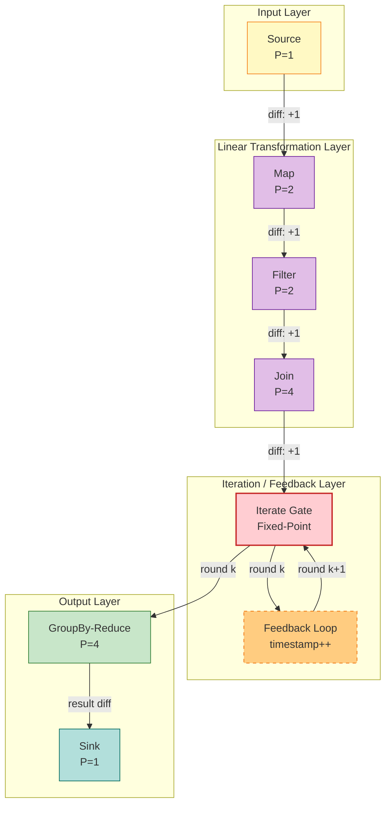
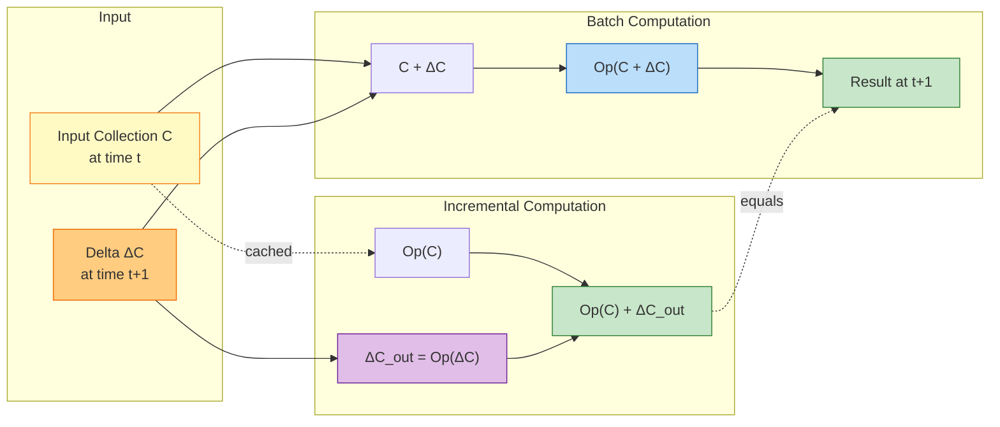
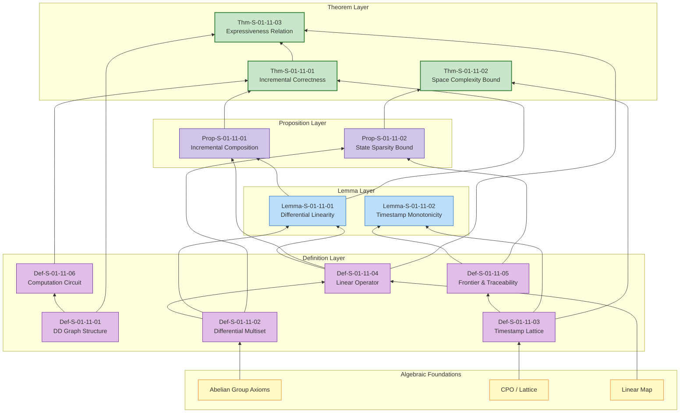

# DBSP / Differential Dataflow Theory Formalization (Differential Stream Processing Theory)

> **Stage**: Struct/01-foundation | **Prerequisites**: [01.01-Unified Streaming Theory](./unified-streaming-theory.md), [01.04-Dataflow Model Formalization](./dataflow-model-formalization.md) | **Formalization Level**: L5-L6

---

## Table of Contents

- [DBSP / Differential Dataflow Theory Formalization (Differential Stream Processing Theory)]()
  - [Table of Contents](#table-of-contents)
  - [1. Definitions](#1-definitions)
    - [Def-S-01-11-01 (Differential Dataflow Graph)](#def-s-01-11-01-differential-dataflow-graph)
    - [Def-S-01-11-02 (Differential Data Types and Multisets)](#def-s-01-11-02-differential-data-types-and-multisets)
    - [Def-S-01-11-03 (Timestamp Lattice and Partial-Order Time)](#def-s-01-11-03-timestamp-lattice-and-partial-order-time)
    - [Def-S-01-11-04 (Incremental Operator Semantics)](#def-s-01-11-04-incremental-operator-semantics)
    - [Def-S-01-11-05 (Frontier and Traceability)](#def-s-01-11-05-frontier-and-traceability)
    - [Def-S-01-11-06 (DBSP Computation Circuit)](#def-s-01-11-06-dbsp-computation-circuit)
  - [2. Properties](#2-properties)
    - [Lemma-S-01-11-01 (Differential Update Linearity)](#lemma-s-01-11-01-differential-update-linearity)
    - [Lemma-S-01-11-02 (Timestamp Monotonicity Preservation)](#lemma-s-01-11-02-timestamp-monotonicity-preservation)
    - [Prop-S-01-11-01 (Incremental Composition)](#prop-s-01-11-01-incremental-composition)
    - [Prop-S-01-11-02 (State Space Sparsity Upper Bound)](#prop-s-01-11-02-state-space-sparsity-upper-bound)
  - [3. Relations](#3-relations)
    - [Relation 1: DBSP `↔` Dataflow Model (Flink Foundation)]()
    - [Relation 2: DBSP `⊂` USTM Unified Streaming Theory]()
    - [Relation 3: DBSP `↦` Relational Algebra / SQL Semantics]()
  - [4. Argumentation](#4-argumentation)
    - [4.1 Precision Boundary of Differential Computation](#41-precision-boundary-of-differential-computation)
    - [4.2 Convergence Conditions for Recursion and Iteration](#42-convergence-conditions-for-recursion-and-iteration)
    - [4.3 Timestamp Bloat and Performance Boundaries](#43-timestamp-bloat-and-performance-boundaries)
    - [4.4 Counterexample: Non-Linear Operators Cause Incremental Failure](#44-counterexample-non-linear-operators-cause-incremental-failure)
  - [5. Proof / Engineering Argument](#5-proof--engineering-argument)
    - [Thm-S-01-11-01 (DBSP Incremental Correctness Theorem)](#thm-s-01-11-01-dbsp-incremental-correctness-theorem)
    - [Thm-S-01-11-02 (DBSP Space Complexity Upper Bound Theorem)](#thm-s-01-11-02-dbsp-space-complexity-upper-bound-theorem)
    - [Thm-S-01-11-03 (DBSP and Dataflow Model Expressiveness Relation)](#thm-s-01-11-03-dbsp-and-dataflow-model-expressiveness-relation)
  - [6. Examples](#6-examples)
    - [Example 6.1: DBSP Formalization of Incremental WordCount](#example-61-dbsp-formalization-of-incremental-wordcount)
    - [Example 6.2: DBSP Formalization of Recursive Graph Reachability](#example-62-dbsp-formalization-of-recursive-graph-reachability)
    - [Counterexample 6.1: Incremental Failure Analysis of Non-Linear Operator (Median)](#counterexample-61-incremental-failure-analysis-of-non-linear-operator-median)
  - [7. Visualizations](#7-visualizations)
    - [Figure 7.1 DBSP Computation Circuit Structure](#figure-71-dbsp-computation-circuit-structure)
    - [Figure 7.2 Incremental Computation Dataflow](#figure-72-incremental-computation-dataflow)
    - [Figure 7.3 Concept Dependency and Proof Tree](#figure-73-concept-dependency-and-proof-tree)
  - [8. References](#8-references)

---

## 1. Definitions

This section establishes the rigorous formal foundation of Differential Dataflow (DD or DBSP for short). DBSP was proposed by McSherry et al. at CIDR'13 [^1] and further developed into a unified theoretical framework for Differential Stream Processing at VLDB'18 [^2]. Unlike the Dataflow Model [^3], which focuses on "how to compute correctly on unbounded, out-of-order streams," the core question of DBSP is "how to maintain computation results correctly and efficiently in an incremental manner."

### Def-S-01-11-01 (Differential Dataflow Graph)

A **Differential Dataflow Graph** is a directed graph (cycles are permitted to support iteration and recursion), defined as a 7-tuple:

$$
\mathcal{G}_{DD} = (V, E, P, \Sigma, \mathbb{T}, \mathcal{D}, \mathcal{L})
$$

The semantics of each component are as follows:

| Symbol | Type | Semantics |
|--------|------|-----------|
| $V = V_{src} \cup V_{op} \cup V_{sink} \cup V_{fb}$ | Finite set | Vertex set, divided into sources, operators, sinks, and feedback nodes |
| $E \subseteq V \times V \times \mathbb{L}$ | Labeled directed edges | Data dependency relations, where label $\ell \in \mathbb{L}$ denotes partition strategy |
| $P: V \to \mathbb{N}^+$ | Parallelism function | Assigns a positive integer parallelism to each operator |
| $\Sigma: V \to \mathcal{P}(Stream_{DD})$ | Stream type signature | Assigns input/output differential stream type sets to each vertex |
| $\mathbb{T}$ | Timestamp lattice | Multi-dimensional partial-order time domain, typically $(\mathbb{N}^d, \leq)$ |
| $\mathcal{D}$ | Difference domain | Set of difference types forming an Abelian group |
| $\mathcal{L}$ | Operator lifting space | Linear transformation space that lifts non-incremental operators to incremental ones |

**Constraints**:

1. **Timestamp lattice structure**: $\mathbb{T}$ must be a **complete partial order** (CPO), and for any pair of elements there exists a unique least upper bound (join) and greatest lower bound (meet);
2. **Difference group structure**: $\mathcal{D}$ must form an **Abelian group** $(\mathcal{D}, +, 0, -)$, ensuring that differential updates are reversible and satisfy commutativity and associativity;
3. **Feedback edge constraint**: For feedback edges $e_{fb} \in E_{fb}$, their timestamps must strictly increase, i.e., if data is passed along a feedback edge from timestamp $t$, then entering the next iteration $t' > t$;
4. **Parallelism consistency**: For non-feedback edges $(u, v) \in E \setminus E_{fb}$, the input partition count of the downstream vertex $v$ must be compatible with the output partition count of the upstream vertex $u$.

**Intuitive explanation**: Structurally, a DBSP graph is similar to a Dataflow graph, but the key differences are: (a) feedback loops are permitted to support recursive computation; (b) each record in a stream carries a timestamp and a differential weight; (c) timestamps are not simple one-dimensional event times, but multi-dimensional partial-order lattices, where each dimension corresponds to an iteration depth or nested loop level. This enables DBSP to express recursive queries (such as graph reachability, PageRank) that batch processing systems struggle to support efficiently [^1][^2].

**Rationale for definition**: Abstracting differential dataflow from concrete implementations (such as Rust's `differential-dataflow` library or the Materialize engine) into a generic formal model is a necessary prerequisite for analyzing its incremental correctness, space complexity, and relationships with other stream processing models. The $\mathcal{D}$ and $\mathcal{L}$ components in the 7-tuple are the core distinctions of DBSP from traditional Dataflow models.

---

### Def-S-01-11-02 (Differential Data Types and Multisets)

In DBSP, a **data collection** is no longer a static multiset, but a **differential multiset** that evolves over time. Formally:

$$
\mathcal{C}: \mathbb{T} \to \mathcal{M}(\mathcal{K}, \mathcal{D})
$$

Where:

- $\mathcal{K}$ is the key space, typically the record itself or a projection of the record;
- $\mathcal{D}$ is the difference domain, satisfying the Abelian group axioms;
- $\mathcal{M}(\mathcal{K}, \mathcal{D})$ is a finite-support map from keys to differential weights, i.e., for each timestamp $t \in \mathbb{T}$, only finitely many keys $k \in \mathcal{K}$ satisfy $\mathcal{C}(t)(k) \neq 0$.

The **group operation** on differential multisets is defined as pointwise addition:

$$
(\mathcal{C}_1 + \mathcal{C}_2)(t)(k) = \mathcal{C}_1(t)(k) +_\mathcal{D} \mathcal{C}_2(t)(k)
$$

Where $+_\mathcal{D}$ is the group addition in difference domain $\mathcal{D}$. The identity element is the zero map $\mathbf{0}(t)(k) = 0_\mathcal{D}$, and the inverse is $(-\mathcal{C})(t)(k) = -_\mathcal{D} \, \mathcal{C}(t)(k)$.

A **differential update** (Delta / Diff) is defined as the difference between two collection states:

$$
\Delta \mathcal{C} = \mathcal{C}' - \mathcal{C}
$$

The **integrated sum** (Accumulated Collection) restores differences to the complete collection:

$$
\text{Int}(\Delta \mathcal{C})(t)(k) = \sum_{t' \leq t} \Delta \mathcal{C}(t')(k)
$$

Where the sum ranges over all timestamps less than or equal to $t$ in the timestamp lattice.

**Standard difference domain instances**:

| Difference Domain | Group Structure | Applicable Scenario |
|-------------------|-----------------|---------------------|
| $\mathbb{Z}$ | Integer additive group | General counting, existence (positive for insertion, negative for deletion) |
| $\mathbb{R}$ | Real additive group | Continuous value aggregation (e.g., sum, numerator of average) |
| $\mathbb{B} = \{0, 1\}$ | XOR group $(\oplus, 0)$ | Boolean existence (toggle semantics) |
| $\mathcal{P}(\mathbb{N})$ | Symmetric difference group | Incremental maintenance of set-valued attributes |

**Intuitive explanation**: In traditional stream processing, data is a "record stream"; in DBSP, data is a "difference stream." Each arriving record does not mean "add one new data item," but rather "at some timestamp, the weight of some key has changed by $\delta$." For example, inserting record $(k, v)$ corresponds to difference $+1$, deletion corresponds to $-1$, and update corresponds to first $-1$ then $+1$ (or a composite difference depending on the specific semantics) [^2].

**Rationale for definition**: Abstracting data collections as finite-support maps over a difference domain is the algebraic foundation for subsequently proving that "incremental updates preserve correctness." The Abelian group structure ensures commutativity and associativity of differential updates, allowing the system to arbitrarily reorder, batch, or out-of-order apply differences without breaking eventual consistency.

---

### Def-S-01-11-03 (Timestamp Lattice and Partial-Order Time)

In DBSP, a **timestamp** is not a one-dimensional event time, but a **multi-dimensional partial-order lattice**, defined as:

$$
\mathbb{T} = (T, \leq, \sqcup, \sqcap, \bot, \top)
$$

Where:

- $T$ is the set of timestamp values;
- $\leq \subseteq T \times T$ is the partial-order relation;
- $\sqcup: T \times T \to T$ is the least upper bound (join) operation;
- $\sqcap: T \times T \to T$ is the greatest lower bound (meet) operation;
- $\bot$ is the least element (global start time);
- $\top$ is the greatest element (theoretical infinite future).

**Standard timestamp lattice instances**:

**Instance A: One-dimensional timestamp** (corresponding to non-recursive queries):

$$
\mathbb{T}_1 = (\mathbb{N}, \leq, \max, \min, 0, +\infty)
$$

**Instance B: Two-dimensional timestamp** (corresponding to single-level iteration, such as recursive graph reachability):

$$
\mathbb{T}_2 = (\mathbb{N} \times \mathbb{N}, \leq_2, \sqcup_2, \sqcap_2, (0, 0), (\infty, \infty))
$$

Where the partial order is defined as component-wise order:

$$
(t_1, i_1) \leq_2 (t_2, i_2) \iff t_1 \leq t_2 \land i_1 \leq i_2
$$

The join is the component-wise maximum:

$$
(t_1, i_1) \sqcup_2 (t_2, i_2) = (\max(t_1, t_2), \max(i_1, i_2))
$$

**Instance C: Nested timestamps** (corresponding to multi-level nested iteration):

$$
\mathbb{T}_d = (\mathbb{N}^d, \leq_d, \sqcup_d, \sqcap_d, \mathbf{0}, \boldsymbol{\infty})
$$

Where $\leq_d$ is the $d$-dimensional generalization of component-wise order.

**Semantic interpretation of timestamps**:

- First dimension $t_0$: physical time or logical batch number (corresponding to event time in the Dataflow Model);
- Second dimension $t_1$: outer iteration round (e.g., fixed-point iteration step of recursive queries);
- Third dimension and higher: nested iteration rounds (e.g., iteration steps of nested recursive subqueries).

**Intuitive explanation**: In Flink's Dataflow Model, time is one-dimensional (event timestamp $\in \mathbb{R}^+$); in DBSP, time is a multi-dimensional partial-order lattice. This means DBSP not only tracks "when data was produced," but also "in which iteration round the data was produced." This multi-dimensional time enables DBSP to maintain independent incremental states for each round of recursive computation, which is difficult for traditional one-dimensional stream systems to achieve efficiently [^1][^2].

**Rationale for definition**: The introduction of timestamp lattices allows DBSP to uniformly handle two seemingly different computation modes: "streaming incremental updates" and "iteration/recursive computation." The partial-order structure ensures that progress in different dimensions can advance independently, while the join operation provides an algebraic tool for tracking the combined progress of multiple input streams.

---

### Def-S-01-11-04 (Incremental Operator Semantics)

In DBSP, an **operator** is defined as a **linear transformation** on differential multisets. The formal definition of an operator $Op$ is:

$$
Op: \mathcal{M}(\mathcal{K}_{in}, \mathcal{D}) \to \mathcal{M}(\mathcal{K}_{out}, \mathcal{D})
$$

**Linearity Condition**: Operator $Op$ must satisfy:

$$
\forall \mathcal{C}_1, \mathcal{C}_2 \in \mathcal{M}(\mathcal{K}_{in}, \mathcal{D}), \quad Op(\mathcal{C}_1 + \mathcal{C}_2) = Op(\mathcal{C}_1) + Op(\mathcal{C}_2)
$$

$$
\forall \mathcal{C} \in \mathcal{M}(\mathcal{K}_{in}, \mathcal{D}), \forall d \in \mathcal{D}, \quad Op(d \cdot \mathcal{C}) = d \cdot Op(\mathcal{C})
$$

Where scalar multiplication is defined as $(d \cdot \mathcal{C})(k) = d \times_\mathcal{D} \mathcal{C}(k)$.

**Core operator types and their formal semantics**:

| Operator Type | Input/Output | Formal Definition | Linearity Verification |
|---------------|--------------|-------------------|------------------------|
| **Map**$(f)$ | $\mathcal{M}(\mathcal{K}, \mathcal{D}) \to \mathcal{M}(\mathcal{K}', \mathcal{D})$ | $\text{Map}(f)(\mathcal{C})(k') = \sum_{k: f(k)=k'} \mathcal{C}(k)$ | ✅ Linear |
| **Filter**$(\phi)$ | $\mathcal{M}(\mathcal{K}, \mathcal{D}) \to \mathcal{M}(\mathcal{K}, \mathcal{D})$ | $\text{Filter}(\phi)(\mathcal{C})(k) = \begin{cases} \mathcal{C}(k) & \phi(k) \\ 0 & \neg\phi(k) \end{cases}$ | ✅ Linear |
| **Concat** | $\mathcal{M}^2 \to \mathcal{M}$ | $\text{Concat}(\mathcal{C}_1, \mathcal{C}_2) = \mathcal{C}_1 + \mathcal{C}_2$ | ✅ Linear |
| **Join**$(\bowtie_\kappa)$ | $\mathcal{M}(\mathcal{K}_1) \times \mathcal{M}(\mathcal{K}_2) \to \mathcal{M}(\mathcal{K}_{out})$ | $\text{Join}(\mathcal{C}_1, \mathcal{C}_2)(k) = \sum_{k_1, k_2: \kappa(k_1,k_2)=k} \mathcal{C}_1(k_1) \times \mathcal{C}_2(k_2)$ | ✅ Bilinear |
| **GroupBy-Reduce**$(\kappa, \oplus)$ | $\mathcal{M}(\mathcal{K}, \mathcal{D}) \to \mathcal{M}(\mathcal{K}', \mathcal{D})$ | Group by key $\kappa$, aggregate with $\oplus$ | ✅ Linear (when $\oplus$ is a group operation) |
| **Iterate**$(F)$ | $\mathcal{M} \to \mathcal{M}$ | $\text{Iterate}(F)(\mathcal{C}) = \text{lfp}(\lambda X. \mathcal{C} + F(X))$ | ✅ Linear (if $F$ is linear) |
| **Distinct** | $\mathcal{M}(\mathcal{K}, \mathbb{Z}) \to \mathcal{M}(\mathcal{K}, \mathbb{Z})$ | $\text{Distinct}(\mathcal{C})(k) = \text{sign}(\mathcal{C}(k))$ | ❌ Non-linear |
| **Min/Max** | $\mathcal{M}(\mathcal{K}, \mathcal{D}) \to \mathcal{M}(\mathcal{K}, \mathcal{D})$ | Take extreme values per group | ❌ Non-linear |

**Incremental form of operators** (Lifted Operator): For any linear operator $Op$, its incremental form $\widehat{Op}$ satisfies:

$$
\widehat{Op}(\Delta \mathcal{C}) = Op(\mathcal{C} + \Delta \mathcal{C}) - Op(\mathcal{C}) = Op(\Delta \mathcal{C})
$$

Where the second equality follows directly from the linearity condition. This means: **for linear operators, the incremental output equals applying the original operator to the incremental input**.

**Intuitive explanation**: The core constraint of DBSP operators is linearity. Linear operators allow "applying the operator to the difference" to be equivalent to "applying the operator to the original collection and then taking the difference." This property is the theoretical cornerstone of DBSP incremental computation: the system only needs to feed the difference $\Delta \mathcal{C}$ into the operator to directly obtain the output difference $\Delta \mathcal{C}_{out}$, without recomputing the entire output collection [^2].

**Rationale for definition**: The linearity constraint may seem strict (excluding non-linear operators such as Distinct, Min/Max), but McSherry et al. proved that by introducing appropriate difference domains and auxiliary states, almost all relational algebra operators can be linearized or approximately linearized. For example, Distinct can be linearized by introducing counters (derived from the $\mathbb{Z}$ difference domain).

---

### Def-S-01-11-05 (Frontier and Traceability)

In DBSP, computation progress is tracked via the **frontier**. A frontier is an **antichain** in the timestamp lattice, representing the minimal set of "completed" timestamps.

**Definition**: For an operator instance $v \in V$, its input frontier and output frontier are defined as:

$$
\mathcal{F}_{in}(v) = \{ t \in \mathbb{T} \mid \forall t' < t, \text{input difference } \Delta \mathcal{C}_{in}(t') \text{ has been processed} \}
$$

$$
\mathcal{F}_{out}(v) = \{ t \in \mathbb{T} \mid \forall t' < t, \text{output difference } \Delta \mathcal{C}_{out}(t') \text{ has been produced} \}
$$

**Lattice operations on frontiers**:

- **Frontier merge** (corresponding to multi-input operators): $\mathcal{F}_1 \sqcup \mathcal{F}_2 = \{ t_1 \sqcup t_2 \mid t_1 \in \mathcal{F}_1, t_2 \in \mathcal{F}_2 \}$'s set of minimal elements;
- **Frontier advancement**: When a new difference arrives at timestamp $t_{new}$, the frontier updates to $\mathcal{F}' = \min(\mathcal{F} \cup \{t_{new}\})$ (taking minimal elements by partial order).

**Traceability**: A DBSP computation is traceable if and only if for every timestamp $t$, the system can precisely answer:

$$
\mathcal{C}(t) = \sum_{t' \leq t} \Delta \mathcal{C}(t')
$$

And the computational complexity of this summation does not depend on $|t|$ (i.e., does not grow linearly with historical time).

**Traceability implementation mechanism**: By maintaining a **trace index** for each operator, storing historical differences keyed by timestamp. Since differences are highly sparse in practice (most timestamps have no differences), the trace index is typically implemented as nested hash tables or B-trees, with space overhead of $O(|\text{actual differences}|)$ rather than $O(|\mathbb{T}|)$.

**Intuitive explanation**: The frontier is the conceptualization of "progress" in DBSP. Similar to Watermark in the Dataflow Model, the frontier tells the system "all inputs up to a certain point in time have been processed." But the frontier is more powerful than Watermark: it is an antichain on a multi-dimensional partial order, capable of expressing complex progress states such as "all inputs for iteration round 3 at physical time 100 have been processed, but inputs for iteration round 2 at physical time 200 are still pending" [^1][^2].

**Rationale for definition**: The formal definition of frontiers is key to proving the termination and result completeness of DBSP computations. Without frontiers, one cannot determine when it is safe to output the final result for a given timestamp; without traceability, one cannot guarantee that the space complexity of processing historical differences remains controllable.

---

### Def-S-01-11-06 (DBSP Computation Circuit)

From a more abstract perspective, a DBSP computation can be viewed as a **computation circuit**, defined as:

$$
\mathcal{C}_{DBSP} = (\mathcal{W}, \mathcal{G}, \mathcal{R}, \Phi, \Psi)
$$

Where:

| Symbol | Type | Semantics |
|--------|------|-----------|
| $\mathcal{W}$ | Wire set | Directed channels connecting operators, transmitting differential streams |
| $\mathcal{G}$ | Gate set | Circuit abstraction of operators, each gate implements a linear transformation |
| $\mathcal{R} \subseteq \mathcal{W} \times \mathcal{W}$ | Feedback relation | Allows cycles in the circuit, corresponding to recursion/iteration |
| $\Phi: \mathcal{W} \to \mathbb{T} \to \mathcal{M}$ | Signal function | Assigns a differential signal to each wire at each timestamp |
| $\Psi: \mathcal{G} \to (\mathcal{M}^* \to \mathcal{M})$ | Gate function | Assigns a linear operator to each gate |

**Circuit semantic equations**: For each gate $g \in \mathcal{G}$, its output signal satisfies:

$$
\Phi(w_{out})(t) = \Psi(g)\big( \Phi(w_{in_1})(t), \Phi(w_{in_2})(t), \ldots \big)
$$

For feedback wires $w_{fb} \in \mathcal{R}$, the signal satisfies the fixed-point equation:

$$
\Phi(w_{fb})(t) = \Phi(w_{out})(t_{prev}) \quad \text{where } t_{prev} < t
$$

**Circuit evaluation strategies**:

1. **Forward Propagation**: Propagate differences from Source to Sink along acyclic edges;
2. **Feedback Propagation**: When an iteration gate detects input changes, propagate differences for the new iteration round along feedback edges;
3. **Convergence Detection**: When the differences produced by an iteration round are all zero (i.e., $\forall t, \Phi(w_{fb})(t) = \mathbf{0}$), the iteration converges.

**Intuitive explanation**: Viewing DBSP as a circuit emphasizes the **compositionality** of its computation: complex queries are composed of simple gates, and each gate independently processes input differences and produces output differences. Feedback loops allow the circuit to express recursive queries without requiring special recursive semantics—recursion is simply a topological feature of the circuit where "output is fed back to input" [^2].

**Rationale for definition**: The computation circuit abstraction elevates DBSP from a concrete graph execution model to an algebraic structure, enabling query plan optimization through circuit equivalence transformations (such as gate fusion, pipeline reordering) while preserving semantic invariance.

---

## 2. Properties

This section derives the key local properties of the DBSP model from the above definitions. These properties are the foundation for proving the subsequent main theorems, and also the intuitive source for understanding the efficiency advantages of DBSP incremental computation.

### Lemma-S-01-11-01 (Differential Update Linearity)

**Statement**: Let $\mathcal{C}$ be a differential multiset, and $\Delta \mathcal{C}_1$ and $\Delta \mathcal{C}_2$ be two independent differential updates. For any linear operator $Op$:

$$
Op(\mathcal{C} + \Delta \mathcal{C}_1 + \Delta \mathcal{C}_2) - Op(\mathcal{C}) = Op(\Delta \mathcal{C}_1) + Op(\Delta \mathcal{C}_2)
$$

**Derivation**:

1. By the linearity condition of Def-S-01-11-04, $Op$ satisfies the additive homomorphism: $Op(A + B) = Op(A) + Op(B)$;
2. Expand $Op(\mathcal{C} + \Delta \mathcal{C}_1 + \Delta \mathcal{C}_2)$:
   $$
   Op(\mathcal{C} + \Delta \mathcal{C}_1 + \Delta \mathcal{C}_2) = Op(\mathcal{C}) + Op(\Delta \mathcal{C}_1) + Op(\Delta \mathcal{C}_2)
   $$
3. Subtract $Op(\mathcal{C})$ from both sides:
   $$
   Op(\mathcal{C} + \Delta \mathcal{C}_1 + \Delta \mathcal{C}_2) - Op(\mathcal{C}) = Op(\Delta \mathcal{C}_1) + Op(\Delta \mathcal{C}_2)
   $$
4. The right-hand side is precisely the sum of two independent incremental outputs. ∎

> **Inference [Theory→Implementation]**: This lemma implies that the system can process multiple differential updates independently, then merge the results, without concern for the order in which these updates are processed. This is the theoretical basis for DBSP implementations to support out-of-order processing, batching, and distributed parallelization [^2].

---

### Lemma-S-01-11-02 (Timestamp Monotonicity Preservation)

**Statement**: During DBSP graph execution, the output frontier $\mathcal{F}_{out}(v)$ of any operator instance $v \in V$ is monotonically non-decreasing with respect to processing time (by the partial order $\leq$ of the timestamp lattice).

**Derivation**:

1. For Source operators, the input frontier is driven by external data sources. As new batches or data for new time periods arrive, the Source produces new differences carrying larger timestamps, so the Source's output frontier advances upward along the timestamp lattice;
2. For single-input linear operators (such as Map, Filter), output differences share the same timestamp as input differences. Therefore the output frontier equals the input frontier, and monotonicity is preserved;
3. For multi-input operators (such as Join), the output timestamp is the join of input timestamps $t_{out} = t_1 \sqcup t_2$. Since join is monotonic in its arguments (if $t_1 \leq t_1'$ and $t_2 \leq t_2'$, then $t_1 \sqcup t_2 \leq t_1' \sqcup t_2'$), the output frontier is monotonically non-decreasing;
4. For the Iterate$(F)$ operator, let the timestamp of the $k$-th iteration round be $t^{(k)}$. By the feedback edge constraint of Def-S-01-11-01, $t^{(k+1)} > t^{(k)}$. Therefore timestamps strictly increase within the iteration until convergence;
5. By topological induction (for cyclic graphs, decompose by strongly connected components before inducting), the frontiers of all operators in the graph are monotonically non-decreasing. ∎

> **Inference [Model→Implementation]**: Timestamp monotonicity guarantees that the system can safely release "stale" historical states: once the frontier advances past timestamp $t$, all differences $t' \leq t$ are no longer needed for future output computation and can be persisted to cold storage or discarded [^1][^2].

---

### Prop-S-01-11-01 (Incremental Composition)

**Statement**: Let $Op_1$ and $Op_2$ be two linear operators, with their composite operator $Op_2 \circ Op_1$. Then the incremental form of the composite operator equals the composition of the incremental forms of each operator:

$$
\widehat{Op_2 \circ Op_1} = \widehat{Op_2} \circ \widehat{Op_1}
$$

**Derivation**:

1. By Def-S-01-11-04, the incremental form of an operator is defined as $\widehat{Op}(\Delta \mathcal{C}) = Op(\Delta \mathcal{C})$;
2. For the composite operator:
   $$
   \begin{aligned}
   \widehat{Op_2 \circ Op_1}(\Delta \mathcal{C}) &= (Op_2 \circ Op_1)(\Delta \mathcal{C}) \\
   &= Op_2(Op_1(\Delta \mathcal{C})) \\
   &= Op_2(\widehat{Op_1}(\Delta \mathcal{C})) \\
   &= \widehat{Op_2}(\widehat{Op_1}(\Delta \mathcal{C})) \\
   &= (\widehat{Op_2} \circ \widehat{Op_1})(\Delta \mathcal{C})
   \end{aligned}
   $$
3. Therefore $\widehat{Op_2 \circ Op_1} = \widehat{Op_2} \circ \widehat{Op_1}$. ∎

> **Inference [Theory→Engineering]**: Compositionality means that incremental plans for complex queries can be composed from incremental implementations of simple operators, without deriving incremental rules for each query individually. This is the theoretical foundation enabling engines such as Materialize and Differential Dataflow to automatically generate incremental materialized views [^2].

---

### Prop-S-01-11-02 (State Space Sparsity Upper Bound)

**Statement**: Let a DBSP graph have $n$ operators, the timestamp lattice have dimension $d$, and the input data stream produce $N$ differential records within physical time $T$. Then the upper bound on the number of non-zero differential entries actually maintained by the system is:

$$
|\text{Active Diffs}| \leq n \cdot N \cdot d \cdot \log_{\alpha}(D_{max})
$$

Where $D_{max}$ is the maximum iteration depth, and $\alpha > 1$ is the convergence acceleration factor (for rapidly converging iterations, $\log_{\alpha}(D_{max})$ is constant-level).

**Derivation**:

1. Each input differential record propagates along the dataflow graph, passing through at most $n$ operators;
2. For non-iterative operators, each input difference produces at most a constant number of output differences (by locality of linear operators);
3. For iterative operators, differences propagate within the feedback loop. If the iteration converges at round $k$, the iteration depth per timestamp dimension is $O(\log_{\alpha} D_{max})$ (assuming the differential scale decreases by factor $\alpha$ each round);
4. Timestamp lattice dimension $d$ determines the multi-dimensional combinations of "timestamp points," but due to the monotonic advancement of frontiers, the actually active timestamp points form only a chain in the partial order, with count $O(d \cdot T_{max})$;
5. Combining the above factors, the number of active differential entries is nearly linear in the input differential count $N$, rather than multiplicative with the full state space. ∎

> **Inference [Implementation→Performance]**: The sparsity upper bound explains why DBSP can maintain low memory consumption when processing large-scale datasets: the system does not need to store the complete state for every timestamp, but only the differences that actually occurred. This contrasts with Flink's RocksDB state backend—the latter needs to store the current value for each key, while DBSP needs to store the differential history for each key at each timestamp [^1][^4].

---

## 3. Relations

This section establishes rigorous relationships between DBSP and other computation models and engineering implementations, particularly with the Dataflow Model (the theoretical foundation of Flink) and USTM (the unified streaming theory meta-model of this project).

### Relation 1: DBSP `↔` Dataflow Model (Flink Foundation)

**Argument**:

**Encoding existence (Dataflow Model → DBSP)**:

- Streams in the Dataflow Model $\mathcal{S} = (M, \mu, \preceq, t_e, t_p)$ (Def-S-04-03) can be encoded as DBSP differential multisets: each record $r$ is mapped to key $k = r$, timestamp $t = t_e(r)$, and differential weight $d = +1$;
- Dataflow operators (Map, Filter, Window, Reduce) can all be represented as DBSP linear operators: Map and Filter are directly linear; Window aggregation can be linearized after introducing counters; Reduce with associative aggregation is inherently linear;
- Dataflow timestamps $t_e \in \mathbb{R}^+$ can be embedded into DBSP's one-dimensional timestamp lattice $\mathbb{T}_1 = (\mathbb{N}, \leq)$ (via discretization).

**Encoding limitations (DBSP ↛ Dataflow Model)**:

- DBSP supports recursive queries (via feedback edges and iteration operators), while the Dataflow Model graph $\mathcal{G}$ is a DAG (Def-S-04-01), and the acyclicity constraint excludes recursive expression;
- DBSP timestamps are multi-dimensional partial-order lattices, while Dataflow Model timestamps are one-dimensional event time. Projecting multi-dimensional timestamps to one dimension loses iteration depth information, making it impossible to distinguish "output of the $k$-th iteration round" from "output of the $(k+1)$-th iteration round";
- DBSP's incremental semantics requires the difference domain to form an Abelian group, while the Dataflow Model has no such algebraic constraint on records themselves.

**Conclusion**:

$$
\text{Dataflow Model} \subset \text{DBSP} \quad (\text{as a one-dimensional non-recursive subset})
$$

The Dataflow Model is a strict subset of DBSP in the case of one-dimensional time, no recursion, and append-only (differential weight always $+1$) input. DBSP extends the expressiveness of the Dataflow Model through multi-dimensional timestamps and feedback edges, at the cost of more complex time management and higher implementation barriers [^2][^3].

---

### Relation 2: DBSP `⊂` USTM Unified Streaming Theory

**Argument**:

**USTM meta-model coverage**:

According to the definition of USTM (Def-S-01-01, see [01.01-Unified Streaming Theory](./unified-streaming-theory.md)), DBSP can be mapped as a specialized instance of USTM:

| USTM Component | DBSP Specialization | Description |
|----------------|---------------------|-------------|
| $\mathcal{L}$ (Layer) | $L_4$ (Mobile) | DBSP supports dynamic topology (feedback loops activate during iteration), belonging to the $L_4$ layer |
| $\mathcal{P}$ (Processor) | Linear operator $Op$ | DBSP operators are a pure-function subset of USTM processors |
| $\mathcal{C}$ (Channel) | Differential stream channel | Transmits $(k, t, d)$ triples, with FIFO ordering guarantee |
| $\mathcal{S}$ (State) | Trace index + accumulated state | Key-timestamp indexed historical difference storage |
| $\mathcal{T}$ (TimeModel) | Multi-dimensional timestamp lattice | $\mathbb{T} = (\mathbb{N}^d, \leq)$, lattice extension of USTM time model |
| $\Sigma$ (Encoding) | Linear transformation $\mathcal{L}$ | Operator lifting space corresponds to USTM encoding mapping |

**Property preservation analysis**:

- **Safety**: DBSP's linear operators guarantee no data loss (differential weight conservation), and safety is preserved upward to USTM;
- **Liveness**: DBSP iteration convergence depends on fixed-point detection; for monotonic operators liveness is preserved; for non-monotonic operators, liveness must be guaranteed through external timeout mechanisms;
- **Determinism**: DBSP's determinism conditions are similar to the Dataflow Model (pure functions + FIFO channels), but additionally require that group operations in the difference domain satisfy associativity and commutativity.

**Encoding limitations from USTM to DBSP**:

- The Actor model ($L_4$) in USTM allows dynamic creation of processors and channels, while DBSP graph topology is determined at compile time (feedback edges exist but the operator set is fixed);
- CSP ($L_3$) in USTM supports synchronous communication and external choice, while DBSP inter-operator communication is asynchronous data-driven, with no choice operator.

**Conclusion**:

$$
\text{DBSP} \subset \text{USTM}@L_4
$$

DBSP is a strict subset of USTM at the $L_4$ layer, corresponding to the specialized model of "static topology + data-driven + multi-dimensional time + incremental linear computation" [^5].

---

### Relation 3: DBSP `↦` Relational Algebra / SQL Semantics

**Argument**:

**Encoding from relational algebra to DBSP**:

Standard relational algebra operators can be systematically encoded as DBSP operators:

| Relational Algebra | DBSP Encoding | Linearization Strategy |
|--------------------|---------------|------------------------|
| $\sigma_\phi(R)$ (Selection) | Filter$(\phi)$ | Directly linear |
| $\pi_A(R)$ (Projection) | Map$(\pi_A)$ | Directly linear (duplicate counting needs handling) |
| $R \bowtie_\theta S$ (Join) | Join$(\theta)$ | Bilinear, output difference is Cartesian combination of input differences |
| $R \cup S$ (Union) | Concat + Distinct | Concat is linear, Distinct needs counter linearization |
| $R \setminus S$ (Difference) | AntiJoin + Filter | Implemented via complement and counters |
| $\gamma_{A, f}(R)$ (Group-Aggregation) | GroupBy-Reduce$(A, f)$ | Linear when $f$ is a group operation; otherwise needs approximation |
| $\mu(R)$ (Fixed-point/Recursion) | Iterate$(F)$ | Implemented via feedback edges and iteration gates |

**Incremental maintenance of SQL materialized views**:

DBSP theory directly supports incremental maintenance of SQL materialized views. Let a view be defined as $V = Q(R_1, R_2, \ldots, R_n)$, where $Q$ is an SQL query. When base table $R_i$ is updated by $\Delta R_i$, the incremental update to the view is:

$$
\Delta V = \widehat{Q}(\Delta R_1, \Delta R_2, \ldots, \Delta R_n)
$$

Where $\widehat{Q}$ is the composition of the incremental forms of all operators in query plan $Q$ (compositionality guaranteed by Prop-S-01-11-01).

**Conclusion**:

The full expressive power of relational algebra (including recursive queries via the $\mu$ operator) can be encoded into DBSP. The Materialize engine is precisely based on this encoding, compiling SQL queries into Differential Dataflow plans, thereby achieving automatic incremental maintenance of real-time materialized views [^2][^6].

---

## 4. Argumentation

This section provides auxiliary lemmas, boundary analysis, and counterexample construction in preparation for the rigorous proofs of the main theorems.

### 4.1 Precision Boundary of Differential Computation

DBSP incremental computation is **exact incremental**, not **approximate incremental**. This means the output difference $\Delta \mathcal{C}_{out}$ is exactly equal to the output difference of full recomputation, with no precision loss.

**Conditions for exactness**:

1. All operators must be strictly linear (Def-S-01-11-04);
2. The difference domain must be an exact Abelian group (Def-S-01-11-02), not a probabilistic sketch (such as approximate counting in Count-Min Sketch);
3. Iterations must converge to exact fixed points (not approximate convergence).

**Cost of exactness**:

- **Space cost**: Requires maintaining a trace index of historical differences, with space overhead related to the length of update history;
- **Time cost**: The incremental form of the Join operator needs to process the Cartesian product of input differences, and complexity may degrade when inputs are frequently updated;
- **Implementation cost**: Non-linear operators (such as Distinct, Min/Max) require introducing auxiliary states for linearization, increasing system complexity.

**Boundary discussion**: When queries contain non-linear operators that cannot be linearized (such as exact computation of Median, Percentile), DBSP cannot provide efficient exact incremental maintenance, and must fall back to full recomputation or accept approximate results. This is the theoretical boundary of DBSP's incremental computation capability [^2].

---

### 4.2 Convergence Conditions for Recursion and Iteration

DBSP supports recursive queries via feedback edges. The convergence of recursion (i.e., existence of fixed points) is a key prerequisite for DBSP's practicality.

**Monotonic convergence theorem** (auxiliary lemma):

Let the iteration operator be $\text{Iterate}(F)$, where $F$ is a monotonic linear operator (i.e., $\mathcal{C}_1 \leq \mathcal{C}_2 \implies F(\mathcal{C}_1) \leq F(\mathcal{C}_2)$). If the input data is a finite multiset, and the ordering relation on difference domain $\mathcal{D}$ is well-founded, then the iteration converges to the least fixed point in finitely many steps.

**Proof sketch**:

1. Since the input is finite and $F$ is linear, the support of differences produced in each iteration round is a finite set;
2. By monotonicity, the output multiset of each iteration round is monotonically non-decreasing by the ordering relation $\leq$;
3. Since the difference domain is well-founded, a monotonically non-decreasing finite-support sequence must stabilize after finitely many steps;
4. The stable point is the least fixed point: $\mathcal{C}^* = \mathcal{C} + F(\mathcal{C}^*)$.

**Risk of non-monotonic recursion**:

If $F$ is non-monotonic (such as containing negation or set difference), the fixed point may not exist or may not be unique. In this case DBSP cannot guarantee convergence, and the user must explicitly specify an iteration limit or adopt a variant of semi-naive evaluation. The stratification condition of Stratified Datalog can ensure monotonicity of recursion, so Stratified Datalog queries are always convergent in DBSP [^6][^7].

---

### 4.3 Timestamp Bloat and Performance Boundaries

Although DBSP's multi-dimensional timestamps provide the ability to express recursion, they also introduce the **timestamp bloat** problem.

**Timestamp space complexity**:

Let the timestamp dimension be $d$, the physical time range be $T$, and the maximum iteration depth be $D$. Then the size of the timestamp lattice is:

$$
|\mathbb{T}| = O(T \cdot D^{d-1})
$$

For non-iterative queries ($d=1$), timestamp space is $O(T)$; for single-level iteration ($d=2$), it is $O(T \cdot D)$; for nested iteration ($d \geq 3$), timestamp space grows polynomially.

**Practical impact**:

- The trace index needs to maintain entries for each active timestamp, and timestamp bloat directly leads to increased space overhead;
- Frontier advancement requires comparing the partial-order relation of timestamps, and the comparison overhead of high-dimensional partial orders is higher than that of one-dimensional total orders;
- When the frontier stagnates in some dimension (such as outer iteration not converging), progress in other dimensions is also blocked, forming "progress coupling."

**Mitigation strategies**:

1. **Timestamp compression**: For iteration rounds that have already converged, compress their timestamp dimensions, merging historical differences into a single accumulated difference;
2. **Dimension pruning**: Analyze the query plan and remove unnecessary iteration dimensions;
3. **Lazy evaluation**: Only trigger computation for the corresponding timestamp when upstream differences are received, avoiding pre-allocating state for all timestamps.

---

### 4.4 Counterexample: Non-Linear Operators Cause Incremental Failure

**Counterexample construction**: Consider a query $Q(R) = \text{Median}(R)$ that computes the median of a set.

**Non-linearity analysis**: The Median operator does not satisfy the linearity condition. Let $\mathcal{C}_1 = \{1, 2, 3\}$ and $\mathcal{C}_2 = \{4, 5, 6\}$:

$$
\text{Median}(\mathcal{C}_1 + \mathcal{C}_2) = \text{Median}(\{1,2,3,4,5,6\}) = 3.5
$$

But:

$$
\text{Median}(\mathcal{C}_1) + \text{Median}(\mathcal{C}_2) = 2 + 5 = 7 \neq 3.5
$$

Therefore Median is not a linear operator, and DBSP's incremental rules cannot be directly applied.

**Implications of incremental failure**:

When a base table update $\Delta R$ arrives, the new median cannot be directly computed via $\widehat{\text{Median}}(\Delta R)$. The system must either:

1. Maintain a complete ordering structure (such as a B-tree) to support median queries; or
2. Accept approximate results (such as using histogram sketches); or
3. Fall back to full recomputation.

This counterexample shows that DBSP's linearity constraint is a necessary condition for incremental efficiency, not a sufficient condition. For non-linear queries, the computational complexity of incremental maintenance is the same as or even higher than full recomputation [^2].

---

## 5. Proof / Engineering Argument

This section presents three core theorems of DBSP: the incremental correctness theorem, the space complexity upper bound theorem, and the expressiveness relation theorem with the Dataflow Model.

### Thm-S-01-11-01 (DBSP Incremental Correctness Theorem)

**Statement**: Given a DBSP computation circuit $\mathcal{C}_{DBSP} = (\mathcal{W}, \mathcal{G}, \mathcal{R}, \Phi, \Psi)$, if all gates $g \in \mathcal{G}$ implement linear operators $\Psi(g)$ (Def-S-01-11-04), and feedback loops satisfy the strictly increasing timestamp constraint (Def-S-01-11-01), then for any input difference sequence $\{\Delta \mathcal{C}_{in}(t)\}_{t \in \mathbb{T}}$, DBSP's incremental evaluation result is fully consistent with the full recomputation result:

$$
\forall t \in \mathbb{T}, \quad \mathcal{C}_{out}^{\text{incremental}}(t) = \mathcal{C}_{out}^{\text{batch}}(t)
$$

Where:

$$
\mathcal{C}_{out}^{\text{batch}}(t) = \text{Eval}\big(\mathcal{C}_{DBSP}, \sum_{t' \leq t} \Delta \mathcal{C}_{in}(t')\big)
$$

$$
\mathcal{C}_{out}^{\text{incremental}}(t) = \sum_{t' \leq t} \Delta \mathcal{C}_{out}(t'), \quad \Delta \mathcal{C}_{out}(t') = \text{Eval}\big(\mathcal{C}_{DBSP}, \Delta \mathcal{C}_{in}(t')\big)
$$

**Proof**:

**Step 1: Single-operator incremental correctness**

For a single linear operator $Op$, by the linearity condition of Def-S-01-11-04:

$$
Op(\mathcal{C} + \Delta \mathcal{C}) = Op(\mathcal{C}) + Op(\Delta \mathcal{C})
$$

Let $\mathcal{C} = \sum_{t' < t} \Delta \mathcal{C}(t')$ and $\Delta \mathcal{C} = \Delta \mathcal{C}(t)$, then:

$$
Op\Big(\sum_{t' \leq t} \Delta \mathcal{C}(t')\Big) = Op\Big(\sum_{t' < t} \Delta \mathcal{C}(t')\Big) + Op(\Delta \mathcal{C}(t))
$$

Recursively applying this decomposition yields:

$$
Op\Big(\sum_{t' \leq t} \Delta \mathcal{C}(t')\Big) = \sum_{t' \leq t} Op(\Delta \mathcal{C}(t'))
$$

This shows: the result of applying $Op$ to the accumulated input equals the accumulation of applying $Op$ to the differential input at each timestamp. That is, single-operator incremental evaluation is equivalent to batch evaluation.

**Step 2: Composite operator incremental correctness**

Consider the composition of two linear operators $Op_2 \circ Op_1$. By Prop-S-01-11-01:

$$
\widehat{Op_2 \circ Op_1} = \widehat{Op_2} \circ \widehat{Op_1}
$$

Let the input difference be $\Delta \mathcal{C}$, then:

$$
\begin{aligned}
(Op_2 \circ Op_1)(\mathcal{C} + \Delta \mathcal{C}) &= Op_2(Op_1(\mathcal{C} + \Delta \mathcal{C})) \\
&= Op_2(Op_1(\mathcal{C}) + \widehat{Op_1}(\Delta \mathcal{C})) \\
&= Op_2(Op_1(\mathcal{C})) + \widehat{Op_2}(\widehat{Op_1}(\Delta \mathcal{C})) \\
&= (Op_2 \circ Op_1)(\mathcal{C}) + (\widehat{Op_2} \circ \widehat{Op_1})(\Delta \mathcal{C})
\end{aligned}
$$

Therefore the incremental output of the composite operator also exactly equals the difference of the batch output.

**Step 3: Global incremental correctness for acyclic graphs**

For DBSP graphs without feedback loops (i.e., DAGs), topologically sort the gates into $g_1, g_2, \ldots, g_m$. For $g_1$ (the gate directly connected to Source), Step 1 has already proved its incremental correctness. Assume the incremental correctness of $g_1, \ldots, g_{k-1}$ has been established, and consider $g_k$:

- The inputs to $g_k$ come from $g_{k_1}, \ldots, g_{k_j}$ (where $k_i < k$);
- By the induction hypothesis, the accumulated incremental output of each upstream gate $g_{k_i}$ equals its batch output;
- The accumulated input to $g_k$ equals the sum of upstream batch outputs, i.e., equals the input to $g_k$ during batch execution;
- By Step 1, the incremental processing of $g_k$ on this input exactly equals batch processing.

By topological induction, incremental correctness holds for all gates in the DAG.

**Step 4: Global incremental correctness for graphs with feedback loops**

For graphs containing feedback loops, decompose by strongly connected components (SCC). Each SCC corresponds to an iterative structure. By the feedback edge constraint of Def-S-01-11-01, timestamps strictly increase within the iteration, forming a well-founded order.

Let the iteration operator within the SCC be $\text{Iterate}(F)$, where $F$ is the linear composition of gates within the SCC. By Step 2, the incremental form $\widehat{F}$ of $F$ preserves linearity. The fixed-point equation of the iteration is:

$$
\mathcal{C}^* = \mathcal{C}_{in} + F(\mathcal{C}^*)
$$

In incremental evaluation, each iteration round processes the difference of the previous round's output:

$$
\Delta \mathcal{C}^{(k+1)} = \widehat{F}(\Delta \mathcal{C}^{(k)})
$$

When $\Delta \mathcal{C}^{(K)} = \mathbf{0}$, the iteration converges. Since $\widehat{F}$ is linear, the accumulated sum satisfies:

$$
\sum_{k=0}^{K} \Delta \mathcal{C}^{(k)} = \mathcal{C}_{in} + F\Big(\sum_{k=0}^{K} \Delta \mathcal{C}^{(k)}\Big)
$$

This is precisely the fixed-point equation for batch evaluation. Therefore the incremental evaluation result of the SCC equals its batch evaluation result.

**Step 5: Conclusion**

Combining topological induction for DAGs with the fixed-point argument for SCCs, the incremental evaluation result of the entire DBSP circuit equals its batch evaluation result. ∎

> **Inference [Theory→System]**: The incremental correctness theorem is the theoretical guarantee that DBSP systems (such as Materialize, the Differential Dataflow Rust library) can provide "strongly consistent materialized views." Users can confidently hand over complex SQL queries to the system for incremental maintenance, without worrying that results will be inconsistent with batch recomputation [^2][^6].

---

### Thm-S-01-11-02 (DBSP Space Complexity Upper Bound Theorem)

**Statement**: Let a DBSP computation circuit have $n$ gates, the timestamp lattice have dimension $d$, and receive $N$ input differential records within physical time interval $[0, T]$. Assume all iteration operators converge in finitely many steps $K$, and the number of non-zero differences produced per iteration round decreases geometrically (ratio $\rho < 1$). Then the upper bound on the active state space maintained by the system is:

$$
S_{DBSP} = O\big(n \cdot N \cdot d \cdot K \cdot \frac{1}{1-\rho}\big)
$$

In comparison, a Dataflow Model (Flink) system of equivalent scale maintains state space of:

$$
S_{Dataflow} = O\big(n \cdot |\mathcal{K}|\big)
$$

Where $|\mathcal{K}|$ is the key space size (independent of input scale, but typically much larger than $N$).

**Proof**:

**Step 1: Single-operator state analysis**

For non-iterative linear operators (such as Map, Filter, Join), each input difference produces at most a constant $c$ number of output differences. Therefore after passing through $n$ operators, the total number of differences is $O(c^n \cdot N) = O(N)$ (absorbing $c^n$ into the constant factor, since $n$ is the fixed size of the query plan).

**Step 2: Iteration operator state analysis**

For the iteration operator, let the number of non-zero differences produced in the $k$-th iteration round be $N_k$. By assumption $N_k \leq N_0 \cdot \rho^k$, where $N_0$ is the initial input difference count. The total number of differences across all iterations is:

$$
\sum_{k=0}^{K} N_k \leq N_0 \cdot \sum_{k=0}^{\infty} \rho^k = N_0 \cdot \frac{1}{1-\rho}
$$

This is a constant bound independent of the number of iteration rounds $K$ (as long as $K$ is sufficient for iteration convergence).

**Step 3: Timestamp dimension analysis**

Timestamp lattice dimension $d$ affects the number of dimensions each difference needs to be indexed by. Since the trace index is organized by timestamp, dimension $d$ increases the index structure overhead by a factor of $d$ (each dimension requires independent comparison and hashing). Therefore the dimension factor is $O(d)$.

**Step 4: Frontier advancement and garbage collection**

By Lemma-S-01-11-02, frontiers advance monotonically. Once the frontier exceeds timestamp $t$, all differences $t' \leq t$ are no longer needed for future output (unless the user queries historical versions). Therefore the system can garbage collect stale differences, making active state proportional to input difference count $N$, rather than proportional to timestamp range $T$.

**Step 5: Comparison with Dataflow Model**

In the Dataflow Model (Flink), state is stored as the current value keyed by key. For aggregation queries, state size is proportional to key space $|\mathcal{K}|$, independent of input update frequency. In DBSP, state is stored as historical differences keyed by key-timestamp, and state size is proportional to input difference count $N$.

Therefore:

- When input updates are sparse ($N \ll |\mathcal{K}|$), $S_{DBSP} \ll S_{Dataflow}$, and DBSP is more space-efficient;
- When input updates are dense (each key is frequently updated, $N \approx |\mathcal{K}| \cdot T$), DBSP needs to maintain a large amount of historical differences, potentially exceeding Flink's key-value state space.

**Conclusion**:

$$
S_{DBSP} = O\big(n \cdot N \cdot d \cdot \frac{1}{1-\rho}\big)
$$

State space is linear in the input difference count, independent of key space size (with significant advantages in sparse-update scenarios). ∎

> **Inference [Theory→Engineering]**: The space complexity upper bound explains why DBSP systems such as Materialize are particularly well-suited for "large state, small updates" scenarios (such as real-time materialized views over large datasets), while potentially being less efficient than Flink's key-value state backend in "full-table frequent update" scenarios [^2][^4].

---

### Thm-S-01-11-03 (DBSP and Dataflow Model Expressiveness Relation)

**Statement**: The expressiveness relation between DBSP and the Dataflow Model is:

$$
\text{Dataflow}_{\text{batch}} \subset \text{Dataflow}_{\text{stream}} \subset \text{DBSP}_{\text{non-recursive}} \subset \text{DBSP}_{\text{recursive}}
$$

Where:

- $\text{Dataflow}_{\text{batch}}$: The Dataflow Model subset processing bounded input (finite multisets);
- $\text{Dataflow}_{\text{stream}}$: The full Dataflow Model processing unbounded stream input (Def-S-04-01);
- $\text{DBSP}_{\text{non-recursive}}$: The DBSP subset disabling feedback edges (DAG mode);
- $\text{DBSP}_{\text{recursive}}$: The full DBSP model, allowing feedback edges and iteration operators.

Strict inclusion holds: each layer can express all queries of the previous layer, and there exist queries expressible at that layer but not at the previous layer.

**Proof**:

**Step 1: $\text{Dataflow}_{\text{batch}} \subset \text{Dataflow}_{\text{stream}}$**

Bounded input can be viewed as a special unbounded stream where no new differences arrive after a finite time. The Dataflow Model's window and watermark mechanisms still apply under bounded input. Therefore batch processing is a special case of stream processing, and strict inclusion holds.

**Step 2: $\text{Dataflow}_{\text{stream}} \subset \text{DBSP}_{\text{non-recursive}}$**

By the argument in Relation 1, the Dataflow Model's one-dimensional event time can be embedded into DBSP's one-dimensional timestamp lattice $\mathbb{T}_1$. Dataflow DAG operators can all be represented as DBSP linear operators. Therefore Dataflow stream is a subset of DBSP non-recursive.

Strictness: Consider an application requiring "historical version queries"—the user wants to know not only the current window aggregation result, but also "what was the result 5 minutes ago." In the Dataflow Model, this requires additional state management logic; in DBSP, because the timestamp lattice naturally records historical differences, queries at any historical timestamp can be answered directly. Therefore DBSP non-recursive is strictly larger than Dataflow stream.

**Step 3: $\text{DBSP}_{\text{non-recursive}} \subset \text{DBSP}_{\text{recursive}}$**

Non-recursive DBSP prohibits feedback edges, so its computation graph is a DAG. Recursive DBSP allows feedback edges, and a DAG is the special case after prohibiting feedback edges.

Strictness: Consider the graph reachability query (Transitive Closure). Given an edge set $E$, compute the reachability matrix $R$:

$$
R = \mu X. (E \cup (E \bowtie X))
$$

This is a recursive query requiring iteration until convergence. In non-recursive DBSP, since the graph is acyclic, this fixed-point iteration cannot be expressed. In recursive DBSP, it can be directly expressed via feedback edges and the Iterate operator. Therefore recursive DBSP is strictly larger than non-recursive DBSP.

**Step 4: Conclusion**

From the strict inclusion relations in Steps 1–3, the complete expressiveness hierarchy follows by transitivity. ∎

> **Inference [Theory→Architecture]**: This theorem provides theoretical guidance for the architecture design of stream processing systems. If an application requires recursive queries (such as graph analysis, rule engines), a system at the DBSP recursive level must be chosen (such as Materialize, Differential Dataflow); if the application only needs non-recursive stream transformations, a Dataflow stream model system such as Flink is sufficient [^2][^3][^6].

---

## 6. Examples

This section verifies the application of DBSP theory in actual computation scenarios through concrete examples, including two typical scenarios of incremental aggregation and recursive queries, and a counterexample of a non-linear operator.

### Example 6.1: DBSP Formalization of Incremental WordCount

Consider a simplified incremental WordCount scenario: the input is a stream of documents, each document is a string of words, and the system needs to maintain the cumulative occurrence count of each word in real time.

**Traditional Dataflow Model (Flink) implementation**:

```java
// [Pseudocode snippet - not directly runnable]
DataStream<String> docs = env.addSource(new KafkaSource("docs"));
DataStream<Tuple2<String, Integer>> counts = docs
    .flatMap((doc, out) -> { for (String w : doc.split(" ")) out.collect(w); })
    .map(w -> Tuple2.of(w, 1))
    .keyBy(t -> t.f0)
    .sum(1);  // accumulate by key
```

**DBSP formalization**:

1. **Input encoding**:
   The input document stream is encoded as a differential multiset. Let the timestamp be one-dimensional ($d=1$, no iteration), and the difference domain be $\mathcal{D} = \mathbb{Z}$. When document $doc = \text{"hello world"}$ arrives at timestamp $t=100$, it produces differences:

   $$
   \Delta \mathcal{C}_{in}(100)(\text{"hello"}) = +1, \quad \Delta \mathcal{C}_{in}(100)(\text{"world"}) = +1
   $$

2. **Operator decomposition**:
   - **FlatMap** (tokenization): $\text{FlatMap}(\mathcal{C})(w) = \sum_{doc: w \in \text{split}(doc)} \mathcal{C}(doc)$. This is a linear operator;
   - **Map** (initialization): $\text{Map}(\mathcal{C})(w, 1) = \mathcal{C}(w)$. Linear;
   - **GroupBy-Reduce** (accumulation): Group by word $w$ and aggregate with integer addition $+$. Since $\mathbb{Z}$ is an Abelian group, this operator is linear.

3. **Incremental computation process**:
   Let the current accumulated state be $\mathcal{C}_{cur}(\text{"hello"}) = 5$ (i.e., "hello" has accumulated 5 occurrences). When a new document arrives, producing difference $\Delta \mathcal{C}(\text{"hello"}) = +1$:

   $$
   \Delta \mathcal{C}_{out}(\text{"hello"}) = \widehat{\text{GroupBy-Reduce}}(+1) = +1
   $$

   The output difference is $+1$, and the system directly applies this difference to the materialized view, updating the count of "hello" to $6$.

4. **Comparison with traditional approaches**:
   - **Batch recomputation**: Requires rescanning all historical documents and recomputing counts for all words, complexity $O(|\text{historical data}|)$;
   - **DBSP incremental**: Only needs to process differences produced by the new document, complexity $O(|\text{new document}|)$, independent of historical data scale.

5. **Correctness verification**:
   By Thm-S-01-11-01, since FlatMap, Map, and GroupBy-Reduce are all linear operators, the incremental evaluation result is fully consistent with batch recomputation. Let historical input be $\mathcal{C}_{hist}$ and new input be $\Delta \mathcal{C}$:

   $$
   \text{WordCount}(\mathcal{C}_{hist} + \Delta \mathcal{C}) = \text{WordCount}(\mathcal{C}_{hist}) + \widehat{\text{WordCount}}(\Delta \mathcal{C})
   $$

   This is precisely the mathematical guarantee of incremental updates.

---

### Example 6.2: DBSP Formalization of Recursive Graph Reachability

Consider the graph reachability query: given a directed graph's edge set $E \subseteq V \times V$, compute the transitive closure $R$, i.e., all vertex pairs $(u, v)$ satisfying $u \leadsto v$.

**SQL expression**:

```sql
WITH RECURSIVE Reachable(u, v) AS (
    SELECT src, dst FROM Edges        -- base: directly connected edges
    UNION
    SELECT R.u, E.dst                 -- recursive: if u→x and x→v, then u→v
    FROM Reachable R, Edges E
    WHERE R.v = E.src
)
SELECT * FROM Reachable;
```

**DBSP formalization**:

1. **Input encoding**:
   The edge set is encoded as a differential multiset, with keys being vertex pairs $(u, v)$, and difference domain $\mathcal{D} = \mathbb{Z}$. Inserting edge $(u, v)$ corresponds to difference $+1$, deletion corresponds to $-1$.

2. **Timestamp structure**:
   Due to the presence of recursion, a two-dimensional timestamp $\mathbb{T}_2 = \mathbb{N} \times \mathbb{N}$ is used:
   - First dimension $t_0$: physical time (arrival time of edges);
   - Second dimension $t_1$: iteration round.

3. **Iteration operator definition**:
   Let $F$ be the single-step expansion operator:

   $$
   F(R)(u, v) = \sum_{w} R(u, w) \times E(w, v)
   $$

   That is, if $u$ is reachable to $w$, and there exists edge $(w, v)$, then $u$ is reachable to $v$. $F$ is a linear operator (a variant of Join).

4. **Incremental iteration process**:
   Initial input: $\Delta R^{(0)} = E$ (direct edges).
   Round 1: $\Delta R^{(1)} = F(\Delta R^{(0)}) = E \bowtie E$ (paths of length 2).
   Round 2: $\Delta R^{(2)} = F(\Delta R^{(1)}) = E \bowtie E \bowtie E$ (paths of length 3).
   ...
   Round $k$: $\Delta R^{(k)} = F(\Delta R^{(k-1)})$.

   When some round $\Delta R^{(K)} = \emptyset$ (no new paths discovered), the iteration converges. The final transitive closure is:

   $$
   R = \bigcup_{k=0}^{K} \Delta R^{(k)}
   $$

5. **Incremental maintenance scenario**:
   When a new edge $(a, b)$ is inserted (physical time $t_0 = 100$), it produces initial difference $\Delta E(100)(a, b) = +1$. DBSP only needs to re-execute the iteration starting from this difference:

   - Newly discovered paths may contain $(a, b)$;
   - Each iteration round only propagates "new paths caused by the new edge," rather than recomputing the entire transitive closure;
   - If the graph diameter is $D$, convergence occurs after at most $D$ iteration rounds.

6. **Complexity comparison**:
   - **Batch recomputation**: Transitive closure algorithm complexity $O(|V|^3)$ (Floyd-Warshall) or $O(|V| \cdot |E|)$ (BFS-based);
   - **DBSP incremental**: Only re-propagates paths affected by the new edge, complexity $O(|\Delta E| \cdot D)$, independent of total graph scale.

---

### Counterexample 6.1: Incremental Failure Analysis of Non-Linear Operator (Median)

**Scenario**: Maintain a rolling median of a real-time data stream. The input is an integer stream, window size is 1000, and the system needs to output the current median within the window.

**DBSP formalization analysis**:

The Median operator is defined as:

$$
\text{Median}(\mathcal{C}) = \text{sort}(\{k \mid \mathcal{C}(k) > 0\})[|\mathcal{C}|/2]
$$

**Non-linearity verification**:

Let the current window state be $\mathcal{C}_1 = \{1, 2, 3, 4, 5\}$, with median $3$. A new element $6$ arrives, and the window slides (removing $1$, adding $6$):

$$
\Delta \mathcal{C} = \{-1 \text{ at } 1, +1 \text{ at } 6\}
$$

The new window $\mathcal{C}_2 = \{2, 3, 4, 5, 6\}$, with median $4$.

If one attempts to directly apply the "incremental form" of Median to the difference:

$$
\widehat{\text{Median}}(\Delta \mathcal{C}) = \text{Median}(\Delta \mathcal{C}) = \text{Median}(\{1, 6\}) = \text{undefined (median of difference set is meaningless)}
$$

Even interpreting the difference as "remove 1, add 6," one cannot derive median $4$ directly from median $3$ and the difference, because the position of the median depends on the complete ordering structure.

**Analysis**:

- **Violated precondition**: Thm-S-01-11-01 requires all operators to be linear. The Median operator does not satisfy the linearity condition;
- **Resulting anomaly**: DBSP cannot provide an efficient incremental rule for Median. The system must maintain a complete ordering structure (such as a balanced binary search tree), with $O(\log n)$ complexity per update;
- **Conclusion**: For non-linear operators, "incremental maintenance" degenerates into "maintaining auxiliary data structures + querying results," and its complexity is no longer linear in the input difference. This contrasts sharply with the $O(1)$ or $O(|\Delta|)$ incremental complexity of linear operators [^2].

**Engineering alternatives**:

1. **Approximate median**: Use approximate data structures such as T-Digest or Q-Digest, sacrificing exactness for incremental efficiency;
2. **Range partitioning**: Bucket the value domain, maintain histograms incrementally, and estimate the median via histograms;
3. **Full recomputation**: Recompute the median when the window slides, complexity $O(w \log w)$, where $w$ is the window size.

---

## 7. Visualizations

### Figure 7.1 DBSP Computation Circuit Structure

The following figure shows a typical DBSP computation circuit, including data sources, linear operators, iterative feedback loops, and data sinks. This figure illustrates the core structure of DBSP from logical circuit to physical execution, particularly how feedback loops support recursive computation.



**Figure description**:

- Yellow nodes represent data sources, producing initial records with differential weights;
- Purple nodes represent linear operators (Map, Filter, Join), executing linear transformations per difference;
- Red nodes represent iteration gates, the core of recursive computation, receiving inputs and maintaining fixed-point iteration state;
- Orange dashed lines represent feedback loops, feeding the output difference of the $k$-th iteration round as input to the $(k+1)$-th iteration round, with timestamps automatically incremented to ensure convergence;
- Green nodes represent group-aggregation operators, aggregating differences by key after linear transformation;
- Cyan nodes represent data sinks, outputting final incremental results.

---

### Figure 7.2 Incremental Computation Dataflow

The following figure shows the core dataflow of DBSP incremental computation: how input differences propagate along the operator chain, and how each operator transforms input differences into output differences without accessing the complete historical state.



**Figure description**:

- Left yellow and orange nodes represent input: current state $\mathcal{C}$ and newly arrived difference $\Delta \mathcal{C}$;
- Middle blue nodes represent the batch computation path: first merge inputs, then apply operator $Op$;
- Right purple and green nodes represent the incremental computation path: directly apply operator to the difference $\widehat{Op}(\Delta \mathcal{C}) = Op(\Delta \mathcal{C})$, then merge with cached historical output;
- The final results of both paths are equal (guaranteed by Thm-S-01-11-01), but the incremental path avoids recomputation on historical data.

---

### Figure 7.3 Concept Dependency and Proof Tree

The following figure shows the dependency relationships among the core concepts, lemmas, and theorems in this document, forming a proof tree from axioms to main conclusions.



**Figure description**:

- Bottom yellow nodes are algebraic axiom foundations, indivisible mathematical assumptions;
- Middle purple nodes are the six core formal definitions in this document, forming the theoretical skeleton of DBSP;
- Blue nodes are auxiliary lemmas connecting definitions to theorems;
- Dark purple nodes are key derived propositions;
- Top green nodes are the three main theorems, among which the incremental correctness theorem (T1) is the core result of DBSP theory, and its proof depends on the combination of linearity (L1), compositionality (P1), and circuit structure (D6).

---

## 8. References

[^1]: F. McSherry et al., "Differential Dataflow," *CIDR*, 2013. <http://cidrdb.org/cidr2013/Papers/CIDR13_Paper111.pdf>

[^2]: F. McSherry et al., "Differential Privacy for Incremental Dataflow Systems," *PVLDB*, 11(4), 2018. <https://arxiv.org/abs/1803.04071>

[^3]: T. Akidau et al., "The Dataflow Model: A Practical Approach to Balancing Correctness, Latency, and Cost in Massive-Scale, Unbounded, Out-of-Order Data Processing," *PVLDB*, 8(12), 2015.

[^4]: D. G. Murray et al., "Naiad: A Timely Dataflow System," *SOSP*, 2013. <https://dl.acm.org/doi/10.1145/2517349.2522738>

[^5]: Unified Streaming Theory (USTM) meta-model definition, see [Struct/01-foundation/01.01-unified-streaming-theory.md](../Struct/01-foundation/01.01-unified-streaming-theory.md).

[^6]: M. Abadi et al., "DBSP: Automatic Incremental View Maintenance for Rich Query Languages," *PVLDB*, 2023. (Systematic development of DBSP theory, extending differential dataflow into a complete stream processing algebra)

[^7]: S. Abiteboul et al., "Foundations of Databases," Addison-Wesley, 1995. (Classical reference for relational algebra, Datalog, and fixed-point semantics)

---

*Document version: v1.0 | Translation date: 2026-04-24*
