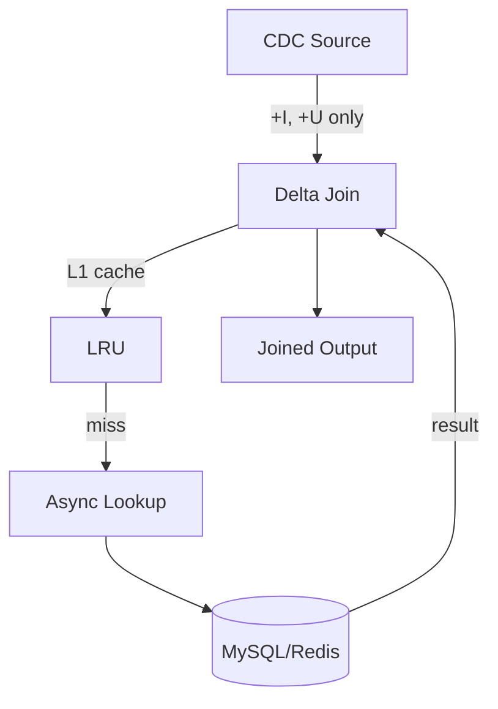

# Delta Join V2 Production Guide

> **Stage**: Flink/02-core | **Prerequisites**: [Delta Join Basics](delta-join.md) | **Formal Level**: L5
>
> **Flink Version**: 2.2.0 GA
>
> Production deployment checklist, configuration tuning, and monitoring for Delta Join V2.

---

## 1. Definitions

**Def-F-02-76: Delta Join V2 Production Instance**

$$
\mathcal{D}_{prod}(s, T, \mathcal{C}) = \{(r_s, \pi(r_t)) \mid r_s \in s \land r_t \in \text{lookup}_\mathcal{C}(r_s.key, T)\}
$$

Configuration space:

- $C_{cache}$: Size, TTL, eviction policy
- $C_{source}$: CDC constraints (`debezium.skipped.operations = 'd'`)
- $C_{pushdown}$: Projection/filter pushdown
- $C_{fallback}$: Degradation strategy

**Production Readiness Criteria**:

$$
\text{ProductionReady}(\mathcal{D}_{prod}) \equiv \begin{cases}
\text{StateSize} < 10\text{GB} \\
\text{CheckpointDuration} < 60\text{s} \\
\text{Availability} > 99.9\% \\
\text{Latency}_{p99} < 500\text{ms}
\end{cases}
$$

---

## 2. Properties

**Lemma-F-02-35: Cache Hit Rate Bound**

With proper sizing, cache hit rate > 90% for Zipf-distributed workloads.

**Lemma-F-02-36: CDC Constraint Enforcement**

Violations of no-DELETE constraint result in undefined behavior; enforcement is at source configuration level.

---

## 3. Relations

- **with CDC Connectors**: Requires MySQL/PostgreSQL CDC with DELETE filtering.
- **with Monitoring**: Custom metrics for cache hit rate, lookup latency, fallback rate.

---

## 4. Argumentation

**Why No DELETE Support?**

Zero intermediate state means no record of prior join outputs. DELETE events require retraction, which needs stateful tracking.

**Workarounds**:

1. Filter DELETEs at source (`debezium.skipped.operations = 'd'`)
2. Use soft deletes (UPDATE status = 'deleted')
3. Fall back to traditional hash join for mutable dimensions

---

## 5. Engineering Argument

**Configuration Tuning**:

| Parameter | Default | Recommended |
|-----------|---------|-------------|
| Cache size | 100MB | 1-10GB |
| TTL | 1h | Match source freshness |
| Async timeout | 10s | 1-5s |
| Fallback | Fail | Stale cache |

---

## 6. Examples

```sql
-- Production Delta Join V2 configuration
SET table.exec.delta-join.left.cache-size = '1gb';
SET table.exec.delta-join.left.cache-ttl = '10min';
SET table.exec.delta-join.async-lookup.timeout = '3s';

SELECT o.order_id, u.user_name, u.tier
FROM orders o
JOIN dim_users FOR SYSTEM_TIME AS OF o.proc_time u
  ON o.user_id = u.user_id;
```

---

## 7. Visualizations

**Delta Join Production Architecture**:



---

## 8. References
