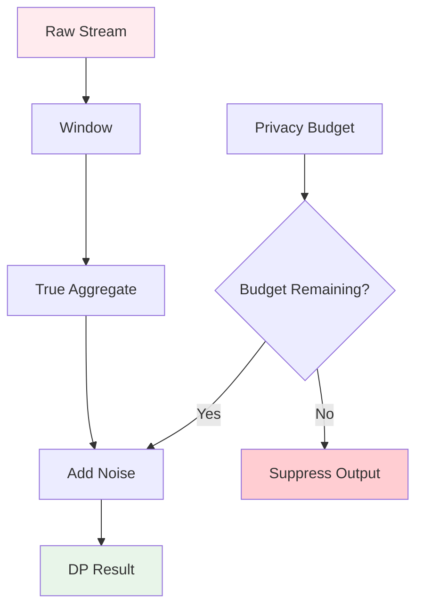

# Differential Privacy in Stream Processing

> **Stage**: Struct/ | **Prerequisites**: [Unified Streaming Theory](unified-streaming-theory.md) | **Formalization Level**: L5
> **Translation Date**: 2026-04-21

## Abstract

**Differential Privacy** provides rigorous privacy guarantees for data analysis. In stream processing, continuous query release and unbounded data arrival create unique challenges for privacy budget management and noise composition.

---

## 1. Definitions

### Def-S-02-21 ((ε,δ)-Differential Privacy)

A randomized algorithm $\mathcal{M}: \mathcal{D} \to \mathcal{R}$ satisfies $(\varepsilon, \delta)$-differential privacy iff for any neighboring datasets $D, D' \in \mathcal{D}$ (differing by at most one record) and any output subset $S \subseteq \mathcal{R}$:

$$\Pr[\mathcal{M}(D) \in S] \leq e^{\varepsilon} \cdot \Pr[\mathcal{M}(D') \in S] + \delta$$

- $\varepsilon$: privacy parameter (smaller = stronger privacy)
- $\delta$: allowable probability of privacy breach
- When $\delta = 0$: pure $\varepsilon$-differential privacy

In streaming, datasets are continuous arrival sequences; adjacency is defined over stream prefixes.

### Def-S-02-22 (Sensitivity)

**Global Sensitivity** for query $f: \mathcal{D} \to \mathbb{R}^d$:

$$\Delta_f = \max_{D \sim D'} \|f(D) - f(D')\|_p$$

**Local Sensitivity** for specific dataset $D$:

$$\Delta_f(D) = \max_{D' \sim D} \|f(D) - f(D')\|_p$$

### Def-S-02-23 (Privacy Budget Management)

**Total Privacy Budget** $\varepsilon_{total}$ over time range $T$:

$$\sum_{t \in T} \varepsilon_t \leq \varepsilon_{total}$$

Privacy budget composition follows:
- **Basic composition**: $k$ mechanisms with budget $\varepsilon$ each $\to$ total $k\varepsilon$
- **Advanced composition**: total $\approx \sqrt{k} \cdot \varepsilon$ (for small $\varepsilon$)

---

## 2. Properties

### Lemma-S-02-07 (Laplace Mechanism)

For function $f$ with sensitivity $\Delta_f$, the mechanism:

$$\mathcal{M}(D) = f(D) + \text{Lap}(\Delta_f / \varepsilon)$$

satisfies $\varepsilon$-differential privacy, where $\text{Lap}(\lambda)$ is Laplace noise with scale $\lambda$.

### Lemma-S-02-08 (Gaussian Mechanism)

For $\ell_2$-sensitivity $\Delta_2$, the mechanism:

$$\mathcal{M}(D) = f(D) + \mathcal{N}(0, \sigma^2)$$

satisfies $(\varepsilon, \delta)$-DP when $\sigma \geq \Delta_2 \cdot \sqrt{2\ln(1.25/\delta)} / \varepsilon$.

---

## 3. Streaming Challenges

### 3.1 Continuous Release

Unlike batch DP, streaming queries release results continuously. Each release consumes privacy budget:

$$\text{Budget}_{consumed}(t) = \sum_{i=1}^{t} \varepsilon_{release_i}$$

**Problem**: Unbounded stream $\to$ unbounded budget consumption.

### 3.2 Solutions

| Approach | Mechanism | Budget Strategy |
|----------|-----------|-----------------|
| Window-based | DP per window | Reset per window |
| Decay | Exponential decay noise | Decreasing $\varepsilon_t$ |
| Sparse vector | Release only on significant changes | Event-driven budget |

### 3.3 Event-Level vs. User-Level Privacy

- **Event-level**: Protect individual events (weaker, lower sensitivity)
- **User-level**: Protect all events from a single user (stronger, higher sensitivity)

---

## 4. Engineering Implementation

### 4.1 DP-Enabled Window Aggregation

```python
# Conceptual: Differentially private window count
class DPWindowCount:
    def __init__(self, epsilon, window_size):
        self.epsilon = epsilon
        self.window_size = window_size
        self.sensitivity = 1  # Adding/removing one event changes count by 1
    
    def compute(self, events):
        true_count = len(events)
        noise = np.random.laplace(0, self.sensitivity / self.epsilon)
        return max(0, true_count + noise)  # Clip negative values
```

### 4.2 Privacy Budget Tracking

```python
class PrivacyBudgetTracker:
    def __init__(self, total_epsilon):
        self.total = total_epsilon
        self.consumed = 0
    
    def allocate(self, epsilon_request):
        if self.consumed + epsilon_request <= self.total:
            self.consumed += epsilon_request
            return True  # Allocated
        return False  # Budget exhausted
```

---

## 5. Visualizations



---

## 6. References

[^1]: C. Dwork & A. Roth, "The Algorithmic Foundations of Differential Privacy", Foundations and Trends in Theoretical Computer Science, 2014.
[^2]: T. Wang et al., "Differential Privacy in Stream Processing", VLDB, 2022.
[^3]: G. Cormode et al., "Privacy at Scale: Local Differential Privacy in Practice", KDD, 2018.
