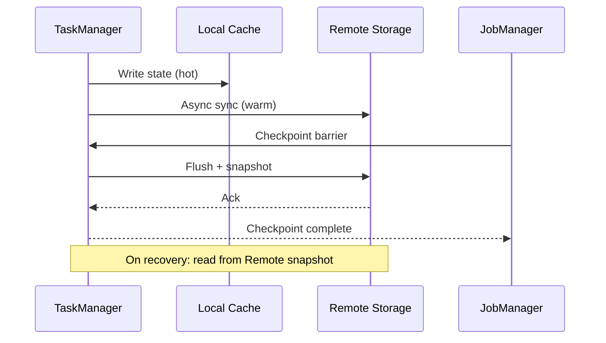

# Disaggregated State Storage Analysis

> **Language**: English | **Source**: [Flink/01-concepts/disaggregated-state-analysis.md](../Flink/01-concepts/disaggregated-state-analysis.md) | **Last Updated**: 2026-04-21

---

## 1. Definitions

### Def-F-01-EN-01: Disaggregated State Storage

An architecture pattern that physically separates stream processing operator state from compute nodes:

$$
\text{DisaggregatedState} = (\mathcal{C}, \mathcal{R}, \gamma, \eta, \sigma)
$$

where:

- $\mathcal{C}$: **LocalCache** — hot state memory resident layer
- $\mathcal{R}$: **RemoteStorage** — distributed object storage (S3, GCS, Azure Blob)
- $\gamma$: **SyncPolicy** — synchronization semantics between local and remote
- $\eta$: **CachePolicy** — LRU/LFU/TTL cache behavior control
- $\sigma$: **ConsistencyLevel** — read/write consistency guarantees

### Def-F-01-EN-02: State Backend Evolution

| Generation | Backend | Storage | Consistency | Use Case |
|-----------|---------|---------|-------------|----------|
| 1st | MemoryStateBackend | JVM Heap | Strong | Dev, small state |
| 2nd | FsStateBackend | Local disk → FS | Strong | Medium state |
| 3rd | RocksDBStateBackend | Local RocksDB → FS | Strong | Large state |
| 4th | ForStateBackend | Remote object store | Configurable | Very large state |

### Def-F-01-EN-03: Sync Policies

| Policy | Write Behavior | Read Behavior | Latency | Durability |
|--------|---------------|---------------|---------|------------|
| **Sync-Write** | Block until remote ack | Read from cache | High | Strong |
| **Async-Write** | Buffer + flush | Read from cache | Low | Eventual |
| **Write-Through** | Write cache + remote concurrently | Read from cache | Medium | Strong |
| **Write-Behind** | Write cache, async flush | Read from cache | Low | Weak |

## 2. Properties

### Lemma-F-01-EN-01: Location Independence

For disaggregated state, task migration does not require state transfer:

$$
\forall t_1, t_2 \in Task. \; Migrate(t_1, t_2) \Rightarrow State(t_1) = State(t_2) \; \text{(via remote)}
$$

### Lemma-F-01-EN-02: Monotonic Versioning

Async sync produces monotonically increasing versions:

$$
\forall t_1 < t_2. \; Version(State_{remote}(t_1)) \leq Version(State_{remote}(t_2))
$$

### Prop-F-01-EN-01: Latency-Throughput Tradeoff

Under disaggregated storage:

$$
\mathcal{L} = \mathcal{L}_{cache} + (1 - \eta_{hit}) \cdot \mathcal{L}_{remote}
$$

where $\eta_{hit}$ is the cache hit ratio.

## 3. Exactly-Once Under Disaggregated Storage

**Thm-F-01-EN-01**: Exactly-Once semantics is preserved under disaggregated state when:

1. Checkpoint barriers align across all operators
2. State snapshots are atomically committed to remote storage
3. Recovery restores from a consistent snapshot version

## 4. Failure Recovery Comparison

| Scenario | Embedded State (1.x) | Disaggregated (2.x) |
|----------|---------------------|---------------------|
| TM crash | Restart TM + restore state from checkpoint | Start new TM + read state from remote |
| Network partition | Wait for partition heal | Serve from cache (stale acceptable) |
| AZ failure | Failover to standby cluster | Redirect to remote storage endpoint |
| Recovery time | $O(|State|)$ | $O(1)$ (no data movement) |

## References
