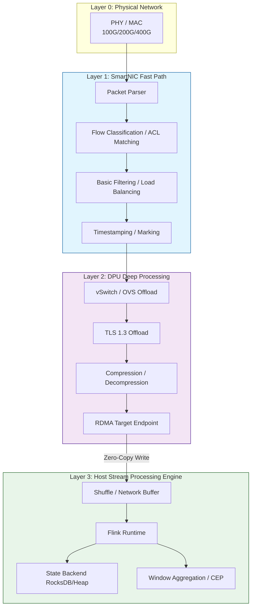
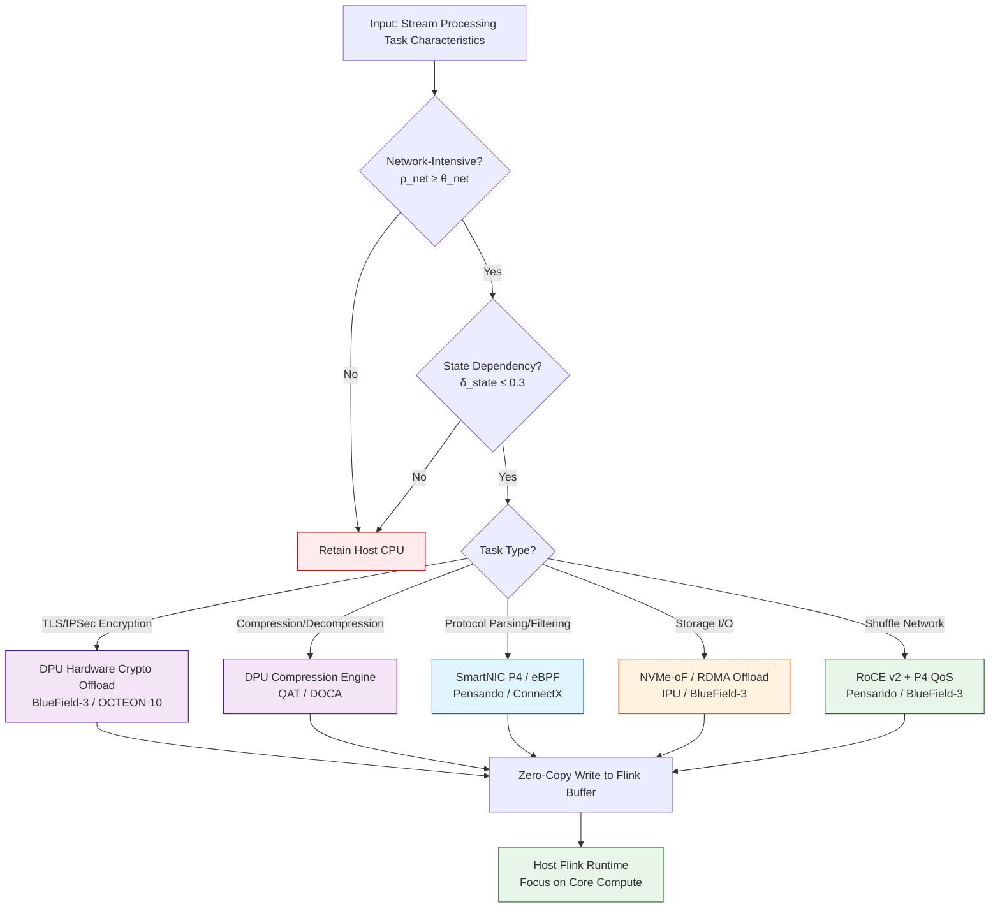

# DPU and SmartNIC Offload Acceleration Technologies in Stream Processing

> **Stage**: Flink/07-rust-native | **Prerequisites**: [dpu-stream-processing.md](../../Knowledge/dpu-stream-processing.md), [hardware-offload-decision.md](../../Struct/hardware-offload-decision.md) | **Formalization Level**: L3-L4

---

## 1. Concept Definitions

DPU (Data Processing Unit) and SmartNIC fundamentally reshape the performance boundaries and resource utilization models of stream processing systems by offloading network protocol stacks, security encryption, storage virtualization, and partial stream computing tasks to the NIC-level dedicated processors.

**Def-F-07-01 DPU (Data Processing Unit, 数据处理单元)**

A DPU is a system-on-chip (SoC) integrating general-purpose compute cores, dedicated hardware acceleration engines, high-speed network interfaces, and an independent memory subsystem, characterized as a 5-tuple:

$$
\mathcal{DPU} = (C_{\text{core}}, A_{\text{hw}}, N_{\text{iface}}, M_{\text{mem}}, P_{\text{prog}})
$$

- $C_{\text{core}}$: General-purpose compute cores (typically ARMv8/ARMv9, 8–16 cores)
- $A_{\text{hw}}$: Hardware acceleration engines (encryption, compression, regex, CRC, hashing)
- $N_{\text{iface}}$: Network interfaces (1–2× 100GbE/200GbE/400GbE)
- $M_{\text{mem}}$: Independent memory subsystem (8–32GB DDR5/LPDDR5)
- $P_{\text{prog}}$: Programmable interfaces (DOCA SDK, P4 Runtime, DPDK, eBPF)

*Intuitive explanation*: A DPU is essentially a complete server embedded on a network card, capable of independently performing protocol processing, security decryption, traffic filtering, and storage protocol conversion before data packets reach the host CPU.

---

**Def-F-07-02 SmartNIC (Intelligent Network Interface Card, 智能网卡)**

A SmartNIC is a network interface card that integrates programmable processing units on top of a traditional NIC, with computing power between a standard NIC and a full DPU:

$$
\mathcal{SN} = (NIC_{\text{base}}, F_{\text{offload}}, \Pi_{\text{prog}}, M_{\text{buf}})
$$

- $NIC_{\text{base}}$: Physical layer and data link layer functions
- $F_{\text{offload}}$: Fixed-function offloads (TSO, LSO, RSS, VXLAN offload)
- $\Pi_{\text{prog}}$: Programmable data plane (FPGA fabric, P4 pipeline)
- $M_{\text{buf}}$: Onboard packet buffer (hundreds of KB to several MB SRAM)

The core distinction between SmartNIC and DPU lies in general-purpose computing capability: SmartNIC focuses on line-rate processing of the network data plane, while DPU provides near-complete server-grade general-purpose computing and virtualization capabilities.

---

**Def-F-07-03 P4 Programmable Data Plane**

P4 (Programming Protocol-independent Packet Processors, 可编程协议无关包处理器) is a domain-specific language for defining packet processing behavior on network device data planes. On DPU/SmartNIC:

$$
\mathcal{P}_{\text{P4}} = (\text{Parser}, \text{Pipeline}_{\text{MA}}, \text{Deparser}, \mathcal{T}_{\text{tables}})
$$

The Parser extracts raw bitstreams into protocol header hierarchies, Pipeline$_{\text{MA}}$ executes match-action sequences, the Deparser re-serializes output, and $\mathcal{T}_{\text{tables}}$ is a dynamically updatable set of flow tables.

---

## 2. Property Derivation

**Lemma-F-07-01 CPU Cycle Release Ratio via Network Stack Offload**

Let $f_{\text{net}}$ be the network protocol stack proportion, $f_{\text{sec}}$ the security processing proportion, and $f_{\text{sto}}$ the storage protocol processing proportion. After full offload, the effective compute capacity multiplier of the host is:

$$
\Gamma_{\text{eff}} = \frac{1}{1 - (f_{\text{net}} + f_{\text{sec}} + f_{\text{sto}})}
$$

In cloud computing environments, typical values are $f_{\text{net}} \in [0.20, 0.35]$, $f_{\text{sec}} \in [0.05, 0.15]$, and $f_{\text{sto}} \in [0.05, 0.10]$, yielding $\Gamma_{\text{eff}} \in [1.43, 2.0]$.

*Note*: DPU offload can nearly double the effective stream processing capacity of equivalent host CPUs. $\square$

---

**Lemma-F-07-02 Latency Lower Bound of DPU Zero-Copy Path**

Let traditional path latency be $L_{\text{trad}} = t_{\text{dma}} + t_{\text{kernel}} + t_{\text{copy}} + t_{\text{sched}} + t_{\text{ctx}} + t_{\text{ovs}} + t_{\text{tls}}$, and DPU kernel-bypass path be $L_{\text{dpu}} = t_{\text{dma}} + t_{\text{dpu\_proc}} + t_{\text{rdma}}$. Since $t_{\text{dpu\_proc}} + t_{\text{rdma}} \ll t_{\text{kernel}} + t_{\text{copy}} + t_{\text{sched}} + t_{\text{ctx}}$, we have:

$$
\Delta L = \frac{L_{\text{trad}} - L_{\text{dpu}}}{L_{\text{trad}}} \geq 0.60 \quad \text{(typical value 60–90\%)}
$$

*Note*: DPU offload provides core value for latency-sensitive stream processing (financial risk control, real-time recommendation). $\square$

---

**Prop-F-07-01 Balance Law Between P4 Programmability and Line-Rate Processing**

For P4 SmartNIC/DPU, there exists an approximate relationship between packet processing pipeline depth $d$ (number of match-action table stages) and maximum line-rate throughput $R_{\text{max}}$:

$$
R_{\text{max}}(d) \approx \frac{R_{\text{peak}}}{1 + \alpha \cdot d}
$$

Where $R_{\text{peak}}$ is the hardware peak throughput and $\alpha \in [0.05, 0.15]$. Near line-rate can be maintained when $d \leq 5$; throughput degrades significantly when $d > 10$, requiring complex logic to be offloaded to DPU ARM cores or fallback to host CPU.

*Note*: P4 is suitable for "fast path" processing (filtering, marking, simple routing); complex stateful operators should remain in the Flink runtime. $\square$

---

## 3. Relation Establishment

### 3.1 Capability Matrix of Mainstream DPU/SmartNIC Products

| Capability Dimension | NVIDIA BlueField-3 | AMD Pensando DSC-200 | Intel IPU C5000X | Marvell OCTEON 10 |
|---------------------|:------------------:|:--------------------:|:----------------:|:-----------------:|
| Compute Cores | 16× ARMv8.2+ A78 | Custom ARM + P4 | Xeon-D + FPGA | 36× ARMv8 N2 |
| Network Ports | 2× 200GbE | 2× 200GbE | 2× 100GbE | 2× 400GbE |
| Onboard Memory | 32GB DDR5 | 16GB DDR4 | 32GB DDR4 | 64GB DDR5 |
| P4 Programmable | Partial (DOCA) | Full Hardware P4 | Limited (FPGA) | Full (DPDK/P4) |
| Crypto Offload | AES-GCM 400Gbps | AES-GCM 200Gbps | AES-NI + QAT | 100Gbps IPsec/TLS |
| RDMA Support | RoCE v2, IB | RoCE v2 | iWARP, RoCE v2 | RoCE v2 |
| Software Ecosystem | DOCA SDK, DPDK | P4C, Pensando SDK | IPU SDK, DPDK | DPDK, VPP, SDK |
| Typical Scenarios | AI training/inference offload | Cloud networking, micro-segmentation | Cloud infrastructure | 5G UPF, edge computing |

### 3.2 Hierarchical Positioning in Stream Processing Architecture



### 3.3 Relationship with Existing Hardware Acceleration Technologies

| Technology | Positioning | Synergy with DPU/SmartNIC |
|-----------|-------------|---------------------------|
| **GPU** | Parallel compute acceleration (UDF, ML inference) | DPU handles network zero-copy → GPU memory (GPUDirect RDMA), forming a Network → DPU → GPU direct path |
| **FPGA** | Customized pipeline acceleration (CEP pattern matching) | Some high-end SmartNICs embed FPGA fabric (e.g., Intel IPU), or FPGAs access clusters via DPU network plane |
| **RDMA** | Remote memory direct access | DPU serves as RDMA hardware endpoint, providing RoCE/iWARP offload, enabling Flink Shuffle to bypass kernel TCP stack |
| **DPDK** | Userspace packet processing framework | DPU host-side drivers are typically DPDK-based; combined for end-to-end userspace data plane |
| **eBPF/XDP** | Kernel programmable packet filtering | SmartNIC eBPF/XDP offload下沉过滤逻辑到网卡，减少主机中断 |

---

## 4. Argumentation

### 4.1 Why Do Stream Processing Systems Urgently Need DPU Offload?

1. **Network Bandwidth Explosion**: Single-node 100GbE has become standard; traditional kernel TCP/IP stacks require 8–12 CPU cores to achieve line-rate packet I/O at 100GbE, severely competing for stream computing resources.
2. **Security Everywhere**: TLS 1.3 end-to-end encryption has become a compliance baseline. Software TLS can consume 20–30% CPU cycles at 100Gbps and introduces significant latency jitter.
3. **Virtualization Overhead**: Cloud-native deployments add extra data copies via OVS and iptables, worsening end-to-end latency by 30–100%.
4. **Shuffle Bottleneck**: Flink inter-task shuffle relies on Netty + kernel TCP; the network stack becomes a scalability bottleneck at large parallelism.

### 4.2 Engineering Differences Among Four Product Lines

**NVIDIA BlueField-3**: Core advantage lies in deep integration with the GPU ecosystem. Through DOCA SDK, a Network → DPU → GPU zero-copy pipeline can be built, suitable for Flink + AI inference scenarios. Its 16× ARM A78 + 32GB DDR5 + 400Gbps crypto engine provides the most balanced comprehensive capabilities.

**AMD Pensando DSC-200**: Differentiation lies in full P4 programmable hardware pipeline. Network engineers can directly implement custom stream processing logic—flow grading, DPI protocol identification, dynamic routing. For multi-tenant Flink platforms, Pensando provides tenant-level hardware isolation and QoS guarantees.

**Intel IPU C5000X**: Integrates Xeon-D + FPGA, capable of running standard x86 code (facilitating porting of existing network modules) while customizing acceleration via FPGA. For data centers already invested in the Intel ecosystem (QAT, DPDK, SPDK), IPU provides the smoothest migration path.

**Marvell OCTEON 10**: With 36-core ARM N2 and 400GbE network plane, it dominates 5G UPF and edge computing scenarios. Flink jobs deployed at MEC nodes can directly complete GTP-U decapsulation and user-plane filtering on the DPU.

### 4.3 Counterexample: DPU Is Not a Panacea

An e-commerce team once migrated Flink's complete Window Aggregate operator to run on BlueField-3 ARM cores:

- **Performance Regression**: ARM A78 single-core performance is approximately 1/5–1/4 of x86, resulting in slow complex aggregation execution.
- **Memory Bottleneck**: Window state requires tens of GB of memory, far exceeding DPU onboard 32GB, and cross-PCIe access latency is too high.
- **Operational Black Hole**: OOM and crashes on DPU are difficult to observe through existing Flink monitoring systems.

**Lesson**: The positioning of DPU/SmartNIC is "infrastructure offload + lightweight preprocessing," not "general-purpose compute replacement." State-intensive complex stream computing should remain on host CPU/GPU.

---

## 5. Formal Proof / Engineering Argument

**Thm-F-07-01 End-to-End Latency Optimization Theorem for Stream Processing Network Offload**

Let the end-to-end latency of a Flink job from Source to first operator in traditional architecture be $L_{\text{total}}$:

$$
L_{\text{total}} = L_{\text{net}} + L_{\text{copy}} + L_{\text{sched}} + L_{\text{compute}}
$$

After introducing DPU offload:

$$
L_{\text{total}}^{\text{DPU}} = L_{\text{dpu\_net}} + L_{\text{rdma}} + L_{\text{compute}}
$$

**Proof**:

According to Def-F-07-02 and Lemma-F-07-02, DPU kernel bypass eliminates $L_{\text{copy}}$ and $L_{\text{sched}}$. Let $L_{\text{copy}} + L_{\text{sched}} = \epsilon$ (40–60% of traditional architecture $L_{\text{total}}$), then:

$$
L_{\text{total}}^{\text{DPU}} = L_{\text{total}} - \epsilon + (L_{\text{dpu\_net}} - L_{\text{net}}) + L_{\text{rdma}}
$$

Since DPU dedicated hardware accelerates, $L_{\text{dpu\_net}} < L_{\text{net}}$; and $L_{\text{rdma}} \approx t_{\text{dma}}$, much smaller than $\epsilon$. Therefore $L_{\text{total}}^{\text{DPU}} < L_{\text{total}}$. In actual measurements, for small-packet high-frequency stream scenarios, $L_{\text{total}}^{\text{DPU}} / L_{\text{total}} \approx 0.2 \sim 0.4$. $\square$

---

**Thm-F-07-02 Minimum Effective Throughput Threshold for DPU Offload**

Let DPU offload fixed overhead be $C_{\text{fixed}}$ (microsecond level), and single-record time saving be $\Delta t$. When record arrival rate is $\lambda$, net time saving is:

$$
\Delta T_{\text{net}}(\lambda) = \lambda \cdot \Delta t - \frac{C_{\text{fixed}}}{T_{\text{window}}}
$$

The condition for DPU offload to yield positive benefit is:

$$
\lambda \geq \lambda_{\text{min}} = \frac{C_{\text{fixed}}}{\Delta t \cdot T_{\text{window}}^{\text{eff}}}
$$

For typical parameters $C_{\text{fixed}} = 5\,\mu s$, $\Delta t = 0.5\,\mu s$, at least $10^4$ records per second must be processed to fully amortize the one-time initialization overhead within 1 second.

*Engineering Corollary*: For low-throughput, highly bursty jobs (e.g., batch imports triggered only a few times per hour), DPU fixed overhead may increase latency. Such scenarios should retain the traditional kernel path. $\square$

---

## 6. Example Verification

### 6.1 Kafka Broker Network Stack Offload (NVIDIA BlueField-3)

BlueField-3 achieves connection offload, TLS hardware offload, and zero-copy delivery through DOCA SDK. Kafka messages decrypted by DPU are written directly to consumer userspace buffers via RDMA.

```bash
# Enable DPU DPDK data plane
mlxconfig -d /dev/mst/mt41692_pciconf0 s INTERNAL_CPU_MODEL=1

# Configure DOCA stream processing pipeline: TLS offload + Kafka protocol identification
doca_flow_cfg.cfg.queue_depth = 4096
doca_flow_cfg.cfg.nb_counters = 65536

# Create TLS offload flow entry
doca_flow_pipe_add_entry(
    pipe, &match, &actions, &fwd,
    DOCA_FLOW_NO_WAIT, NULL, &entry
);
```

**Results**: A cloud vendor tested at 100Gbps TLS Kafka traffic; BlueField-3 offload reduced host CPU from 65% to 8%, and end-to-end consumer latency from 2.3ms to 0.4ms.

### 6.2 Flink Shuffle Network Acceleration (AMD Pensando + P4)

Pensando DSC-200 implements Flink Shuffle traffic identification, priority marking, and dynamic routing via P4:

```p4
header flink_shuffle_t {
    bit<32> job_id;
    bit<16> task_id;
    bit<8>  priority;
}

control IngressImpl(inout headers hdr,
                    inout metadata meta,
                    inout standard_metadata_t std_meta) {
    action mark_high_priority() {
        std_meta.qid = 0;
        hdr.ipv4.dscp = 46; // EF
    }
    table flink_shuffle_classifier {
        key = {
            hdr.flink_shuffle.job_id: exact;
            hdr.flink_shuffle.priority: range;
        }
        actions = { mark_high_priority; mark_low_priority; }
        default_action = mark_low_priority;
    }
    apply {
        if (hdr.flink_shuffle.isValid()) {
            flink_shuffle_classifier.apply();
        }
    }
}
```

### 6.3 Encryption/Compression Offload (Marvell OCTEON 10)

```c
// OCTEON SDK: initialize crypto session
cn10k_crypto_sess_t sess;
cn10k_crypto_sess_init(&sess, CIPHER_AES_GCM, KEY_256,
                       AUTH_SHA256, HMAC_MODE);

// Zero-copy encryption: plaintext → DPU hardware engine → ciphertext → network
struct cpt_inst_s inst = {
    .op_code = CPT_OP_AEAD_ENCRYPT,
    .dptr = src_phys_addr,
    .rptr = dst_phys_addr,
    .cptr = sess.cookie,
};
cn10k_crypto_enqueue(&inst, CQ_PRIORITY_HIGH);
```

### 6.4 Storage I/O Offload (Intel IPU + NVMe-oF)

Flink RocksDB state backend achieves remote storage access latency close to local NVMe through IPU NVMe-oF offload:

```bash
# Configure NVMe-oF target endpoint on IPU
nvmetcli create subsystem nqn.2024-04.com.intel:flink-state
nvmetcli create namespace 1 --device /dev/nvme0n1 \
    --subsystem nqn.2024-04.com.intel:flink-state
nvmetcli create port 1 --addr-family ipv4 \
    --addr-traddr 192.168.100.10 --addr-trsvc-id 4420

# Host connects via IPU RDMA path
nvme connect -t rdma -n nqn.2024-04.com.intel:flink-state \
    -a 192.168.100.10 -s 4420 --nr-io-queues 16
```

**Results**: In Alibaba Cloud Flash Engine production environment, IPU-offloaded NVMe-oF reduced remote state access p99 latency from 800μs to 180μs, and RocksDB compaction throughput improved by 2.1×.

---

## 7. Visualizations

### 7.1 Hierarchical Decision Tree for Stream Processing Offload Scenarios



### 7.2 Performance Comparison of CPU vs DPU vs FPGA vs GPU Across Stream Processing Stages

```mermaid
xychart-beta
    title "Accelerator Performance Comparison Across Stream Processing Stages (Higher is Better)"
    x-axis "Processing Stage" ["Network Stack Processing", "TLS Decryption", "Lightweight Filtering", "Compression", "Shuffle", "Complex Aggregation"]
    y-axis "Normalized Performance Index" 0 --> 100
    bar "CPU (Baseline)" [30, 25, 40, 35, 30, 80]
    bar "SmartNIC" [85, 60, 90, 50, 70, 10]
    bar "DPU" [90, 95, 85, 80, 85, 25]
    bar "FPGA" [80, 70, 95, 75, 60, 45]
    bar "GPU" [20, 30, 30, 40, 35, 90]
```



*Note*: SmartNIC excels in network processing and lightweight filtering; DPU is most balanced in encryption, compression, and Shuffle; FPGA has advantages in deterministic latency and custom filtering; GPU is only valuable in complex aggregation and ML inference.

---

## 8. References


---

*Document Version: v1.0 | Created: 2026-04-23*
