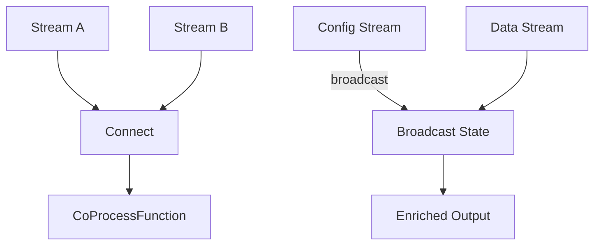

# Dual Stream Processing Patterns

> **Stage**: Knowledge | **Prerequisites**: [Stream Join Patterns](../stream-join-patterns.md) | **Formal Level**: L4-L5
>
> Advanced dual-stream collaboration: Connect/CoProcess, Broadcast State, and async dual-stream join.

---

## 1. Definitions

**Def-K-02-37: Dual Stream Processing**

Coordinated computation over two streams producing output:

$$
\text{DualStream}(S_A, S_B) = \{(o, t_o) \mid o = f(A_{buf}, B_{buf}), A_{buf} \subseteq S_A, B_{buf} \subseteq S_B\}
$$

**Def-K-02-38: Connect Operation**

Merging two heterogeneous streams into ConnectedStreams:

$$
\text{Connect}: S_A \times S_B \to \text{ConnectedStreams}(A, B)
$$

**Def-K-02-39: Broadcast State**

Broadcasting a small stream (rules, config) to all parallel instances of a larger stream:

$$
\text{Broadcast}(S_{config}, S_{data}) = \{(c, d) \mid c \in S_{config} \land d \in S_{data} \land \text{apply}(c, d)\}
$$

**Def-K-02-40: Async Dual-Stream Join**

Non-blocking join using async I/O for external lookups on both streams.

---

## 2. Properties

**Prop-K-02-19: Connect/CoProcess Expressiveness**

CoProcessFunction can express any deterministic dual-stream transformation with per-key state.

**Prop-K-02-20: Broadcast State Consistency**

Broadcast stream updates are atomic across all subtasks, ensuring consistent rule application.

---

## 3. Relations

- **with Join Patterns**: Connect is more general than Join (arbitrary logic vs equi-join).
- **with Stateful Computation**: Broadcast State uses operator state for the broadcast side.

---

## 4. Argumentation

**Connect vs Union**:

| Aspect | Union | Connect |
|--------|-------|---------|
| Stream types | Same | Different |
| Processing | Independent | Coordinated |
| State sharing | No | Yes |
| Use case | Merge same-type sources | Correlate different types |

**Broadcast State Boundaries**:

- Broadcast stream must be small (fits in memory)
- Update rate must be low (avoids frequent rebalancing)
- Data stream can be arbitrarily large

---

## 5. Engineering Argument

**Broadcast State Consistency**: Flink guarantees that all subtasks receive broadcast elements in the same order. Combined with checkpointing, this ensures exactly-once rule application.

---

## 6. Examples

```java
// Broadcast State pattern
MapStateDescriptor<String, Rule> ruleStateDescriptor =
    new MapStateDescriptor<>("rules", String.class, Rule.class);

BroadcastStream<Rule> broadcastStream = ruleStream
    .broadcast(ruleStateDescriptor);

dataStream.connect(broadcastStream)
    .process(new KeyedBroadcastProcessFunction() {
        @Override
        public void processElement(Data value, ReadOnlyContext ctx, Collector<Result> out) {
            Rule rule = ctx.getBroadcastState(ruleStateDescriptor).get(value.getRuleId());
            out.collect(rule.apply(value));
        }
    });
```

---

## 7. Visualizations

**Dual Stream Patterns Overview**:



---

## 8. References
