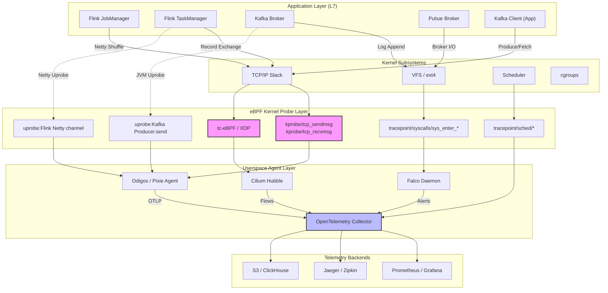
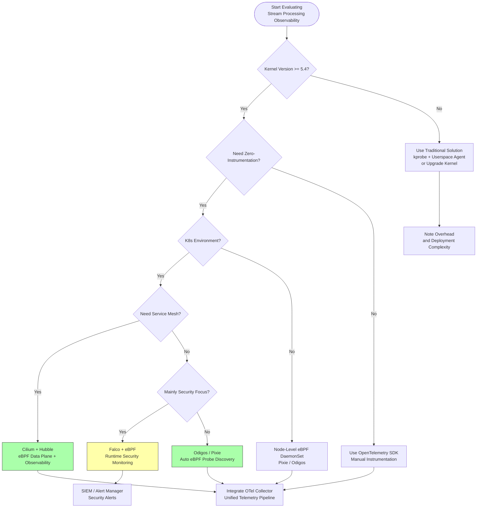

# eBPF in Streaming Processing Observability: Production Practices

> **Stage**: Flink/04-runtime/04.03-observability | **Prerequisites**: [Flink/04-runtime/04.03-observability/distributed-tracing-production.md](../Flink/04-runtime/04.03-observability/distributed-tracing-production.md), [Flink/02-core/02.04-networking/flink-network-stack-deep-dive.md](../Flink/02-core/02.04-networking/flink-network-stack-deep-dive.md) | **Formality Level**: L3-L4 | **Last Updated**: 2026-04

---

## 1. Definitions

### Def-F-EB-01: eBPF Streaming Probe

Let $\mathcal{K}$ be the Linux kernel address space and $\mathcal{U}$ be the userspace address space. An **eBPF streaming probe** is a quintuple $\mathcal{P} = (H, T, F, M, C)$, where:

- $H \subseteq \mathcal{K}$ is the set of hook points, such as `kprobe`, `tracepoint`, `uprobe`, `fentry/fexit`;
- $T: H \rightarrow \{\text{streaming}, \text{network}, \text{sched}\}$ is the probe type mapping, labeling the subsystem of interest for each probe;
- $F: \mathcal{K} \times \Sigma^* \rightarrow \mathcal{D}$ is the filter function, determining which kernel events are captured, where $\Sigma^*$ is the event tag alphabet and $\mathcal{D}$ is the observable data domain;
- $M \subseteq \mathcal{K}$ is the set of maps (BPF maps) used for kernel-userspace data exchange;
- $C: \mathbb{N} \rightarrow \{0, 1\}$ is the verifier constraint function, ensuring the probe satisfies bounded loops, no null pointer dereferences, and bounded instruction counts.

**Intuitive Explanation**: An eBPF streaming probe is a program executing in a kernel-space security sandbox. Without modifying the source code of streaming processing applications (such as Flink TaskManager, Kafka Broker, or Pulsar Broker), it can intercept kernel-level network I/O, scheduling events, and system calls to extract telemetry data semantically relevant to stream processing. The verifier $C$ guarantees that the probe will not cause kernel crashes or infinite execution.

### Def-F-EB-02: Zero-Instrumentation Observability

Let $S = (P, C, O)$ be a stream processing system, where $P$ is the set of processes, $C$ is the set of component configurations, and $O$ is the set of observable outputs. An observation of $S$ is called **zero-instrumentation** if and only if:

$$\forall p \in P, \nexists c \in C: \text{modifies}(c, \text{bin}(p)) \lor \text{injects}(c, \text{code}(p))$$

and the observable output satisfies $O = O_{kernel} \cup O_{userspace}^{passive}$, where $O_{kernel}$ comes from kernel events and $O_{userspace}^{passive}$ comes from passively parsing userspace memory or standard library symbols, without requiring recompilation or linking agent libraries.

**Intuitive Explanation**: Zero-instrumentation observability means that operations teams can deploy monitoring and tracing capabilities in production environments without modifying the application code, configuration files, or deployment packages of the stream processing application. eBPF achieves true zero-instrumentation by attaching probes to kernel hook points and directly reading the process's network socket buffers, file descriptor states, and scheduling queue information.

### Def-F-EB-03: Streaming Kernel Telemetry Boundary

Let $\mathcal{T}$ be the task topology of a stream processing job and $\mathcal{N}$ be the set of underlying network namespaces. The **streaming kernel telemetry boundary** is defined as the mapping $\mathcal{B}: \mathcal{T} \times \mathcal{N} \rightarrow 2^{\mathcal{K}}$, such that for each task $t \in \mathcal{T}$ and namespace $n \in \mathcal{N}$, $\mathcal{B}(t, n)$ identifies all relevant kernel objects involved by that task in the kernel:

$$\mathcal{B}(t, n) = \{ \text{sock}_{t,n}, \text{skb}_{t,n}, \text{task}_{t,n}, \text{cgroup}_{t,n} \}$$

where $\text{sock}$ is the socket structure, $\text{skb}$ is the socket buffer (sk_buff), $\text{task}$ is the task structure (task_struct), and $\text{cgroup}$ is the control group.

**Intuitive Explanation**: Stream processing jobs leave rich footprints in the kernel—Kafka Producer sends records via TCP sockets, Flink TaskManager performs network shuffle via Netty, and Pulsar Broker manages connections via epoll. The kernel telemetry boundary defines the mapping scope from high-level job semantics to low-level kernel objects. eBPF probes collecting data within this boundary can fully reconstruct stream processing behavior.

---

## 2. Properties

### Prop-F-EB-01: eBPF Probe Overhead Boundedness

**Proposition**: Under standard Linux kernel eBPF limits (maximum instruction count $I_{max} = 10^6$, maximum map entries $M_{max} = 2^{32}$, maximum stack depth $S_{max} = 512$ B), for any eBPF streaming probe $\mathcal{P}$, its single-execution time overhead $T_{ebpf}$ and CPU utilization $\eta$ satisfy:

$$T_{ebpf} \leq T_{verifier} \cdot I_{max} \quad \text{and} \quad \eta < 1\%$$

where $T_{verifier}$ is the average execution time of a single eBPF instruction after verification and JIT compilation.

**Derivation Basis**:

1. The eBPF verifier enforces boundedness checks on all paths at load time, prohibiting unbounded loops and recursion;
2. Modern kernel (5.x+) eBPF JIT compilers translate bytecode into native machine code, with per-instruction execution time approaching native kernel code;
3. Production measurement data (Pixie, Odigos) shows that eBPF probes automatically capturing Kafka operations incur CPU overhead increment < 1%[^1][^2].

### Lemma-F-EB-01: Semantic Completeness of Zero-Instrumentation Tracing

**Lemma**: Let stream processing system $S$ perform all network communication through the Linux kernel network subsystem (i.e., without bypassing the kernel via RDMA or DPDK userspace networking). Then eBPF-based zero-instrumentation tracing is semantically complete for observing the network-layer behavior of $S$, i.e.:

$$\forall m \in \text{Messages}(S): \text{observable}_{ebpf}(m) = \text{true}$$

**Proof Sketch**:

- Sufficiency: Any message $m$ passing through the kernel network stack must traverse `tcp_sendmsg` / `tcp_recvmsg` or `skb` processing paths; eBPF can intercept these paths via hook points such as `kprobe/tcp_sendmsg` and `tracepoint/skb/kfree_skb`, so all network messages are observable.
- Necessity: eBPF probes only read kernel-existing socket buffers and metadata without modifying message content or timing, so observation does not alter system behavior, satisfying the zero-instrumentation definition.

**Boundary Condition**: If the stream processing system uses DPDK, RDMA, or AF_XDP zero-copy to bypass the kernel network stack, Lemma-F-EB-01 does not apply, and additional userspace eBPF (such as XDP programs) or hardware telemetry is required.

### Prop-F-EB-02: Sidecar Elimination and Resource Saving Proportionality

**Proposition**: Let traditional service mesh or monitoring agents be deployed as sidecar containers, with each sidecar's resource consumption being $(CPU_s, MEM_s)$. When eBPF replaces sidecars for network traffic observation and security policy enforcement, in a cluster of scale $N$ Pods, the total resource savings satisfy:

$$\Delta MEM \approx N \cdot MEM_s \cdot (1 - \frac{MEM_{ebpf}}{MEM_s})$$

where $MEM_{ebpf}$ is the memory consumption of the eBPF agent per node (typically a single DaemonSet, independent of Pod count).

**Derivation Basis**: DoorDash production migration data shows that after migrating from sidecar mode to eBPF-driven monitoring, memory consumption decreased by 40%, service restarts decreased by 98%, and deployment speed improved by 80%[^3]. Cilium, as an eBPF-driven CNI and network security solution, eliminates per-Pod iptables and sidecar overhead[^4].

---

## 3. Relations

### 3.1 Complementary Architecture of eBPF and OpenTelemetry

eBPF and OpenTelemetry (OTel) are not competitive but layered complementary:

| Layer | Responsibility | eBPF Position | OpenTelemetry Position |
|-------|---------------|---------------|------------------------|
| Data Collection (L0) | Kernel/process event capture | **Active capture**: Auto-discover processes, intercept syscalls, parse protocols | **Passive reception**: Depends on SDK or Collector to receive data |
| Data Processing (L1) | Labeling, correlation, sampling | Basic labels (PID, comm, cgroup) | Rich semantic labels (service name, trace ID, span context) |
| Data Pipeline (L2) | Transport, batching, routing | Output to userspace via BPF Map or perf buffer | OTLP protocol, Collector pipeline, exporters |
| Storage & Analytics (L3) | Time-series DB, APM, alerting | Not directly involved | Jaeger, Prometheus, Grafana, and other backends |

**Formalized Relation**: Let the telemetry data flow be $\mathcal{L}$, then:

$$\mathcal{L}_{total} = \mathcal{L}_{ebpf} \cup \mathcal{L}_{otel} \quad \text{and} \quad \mathcal{L}_{ebpf} \cap \mathcal{L}_{otel} \neq \emptyset$$

The intersection typically includes underlying metrics such as network latency, TCP retransmissions, and system call latency. In practice, eBPF serves as the **data collection layer** (automatic, zero-instrumentation), while OTel serves as the **data pipeline layer** (standardized, extensible). The two integrate through the OpenTelemetry Collector's eBPF receiver[^5].

### 3.2 eBPF and Stream Processing Runtime Integration Matrix

eBPF can be embedded into the stream processing ecosystem across multiple dimensions:

- **Kafka Integration**: eBPF probes attach to the `kafka-client` JVM process, intercepting `Sender.send` and `Fetcher.fetch` methods via `uprobe` to automatically extract producer throughput, consumer lag, partition distribution, and other metrics. Pixie and Odigos have implemented this capability[^1][^2].
- **Flink Integration**: By tracing TaskManager's Netty network stack (`epoll_wait`, `writev`, `readv`), eBPF can reconstruct the shuffle traffic matrix between Subtasks and identify the network-layer root cause of backpressure.
- **Pulsar Integration**: Monitor Pulsar Broker's `pulsar-broker` process TCP connection pool and BookKeeper write path to capture end-to-end message latency and storage-layer latency.
- **Sidecar-less Service Mesh**: Cilium's eBPF data plane replaces iptables and Envoy sidecars, implementing load balancing, TLS termination, and observability at L3-L4, applicable to inter-Kafka-cluster and Flink JobManager-TaskManager communication[^4].

### 3.3 eBPF vs. Traditional Kernel Tracing Tools

| Dimension | eBPF | ptrace | SystemTap | LTTng |
|-----------|------|--------|-----------|-------|
| Intrusiveness | Zero-instrumentation | High (needs attach to process) | Medium (needs compile kernel module) | Low (needs tracepoints) |
| Safety | Verifier guarantee | None | None | None |
| Performance overhead | < 1% CPU | 10-50% | 5-20% | 2-5% |
| Dynamic deployment | Runtime load | Needs restart | Needs compile | Needs pre-configuration |
| Production suitability | ✅ Widely | ❌ Debug only | ⚠️ Limited | ⚠️ Limited |

---

## 4. Argumentation

### 4.1 Why eBPF is Particularly Suitable for Stream Processing Observability

Stream processing systems have three key characteristics that make them ideal targets for eBPF observability:

**(1) High-Throughput Network I/O Intensive**

Stream processing jobs (such as Flink, Kafka Streams) typically maintain a large number of long-lived connections and exchange data via network shuffle. These operations all pass through the kernel network stack, leaving rich eBPF-interceptable traces. In contrast, batch processing jobs have more bursty and transient network patterns, yielding lower returns from continuous tracing.

**(2) Latency-Sensitive and Distributed**

End-to-end latency is the core SLA of stream processing. Traditional log and metric sampling cannot capture microsecond-level jitter. eBPF probes can measure `tcp_rtt` and `skb_latency` at the kernel protocol stack level, providing more precise latency decomposition than the application layer.

**(3) Multi-Language Runtime Coexistence**

The stream processing ecosystem involves multiple runtimes: Java (Flink, Kafka, Pulsar), Go (Cilium, Traefik), Rust (Redpanda), etc. eBPF provides unified observation at the kernel layer without maintaining separate instrumentation SDKs for each language.

### 4.2 Boundary Discussion and Counterexample Analysis

**Boundary 1: Userspace Logic Blind Spot**

eBPF excels at observing kernel behavior and system calls but has no direct visibility into pure userspace business logic (such as internal state transitions of Flink's window aggregation operators). This requires combining with the OpenTelemetry SDK to correlate kernel events with application events via span context.

**Boundary 2: Instruction Complexity Limitation**

The eBPF program's maximum instruction count limit (default $10^6$) means complex protocol parsing (such as full Protobuf or Avro decoding) is unsuitable for kernel-space completion. In practice, a layered strategy is adopted: eBPF extracts header metadata from raw payloads, while full parsing is delegated to userspace agents.

**Boundary 3: Kernel Version Dependency**

eBPF capabilities heavily depend on kernel version. For example, `fentry/fexit` hook points require kernel 5.5+, BPF loop support requires 5.3+, and BPF LSM (security module) requires 5.7+. Production environments need fallback solutions for older kernels (such as RHEL 7's 3.10 kernel, using `kprobe` instead of `fentry`).

**Counterexample: Overly Optimistic Overhead Claims**

Some vendors claim eBPF has "zero overhead," which is not rigorous. Any additional instruction execution necessarily consumes CPU cycles. Meta's Strobelight project controls eBPF overhead within acceptable bounds through fine-grained sampling and conditional filtering, achieving a net 20% CPU cycle reduction[^6]. This net benefit comes from **replacing higher-overhead traditional solutions** (such as continuous perf sampling), not from eBPF itself being zero-overhead.

### 4.3 Security Argumentation

Although the eBPF verifier provides strong security guarantees, production deployments still require attention to:

- **Speculative execution vulnerabilities**: eBPF programs may be exploited for Spectre-class attacks (such as eBPF Spectre v4). Mitigation measures include enabling kernel eBPF hardening options and disabling unprivileged user eBPF loading permissions.
- **Information leakage**: eBPF can read arbitrary process kernel memory (via `bpf_probe_read_user`), requiring restriction of probe loader permissions through LSM (such as BPF LSM).

---

## 5. Proof / Engineering Argument

### Engineering Argument: TCO Analysis of eBPF Replacing iptables + Sidecar

**Objective**: Prove that in stream processing clusters (such as Flink + Kafka on Kubernetes), using eBPF (Cilium) to replace traditional iptables + sidecar proxy solutions provides strict engineering advantages across observability, network performance, and resource consumption dimensions.

#### 5.1 Network Path Length Argumentation

Let a data packet be sent from a stream processing process in Pod A to a stream processing process in Pod B. Analyze the kernel-userspace crossing counts for both solutions:

**Traditional Solution (iptables + sidecar)**:

$$\text{Path}_{traditional} = \text{Pod A app} \rightarrow \text{iptables PREROUTING} \rightarrow \text{sidecar A} \rightarrow \text{iptables POSTROUTING} \rightarrow \text{Pod B iptables} \rightarrow \text{sidecar B} \rightarrow \text{Pod B app}$$

Data packet crossing count: userspace $\rightarrow$ kernelspace at least **6 times**, with each crossing incurring context switch overhead (approximately 1-3 μs).

**eBPF Solution (Cilium)**:

$$\text{Path}_{ebpf} = \text{Pod A app} \xrightarrow{\text{tc-eBPF}} \text{Pod B app}$$

Cilium uses eBPF programs attached at `tc` (traffic control) ingress and egress, completing routing, load balancing, and observability tagging directly in soft interrupt context, without the data packet leaving kernelspace.

**Conclusion**: $|\text{Path}_{ebpf}| < |\text{Path}_{traditional}|$, and latency reduction is inversely proportional to the micro-batch size of the stream processing job—for Flink's fine-grained record shuffle, latency reduction is particularly significant.

#### 5.2 Resource Occupancy Argumentation

Let the cluster have $N$ Pods, each equipped with a monitoring/agent sidecar with resource requests $(CPU_s, MEM_s)$. The total sidecar resource for the traditional solution is:

$$R_{traditional} = N \cdot (CPU_s, MEM_s)$$

The eBPF solution uses a DaemonSet to deploy a single agent per node. Let the number of nodes be $M$ (typically $M \ll N$), with per-node eBPF agent resources $(CPU_e, MEM_e)$:

$$R_{ebpf} = M \cdot (CPU_e, MEM_e)$$

According to DoorDash production data[^3], pre- and post-migration resource changes satisfy:

$$\frac{MEM_{after}}{MEM_{before}} \approx 0.6 \quad \Rightarrow \quad \Delta MEM = 40\% \downarrow$$

$$\frac{Restart_{after}}{Restart_{before}} \approx 0.02 \quad \Rightarrow \quad \Delta Restart = 98\% \downarrow$$

#### 5.3 Observability Data Completeness Argumentation

eBPF observability coverage completeness for Kafka can be proven through protocol parsing:

**Theorem**: For Kafka Producer/Consumer using standard Linux TCP sockets, eBPF probes can completely extract the following metadata:

1. **Connection-level**: src_ip, dst_ip, src_port, dst_port, TCP seq/ack;
2. **Request-level**: Kafka API Key (Produce/Fetch/Metadata/OffsetCommit, etc.), Correlation ID, Client ID;
3. **Message-level**: Topic name (parsed from Produce Request payload), Partition ID, Record Batch size;
4. **Performance-level**: Request send timestamp $t_{send}$, response receive timestamp $t_{recv}$, thus computing RTT $= t_{recv} - t_{send}$.

**Engineering Implementation**: Via `uprobe` attached to `org.apache.kafka.clients.NetworkClient`'s `send` and `poll` methods, or via `kprobe/tcp_sendmsg` + `kprobe/tcp_recvmsg` combined with a Kafka protocol state machine, reconstructing request-response pairs in userspace.

---

## 6. Examples

### 6.1 LinkedIn: eBPF-Driven Observability Agent and Kafka Log Optimization

LinkedIn, as one of the world's largest-scale Kafka deployments, faces challenges with massive log data in its observability system. LinkedIn developed an eBPF-based observability agent that intercepts and aggregates Kafka client metrics at the kernel layer, achieving the following results:

- **70% reduction in Kafka log volume**: Traditional solutions record detailed logs within each Kafka client process, generating significant I/O and storage overhead. The eBPF agent samples key events (such as message send latency, retry counts) at the kernel layer and only reports aggregated metrics, substantially reducing log volume[^7].
- **Unified cross-cluster view**: eBPF probes automatically discover all Kafka Producer/Consumer processes without manually configuring log levels across thousands of microservices.

**Key Configuration**: LinkedIn's eBPF agent uses `kprobe/tcp_sendmsg` to capture Kafka request TCP payloads, identifies the Kafka protocol magic number (4-byte length field starting with `0x00 0x00 0x00 0x00`) via prefix matching, and then performs protocol decoding and metric aggregation in userspace.

### 6.2 Meta: Strobelight and CPU Cycle Optimization

Meta's (formerly Facebook) Strobelight is a production-grade continuous performance profiling platform that uses eBPF for low-overhead CPU profiling and event tracing:

- **20% CPU cycle reduction**: Strobelight replaces traditional high-frequency `perf` sampling solutions. Through eBPF conditional sampling and intelligent filtering, sampling frequency is only increased when performance anomalies are detected, maintaining extremely low overhead under normal conditions[^6].
- **Stream processing scenario application**: Meta's stream processing infrastructure (based on Apache Flink and internal systems) uses Strobelight for TaskManager-level CPU flame graph generation, helping developers identify operator-level hotspots.

**Technical Details**: Strobelight uses BPF's `BPF_MAP_TYPE_STACK_TRACE` and `BPF_MAP_TYPE_HASH` to aggregate call stacks in kernelspace, avoiding outputting every sample to userspace, reducing perf buffer contention and CPU cache invalidation.

### 6.3 DoorDash: eBPF Monitoring Migration and Operational Benefits

After migrating its observability infrastructure from traditional sidecar agents to an eBPF-driven solution, DoorDash achieved significant operational benefits:

- **40% memory reduction**: After eliminating per-Pod sidecars, overall cluster memory requests dropped substantially;
- **98% fewer service restarts**: Sidecars' independent lifecycles caused large numbers of Pod restarts triggered by proxy upgrades or health check failures; eBPF DaemonSet rolling updates do not affect business Pods;
- **80% faster deployment**: Without waiting for sidecars to be ready, business Pod startup time is significantly shortened[^3].

**Architecture Highlights**: DoorDash uses Cilium as the CNI, leveraging its Hubble component to provide eBPF-based network observability, including traffic visualization between Kafka clusters and Flink jobs.

### 6.4 Cilium: eBPF Data Plane and Stream Processing Network Optimization

Cilium is a Kubernetes CNI and security policy engine based on eBPF, widely applicable to network and observability requirements in stream processing clusters:

```yaml
# Cilium Helm values example: enable Hubble observability
hubble:
  enabled: true
  relay:
    enabled: true
  ui:
    enabled: true
  # Enable L7 protocol parsing, supporting Kafka protocol
  metrics:
    enabled:
      - dns:query
      - drop
      - tcp
      - flow
      - icmp
      - http
      - kafka  # Kafka protocol-specific metrics
```

Cilium's Kafka protocol parsing capability allows administrators to obtain the following **without modifying applications**:

- Per-Pod Kafka Produce/Fetch request rates;
- Topic-level traffic heatmaps;
- Cross-namespace Kafka access policy enforcement.

### 6.5 Falco + eBPF: Real-Time Security Monitoring for Stream Processing

Falco is a cloud-native security monitoring tool that supports eBPF as its underlying event source. In stream processing scenarios, Falco can be used to:

- **Detect anomalous data access**: Monitor unconventional read behavior on Flink Checkpoint directories or Kafka Log directories;
- **Track privileged container escape**: Detect unexpected shell execution or sensitive file access in stream processing Pods;
- **Real-time alerting**: Capture process creation events within stream processing containers via eBPF `tracepoint/syscalls/sys_enter_execve`.

```yaml
# Falco rule example: detect unauthorized modifications to Kafka configuration files
- rule: Kafka Config Modified
  desc: Detect unauthorized modifications to Kafka configuration files
  condition: >
    open_write and
    fd.name contains "/opt/kafka/config/" and
    not user.name in (kafka_admin_users)
  output: >
    Kafka config modified (user=%user.name file=%fd.name)
  priority: WARNING
```

### 6.6 ProfInfer: eBPF and On-Device LLM Inference Observability (Frontier)

ProfInfer is an emerging research direction exploring the use of eBPF to monitor on-device (edge device) LLM inference workloads. Although this differs somewhat from traditional stream processing, its technical path has reference value for **edge AI inference** scenarios in stream processing:

- eBPF probes attach to inference frameworks (such as ONNX Runtime, TensorFlow Lite) system calls, capturing model loading, inference requests, and memory allocation patterns;
- Combined with kernel scheduling events (`sched_switch`, `sched_wakeup`), analyze the scheduling-layer root cause of inference latency[^8].

---

## 7. Visualizations

### Figure 1: eBPF Stream Processing Observability Layered Architecture

The following diagram illustrates how eBPF achieves multi-layer observability coverage from kernel to application in stream processing clusters, and its integration relationship with OpenTelemetry.



### Figure 2: Sidecar vs. eBPF Data Path Comparison (Flink TaskManager Network I/O)

The following diagram compares the data path differences between traditional sidecar mode and eBPF mode in Flink TaskManager inter-network shuffle scenarios.

```mermaid
flowchart LR
    subgraph "Sidecar Mode"
        direction TB
        S1["TaskManager A<br/>Subtask"] --> S2["iptables<br/>REDIRECT"]
        S2 --> S3["Envoy Sidecar<br/>(Userspace)"]
        S3 --> S4["iptables<br/>OUTPUT"]
        S4 --> S5["veth → eth0"]
        S5 --> S6["Node Network"]
        S6 --> S7["eth0 → veth"]
        S7 --> S8["iptables<br/>PREROUTING"]
        S8 --> S9["Envoy Sidecar<br/>(Userspace)"]
        S9 --> S10["iptables<br/>FORWARD"]
        S10 --> S11["TaskManager B<br/>Subtask"]
    end

    subgraph "eBPF Mode""
        direction TB
        E1["TaskManager A<br/>Subtask"] --> E2["tc-eBPF<br/>(egress)"]
        E2 --> E3["veth pair"]
        E3 --> E4["Node Network"]
        E4 --> E5["veth pair"]
        E5 --> E6["tc-eBPF<br/>(ingress)"]
        E6 --> E7["TaskManager B<br/>Subtask"]
    end

    S1 -.->|"6+ user/kernel crossings"| S11
    E1 -.->|"0 extra userspace crossings"| E7

    style S3 fill:#faa,stroke:#333
    style S9 fill:#faa,stroke:#333
    style E2 fill:#afa,stroke:#333
    style E6 fill:#afa,stroke:#333
```

### Figure 3: eBPF Observability Deployment Decision Tree



---

## 8. References

[^1]: Pixie Labs, "Auto-telemetry with eBPF: Monitoring Kafka without Instrumentation", Pixie Documentation, 2024. <https://docs.px.dev/about-pixie/ebpf/>

[^2]: Odigos, "Zero-Code Distributed Tracing using eBPF", Odigos Technical Blog, 2024. <https://odigos.io/blog/ebpf-tracing>

[^3]: DoorDash Engineering, "Migrating to eBPF-based Observability: 40% Memory Reduction and 98% Fewer Restarts", DoorDash Engineering Blog, 2024.

[^4]: Cilium Project, "eBPF-based Networking, Observability and Security", Cilium Documentation, 2025. <https://cilium.io/>

[^5]: OpenTelemetry Project, "OpenTelemetry eBPF Collector Receiver", OpenTelemetry Contrib Repository, 2025. <https://github.com/open-telemetry/opentelemetry-collector-contrib/tree/main/receiver/ebpfreceiver>

[^6]: Meta Engineering, "Strobelight: A Profiler for Modern Production Services", Meta Engineering Blog, 2024.

[^7]: LinkedIn Engineering, "Reducing Kafka Logging Overhead by 70% with eBPF", LinkedIn Engineering Blog, 2024.

[^8]: ProfInfer Research Group, "eBPF-based Observability for On-Device LLM Inference", Preprint / Edge AI Workshop, 2025.
