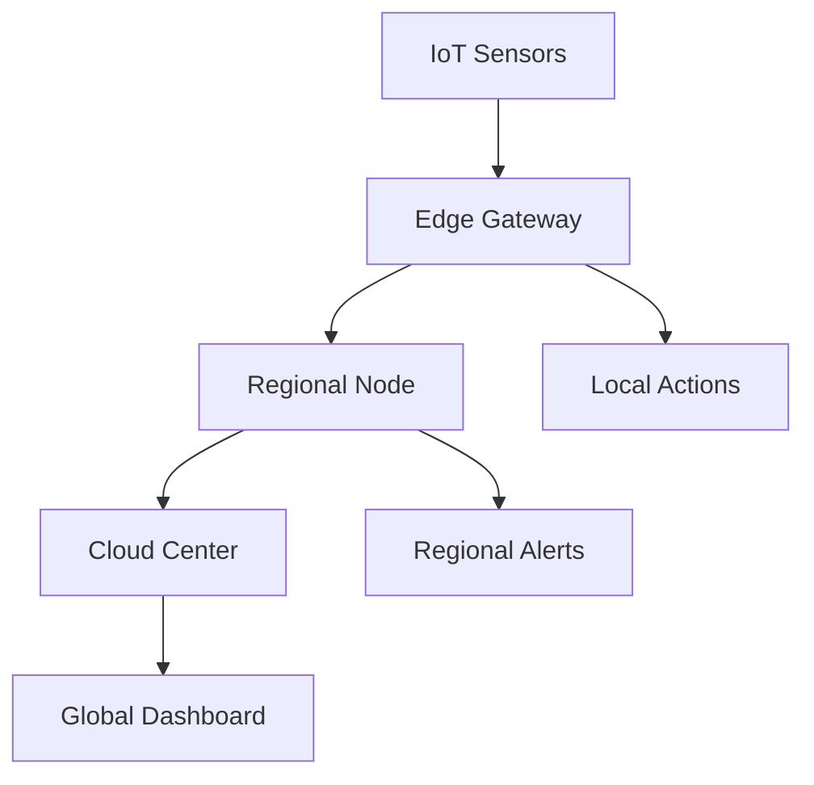

# Edge Streaming Architecture and IoT Real-Time Analytics

> **Stage**: Knowledge/06-frontier | **Prerequisites**: [Deployment Patterns](deployment-patterns.md) | **Formalization Level**: L4
> **Translation Date**: 2026-04-21

## Abstract

Edge stream processing performs real-time computation near data sources, minimizing latency and bandwidth consumption for IoT and industrial applications.

---

## 1. Definitions

### Def-K-06-190 (Edge Stream Processing)

**Edge stream processing** system $\mathcal{E}$ is a 6-tuple:

$$\mathcal{E} = \langle \mathcal{N}, \mathcal{S}, \mathcal{F}, \mathcal{C}, \mathcal{G}, \mathcal{Q} \rangle$$

where:

- $\mathcal{N} = \{n_1, \ldots, n_k\}$: edge nodes with resource constraints $(CPU, MEM, PWR)$
- $\mathcal{S}$: data streams, $s_i: \mathbb{T} \to \mathcal{D}$
- $\mathcal{F}: \mathcal{S} \to \mathcal{S}'$: processing operators
- $\mathcal{C} \subseteq \mathcal{N} \times \mathcal{N}$: node connectivity
- $\mathcal{G}: \mathcal{N} \to \{0,1,2\}$: tier function (0=Edge, 1=Regional, 2=Cloud)
- $\mathcal{Q}$: QoS constraints ($L_{max}$, $A_{min}$)

### Def-K-06-191 (Edge Latency Model)

$$L_{total} = L_{gen} + L_{proc}^{edge} + L_{net} + L_{proc}^{cloud} + L_{storage}$$

| Metric | Cloud-Only | Edge | Improvement |
|--------|-----------|------|-------------|
| Network latency | 50-200ms | 1-10ms | 10-100x |
| End-to-end latency | 100-500ms | 5-50ms | 5-20x |
| Bandwidth | 100% | 5-30% | 3-20x |
| Privacy risk | High | Low | - |

### Tiered Architecture

| Tier | Location | Latency | Processing | Functions |
|------|----------|---------|------------|-----------|
| L0: Device | IoT sensor | <1ms | Microcontroller | Data acquisition |
| L1: Edge Gateway | On-site | <10ms | Edge server | Protocol conversion, local aggregation |
| L2: Regional | City/campus | <50ms | Small DC | Cross-site coordination |
| L3: Cloud | Public cloud | <500ms | Large cluster | Global analysis, model training |

---

## 2. Architecture

---

## 3. References
