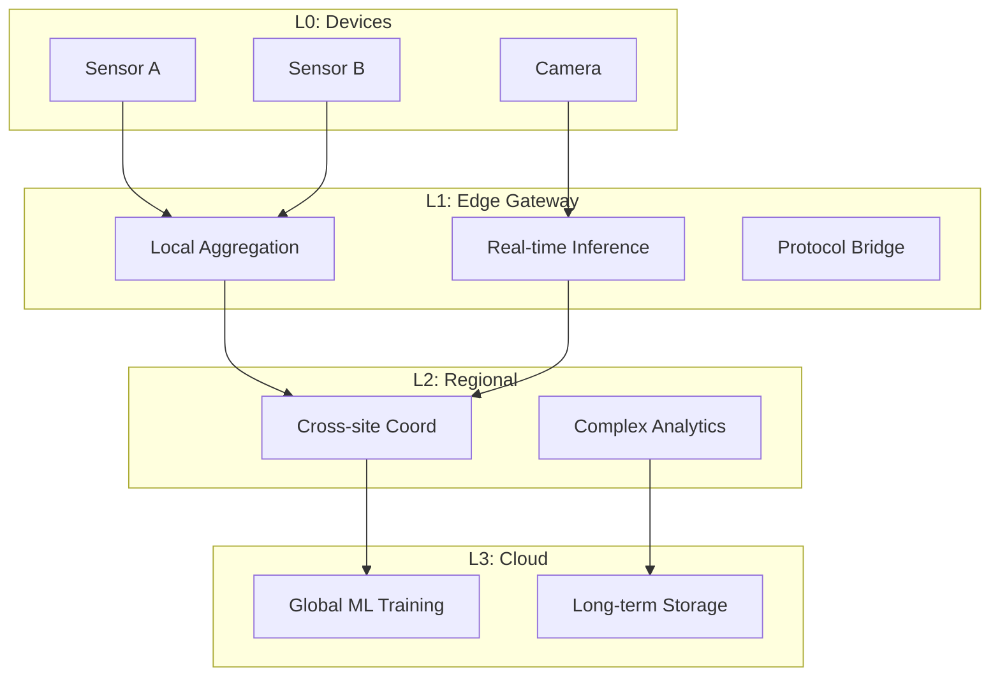

# Edge Streaming Architecture & IoT Real-Time Analytics

> **Language**: English | **Source**: [Knowledge/06-frontier/edge-streaming-architecture.md](../Knowledge/06-frontier/edge-streaming-architecture.md) | **Last Updated**: 2026-04-21

---

## 1. Definitions

### Def-K-06-EN-190: Edge Stream Processing

Real-time processing, filtering, aggregation, and inference on continuously arriving data streams at or near the data source. Formally modeled as a 6-tuple:

$$
\mathcal{E} = \langle \mathcal{N}, \mathcal{S}, \mathcal{F}, \mathcal{C}, \mathcal{G}, \mathcal{Q} \rangle
$$

where:

- $\mathcal{N} = \{n_1, ..., n_k\}$: Edge nodes with resource constraints $(CPU, MEM, PWR)$
- $\mathcal{S}$: Data streams, $s_i: \mathbb{T} \rightarrow \mathcal{D}$
- $\mathcal{F}: \mathcal{S} \rightarrow \mathcal{S}'$: Stream operators (filter, map, window aggregate)
- $\mathcal{C} \subseteq \mathcal{N} \times \mathcal{N}$: Inter-node connection topology
- $\mathcal{G}: \mathcal{N} \rightarrow \{0,1,2\}$: Tier function, 0=Edge, 1=Regional, 2=Cloud
- $\mathcal{Q}$: QoS constraints (latency bound $L_{max}$, availability $A_{min}$)

### Def-K-06-EN-191: Edge Latency Model

End-to-end latency components:

$$
L_{total} = L_{gen} + L_{proc}^{edge} + L_{net} + L_{proc}^{cloud} + L_{storage}
$$

Edge computing minimizes $L_{net}$ and $L_{proc}^{cloud}$ via local processing.

| Metric | Cloud Only | Edge + Cloud | Improvement |
|--------|-----------|--------------|-------------|
| Network latency | 50-200ms | 1-10ms | 10-100× |
| End-to-end latency | 100-500ms | 5-50ms | 5-20× |
| Bandwidth usage | 100% | 5-30% | 3-20× |
| Data privacy risk | High | Low | — |

### Def-K-06-EN-192: Edge-Cloud Tiered Architecture

| Tier | Location | Latency | Compute | Typical Function |
|------|----------|---------|---------|-----------------|
| **L0: Device** | IoT sensor/actuator | < 1ms | Microcontroller | Data collection, simple control |
| **L1: Edge Gateway** | On-site/local | < 10ms | Edge server | Protocol conversion, local aggregation, inference |
| **L2: Regional** | City/campus | < 50ms | Small DC | Cross-site coordination, complex analysis |
| **L3: Cloud** | Public cloud | < 500ms | Large cluster | Global analysis, model training, long-term storage |

## 2. Properties

### Lemma-K-06-EN-125: Edge Advantage Boundary

Edge processing outperforms cloud-only when:

$$
\frac{D_{raw}}{B_{available}} \cdot C_{transfer} > T_{edge-proc} + C_{edge-compute}
$$

where $D_{raw}$ is raw data volume, $B_{available}$ is available bandwidth, $C_{transfer}$ is transfer cost.

## 3. Architecture

## References
