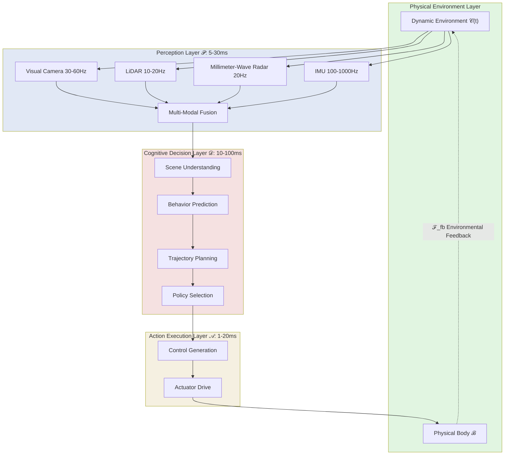
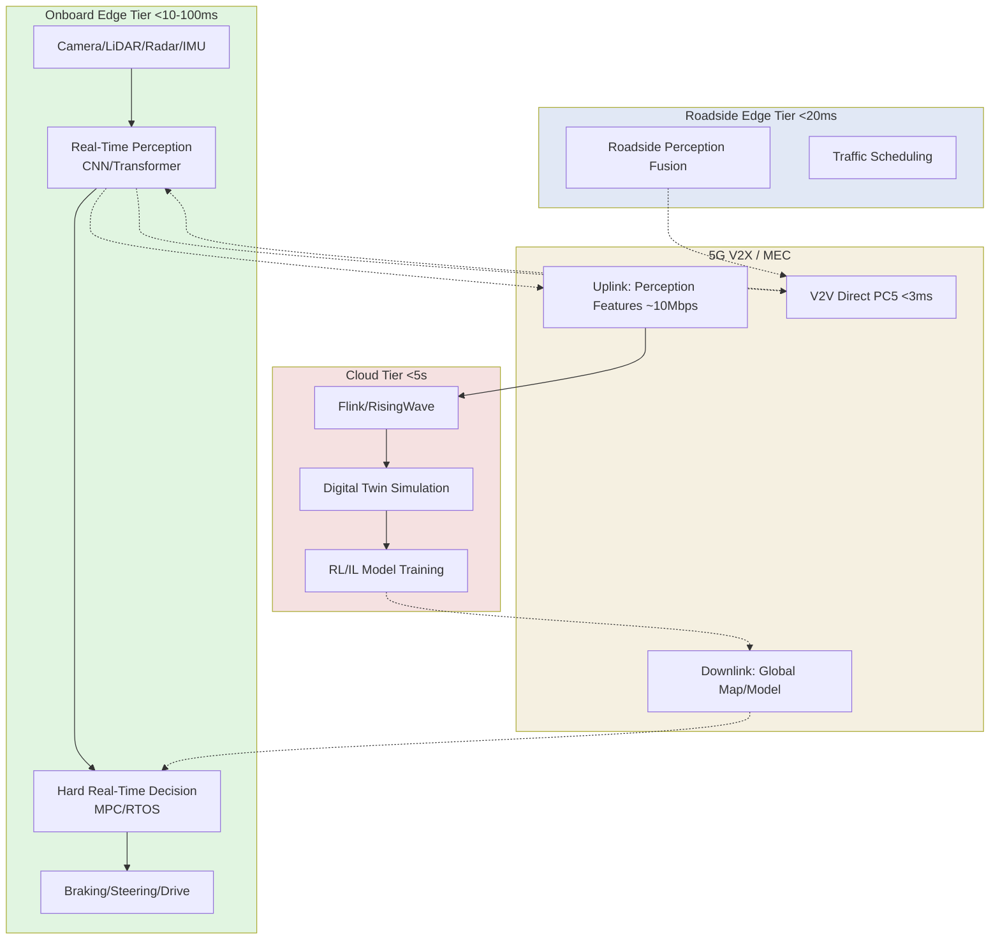

# Embodied AI Real-Time Perception-Decision-Action Streaming Closed-Loop Architecture

> **Status**: Forward-looking | **Estimated Release**: 2026-07 | **Last Updated**: 2026-04-23
>
> ⚠️ The features described in this document are in early research and prototype validation stages; implementation details may change.

> **Stage**: Knowledge/06-frontier | **Prerequisites**: [edge-ai-streaming-architecture.md](./edge-ai-streaming-architecture.md), [realtime-digital-twin-streaming.md](./realtime-digital-twin-streaming.md), [multimodal-ai-streaming-architecture.md](./multimodal-ai-streaming-architecture.md) | **Formalization Level**: L3-L4

---

## 1. Definitions

### Def-K-06-300: Embodied AI System (具身智能系统)

An **Embodied AI System** is an open system in which a physical entity is deeply coupled with an intelligent decision-making model:

$$
\mathcal{E} \triangleq \langle \mathcal{B}, \mathcal{S}, \mathcal{A}, \mathcal{M}, \mathcal{C} \rangle
$$

Where $\mathcal{B}$ is the physical body (robot / vehicle / UAV), $\mathcal{S}$ is the set of multi-modal sensors, $\mathcal{A}$ is the set of actuators, $\mathcal{M}$ is the cognitive model, and $\mathcal{C}(t)$ is the environmental context. The core characteristic distinguishing embodied AI from disembodied AI is: **the formation of intelligent behavior must rely on real-time interactive feedback between the physical body and the environment**.

### Def-K-06-301: Perception-Decision-Action Closed Loop (PDA Closed Loop, 感知-决策-行动闭环)

The **PDA Closed Loop** is the core control cycle of an embodied AI system:

$$
\mathcal{L}_{PDA} \triangleq \langle \mathcal{P}, \mathcal{D}, \mathcal{A}, \mathcal{F}_{fb} \rangle
$$

The cyclic flow is defined as $\mathcal{S}(t) \xrightarrow{\mathcal{P}} \hat{\mathcal{C}}(t) \xrightarrow{\mathcal{D}} \pi(t) \xrightarrow{\mathcal{A}} u(t) \xrightarrow{\mathcal{F}_{fb}} \mathcal{S}(t + \Delta t)$, where $\mathcal{P}$ is perception fusion, $\mathcal{D}$ is decision planning, $\mathcal{A}$ is execution control, and $\mathcal{F}_{fb}$ is environmental feedback. The **completeness condition** requires the system to complete the state transition before the deadline: $\forall t \geq t_0, \; \exists \, \Delta t_{cycle} < \tau_{deadline}$.

### Def-K-06-302: Real-Time Constraint Level (实时性约束分级)

The real-time requirements of embodied AI are classified into four levels according to safety-criticality:

| Level | Latency Upper Bound $\tau$ | Penalty | Typical Scenarios |
|-------|---------------------------|---------|-------------------|
| **Critical** | < 10 ms | Catastrophic failure | Industrial robot emergency braking, AEB (自动紧急制动) |
| **Hard** | < 100 ms | Safety risk | Autonomous driving lane keeping, obstacle avoidance |
| **Firm** | < 500 ms | Mission degradation | UAV path replanning |
| **Soft** | < 2000 ms | Experience loss | Service robot interactive navigation |

Critical / Hard levels require **deterministic latency guarantees** (worst-case WCET strictly below threshold); Firm / Soft allow statistical guarantees.

### Def-K-06-303: Edge-Vehicle-Cloud Stream (边缘-车云协同流)

$$
\mathcal{S}_{EVC} \triangleq \langle \mathcal{S}_e, \mathcal{S}_v, \mathcal{S}_c, \mathcal{T}_{sync}, \mathcal{R}_{offload} \rangle
$$

Where $\mathcal{S}_e$ is the on-vehicle edge stream (responsible for Critical / Hard tasks), $\mathcal{S}_v$ is the V2X communication stream, and $\mathcal{S}_c$ is the cloud stream (global optimization / training). The offloading decision function is:

$$
\mathcal{R}_{offload}(task) = \begin{cases} local & \text{if } T_{local} < T_{trans} + T_{cloud} + \sigma_{jitter} \\ offload & \text{otherwise} \end{cases}
$$

---

## 2. Properties

### Prop-K-06-100: Closed-Loop End-to-End Latency Decomposition

The total latency of the PDA closed loop decomposes into five independent components:

$$
\Delta_{total} = \Delta_{perc} + \Delta_{trans}^{in} + \Delta_{dec} + \Delta_{act} + \Delta_{trans}^{fb}
$$

Typical values for autonomous driving Hard-level tasks: $\Delta_{perc} \approx 15$ ms (CNN perception), $\Delta_{trans}^{in} \approx 3$ ms (in-domain communication), $\Delta_{dec} \approx 50$ ms (trajectory planning), $\Delta_{act} \approx 5$ ms (motor response), $\Delta_{trans}^{fb} \approx 5$ ms. Total **78 ms < 100 ms**, but with only 22 ms margin, making it extremely sensitive to jitter.

### Lemma-K-06-60: Multi-Modal Temporal Alignment Lemma

Let the sampling periods of $n$ sensor streams be $\{T_i\}$, and the clock synchronization accuracy be $\epsilon_{sync}$; then the upper bound of temporal alignment error at fusion time is:

$$
\epsilon_{align} \leq \frac{1}{2} \max_{i,j} |T_i - T_j| + \epsilon_{sync}
$$

For camera (30 Hz, $T=33.3$ ms) and LiDAR (10 Hz, $T=100$ ms) fusion, $\epsilon_{align} \leq 34.3$ ms. Within a 100 ms decision cycle, **over 34% of the time may be in a modal misalignment state**, necessitating asynchronous fusion or motion compensation.

---

## 3. Relations

### 3.1 Mapping to the Dataflow Model

The embodied AI PDA closed loop maps to an **extended cyclic Dataflow graph**:

| Dataflow Concept | Embodied AI Correspondence | Description |
|-----------------|----------------------------|-------------|
| Source | Sensor array | Generates infinite multi-modal streams |
| Transform | Perception / decision / action operators | Stateful compute nodes |
| Sink | Actuator interface | Output to the physical world |
| Feedback Edge | Environmental physical feedback | Cyclic edge from Sink back to Source |

Standard Dataflow assumes a DAG; the PDA closed loop introduces **cyclic feedback edges**, requiring **iterative convergence semantics** or **cyclic Dataflow** extensions.

### 3.2 Relationship with Edge AI and Digital Twins

- Specialization relationship with [edge-ai-streaming-architecture.md](./edge-ai-streaming-architecture.md): this document focuses on **physical closed-loop control**, emphasizing deterministic latency and safety-critical fault tolerance
- Integration with [realtime-digital-twin-streaming.md](./realtime-digital-twin-streaming.md): the digital twin $\mathcal{DT}$ serves as a **shadow validation system** for the PDA closed loop, forming a dual-tier architecture of inner loop (10–100 ms) and outer-loop validation (100 ms–1 s)
- Association with MCP / A2A protocols: in multi-robot scenarios, each individual PDA closed loop is an **embodied intelligent agent**, querying cloud knowledge via MCP and achieving multi-machine collaboration via A2V / A2A

---

## 4. Argumentation

### 4.1 Formal Requirements for Safety-Critical Systems

According to ISO 26262 and ISO 10218, safety-critical embodied AI must satisfy:

$$
\square \big( \text{Fault}(s_i) \rightarrow \Diamond_{\leq \tau_{fault}} \text{Detect}(s_i) \big)
$$

That is, **globally, any sensor fault must be detected within a bounded time**. Streaming systems must provide deterministic fault detection rather than probabilistic detection.

### 4.2 Counterexample: Safety Accident Caused by Excessive Latency

**Uber 2018 Accident**: LiDAR and vision fusion latency was approximately 120 ms, exceeding the 100 ms expectation. The system detected the pedestrian 1.3 s before impact, but fusion latency caused the trajectory prediction to use a stale state from 120 ms prior.

**Collaborative Robot Collision**: Robot speed 1.5 m/s, detection-to-braking delay 35 ms (exceeding the 10 ms Critical requirement), moving distance $d = 1.5 \times 0.035 = 52.5$ mm, sufficient to cause crushing injury.

### 4.3 Network Partition Degradation Strategies

| Partition Scenario | Strategy | Guarantee Level |
|-------------------|----------|-----------------|
| Cloud link disconnected | Edge full PDA continues running, model updates paused | Hard level maintained |
| V2X disconnected | Single-vehicle autonomous perception, reduced reliance on cooperative prediction | Hard level maintained |
| Single sensor failure | Multi-modal redundancy degradation, switch to conservative strategy | Critical level maintained |
| Edge overload | Decision model lightweight switching (large → small model) | Firm level degraded |

---

## 5. Proof / Engineering Argument

### Thm-K-06-100: PDA Closed-Loop Stability Theorem

**Theorem**: Given an embodied AI system $\mathcal{E}$, if each stage has a deterministic upper bound on latency, and the actuator dynamics satisfy the Lipschitz condition $||f(x_1,u)-f(x_2,u)|| \leq L||x_1-x_2||$, then the PDA closed loop maintains Input-to-State Stability (ISS) under time-varying disturbances:

$$
||x(t)|| \leq \beta(||x(0)||, t) + \gamma(w_{max})
$$

**Proof Sketch**:

1. Discretize the continuous PDA closed loop into a sampled system with period $\tau = \tau_p + \tau_d + \tau_a$
2. Take Lyapunov function $V(x) = x^T P x$, where $P$ is the positive-definite solution of the Riccati equation
3. By Razumikhin's theorem, if $L \cdot \tau < e^{-1} \approx 0.368$, then the time-delayed system is ISS stable
4. Under typical parameters ($L \approx 10$ s$^{-1}$, $\tau \approx 0.1$ s), $L \cdot \tau = 1 > 0.368$; therefore **predictive compensation** (MPC horizon $N_p \geq \tau/T_s$) is required to strictly guarantee stability

**Engineering Significance**: The faster the physical dynamics ($L$ larger), the smaller the tolerable decision delay, revealing the **fundamental tradeoff between latency and stability**.

### 5.2 Streaming Engine Selection Argument

| Engine | Latency | Determinism | Edge Deployment | Applicable Level |
|--------|---------|-------------|-----------------|------------------|
| **ROS2 DDS** | Sub-millisecond | High (RT-PREEMPT) | Excellent | Critical / Hard |
| **CyberRT** | Millisecond | High | Excellent | Hard (autonomous driving specific) |
| **Apache Flink** | Millisecond–second | Medium | Heavy | Soft / Firm (vehicle-cloud collaboration) |
| **RisingWave** | Millisecond | Medium-High | Good | Firm (edge SQL analytics) |

**Conclusion**: Critical / Hard levels must adopt **dedicated middleware** (ROS2 RT, CyberRT); Firm / Soft levels can use **lightweight streaming SQL**; the vehicle-cloud collaboration layer is suitable for Flink / RisingWave.

---

## 6. Examples

### 6.1 Autonomous Driving Multi-Sensor Fusion Obstacle Avoidance

Driving at 120 km/h on a highway, the vehicle in front suddenly brakes. Measured PDA closed-loop latency:

| Stage | Latency | Jitter |
|-------|---------|--------|
| Perception Fusion | 18 ms | ±5 ms |
| Trajectory Planning | 45 ms | ±15 ms |
| Control Execution | 8 ms | ±2 ms |
| **Total** | **71 ms** | **±22 ms** |

71 ms < 100 ms Hard-level requirement, but the worst case of 93 ms is close to the boundary. The system adopts a **Time-Triggered Architecture (TTA)**, scheduling all tasks with a 10 ms base period to ensure determinism.

### 6.2 Industrial Robot Collaborative Assembly

Dual robotic arms sharing workspace, with tiered real-time design:

- **Critical level (<5 ms)**: Torque sensor (1 kHz) directly connected to safety PLC, bypassing software stack, hardware-level emergency braking
- **Hard level (<10 ms)**: Dual-machine coordinated trajectory planning, 10 ms period time-triggered
- **Soft level (<500 ms)**: Visual defect detection running on AI accelerator

### 6.3 UAV Swarm Collaborative Search

Ten UAVs searching a 1 km² disaster area, tiered architecture:

- **Onboard Edge**: YOLO-Nano target detection (5 ms/frame), local SLAM (20 ms/frame)
- **V2X Mesh**: Inter-UAV communication <20 ms, sharing local maps
- **Cloud Aggregation**: Global coverage analysis, task reassignment (1–5 s period), RisingWave aggregating multi-UAV detection streams

```sql
SELECT drone_id, detected_class, geo_location, confidence
FROM drone_detection_stream
WHERE confidence > 0.85
GROUP BY TUMBLE(event_time, INTERVAL '1' SECOND)
EMIT WITH LATENESS INTERVAL '500' MILLISECOND;
```

---

## 7. Visualizations

### 7.1 Embodied AI PDA Closed-Loop Architecture Overview

Displays the complete data flow of multi-modal sensor input, tiered cognitive processing, actuator output, and environmental feedback.



### 7.2 Edge-Vehicle-Cloud Collaborative Streaming Architecture

Displays the four-tier collaborative data flow and compute offloading relationships among onboard edge, 5G V2X, roadside units, and cloud.



---

## 8. References


---

*Document created: 2026-04-23 | Maintainer: AnalysisDataFlow Project | Version: v1.0*
