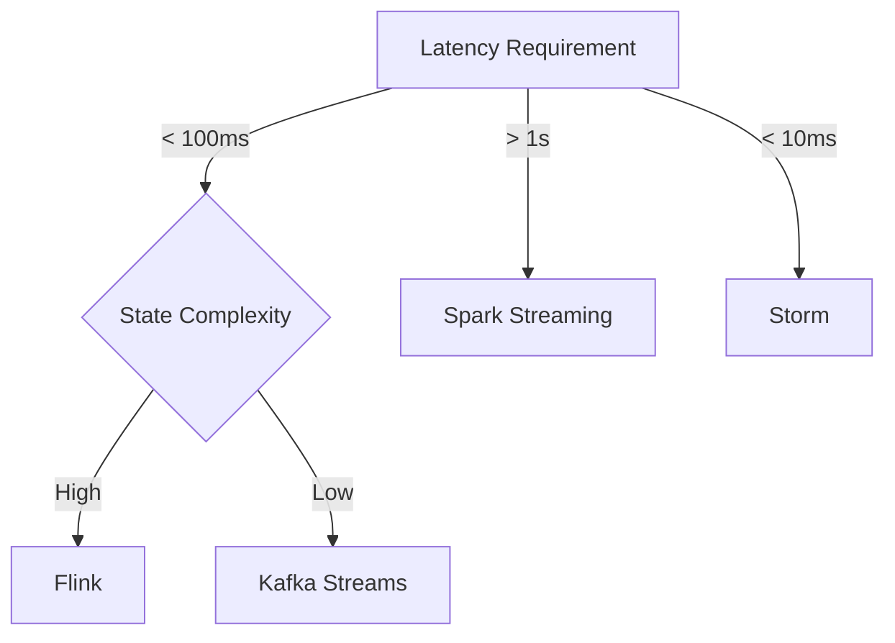

# Stream Processing Engine Selection Guide

> **Stage**: Knowledge/04-technology-selection | **Prerequisites**: [Expressiveness Hierarchy](../../Struct/03-relationships/03.03-expressiveness-hierarchy.md) | **Formal Level**: L4-L6
>
> Comprehensive comparison of Flink, Kafka Streams, Spark Streaming, Storm, and Pulsar Functions.

---

## 1. Definitions

**Def-K-04-01: Apache Flink**

Unified batch/streaming engine with true streaming semantics, event-time processing, and exactly-once guarantees.

**Def-K-04-02: Kafka Streams**

Lightweight stream processing library embedded in Kafka client applications.

**Def-K-04-03: Spark Structured Streaming**

Micro-batch streaming built on Spark SQL engine.

**Def-K-04-04: Apache Storm**

True streaming engine with low latency but weaker consistency guarantees.

**Def-K-04-05: Pulsar Functions**

Serverless event streaming functions tied to Apache Pulsar.

**Def-K-04-06: Latency Profile**

End-to-end latency characteristics of an engine under typical workloads.

---

## 2. Properties

**Lemma-K-04-01: Latency-Throughput Trade-off Upper Bound**

No engine simultaneously achieves sub-10ms latency and 1M+ RPS throughput with strong consistency.

**Lemma-K-04-02: State Complexity vs Recovery Cost**

State complexity and recovery time are positively correlated.

---

## 3. Relations

- **with Expressiveness Hierarchy**: Flink supports the most expressive Dataflow Model.
- **with Deployment Model**: Kafka Streams is embedded; Flink is cluster-based.

---

## 4. Argumentation

**Six-Dimension Comparison Matrix**:

| Dimension | Flink | Kafka Streams | Spark Streaming | Storm |
|-----------|-------|---------------|-----------------|-------|
| Latency | < 100ms | < 100ms | Seconds | < 10ms |
| Throughput | Very high | Medium | High | High |
| State | Rich | Limited | Rich | Basic |
| Exactly-Once | ✓ | ✓ | ✓ | ✗ |
| SQL | ✓ | Limited | ✓ | ✗ |
| Maturity | High | High | High | Medium |

**Scenario-Driven Selection**:

| Scenario | Recommended Engine | Rationale |
|----------|-------------------|-----------|
| Real-time recommendation | Flink | Event time + stateful CEP |
| Log aggregation | Kafka Streams | Simple, Kafka-native |
| Complex CEP | Flink | Rich state + event time |
| Low-latency trading | Storm/Flink | Sub-10ms requirement |

---

## 5. Engineering Argument

**Migration from Spark to Flink**: Benefits include:
- Lower latency (micro-batch → true streaming)
- Better state management
- Native event time support
- Cost: Rewrite logic, retrain operators

---

## 6. Examples

**E-commerce Real-Time Recommendation**:
```
Requirements: < 200ms, event time, stateful, CEP
→ Flink selected for:
  - Event time processing
  - Keyed state for user profiles
  - Async I/O for model inference
```

---

## 7. Visualizations

**Engine Selection Decision Tree**:


---

## 8. References

[^1]: Apache Flink Documentation, 2025.
[^2]: Apache Kafka Documentation, "Kafka Streams", 2025.
