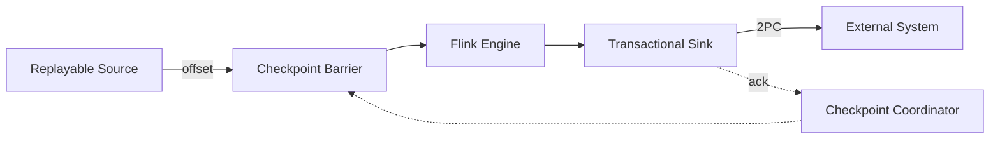

# Exactly-Once Semantics Deep Dive

> **Stage**: Flink/02-core | **Prerequisites**: [Checkpoint Deep Dive](./flink-checkpoint-mechanism-deep-dive.md) | **Formal Level**: L5
>
> Formal definitions of consistency semantics, barrier alignment, 2PC protocol, and end-to-end guarantees.

---

## 1. Definitions

**Def-F-02-55: Exactly-Once Semantics**

Given system $S = (I, O, T, \Sigma)$:

$$
\forall e \in I: \quad |\{ o \in O \mid o = T(e) \land \text{committed}(o) \}| = 1
$$

**Def-F-02-56: End-to-End Exactly-Once**

Requires three pillars:

1. **Replayable Source**: $\exists \text{replay}: \text{Offset} \times \text{Timestamp} \rightarrow I_{\geq \text{offset}}$
2. **Engine Exactly-Once**: As defined above
3. **Transactional Sink**: $\forall B \in \text{Batches}: \quad \text{commit}(B) \iff \text{checkpoint}(C_k) \land B \in C_k$

**Def-F-02-57: Consistency Levels**

| Level | Formal | Guarantee |
|-------|--------|-----------|
| At-Most-Once | $\forall e: |O_e| \leq 1$ | May lose, never duplicate |
| At-Least-Once | $\forall e: |O_e| \geq 1$ | Never lose, may duplicate |
| Exactly-Once | $\forall e: |O_e| = 1$ | Neither lose nor duplicate |

**Def-F-02-58: Barrier Alignment**

- **Aligned**: Block inputs until all barriers received
- **Unaligned**: Snapshot in-flight data immediately without blocking

---

## 2. Properties

**Lemma-F-02-27: Aligned Barrier Consistency**

Aligned checkpoints produce consistent cuts because all operators snapshot at the same logical time.

**Lemma-F-02-28: 2PC Atomicity**

Two-phase commit ensures that sink output is committed if and only if the corresponding checkpoint completes.

---

## 3. Relations

- **with Checkpoint**: Exactly-Once semantics are built upon consistent checkpointing.
- **with State Management**: State must be recoverable to the checkpoint point.

---

## 4. Argumentation

**Aligned vs Unaligned Checkpoint**:

| Factor | Aligned | Unaligned |
|--------|---------|-----------|
| Latency | Higher (blocking) | Lower |
| Snapshot size | State only | State + in-flight |
| Recovery | Fast | Fast |
| Use case | Small state | Large state / backpressure |

---

## 5. Engineering Argument

**Thm-F-02-08 (End-to-End Exactly-Once)**: Given replayable source, aligned/unaligned checkpoint, and transactional 2PC sink, the pipeline provides end-to-end Exactly-Once semantics.

*Proof Sketch*:

1. Source replays from committed offset
2. Engine restores to consistent checkpoint state
3. Sink commits only upon checkpoint acknowledge
4. Pre- or post-checkpoint failure results in abort or confirmed commit respectively
∎

---

## 6. Examples

```java
// Kafka transactional sink for Exactly-Once
FlinkKafkaProducer<String> sink = new FlinkKafkaProducer<>(
    topic,
    new KafkaSerializer(),
    properties,
    FlinkKafkaProducer.Semantic.EXACTLY_ONCE
);
```

---

## 7. Visualizations

**Exactly-Once Architecture**:



---

## 8. References
