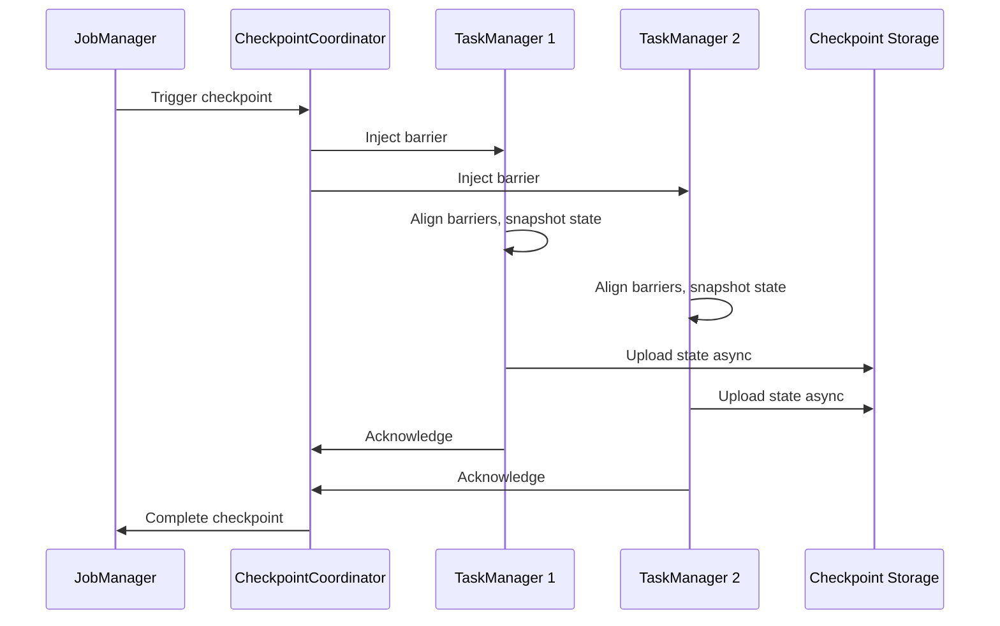
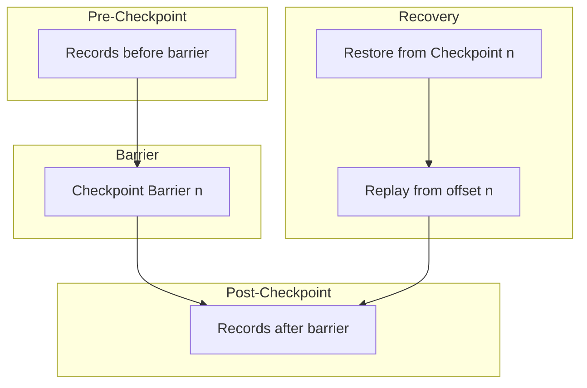

# Exercise: Checkpoint Analysis

> **Language**: English | **Source**: [Knowledge/98-exercises/exercise-03-checkpoint-analysis.md](../Knowledge/98-exercises/exercise-03-checkpoint-analysis.md) | **Last Updated**: 2026-04-21

---

## Learning Objectives

After completing this exercise, you will be able to:

- **Def-K-03-EN-01**: Understand checkpoint trigger mechanisms and execution flow
- **Def-K-03-EN-02**: Diagnose checkpoint timeouts and failures
- **Def-K-03-EN-03**: Configure and optimize checkpoint parameters
- **Def-K-03-EN-04**: Understand Exactly-Once semantics via checkpointing

## Core Concepts

| Concept | Description |
|---------|-------------|
| **Checkpoint Barrier** | Special record separating pre- and post-checkpoint data |
| **Snapshot** | Consistent snapshot of all operator states |
| **Checkpoint Coordinator** | JobManager component that orchestrates checkpoints |
| **State Backend** | Persistent storage for state (Memory/FS/RocksDB) |
| **Incremental Checkpoint** | Only saves delta state changes |

## Key Configuration Parameters

```java
// Checkpointing settings
env.enableCheckpointing(60000);           // Interval: 60s
env.getCheckpointConfig().setTimeout(600000);  // Timeout: 10 min
env.getCheckpointConfig().setMinPauseBetweenCheckpoints(30000);  // 30s min pause
env.getCheckpointConfig().setMaxConcurrentCheckpoints(1);
env.getCheckpointConfig().setCheckpointStorage("file:///checkpoints");

// RocksDB settings
env.setStateBackend(new EmbeddedRocksDBStateBackend(true));  // Incremental
env.getCheckpointConfig().setCheckpointStorage(new FileSystemCheckpointStorage("s3://bucket"));
```

## Checkpoint Execution Flow



## Failure Diagnosis

| Symptom | Likely Cause | Fix |
|---------|-------------|-----|
| `Checkpoint expired` | State too large; slow storage | Enable incremental; use faster storage |
| `Alignment timeout` | Backpressure during checkpoint | Reduce `alignmentTimeout`; enable unaligned |
| `Async phase timeout` | Serialization bottleneck | Use `TypeInformation`; tune buffer size |
| `Checkpoint decline` | TM overloaded | Scale out TMs; reduce task slots per TM |

## Exactly-Once Semantics



**Key insight**: Barriers divide the stream into pre-checkpoint and post-checkpoint regions. On recovery, restore state from checkpoint and replay source from the recorded offset.

## Optimization Checklist

- [ ] Interval < max tolerable replay window
- [ ] Timeout > expected checkpoint duration × 2
- [ ] Incremental enabled for large state (> 1GB)
- [ ] Local recovery enabled for fast failover
- [ ] Unaligned checkpoint enabled for high backpressure scenarios
- [ ] Externalized checkpoint cleanup for savepoint retention

## References
