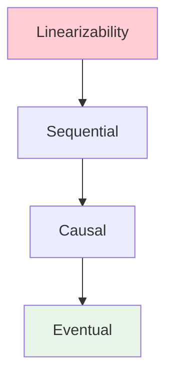

# Exercise 04: Consistency Model Comparison

> **Stage**: Knowledge/98-exercises | **Prerequisites**: [Consistency Hierarchy](consistency-hierarchy.md) | **Formalization Level**: L5
> **Translation Date**: 2026-04-21

## Abstract

This exercise covers formal definitions, proofs, and case studies of consistency models in distributed systems.

---

## 1. Learning Objectives

After completing this exercise, you will be able to:

- **Def-K-04-01**: Formally define consistency models (linear, sequential, causal, eventual)
- **Def-K-04-02**: Analyze consistency guarantees in stream processing
- **Def-K-04-03**: Prove consistency properties using formal methods
- **Def-K-04-04**: Trade off consistency vs performance in practice

---

## 2. Exercises

### 2.1 Formal Definitions and Proofs (50 points)

**Problem 4.1**: Define linearizability formally (10 points)

**Problem 4.2**: Classify stream processing consistency models (15 points)

- At-Most-Once, At-Least-Once, Exactly-Once
- End-to-end semantics

**Problem 4.3**: Analyze happens-before relations (10 points)

- Lamport's partial order
- Vector clocks

**Problem 4.4**: Compare consistency protocols (15 points)

- 2PC, 3PC, Paxos, Raft

### 2.2 Case Analysis and Design (50 points)

**Problem 4.5**: Design consistency for e-commerce order system (20 points)

- Inventory deduction
- Payment confirmation

**Problem 4.6**: Cross-DC replication consistency (15 points)

- Latency vs consistency trade-off

**Problem 4.7**: Consistency model decision tree (15 points)

- When to use which model?

---

## 3. Consistency Hierarchy

---

## 4. References
