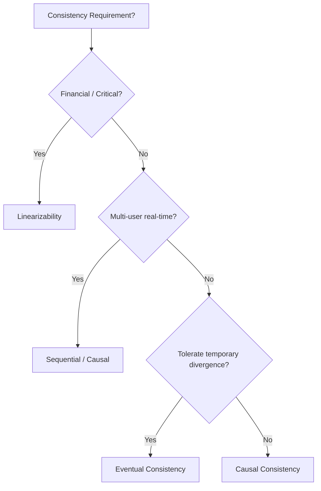

# Exercise: Consistency Models Comparison

> **Language**: English | **Source**: [Knowledge/98-exercises/exercise-04-consistency-models.md](../Knowledge/98-exercises/exercise-04-consistency-models.md) | **Last Updated**: 2026-04-21

---

## Learning Objectives

After completing this exercise, you will be able to:

- **Def-K-04-EN-01**: Formally define consistency models (linearizability, sequential, causal, eventual)
- **Def-K-04-EN-02**: Analyze consistency guarantees in stream processing systems
- **Def-K-04-EN-03**: Use formal methods to prove consistency properties
- **Def-K-04-EN-04**: Trade off consistency vs. performance in system design

## Consistency Hierarchy

```
Linearizability
    ↓ Strictly weaker
Sequential Consistency
    ↓ Strictly weaker
Causal Consistency
    ↓ Equivalent
PRAM + Convergence
    ↓ Strictly weaker
Eventual Consistency
```

## Model Definitions

| Model | Guarantee | Latency | Throughput | Use Case |
|-------|-----------|---------|------------|----------|
| **Linearizability** | Every operation appears to take effect atomically at some point between invocation and completion | High | Low | Financial transactions, distributed locks |
| **Sequential** | Operations appear to execute in some global sequential order | Medium | Medium | Multi-player games, collaborative editing |
| **Causal** | Causally related operations appear in order | Low | High | Social media feeds, comment threads |
| **Eventual** | If no new updates, all replicas converge to same value | Lowest | Highest | CDN cache, analytics dashboards |

## Stream Processing Consistency

| System | Consistency Model | Mechanism |
|--------|-------------------|-----------|
| **Flink (Checkpoint)** | Exactly-Once | Barrier alignment + state snapshots |
| **Flink (Unaligned CP)** | Exactly-Once | Barrier bypass + async state |
| **Kafka Streams** | At-Least-Once / Exactly-Once | Transactions (EOS) |
| **Spark Streaming** | Exactly-Once | WAL + idempotent sinks |
| **RisingWave** | Strong consistency | Materialized views + deterministic compute |

## Decision Tree



## Design Exercise

### E-commerce Order System

Design consistency for:

- **Inventory**: Strong (prevent overselling)
- **Order status**: Causal (user sees their own actions in order)
- **Analytics**: Eventual (dashboards can lag)
- **Payment**: Linearizable (exactly-once charging)

### Cross-DC Replication

| Scenario | Recommended Model | Rationale |
|----------|-------------------|-----------|
| Same city, < 5ms RTT | Linearizable | Low latency penalty |
| Same continent, 50ms RTT | Sequential / Causal | Balance consistency and latency |
| Global, 200ms+ RTT | Eventual + CRDTs | Accept divergence, automatic merge |

## References
