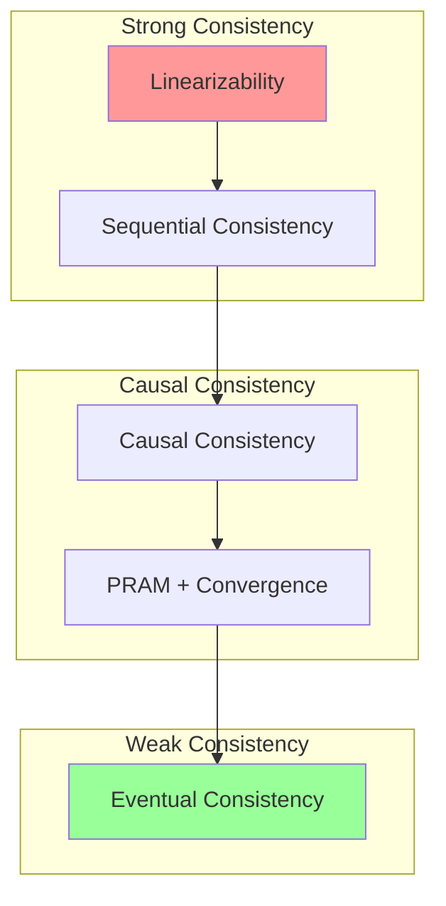
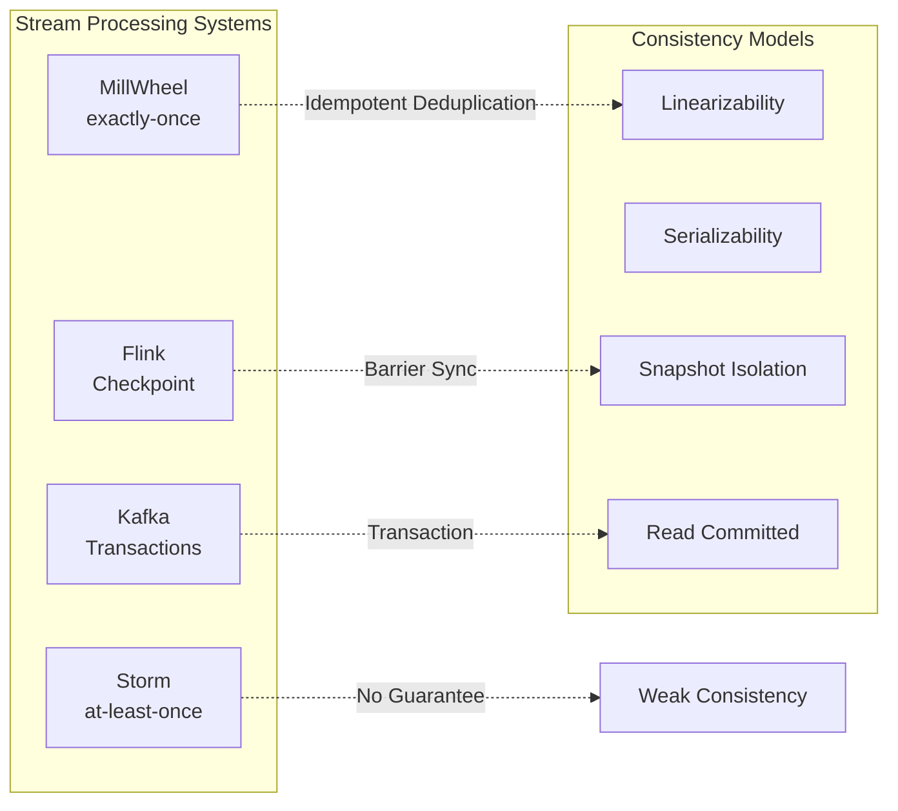

# Exercise 04: Consistency Model Comparison

> Stage: Knowledge | Prerequisites: [Consistency Hierarchy](../../Struct/02-properties/02.02-consistency-hierarchy.md), [exercise-01](./exercise-01-process-calculus.md) | Formalization Level: L5

---

## Table of Contents

- [Exercise 04: Consistency Model Comparison](#exercise-04-consistency-model-comparison)
  - [Table of Contents](#table-of-contents)
  - [1. Learning Objectives](#1-learning-objectives)
  - [2. Prerequisites](#2-prerequisites)
    - [2.1 Consistency Hierarchy](#21-consistency-hierarchy)
    - [2.2 Formalization Toolkit](#22-formalization-toolkit)
  - [3. Exercises](#3-exercises)
    - [3.1 Formal Definitions and Proofs (50 points)](#31-formal-definitions-and-proofs-50-points)
      - [Problem 4.1: Linearizability Definition (10 points)](#problem-41-linearizability-definition-10-points)
      - [Problem 4.2: Stream Processing Consistency Classification (15 points)](#problem-42-stream-processing-consistency-classification-15-points)
      - [Problem 4.3: Happens-Before Relation Analysis (10 points)](#problem-43-happens-before-relation-analysis-10-points)
      - [Problem 4.4: Consistency Protocol Comparison (15 points)](#problem-44-consistency-protocol-comparison-15-points)
    - [3.2 Case Analysis and Design (50 points)](#32-case-analysis-and-design-50-points)
      - [Problem 4.5: E-Commerce Order System Consistency Design (20 points)](#problem-45-e-commerce-order-system-consistency-design-20-points)
      - [Problem 4.6: Cross-Data-Center Replication Consistency (15 points)](#problem-46-cross-data-center-replication-consistency-15-points)
      - [Problem 4.7: Consistency Model Selection Decision Tree (15 points)](#problem-47-consistency-model-selection-decision-tree-15-points)
  - [4. Answer Key Links](#4-answer-key-links)
  - [5. Grading Rubric](#5-grading-rubric)
    - [Score Distribution](#score-distribution)
    - [Key Grading Criteria](#key-grading-criteria)
  - [6. Advanced Challenges (Bonus)](#6-advanced-challenges-bonus)
  - [7. Reference Resources](#7-reference-resources)
  - [8. Visualizations](#8-visualizations)
    - [Consistency Hierarchy](#consistency-hierarchy)
    - [Stream Processing System Consistency Positioning](#stream-processing-system-consistency-positioning)

## 1. Learning Objectives

Upon completing this exercise, you will be able to:

- **Def-K-04-01**: Formally define multiple consistency models (linearizability, sequential consistency, causal consistency, eventual consistency)
- **Def-K-04-02**: Analyze consistency guarantees in stream processing systems
- **Def-K-04-03**: Use formal methods to prove consistency properties
- **Def-K-04-04**: Trade off consistency and performance in real-world system design

---

## 2. Prerequisites

### 2.1 Consistency Hierarchy

```
Linearizability
    ↓ strictly weaker than
Sequential Consistency
    ↓ strictly weaker than
Causal Consistency
    ↓ equivalent to
PRAM + Convergence
    ↓ strictly weaker than
Eventual Consistency
```

### 2.2 Formalization Toolkit

| Symbol | Meaning |
|--------|---------|
| $op \xrightarrow{hb} op'$ | happens-before relation |
| $op \xrightarrow{vis} op'$ | visibility relation |
| $op \xrightarrow{so} op'$ | session order |
| $ret(op)$ | return value of operation op |

---

## 3. Exercises

### 3.1 Formal Definitions and Proofs (50 points)

#### Problem 4.1: Linearizability Definition (10 points)

**Difficulty**: L5

**Task**:

1. Give the complete formal definition of linearizability (4 points)
2. Use an Execution Graph to represent the following operation history, and determine whether it is linearizable (6 points):

```
Process P1: write(x, 1) ────────────────────> read(x) → 2
           │
           ↓ happens-before
Process P2: write(x, 2) ────────────────────> read(x) → 1
           ↑
Time ──────────────────────────────────────────────────>
```

**Hint**: The definition must include real-time order and sequential specification.

---

#### Problem 4.2: Stream Processing Consistency Classification (15 points)

**Difficulty**: L5

Analyze the consistency level in the following stream processing scenarios:

**Scenario A**: Flink Checkpoint Exactly-Once
**Scenario B**: Kafka Streams at-least-once
**Scenario C**: Storm primitives (at-least-once)
**Scenario D**: Google MillWheel exactly-once

**Task**:

1. Map each scenario to a distributed consistency model classification (e.g., strict serializability, serializability, snapshot isolation, etc.) (8 points)
2. Explain why Flink's Exactly-Once is not equivalent to Strict Serializability in distributed transactions (4 points)
3. Discuss the similarities and differences between "Exactly-Once" in stream processing and "ACID" in traditional databases (3 points)

---

#### Problem 4.3: Happens-Before Relation Analysis (10 points)

**Difficulty**: L5

Given a Flink stream processing topology:

```
Source → Map1 → KeyBy → Window → Sink
            ↘ Map2 ↗
```

**Task**:

1. Define all implicit happens-before relations in this topology (5 points)
2. If the Window operator uses Processing Time instead of Event Time, how do the happens-before relations change? (3 points)
3. How do these relations affect state consistency? (2 points)

---

#### Problem 4.4: Consistency Protocol Comparison (15 points)

**Difficulty**: L5

Compare the following protocols in stream processing applications:

| Protocol / Algorithm | Core Idea | Stream Processing Application | Pros & Cons |
|----------------------|-----------|-------------------------------|-------------|
| Two-Phase Commit | | | |
| Paxos | | | |
| Raft | | | |
| Vector Clocks | | | |
| Version Vectors | | | |

<!-- **Answer Key**: Full consistency protocol comparison table -->
<!--
| Protocol / Algorithm | Core Idea | Stream Processing Application | Pros & Cons |
|----------------------|-----------|-------------------------------|-------------|
| Two-Phase Commit | Prepare phase + Commit phase; coordinator asks all participants, commits only if all agree | Flink Kafka Sink two-phase commit implementation for Exactly-Once | Pros: simple to implement, guarantees atomicity<br>Cons: blocking protocol, coordinator single point of failure |
| Paxos | Majority vote, Prepare+Accept two phases, ensures multiple nodes agree on a proposal | Used for stream processing metadata management (e.g., JobManager high availability) | Pros: strong fault tolerance, can tolerate minority node failures<br>Cons: difficult to understand, complex engineering implementation |
| Raft | Leader election + log replication, decomposes consensus into sub-problems | Kafka replica synchronization, Flink HA configuration storage | Pros: easy to understand and implement<br>Cons: leader bottleneck, write performance limited by leader |
| Vector Clocks | Each node maintains a vector clock, determines event causality by comparing vectors | Out-of-order event sorting in stream processing, event time alignment | Pros: accurately captures causality<br>Cons: vector size grows with node count, high overhead |
| Version Vectors | Based on Vector Clocks, used to detect concurrent update conflicts | Stream processing state version management, incremental checkpoint merging | Pros: can detect concurrent conflicts<br>Cons: conflicts require application-level resolution |
-->

**Task**:

1. Complete the table above (10 points)
2. Analyze why Flink Checkpoint uses Barrier instead of Vector Clock (5 points)

---

### 3.2 Case Analysis and Design (50 points)

#### Problem 4.5: E-Commerce Order System Consistency Design (20 points)

**Difficulty**: L5

Design an e-commerce order system that needs to handle:

- Order creation (write to order table)
- Inventory deduction (write to inventory table)
- Payment callback (update order status)
- Logistics notification (write to logistics table)

**Task**:

1. Identify causal dependencies in the system (at least 3) (6 points)
2. Choose eventual consistency or strong consistency for different data (6 points)
3. Describe the state transition of order creation using a TLA+ style formal method (8 points)

**Reference Format**:

```
# Pseudocode example, not complete compilable code
Init ==
    ∧ orderStatus = [i ∈ OrderIDs ↦ "PENDING"]
    ∧ inventory = [i ∈ ProductIDs ↦ 100]
    ∧ ...

CreateOrder(o, p) ==
    ∧ orderStatus[o] = "PENDING"
    ∧ inventory[p] > 0
    ∧ orderStatus' = [orderStatus EXCEPT ![o] = "CREATED"]
    ∧ inventory' = [inventory EXCEPT ![p] = @ - 1]
    ∧ ...
```

---

#### Problem 4.6: Cross-Data-Center Replication Consistency (15 points)

**Difficulty**: L5

**Scenario**: A stream processing system needs to replicate state data across three data centers (Beijing, Shanghai, Guangzhou).

**Task**:

1. Design consistency schemes that satisfy the following different levels:
   - Scheme A: strongest consistency (6 points out of 15)
   - Scheme B: causal consistency (5 points out of 15)
   - Scheme C: eventual consistency (4 points out of 15)
2. Analyze the network latency overhead of each scheme
3. Recommend a scheme suitable for stream processing checkpoint replication

---

#### Problem 4.7: Consistency Model Selection Decision Tree (15 points)

**Difficulty**: L4

**Task**:

1. Create a decision tree for consistency model selection, considering the following factors:
   - Data freshness requirements (3 points)
   - System availability requirements (3 points)
   - Network partition tolerance (3 points)
   - Conflict resolution complexity (3 points)
   - Performance requirements (3 points)

2. Draw the decision tree using Mermaid
3. Recommend a concrete technical implementation for each leaf node of the decision tree

---

## 4. Answer Key Links

| Problem | Answer Location | Supplementary Notes |
|---------|-----------------|---------------------|
| 4.1 | **answers/04-consistency.md** (answer to be added) | Formal definition + diagram |
| 4.2 | **answers/04-consistency.md** (answer to be added) | Consistency mapping table |
| 4.3 | **answers/04-consistency.md** (answer to be added) | happens-before analysis |
| 4.4 | **answers/04-consistency.md** (answer to be added) | Full protocol comparison table |
| 4.5 | **answers/04-code/OrderSystem.tla** (code example to be added) | TLA+ specification |
| 4.6 | **answers/04-code/GeoReplication.md** (answer to be added) | Design scheme |
| 4.7 | **answers/04-code/DecisionTree.md** (answer to be added) | Decision tree |

---

## 5. Grading Rubric

### Score Distribution

| Grade | Score Range | Requirement |
|-------|-------------|-------------|
| S | 95-100 | Accurate formal definitions, complete proofs, in-depth design |
| A | 85-94 | Correct conceptual understanding, thorough analysis |
| B | 70-84 | Mastery of main concepts, analysis substantially complete |
| C | 60-69 | Basic conceptual understanding |
| F | <60 | Confused concepts, incorrect understanding |

### Key Grading Criteria

| Problem | Points | Key Grading Points |
|---------|--------|--------------------|
| 4.1 | 10 | Complete formal definition, correct judgment |
| 4.2 | 15 | Accurate consistency mapping |
| 4.5 | 20 | Correct TLA+ specification syntax, reasonable design |
| 4.7 | 15 | Comprehensive decision tree coverage |

---

## 6. Advanced Challenges (Bonus)

Complete any one of the following tasks to earn an extra 10 points:

1. **Formal Proof**: Use Coq/Isabelle to prove the linearizability of a simple algorithm
2. **Consistency Testing Tool**: Use Jepsen to test the consistency of a stream processing system
3. **New Consistency Model Proposal**: Design a new consistency model for a specific stream processing scenario and formally define it

---

## 7. Reference Resources


---

## 8. Visualizations

### Consistency Hierarchy



### Stream Processing System Consistency Positioning



---

*Last Updated: 2026-04-02*

---

*Document version: v1.0 | Translation date: 2026-04-24*
