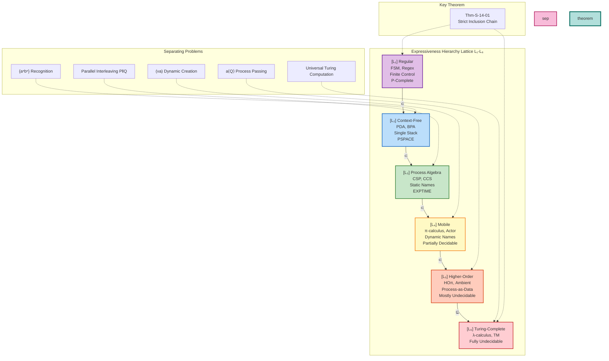
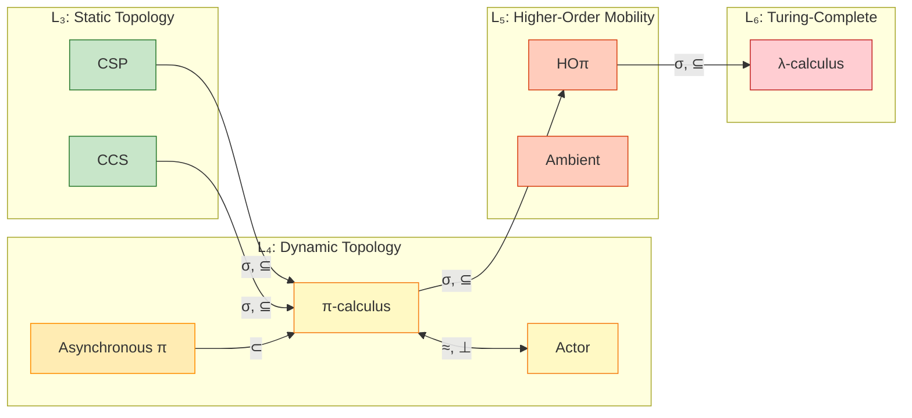

# Expressiveness Hierarchy Theorem

> **Stage**: Struct | **Prerequisites**: [../01-foundation/01.01-unified-streaming-theory.md](../01-foundation/01.01-unified-streaming-theory.md), [../01-foundation/01.02-process-calculus-primer.md](../01-foundation/01.02-process-calculus-primer.md) | **Formality Level**: L3-L6
> **Version**: 2026.04

---

## Table of Contents

- [Expressiveness Hierarchy Theorem](#expressiveness-hierarchy-theorem)
  - [Table of Contents](#table-of-contents)
  - [1. Definitions](#1-definitions)
    - [Def-S-14-01. Expressiveness Preorder](#def-s-14-01-expressiveness-preorder)
    - [Def-S-14-02. Bisimulation Equivalence](#def-s-14-02-bisimulation-equivalence)
    - [Def-S-14-03. Six-Layer Expressiveness Hierarchy](#def-s-14-03-six-layer-expressiveness-hierarchy)
  - [2. Properties](#2-properties)
    - [Lemma-S-14-01. State Space Upper Bound for Compositional Encodings](#lemma-s-14-01-state-space-upper-bound-for-compositional-encodings)
    - [Lemma-S-14-02. Irreversibility of Dynamic Topology](#lemma-s-14-02-irreversibility-of-dynamic-topology)
    - [Prop-S-14-01. Decidability Monotonicity Law](#prop-s-14-01-decidability-monotonicity-law)
    - [Prop-S-14-02. Encoding Existence Preserves Undecidability](#prop-s-14-02-encoding-existence-preserves-undecidability)
  - [3. Relations](#3-relations)
    - [Relation 1: Strict Inclusion Chain Between Layers](#relation-1-strict-inclusion-chain-between-layers)
    - [Relation 2: CSP $\subset$ π-calculus](#relation-2-csp-subset-pi-calculus)
    - [Relation 3: Actor $\perp$ π-calculus (Incomparable)](#relation-3-actor-perp-pi-calculus-incomparable)
    - [Relation 4: Synchronous π $\supset$ Asynchronous π](#relation-4-synchronous-pi-supset-asynchronous-pi)
  - [4. Argumentation](#4-argumentation)
    - [Argument 1: Why Every Layer Separation Is Strict](#argument-1-why-every-layer-separation-is-strict)
    - [Argument 2: Gorla's Encoding Criteria System](#argument-2-gorlas-encoding-criteria-system)
    - [Argument 3: Trade-off Between Expressiveness and Verifiability](#argument-3-trade-off-between-expressiveness-and-verifiability)
  - [5. Proofs](#5-proofs)
    - [Thm-S-14-01. Strict Expressiveness Hierarchy Theorem](#thm-s-14-01-strict-expressiveness-hierarchy-theorem)
    - [Cor-S-14-01. Decidability Decreasing Corollary](#cor-s-14-01-decidability-decreasing-corollary)
  - [6. Examples](#6-examples)
    - [Example 1: $L_3 \to L_4$ Separation — Mobile Channels](#example-1-l_3-to-l_4-separation--mobile-channels)
    - [Example 2: $L_4 \to L_5$ Separation — Process Passing](#example-2-l_4-to-l_5-separation--process-passing)
    - [Example 3: Well-Typed Session Process ($L_4$ Subset)](#example-3-well-typed-session-process-l_4-subset)
    - [Counterexample: Attempts Violating Hierarchy Boundaries](#counterexample-attempts-violating-hierarchy-boundaries)
  - [7. Visualizations](#7-visualizations)
    - [Figure 7.1: Expressiveness Hierarchy Lattice](#figure-71-expressiveness-hierarchy-lattice)
    - [Figure 7.2: Inter-Model Encoding Relations](#figure-72-inter-model-encoding-relations)
    - [Figure 7.3: Decidability vs. Expressiveness Trade-off](#figure-73-decidability-vs-expressiveness-trade-off)
  - [8. References](#8-references)
  - [Related Documents](#related-documents)

## 1. Definitions

### Def-S-14-01. Expressiveness Preorder

Let $\mathcal{M}$ be the set of concurrent computational models. Define the **expressiveness preorder** $\subseteq$ as a binary relation on $\mathcal{M} \times \mathcal{M}$ satisfying the following axioms:

$$
M_1 \subseteq M_2 \iff \exists \sigma: M_1 \to M_2 \text{ is a valid encoding}
$$

where a valid encoding $\sigma$ must satisfy the following **Encoding Criteria**:

| Criterion | Formal Definition | Intuitive Explanation |
|-----------|-------------------|----------------------|
| **Syntax Preservation** | $\forall P \in M_1. \sigma(P) \in M_2$ is well-formed | Every program in the source language has a corresponding representation in the target language |
| **Semantic Preservation** | $P \approx_{M_1} Q \iff \sigma(P) \approx_{M_2} \sigma(Q)$ | Equivalent programs remain equivalent after encoding; inequivalent programs remain inequivalent |
| **Compositionality** | $\sigma(P \parallel Q) = C_{\parallel}[\sigma(P), \sigma(Q)]$ | The encoding of a composite program is built from component encodings via a fixed context |
| **Full Abstraction** | $\sigma$ preserves both observational equivalence and contextual equivalence | The encoding neither introduces nor eliminates observable behavioral differences |

**Expressiveness Equivalence**: $M_1 \approx M_2 \iff M_1 \subseteq M_2 \land M_2 \subseteq M_1$

**Strict Expressiveness Inclusion**: $M_1 \subset M_2 \iff M_1 \subseteq M_2 \land M_2 \not\subseteq M_1$

**Rationale for the Definition**: Without strict encoding criteria, "expressiveness comparison" is subjective. By requiring semantic preservation and compositionality, we distinguish between "theoretically simulatable" (any Turing-complete language can simulate any other) and "structurally compilable" (preserving concurrent interaction patterns). This framework originates from Weijland's (1990) pioneering work on the expressiveness of process algebras [^1].

---

### Def-S-14-02. Bisimulation Equivalence

Let $\mathcal{S} = (S, A, \{\xrightarrow{a}\}_{a \in A})$ be a Labeled Transition System (LTS). A binary relation $\mathcal{R} \subseteq S \times S$ is a **strong bisimulation** if and only if:

$$
\forall (s, t) \in \mathcal{R}. \forall a \in A:
\begin{cases}
s \xrightarrow{a} s' \Rightarrow \exists t'. t \xrightarrow{a} t' \land (s', t') \in \mathcal{R} \\
t \xrightarrow{a} t' \Rightarrow \exists s'. s \xrightarrow{a} s' \land (s', t') \in \mathcal{R}
\end{cases}
$$

**Strong Bisimulation Equivalence** $\sim$ is defined as the union of all strong bisimulations:

$$
s \sim t \iff \exists \mathcal{R} \text{ is a strong bisimulation}. (s, t) \in \mathcal{R}
$$

**Weak Bisimulation Equivalence** $\approx$ ignores internal actions $\tau$:

$$
s \approx t \iff \exists \mathcal{R}. \forall a \neq \tau: s \xrightarrow{a} s' \Rightarrow \exists t'. t \xrightarrow{a} t' \land (s', t') \in \mathcal{R}
$$

where $\xrightarrow{a}$ denotes weak transitions ignoring $\tau$: $\xrightarrow{a} = \xrightarrow{\tau}^* \circ \xrightarrow{a} \circ \xrightarrow{\tau}^*$ (when $a \neq \tau$).

**Key Properties**:

- $\sim$ is a congruence (preserved under parallel composition and other contexts)
- $\approx$ is also a congruence in most process algebras (but not in certain prioritized calculi)
- $\sim \subseteq \approx$ (strong bisimulation is strictly finer than weak bisimulation)

**Rationale for the Definition**: Bisimulation is the finest behavioral equivalence in process algebra, capturing the intuition of "step-by-step simulation" rather than mere trace equivalence. Sangiorgi (2009) notes that the coinductive definition of bisimulation makes it a natural tool for comparing the expressiveness of concurrent models [^2].

---

### Def-S-14-03. Six-Layer Expressiveness Hierarchy

Define the expressiveness hierarchy $\mathcal{L} = \{L_1, L_2, L_3, L_4, L_5, L_6\}$, where each layer is characterized by its **core computational resources**:

| Layer | Name | Core Resource | Representative Models | Decidability |
|-------|------|---------------|----------------------|--------------|
| $L_1$ | Regular | Finite control + finite data | FSM, Regular Expressions | P-Complete |
| $L_2$ | Context-Free | Finite control + single stack | PDA, BPA | PSPACE-Complete |
| $L_3$ | Process Algebra | Static naming + synchronous communication | CSP, CCS | EXPTIME |
| $L_4$ | Mobile | Dynamic creation + name passing | π-calculus, Actor | Partially Undecidable |
| $L_5$ | Higher-Order | Process-as-data passing | HOπ, Ambient | Mostly Undecidable |
| $L_6$ | Turing-Complete | Unrestricted recursion + data | λ-calculus, TM | Fully Undecidable |

**Layer Semantics**:

$$
L_i \subset L_{i+1} \quad (\text{for } 1 \leq i \leq 4), \quad L_5 \subseteq L_6
$$

**Separating Problems**:

- $L_2 \setminus L_1$: Recognition of language $\{a^n b^n \mid n \geq 0\}$
- $L_3 \setminus L_2$: Interleaving semantics of parallel composition $P \parallel Q$
- $L_4 \setminus L_3$: Dynamic channel creation $(\nu a)$ and name passing $\bar{b}\langle a \rangle$
- $L_5 \setminus L_4$: Higher-order process passing (passing a process as a message value)
- $L_6 \setminus L_5$: Universal Turing computation (unrestricted recursion)

**Rationale for the Definition**: The Chomsky hierarchy classifies formal languages by generative capacity, but this is insufficient for classifying the expressiveness of concurrent computation. The six-layer hierarchy extends this idea, capturing a chain of increasing computational resources from "finite-state protocols" to "mobile code". Each additional resource corresponds to a specific boundary of engineering capability.

---

## 2. Properties

### Lemma-S-14-01. State Space Upper Bound for Compositional Encodings

**Statement**: If $\sigma: \mathcal{P} \to \mathcal{Q}$ is a compositional encoding, then for any finite process $P$, the size of its encoded state space satisfies:

$$
|S(\sigma(P))| \leq f(|S(P)|)
$$

where $f$ is a function depending only on the syntactic constructors (typically polynomial or single-exponential).

**Derivation**:

1. By compositionality from Def-S-14-01, the construction of $\sigma(P)$ combines encoded sub-processes only through contexts $C_{op}$;
2. Therefore, the global state of $\sigma(P)$ is formed by the Cartesian product of sub-process encoded states;
3. Each $C_{op}$ introduces at most a constant or linear factor of new states;
4. Thus, the total state space upper bound is a finite power of the sub-process state spaces, i.e., $f(|S(P)|)$. ∎

**Corollary**: Any encoding that violates this upper bound necessarily violates compositionality, requiring either global information or producing exponential blow-up.

---

### Lemma-S-14-02. Irreversibility of Dynamic Topology

**Statement**: Let $M_{static}$ be a static-topology model (e.g., CSP) and $M_{mobile}$ be a model supporting dynamic name creation (e.g., π-calculus). Then there exists no fully abstract encoding from $M_{mobile}$ to $M_{static}$.

**Derivation**:

1. **Premise Analysis**: $M_{mobile}$ supports the operation $(\nu a)P$, which can create a new name $a$ at runtime and pass it to other processes. $M_{static}$ has a fixed set of channels determined before system execution.

2. **Constructing a Counterexample**: Consider the π-calculus process $P = (\nu a)(\bar{a}\langle b \rangle \mid a(x).x\langle c \rangle)$. This process:
   - Creates a new channel $a$
   - Sends channel name $b$ along $a$
   - Receives name $x$ from $a$ (bound to $b$)
   - Sends $c$ along $x$ (i.e., $b$)

3. **Encoding Dilemma**: Any attempt to encode $P$ into CSP must map dynamically created $a$ to some predefined CSP channel. However, since the number of $a$ creations at runtime may be unbounded (through recursive replication), the predefined channel set is necessarily insufficient.

4. **Conclusion**: If a global channel pool is used for simulation, compositionality is violated (all processes share the same pool), and bisimulation semantics cannot be preserved. Therefore, $M_{static}$ cannot fully abstractly encode the dynamic topology capability of $M_{mobile}$. ∎

---

### Prop-S-14-01. Decidability Monotonicity Law

**Statement**: If $M \in L_i$ and $N \in L_j$ and $i < j$, then the set of decidable problems of $M$ is a superset of that of $N$:

$$
\text{Decidable}(L_j) \subseteq \text{Decidable}(L_i)
$$

**Derivation**:

1. By Def-S-14-03, $L_i$ has strictly fewer computational resources than $L_j$;
2. Adding resources (dynamic topology, higher-orderness, unrestricted recursion) introduces new sources of undecidability;
3. For example, $L_3$'s static topology restricts the structure of the state space, making bisimulation decidable for finite-state cases; $L_4$'s dynamic topology removes this restriction, causing general bisimulation to become undecidable;
4. Therefore, increased expressiveness $\Rightarrow$ decreased decidability (negative correlation).

---

### Prop-S-14-02. Encoding Existence Preserves Undecidability

**Statement**: If $M_1 \subseteq M_2$ (faithful encoding), and problem $\Pi$ is undecidable in $M_2$, then $\Pi$ is also undecidable in $M_1$.

**Derivation**:

1. Assume $\Pi$ is decidable in $M_1$; then instances in $M_2$ could be transformed into instances in $M_1$ via encoding $\sigma$;
2. The decision algorithm for $M_1$ could then be applied to solve $\Pi$, thereby making $\Pi$ decidable in $M_2$;
3. This contradicts the premise;
4. Therefore, encoding existence "transmits" undecidability from lower layers to higher layers (or from the target model to the source model).

---

## 3. Relations

### Relation 1: Strict Inclusion Chain Between Layers

**Strict Inclusion Theorem**:

$$
L_1 \subset L_2 \subset L_3 \subset L_4 \subset L_5 \subseteq L_6
$$

**Argumentation**:

| Inclusion Pair | Forward Encoding | Reverse Impossibility | Separating Evidence |
|----------------|------------------|----------------------|---------------------|
| $L_1 \subset L_2$ | FSM → PDA (degenerate) | PDA recognizes $a^n b^n$, FSM cannot | Context-free language class strictly larger than regular class |
| $L_2 \subset L_3$ | BPA → CSP | CSP parallel composition yields interleaving semantics beyond CFL | Parallel interleaving is not context-free |
| $L_3 \subset L_4$ | CSP → π | π's dynamic topology cannot be encoded by static models | $(\nu a)$ creates new names and passes them |
| $L_4 \subset L_5$ | π → HOπ | HOπ's process passing cannot be encoded by π | Higher-order process passed as data value |
| $L_5 \subseteq L_6$ | HOπ → λ | HOπ is already Turing-complete | No super-Turing model known |

---

### Relation 2: CSP $\subset$ π-calculus

**Argumentation**:

- **Encoding Existence**: There exists a compositional encoding $\sigma: \text{CSP} \to \pi$ preserving trace semantics. CSP's synchronous communication can be simulated by π-calculus channel handshakes; CSP's hiding $P \setminus A$ corresponds to π's restriction $(\nu \vec{a} \in A)P$.

- **Separation Result**: By Lemma-S-14-02, CSP's static event alphabet cannot express π's dynamic name creation and passing. Consider the π process $P = (\nu a)(\bar{b}\langle a \rangle \mid a(x).x\langle c \rangle)$; CSP cannot compositionally encode this behavior.

> **Inference [Theory→Implementation]**: CSP belongs to $L_3$ (static topology), so implementations such as Go can rely on compile-time channel type checking, but cannot natively express mobile channels; external service discovery mechanisms (e.g., Consul/Etcd) must be used to compensate for dynamic topology requirements.

---

### Relation 3: Actor $\perp$ π-calculus (Incomparable)

**Argumentation**:

- **Actor $\not\subseteq$ π**: Actor's unbounded spawn produces infinitely many independent mailboxes, while finite π processes cannot pre-allocate names for unboundedly growing independent reception points. Each new Actor requires an independent, externally referencable reception point, and the finite π process's static name set cannot provide infinitely many such names.

- **π $\not\subseteq$ Actor**: π supports passing channel names as first-class values ($\bar{a}\langle b \rangle$); the receiver can immediately use the received channel name as a communication channel. In the pure Actor model, mailbox addresses cannot be passed as message contents and subsequently used as direct communication channels.

---

### Relation 4: Synchronous π $\supset$ Asynchronous π

**Argumentation** (Palamidessi, 2003) [^3]:

- **Asynchronous π $\subseteq$ Synchronous π**: Asynchronous π is a syntactic subset of synchronous π (output prefixes are prohibited).

- **Synchronous π $\not\subseteq$ Asynchronous π**: Synchronous π supports **mixed choice**:

$$
P = a(x).Q + \bar{b}\langle v \rangle.R
$$

This process can choose to receive from $a$ or send to $b$. Asynchronous π does not support output prefixes, and therefore cannot directly express this "send-or-receive" choice. Palamidessi proved that, under the premises of preserving scheduler independence and without a global counter, mixed choice cannot be encoded in asynchronous π.

---

## 4. Argumentation

### Argument 1: Why Every Layer Separation Is Strict

**$L_1 \to L_2$: From Finite-State to Context-Free**

Pushdown Automata (PDA) can recognize $\{a^n b^n \mid n \geq 0\}$, the classic example of a context-free language. Finite State Machines (FSM), lacking a stack structure, cannot count the number of $a$'s and compare it with the number of $b$'s. Therefore, $L_1 \subset L_2$ is strict.

**$L_2 \to L_3$: From Sequential Stack to Parallel Composition**

Context-free grammars can only express sequential and choice constructs, while CSP/CCS parallel composition $P \parallel Q$ introduces **interleaving semantics** — the arbitrary interleaving of two processes produces a trace set that cannot be described by context-free languages. Therefore, $L_2 \subset L_3$ is strict.

**$L_3 \to L_4$: From Static Topology to Dynamic Topology**

This is the most important strict separation in concurrency theory. CSP channel names are fixed at the syntactic level; the communication topology at runtime is entirely determined by the source code. π-calculus allows runtime creation of new channel names via $(\nu a)$ and passes them to other processes via $\bar{b}\langle a \rangle$. This enables "mobility" — the ability of distributed systems to dynamically reconfigure connections.

**$L_4 \to L_5$: From Name Passing to Process Passing**

π-calculus can only pass names (channel references), while Higher-Order π-calculus (HOπ) can pass **entire process code** as a value:

$$
P = a\langle Q \rangle.R
$$

Here $Q$ is a process of arbitrary complexity. This capability directly supports scenarios such as code migration, mobile agents, and active networks.

**$L_5 \to L_6$: Turing Completeness**

$L_5$ is already Turing-complete, but $L_6$ contains all Turing-complete models (including non-parallel λ-calculus and Turing Machines). $L_5 \subseteq L_6$ reflects that higher-order mobility is a subset characteristic of Turing-complete computation.

---

### Argument 2: Gorla's Encoding Criteria System

Gorla (2010) proposed a systematic criterion framework for evaluating process calculus encodings [^4], which forms the basis of the encoding criteria in Def-S-14-01:

| Gorla Criterion | Correspondence in This Document | Core Requirement |
|-----------------|--------------------------------|------------------|
| **Structure Preservation** | Syntax Preservation | Encoding is structurally inductive |
| **Semantic Preservation** | Semantic Preservation | Preserves observational equivalence |
| **Compositionality** | Compositionality | Encoding is via context composition |
| **Name Invariance** | Part of Full Abstraction | Encoding does not depend on specific name choices |
| **Operationality** | Implicit in encoding definition | Encoding is computable |

The strict application of these criteria excludes "cheating" encodings — for example, encoding an entire program as a single integer (via Gödel numbering) and then decoding and simulating it. Such an encoding violates compositionality (requires global decoding).

---

### Argument 3: Trade-off Between Expressiveness and Verifiability

| Layer | Expressiveness | Verifiability | Engineering Trade-off |
|-------|---------------|---------------|----------------------|
| $L_1$-$L_2$ | Limited | Fully automatic | Suitable for safety-critical protocol verification |
| $L_3$ | Static concurrency | Tool support (e.g., FDR) | Foundation for industrial-scale formal verification |
| $L_4$ | Dynamic topology | Partially decidable | Requires runtime monitoring compensation |
| $L_5$-$L_6$ | Universal computation | Undecidable | Relies on testing and monitoring |

Boudol (1992) was the first to systematically study the negative correlation between expressiveness and decidability in concurrent models [^5]. This relationship implies: the more expressive a model is, the weaker the capability of static verification tools to provide complete guarantees.

---

## 5. Proofs

### Thm-S-14-01. Strict Expressiveness Hierarchy Theorem

**Statement**:

$$
L_1 \subset L_2 \subset L_3 \subset L_4 \subset L_5 \subseteq L_6
$$

That is, the six-layer expressiveness hierarchy forms a strict inclusion chain ($L_5 \subseteq L_6$ is a subset relation).

**Proof**:

**Part 1: $L_1 \subset L_2$**

- **Encoding exists**: FSM can be encoded as PDA with empty-stack transitions (degenerate encoding).
- **Separating evidence**: The language $\{a^n b^n \mid n \geq 0\}$ is recognizable by PDA but not by any FSM. This is the classic result that context-free languages strictly contain regular languages.
- **Conclusion**: $L_1 \subset L_2$.

**Part 2: $L_2 \subset L_3$**

- **Encoding exists**: BPA grammar productions $X \to \alpha$ can be encoded as CSP recursive process definitions $X = \sigma(\alpha)$.
- **Separating evidence**: Consider the CSP process $P = a \to \text{STOP} \parallel b \to \text{STOP}$. Its trace set consists of all interleavings of $\{a, b\}$. This parallel interleaving semantics produces non-context-free language structures (two independent counters).
- **Conclusion**: $L_2 \subset L_3$.

**Part 3: $L_3 \subset L_4$**

- **Encoding exists**: By Thm-S-02-01 (see [../01-foundation/01.02-process-calculus-primer.md](../01-foundation/01.02-process-calculus-primer.md)), there exists a trace-semantics-preserving encoding from CSP to π-calculus.

- **Separating evidence (core)**:

  Consider the π-calculus process:
  $$
  P_{mob} = (\nu a)(\bar{b}\langle a \rangle \mid a(x).\bar{c}\langle x \rangle)
  $$

  Execution behavior of $P_{mob}$:
  1. Create a new channel $a$
  2. Send the name $a$ along the public channel $b$
  3. Receive $x$ on $a$
  4. Forward $x$ along $c$

  **Proof by contradiction**: Assume there exists a fully abstract encoding $\sigma: \pi \to \text{CSP}$.

  CSP's event name set $Events$ is fixed at parse time (by Lemma-S-02-01, see [../01-foundation/01.02-process-calculus-primer.md](../01-foundation/01.02-process-calculus-primer.md)). To encode $P_{mob}$, $\sigma$ would need to:

  - Allocate a CSP event name for each $a$ created at runtime
  - Since recursive replication may produce infinitely many $a$'s, infinitely many event names would be required

  **Contradiction A**: If infinitely many event names are pre-allocated, the finite-state premise of the encoding criterion is violated.

  **Contradiction B**: If a finite event name pool is used, the "freshness" of channels cannot be guaranteed; independently created channels may collide.

  Therefore, the assumption does not hold; there is no faithful encoding from π to CSP.

- **Conclusion**: $L_3 \subset L_4$.

**Part 4: $L_4 \subset L_5$**

- **Encoding exists**: π-calculus can be encoded as a degenerate form of Higher-Order π-calculus (HOπ): encode a name $a$ as a proxy passing the empty process $[a] = \bar{a}\langle 0 \rangle$.

- **Separating evidence**:

  Consider the HOπ process:
  $$
  P_{ho} = a\langle Q \rangle.R
  $$
  where $Q$ is a process of arbitrary complexity containing free names.

  In π-calculus, only **names** can be passed, not **process code**. Attempting to encode $Q$ as a name (e.g., a pointer to a global code table):
  - Requires a globally shared code interpreter, violating compositionality
  - Cannot preserve weak bisimulation (environmental contexts cannot distinguish "passing code itself" from "passing a pointer")

  Sangiorgi (1992) proved that there exists no congruence-preserving encoding from HOπ to π [^6].

- **Conclusion**: $L_4 \subset L_5$.

**Part 5: $L_5 \subseteq L_6$**

- Models in $L_5$ (HOπ, Mobile Ambients) have been proven Turing-complete (can encode λ-calculus).
- $L_6$ is defined as the set of all Turing-complete models.
- Therefore $L_5 \subseteq L_6$.

**In summary**: $L_1 \subset L_2 \subset L_3 \subset L_4 \subset L_5 \subseteq L_6$. ∎

---

### Cor-S-14-01. Decidability Decreasing Corollary

**Statement**:

$$
\text{If } L_i \subset L_j \text{, then } \text{Decidable}(L_j) \subset \text{Decidable}(L_i)
$$

**Proof**: Directly follows from Prop-S-14-01 and Thm-S-14-01. ∎

---

## 6. Examples

### Example 1: $L_3 \to L_4$ Separation — Mobile Channels

**π-calculus process** (expressible in $L_4$):

```pseudocode
// Dynamically create and pass a channel
SERVER = (ν reply_ch)(
    request_channel!("process", reply_ch).
    reply_ch?(result).CONTINUE
)
```

**Attempted CSP encoding** (fails in $L_3$):

```csp
-- CSP cannot express: reply_ch is created at runtime
-- All possible reply_ch must be predefined at the syntactic level
SERVER_CSP =
    -- Can only choose from predefined event names
    -- Cannot dynamically create new reply_ch based on runtime requests
```

**Analysis**: CSP event names are fixed at compile time; they cannot create new channels at runtime like π via $(\nu reply\_ch)$.

---

### Example 2: $L_4 \to L_5$ Separation — Process Passing

**HOπ process** (expressible in $L_5$):

```pseudocode
// Pass a process as data
AGENT =
    let code = λx.(x!data.0) in  // process code
    migrate_channel!<code>.      // send process to remote node
    CONTINUE
```

**Attempted π-calculus encoding** (fails in $L_4$):

```pseudocode
// π can only pass names, not process code directly
-- Attempt 1: Encode code as a name (pointer to global table)
-- Problem: violates compositionality, requires global state

-- Attempt 2: Expand code into all possible behaviors
-- Problem: code may contain infinite recursion, expansion is infinite
```

**Analysis**: π-calculus's first-order name passing cannot directly express the higher-order semantics of "process as value passing".

---

### Example 3: Well-Typed Session Process ($L_4$ Subset)

**Protocol definition**:

$$
S_{client} = !\text{Int}.?\text{Bool}.\text{end} \quad (L_4 \text{ session type})
$$

**Process implementation**:

$$
\begin{aligned}
P_{client} &= c!\langle 42 \rangle.c?(x).0 \\
P_{server} &= c?(y).c!\langle y > 0 \rangle.0
\end{aligned}
$$

**Composition**: $(\nu c:S_{client})(P_{client} \mid P_{server})$ is well-typed.

**Verification**: By Cor-S-02-01 (see [../01-foundation/01.02-process-calculus-primer.md](../01-foundation/01.02-process-calculus-primer.md)), this composition is deadlock-free.

---

### Counterexample: Attempts Violating Hierarchy Boundaries

**Scenario**: Attempting to verify all properties of an $L_4$ system (microservice dynamic discovery) using an $L_3$ model (CSP).

**Problems**:

- CSP's static topology assumption cannot capture microservice dynamic registration/discovery behavior
- Using CSP verification tools (e.g., FDR) to analyze microservice protocols produces false negatives or false positives
- Certain states reachable in the real system are eliminated in the CSP abstraction

**Conclusion**: Incorrect model layer selection leads to unreliable verification results. $L_4$ systems require $L_4$ models (π-calculus or Actor) or specialized abstraction techniques.

---

## 7. Visualizations

### Figure 7.1: Expressiveness Hierarchy Lattice



**Figure Description**:

- The six-layer structure forms a strict inclusion chain; each layer adds new computational resources
- Separating problems demonstrate specific languages/behaviors proving strictness
- Colors gradually shift from purple (decidable) to red (undecidable), reflecting decreasing decidability

---

### Figure 7.2: Inter-Model Encoding Relations



**Figure Description**:

- `σ` indicates the existence of an encoding mapping; `⊆` indicates strict inclusion
- `≈` indicates expressiveness equivalence; `⊥` indicates incomparability
- π-calculus sits at the center: upward encodable to HOπ, downward encodable from CSP/CCS
- Asynchronous π is strictly weaker than synchronous π (Palamidessi's Theorem)

---

### Figure 7.3: Decidability vs. Expressiveness Trade-off

```mermaid
quadrantChart
    title Expressiveness vs. Decidability Trade-off
    x-axis High Decidability --> Low Decidability
    y-axis Low Expressiveness --> High Expressiveness

    "L₁ FSM": [0.9, 0.1]
    "L₂ PDA": [0.7, 0.25]
    "L₃ CSP": [0.5, 0.4]
    "L₄ π": [0.2, 0.6]
    "L₅ HOπ": [0.05, 0.8]
    "L₆ λ": [0.0, 1.0]
```

**Figure Description**:

- As expressiveness increases, decidability monotonically decreases
- The engineering "sweet spot" typically lies between L₃ and L₄
- Safety-critical systems tend toward the left (verifiable); general-purpose systems tend toward the right (expressive)

---

## 8. References

[^1]: W. P. Weijland, "Semantics for Logic Programming: A Unifying Approach," Ph.D. Thesis, University of Amsterdam, 1990. — Proposed the systematic criterion framework for process algebra encodings

[^2]: D. Sangiorgi, "Origins of Bisimulation and Coinduction," Cambridge University Press, 2009. — Historical and systematic exposition of bisimulation theory

[^3]: C. Palamidessi, "Comparing the Expressive Power of the Synchronous and Asynchronous π-calculi," *Mathematical Structures in Computer Science*, 13(5), 685-719, 2003. — Strict separation proof between synchronous and asynchronous π-calculi

[^4]: D. Gorla, "Towards a Unified Approach to Encodability and Separation Results for Process Calculi," *Information and Computation*, 208(9), 1031-1053, 2010. — Criterion system for expressiveness comparison

[^5]: G. Boudol, "Asynchrony and the π-calculus," INRIA Research Report, 1992. — Foundational research on asynchronous communication and expressiveness

[^6]: D. Sangiorgi, "Expressing Mobility in Process Algebras: First-Order and Higher-Order Paradigms," Ph.D. Thesis, University of Edinburgh, 1992. — Pioneering comparison of first-order and higher-order mobility

---

## Related Documents

- [../01-foundation/01.01-unified-streaming-theory.md](../01-foundation/01.01-unified-streaming-theory.md) — Unified streaming theory and six-layer hierarchy definition
- [../01-foundation/01.02-process-calculus-primer.md](../01-foundation/01.02-process-calculus-primer.md) — Process calculus fundamentals (CCS, CSP, π, Session Types)
- [../01-foundation/01.03-actor-model-formalization.md](../01-foundation/01.03-actor-model-formalization.md) — Actor model formalization
- [../03-relationships/03.01-actor-to-csp-encoding.md](../03-relationships/03.01-actor-to-csp-encoding.md) — Encoding relations from Actor to CSP
- [../03-relationships/03.02-flink-to-process-calculus.md](../03-relationships/03.02-flink-to-process-calculus.md) — Mapping from Flink to process calculi

---

*Document version: 2026.04 | Formality Level: L3-L6 | Status: Complete*

---

*Document version: v1.0 | Translation date: 2026-04-24*
