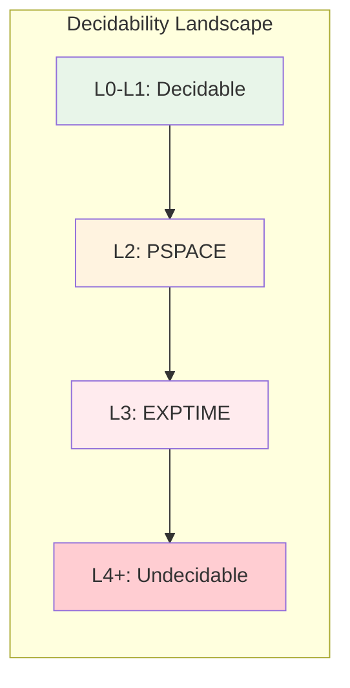

# Expressiveness vs Decidability Trade-offs

> **Stage**: Struct/05-comparative-analysis | **Prerequisites**: [Expressiveness Hierarchy](expressiveness-hierarchy.md) | **Formalization Level**: L3
> **Translation Date**: 2026-04-21

## Abstract

In concurrent computation models, increased expressiveness necessarily decreases decidability. This document formalizes the fundamental trade-off and maps the six-level expressiveness hierarchy to decidability boundaries.

---

## 1. Definitions

### Def-S-25-01 (Decidable Properties Set)

The **decidable properties set** for model $M$:

$$\text{Decidable}(M) = \{ P \mid \exists \text{ algorithm deciding } P \text{ for all programs in } M \}$$

### Def-S-25-02 (Rice's Theorem Framework)

Rice's Theorem: Any non-trivial semantic property of programs is undecidable.

$$\forall P \in \text{SemanticProperties}: P \neq \emptyset \land P \neq \text{AllPrograms} \Rightarrow P \notin \text{Decidable}(TuringComplete)$$

### Def-S-25-03 (Halting Problem Reduction)

The halting problem reduces to verification problems in expressive models:

$$\text{Halting} \leq_P \text{DeadlockDetection}(L_4) \leq_P \text{Bisimilarity}(L_5)$$

### Def-S-25-04 (Model Checking Complexity)

| Level | Model | Decidable Properties | Complexity |
|-------|-------|---------------------|------------|
| L0-L1 | Finite automata | All | PTIME |
| L2 | CSP | Deadlock, determinism | PSPACE |
| L3 | Actor (finite) | Safety (bounded) | EXPTIME |
| L4 | π-calculus | None (unbounded) | Undecidable |
| L5 | Higher-order π | None | Undecidable |
| L6 | Turing-complete | Only syntactic | Undecidable |

---

## 2. Key Theorem

### Thm-S-25-01 (Expressiveness-Decidability Trade-off)

$$\forall M_1, M_2 \in \mathcal{L}: M_1 \subset M_2 \Rightarrow \text{Decidable}(M_2) \subseteq \text{Decidable}(M_1)$$

**Proof Sketch.** More expressive models can encode programs from less expressive models. Any decidable property in $M_2$ restricted to $M_1$ would yield a decision procedure for $M_1$. However, $M_2$ adds computational power, introducing new undecidable properties (by Rice's Theorem). ∎

### Cor-S-25-01 (Complete Decidability Boundary)

Complete decidability is lost at L4 (π-calculus):

$$\text{Decidable}(L_3) \supsetneq \text{Decidable}(L_4) = \emptyset \text{ (semantic properties)}$$

### Cor-S-25-02 (Model Checking Feasibility)

Model checking is feasible for L0-L2 with state space explosion:

$$\text{Feasible}(L) \iff L \leq L_2 \land \text{StateSpace} < 2^{30}$$

---

## 3. Examples

### Example 1: L3 CSP Deadlock Detection

CSP deadlock detection is decidable for finite processes:

$$\text{DeadlockFree}(P) \in \text{Decidable}(CSP_{finite})$$

Tool: FDR model checker.

### Example 2: L4 π-Calculus Bisimilarity

π-calculus bisimilarity is undecidable (unbounded name creation):

$$\sim_\pi \notin \text{Decidable}(\pi\text{-calculus})$$

### Example 3: L5 HOπ Type Inference

Higher-order π-calculus type inference is undecidable:

$$\text{TypeInference}(HO\pi) \notin \text{Decidable}$$

---

## 4. Visualizations

---

## 5. References
